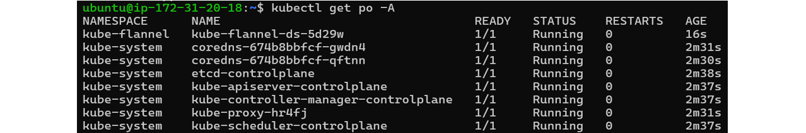
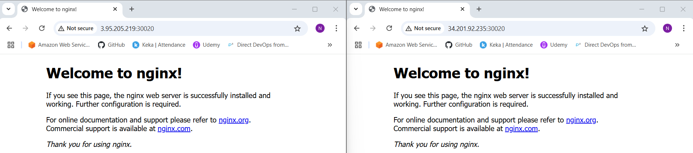
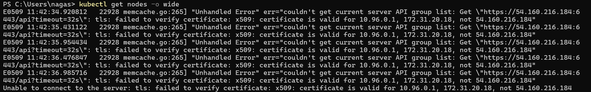
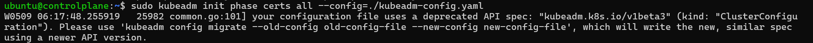
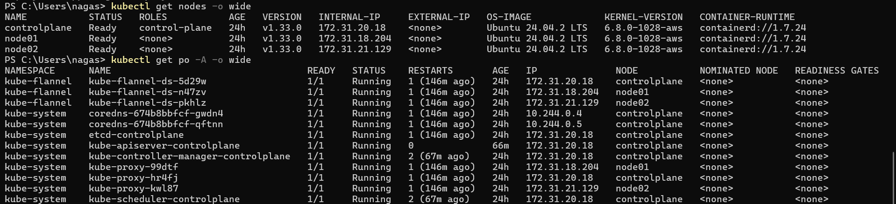
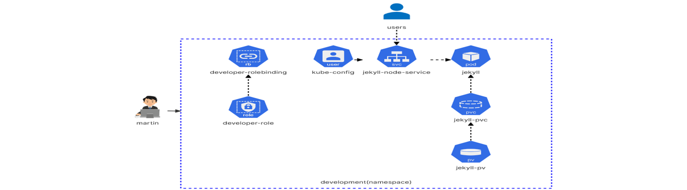
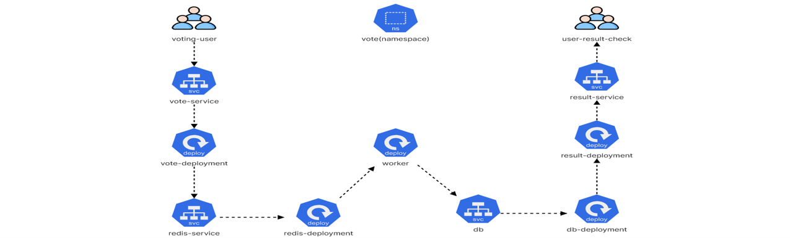
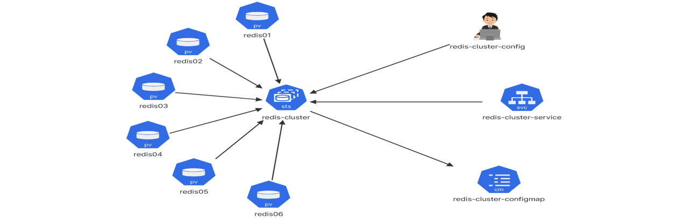

# <p align="center">Certified Kubernetes Administrator (CKA)</p>


# <p align="center">Core Concepts</p>

## Kubernetes Cluster Architecture
- [Refer Here](https://kubernetes.io/docs/concepts/architecture/) for the Official docs.
- Kubernetes (K8s) is used to manage containerized applications automatically.
- It enables easy deployment, scaling, and communication between services.
- **Cluster Structure:**
  - **Master Node (Control Plane)**: Manages the cluster.
  - **Worker Nodes**: Run containerized applications.
  
### Master Node Components
- **etcd**: A key-value store that holds cluster data.
- **Kube API Server**: Main communication hub, exposing the Kubernetes API.
- **Scheduler**: Assigns workloads (Pods) to worker nodes based on resources and constraints.
- **Controllers**: Maintain cluster state (e.g., Node Controller, Replication Controller).
### Worker Node Components
- **Kubelet**: The agent that manages containers on the node, communicating with the API Server.
- **Kube Proxy**: Manages networking and enables communication between Pods.
- **Container Runtime**: Runs containers (Docker, containerd, etc.).

## Docker vs. ContainerD
- Docker and containerd are both container runtimes.
- Older Kubernetes versions supported Docker, while newer versions use containerd.
- Several CLI tools exist to interact with these runtimes: `ctr`, `crictl`, `nerdctl`.
### History of Containers
- Initially, **Docker** was the dominant container tool.
- Kubernetes was built to work **only with Docker** in the beginning.
- Other container runtimes (e.g., **rkt**) wanted support in Kubernetes.
### CRI (Container Runtime Interface)
- Kubernetes introduced **CRI** to support multiple container runtimes.
- **CRI follows OCI (Open Container Initiative) standards**:
  - **ImageSpec**: Defines how container images should be built.
  - **RuntimeSpec**: Defines how container runtimes should work.
- Now, any runtime that follows **OCI standards** can work with Kubernetes.
- **Docker was NOT built for CRI** since it existed before CRI.
- Kubernetes had to create **Dockershim** (a workaround) to support Docker.
### Shift from Docker to ContainerD
- Docker is a full suite with CLI, API, build tools, security, volumes, `runc`, and `containerd`.
- **Containerd is the core runtime inside Docker.** It is **CRI-compatible**, so Kubernetes can use it **without Docker**.
- Now, **Containerd is a separate project** under CNCF. You can install **Containerd directly** without installing Docker.
- Kubernetes **removed `dockershim` in v1.24**, eliminating direct Docker support.
- Docker-built images still work because they follow OCI standards.
### CLI Tools for Working with Containers
- **`ctr` (ContainerD CLI):**
  - CLI tool for **containerd**.
  - Used mainly for debugging.
  - Not user-friendly, supports only basic functions.
- **`nerdctl` (Docker-like CLI for ContainerD):**
  - Docker-compatible CLI for containerd.
  - Supports additional features like **encrypted images, P2P distribution**.
  - Works almost like Docker CLI.
- **`crictl` (CRI CLI for Kubernetes Runtimes):**
  - Kubernetes-specific CLI to interact with **CRI-compatible runtimes** (containerd, CRI-O, etc.).
  - Used for **debugging and troubleshooting**, not creating containers.
  - Unlike Docker, `crictl` can manage **pods** (`crictl pods`).

## ETCD
- [Refer Here](https://etcd.io/) for the Official site.
- ETCD is a **distributed, reliable key-value store** used in Kubernetes.
- It is **simple, secure, and fast**.
- **Key-Value Store:**
  - Traditional databases store data in tables (rows & columns).
  - A **key-value store** stores data as **key-value pairs**.
  
- By default, ETCD runs on **port 2379**.
- Use the `etcdctl` command-line tool to interact with ETCD.
- **Basic Commands:**
  ```bash
  ./etcdctl put key1 value1
  # To store a key-value pair
  ./etcdctl get key1
  # To retrieve stored data
  ./etcdctl
  # To view available commands
  ```
### ETCD Versioning
- API versions **v2.0 vs v3.0** have different `etcdctl` commands.
- **Check ETCDCTL Version:** `etcdctl version`
  - The output shows the **ETCDCTL utility version** and **API version**.
  - **Default API version is v2.0**, but Kubernetes uses v3.0.
- **To set API Version 3 Use:** `export ETCDCTL_API=3`
### ETCD in Kubernetes
- [Refer Here](https://kubernetes.io/docs/tasks/administer-cluster/configure-upgrade-etcd/) for the Official docs.
- Stores cluster data (nodes, pods, configs, secrets, roles, etc.).
- All `kubectl get` commands retrieve data from ETCD.
- Cluster changes (e.g., adding nodes, deploying pods) are recorded in ETCD.
#### Installation of ETCD
- **Manually**:
  - If you setup your Cluster from scratch then you deploy `ETCD` by downloading ETCD Binaries:
    ```sh
    wget -q --https-only "https://github.com/etcd-io/etcd/releases/download/v3.3.11/etcd-v3.3.11-linux-amd64.tar.gz"
    ```
  - Install Binaries and Configure `ETCD` as a service in your master node.
  - `ETCD` runs as a **systemd service**.
- **Using kubeadm**:
  - Automatically deployed as a pod in the `kube-system` namespace.
    ```sh
    kubectl get pods -n kube-system | grep etcd-master
    ```
#### EETCD Data Structure in Kubernetes
- List all keys stored in ETCD:
  ```bash
  kubectl exec etcd-master -n kube-system -- sh -c "ETCDCTL_API=3 etcdctl \
                --cert=/etc/kubernetes/pki/etcd/server.crt \
                --key=/etc/kubernetes/pki/etcd/server.key \
                --cacert=/etc/kubernetes/pki/etcd/ca.crt get / --prefix --keys-only"
  ```
- Data is stored in a **directory-like structure**.
- Kubernetes stores data under the **`registry`** directory (The Root directory).
  - Nodes: `/registry/minions`
  - Pods: `/registry/pods`
  - Deployments: `/registry/deployments`
#### ETCD in High Availability (HA) Setup
- Multiple master nodes run multiple **ETCD instances**.
- ETCD instances must be **aware of each other** (configured via `initial-cluster` option).
- **ETCD must always have an odd number of nodes** in an HA setup to **avoid split-brain scenarios**.
- Ensures redundancy and fault tolerance.
##### Add that `backups` are critical in ETCD, and the `etcdctl snapshot save` command is used for backups.

## Kube API Server
- The **main component** of Kubernetes that **manages all requests**.
- Responsible for:
  - **Authentication** (who can access)
  - **Validation** (checking if requests are correct)
  - **Retrieving & Updating** data in **ETCD** (the cluster database).
- It is the **only component** that interacts directly with ETCD.
- Other components (Scheduler, Controller Manager, Kubelet) **use the API Server** to update the cluster.
### Installation of Kube API Server
- **Manually**:
  - If you installing manually (`the hard way`), download the binary from Kubernetes releases:
    ```sh
    wget https://storage.googleapis.com/kubernetes-release/release/v1.13.0/bin/linux/amd64/kube-apiserver
    ```
  - Install and Configure `Kube API Server` as a service in your master node.
  - `Kube API Server` runs as a **systemd service**.
  - Config is in: `/etc/systemd/system/kube-apiserver.service`
  - Running processes can be checked using `ps aux | grep kube-apiserver`.
- **Using kubeadm**:
  - Automatically deployed as a pod in the `kube-system` namespace.
    ```sh
    kubectl get pods -n kube-system | grep kube-apiserver-master
    ```
  - Config is in: `/etc/kubernetes/manifests/kube-apiserver.yaml`

## Kube Controller Manager
- It **manages all controllers** in Kubernetes.
- A **controller** is responsible for monitoring the cluster state and ensuring it reaches the desired condition.
- Works through the **kube-apiserver** to track and control cluster components.
- **Types of Controllers:**
  1. **Node Controller**
     - Checks the status of nodes every **5 seconds**.
     - Marks a node **unreachable** after **40 seconds**.
     - Waits **5 minutes** before reassigning pods to healthy nodes.
  2. **Replication Controller**
     - Ensures the desired number of pods in a **ReplicaSet** is always maintained.
     - If a pod dies, it creates a new one automatically.
  3. **Other Controllers:**
     - **Deployment Controller**: Manages Deployments.
     - **Service Controller**: Handles Services.
     - **Namespace Controller**: Manages namespaces.
     - **Persistent Volume Controller**: Manages storage.
     - **Job Controller**: Manages Jobs & CronJobs.
### Installation of Kube Controller Manager
- Comes as a **single process** that includes all controllers.
- **Manually**:
  - Download the kube-controller-manager binary from the kubernetes release page:
    ```sh
    wget https://storage.googleapis.com/kubernetes-release/release/v1.13.0/bin/linux/amd64/kube-controller-manager
    ```
  - Install and Configure `Kube Controller Manager` as a service in your master node.
  - `Kube Controller Manager` runs as a **systemd service**.
  - By default all controllers are enabled, but you can choose to enable specific one from `kube-controller-manager.service`.
  - Config is in: `/etc/systemd/system/kube-controller-manager.service`
  - Running processes can be checked using `ps aux | grep kube-controller-manager`.
- **Using kubeadm**:
  - Automatically deployed as a pod in the `kube-system` namespace.
    ```sh
    kubectl get pods -n kube-system | grep kube-controller-manager-master
    ```
  - Config is in: `/etc/kubernetes/manifests/kube-controller-manager.yaml`
### Customizing Controllers
- You can pass **options** (modify configuration) when running the Kube Controller Manager.
- Example settings:
  - **Node monitor period** (How often nodes are checked).
  - **Grace period** (Time before marking a node as failed).
  - **Eviction timeout** (When to reassign pods).
- `--controllers` option allows enabling/disabling specific controllers.

## Kube-Scheduler
- **Kube-Scheduler** is responsible for **deciding** which node a pod should be placed on.
- **It does not create pods** on nodes—that's the job of the **kubelet**.
### Work of Kube-Scheduler
- **Filters Nodes:**
   - Eliminates nodes that **don’t meet the pod’s resource requests** (CPU, memory, etc.).
   - **Example:** If a pod needs 4 CPU but a node only has 2 CPU available, that node is filtered out.
- **Ranks Remaining Nodes:**
   - Assigns a **score (0 to 10)** to each valid node.
   - The node with the **highest score** gets selected.
   - **Example:** If one node would have **6 CPUs free** after placing the pod and another only **2 CPUs free**, the first one gets a **higher score** and wins.
### Customizing Scheduling Rules
- Kubernetes allows **custom schedulers** to be defined.
- Additional factors like **taints, tolerations, affinity rules, and node selectors** influence scheduling decisions (covered in detail later).
### Installation of Kube-Scheduler
- **Manually**:
  - Download the kube-scheduler binary from the kubernetes release page:
    ```sh
    wget https://storage.googleapis.com/kubernetes-release/release/v1.13.0/bin/linux/amd64/kube-scheduler
    ```
  - Install and Configure `Kube-Scheduler` as a service in your master node.
  - `Kube-Scheduler` runs as a **systemd service**.
  - Config is in: `/etc/systemd/system/kube-scheduler.service`
  - Running processes can be checked using `ps aux | grep kube-scheduler`.
- **Using kubeadm**:
  - Automatically deployed as a pod in the `kube-system` namespace.
    ```sh
    kubectl get pods -n kube-system | grep kube-scheduler-master
    ```
  - Config is in: `/etc/kubernetes/manifests/kube-scheduler.yaml`

## Kubelet
- **Kubelet** is the **primary agent** running on every worker node in a Kubernetes cluster.
- It **registers the node** with the cluster and ensures that pods run correctly.
- It is like the **captain of a ship**, handling all tasks related to containers on that node.
- Kubelet **does not manage containers directly**—it interacts with the **container runtime via CRI**.
- Kubelet **periodically sends node status to the API Server** to ensure the node remains active.
### Functions of Kubelet
- **Registers the worker node** with the Kubernetes cluster.
- **Receives pod instructions** from the scheduler.
- **Interacts with the container runtime** (e.g., Docker, containerd) to pull images and create containers.
- **Monitors the health** of pods and containers.
- **Reports node and pod status** back to the Kube API server.
### Installation of Kubelet
- **If using `kubeadm`** unlike other components, **kubeadm does not automatically install kubelet** on worker nodes.
- It must be **manually installed** on each worker node.
- **Steps to Install:**
  ```sh
  sudo apt-get update
  sudo apt-get install -y kubelet
  ```
- After installation, it runs as a **service**.
- **To Check Kubelet Status:**
  ```sh
  sudo systemctl status kubelet
  # Check if kubelet is running
  sudo systemctl restart kubelet
  # Start/Restart kubelet service
  ps aux | grep kubelet
  # Check running kubelet process
  ```

## Kube-Proxy
- `kube-proxy` is a **networking component** that runs on every node in a Kubernetes cluster.
- It **forwards traffic** from services to the correct backend pods.
- It ensures that **every pod can communicate with every other pod** inside the cluster.
- **Manages networking rules** for Kubernetes services.
- Uses **iptables** (or other networking tools) to create routing rules.
### Services Work with Kube-Proxy
- Pods communicate using **Pod IPs**, but Pod IPs can change.
- Services provide a **fixed IP** and **DNS name** to access backend pods.
- `kube-proxy` ensures that **requests to the service** are forwarded to the right pod.
- **Example:**
  - A web app pod needs to talk to a database pod.
  - Instead of using the database pod's IP (which can change), it uses a **service** (`db-service`).
  - `kube-proxy` forwards traffic from `db-service` to the correct database pod.
### Installation of Kube-Proxy
- **Deployed as a DaemonSet**, runs on **every node** in the cluster.
- **Manually**:
  - Download the kube-proxy binary from the kubernetes release page:
    ```sh
    wget https://storage.googleapis.com/kubernetes-release/release/v1.13.0/bin/linux/amd64/kube-proxy
    ```
  - Install and Configure `Kube-Proxy` as a service in your master node.
  - `Kube-Proxy` runs as a **systemd service**.
  - Config is in: `/etc/kubernetes/kube-proxy-config.yaml` or `/etc/kube-proxy/config.yaml`
  - Running processes can be checked using `ps aux | grep kube-proxy`.
- **Using kubeadm**:
  - Automatically deployed as a pod in the `kube-system` namespace.
    ```sh
    kubectl get pods -n kube-system
    ```
  - Config is in: `/var/lib/kube-proxy/config.conf`

## Kubernetes Pods
- [Refer Here](https://kubernetes.io/docs/concepts/workloads/pods/) for the Official docs.
- **Pod** is the **smallest deployable unit** in Kubernetes.
- A **pod encapsulates one or more containers**.
- Containers inside a pod **share the same network** and **storage**.
- Pods are used to **deploy your application containers** on Kubernetes.
- Kubernetes **does not deploy containers directly**, it **deploys Pods**.
- Usually, **one pod = one container** (one-to-one relationship).
- Containers inside a pod run on the **same node** and can communicate through `localhost`.
  
### Scaling
- Want to scale? **Don’t add containers to the same pod.**
- **Create more pods** (each with one container).
- To scale down, **delete pods**.
- Pods can be spread across **multiple nodes** if needed.
### Multi-Container Pods
- A pod **can have multiple containers**, but:
  - They’re **not multiple replicas** of the same app.
  - Usually used for **helper or sidecar containers** (e.g., logging, syncing).
### Deploying a Pod using `kubectl`
- To Create a Pod:
  ```sh
  kubectl run <pod_name> --image=<image_name>
  ```
- Check the list of running pods:
  ```sh
  kubectl get pods
  ```
  
- Help Command:
  ```sh
  kubectl run --help
    # A description of what `kubectl run` does.
    # The usage pattern, like: how to use it, its syntax, options, and examples.
  ```
### Pod YAML Configuration
- [Refer Here](https://kubernetes.io/docs/reference/generated/kubernetes-api/v1.32/) for `One-page API Reference for Kubernetes` and choose required Version.
  - Select required API, in this case `Pod`.
- [Refer Here](https://kubernetes.io/docs/reference/generated/kubernetes-api/v1.32/#pod-v1-core) for the **Pod Workloads APIs**.
  - `apiVersion` → Group/Version
    - If **Group** is `core`, provide only `Version`
    - If **Group** is other than `core`, provide `Group/Version`
  - `kind` → Kind
  - `metadata` & `spec` → Use Field and Description.
- **Must-Have Root Keys:** Every Kubernetes Manifest YAML files must have these 4 top level fields.
  - `apiVersion`: Version of Kubernetes API
  - `kind`: Type of object
  - `metadata`: Data about the object
  - `spec`: Details about what to run
- **Nginx Pod YAML:**
  - Based on `Pod Workloads APIs`, Write the Pod YAML file:
    ```yaml
    apiVersion: v1
    kind: Pod
    metadata:
      name: nginx-pod
      labels:
        app: nginx
        tier: frontend
    spec:
      containers:
        - name: nginx
          image: nginx
    ```
- **Commands to Work with Pods:**
  ```sh
  kubectl create -f <filename>
  # Create a pod using YAML
  kubectl get pods
  # View all pods
  kubectl get pods -o wide
  # View all pods with more details
  kubectl describe pod <name>
  # Detailed pod info
  kubectl exec -it <pod-name> -- <command>
  # Execute a command inside a pod
  kubectl delete pod <name>
  # Delete pod
  ```

## Kubernetes Controllers
- Controllers are **the brain of Kubernetes**.
- They **monitor Kubernetes objects** and take action when needed.
- Example: Replication Controller, ReplicaSet, etc.
### Replication Controller (RC)
- [Refer Here](https://kubernetes.io/docs/concepts/workloads/controllers/replicationcontroller/) for the Official docs.
- Ensures a **specific number of pods** are running at all times.
- Provides **high availability** by running multiple copies of a pod.
- Can be used even for **1 pod** to auto-recover if it fails.
- **Use Cases:**
  - Prevent app downtime by having multiple pod replicas.
  - Load balancing across multiple pods.
  - Auto-healing (restart pods if they crash).
  
#### Replication Controller YAML Configuration
- [Refer Here](https://kubernetes.io/docs/reference/generated/kubernetes-api/v1.32/) for `One-page API Reference for Kubernetes` and choose required Version.
  - Select required API, in this case `ReplicationController`.
- [Refer Here](https://kubernetes.io/docs/reference/generated/kubernetes-api/v1.32/#replicationcontroller-v1-core) for the **ReplicationController Workloads APIs**.
  - `apiVersion` → Group/Version
    - If **Group** is `core`, provide only `Version`
    - If **Group** is other than `core`, provide `Group/Version`
  - `kind` → Kind
  - `metadata` & `spec` → Use Field and Description.
- **`apiVersion`, `kind`, `metadata` & `spec`** these are must have Root Keys in every Kubernetes Manifest YAML files.
- **Nginx Replication Controller YAML:**
  - Based on `ReplicationController Workloads APIs`, Write the Replication Controller YAML file:
    ```yaml
    apiVersion: v1
    kind: ReplicationController
    metadata:
      name: myapp-rc
      labels:
        app: myapp
        type: frontend
    spec:
      replicas: 3
      template:
        metadata:
          labels:
            app: myapp
            type: frontend
        spec:
          containers:
          - name: nginx-container
            image: nginx
    ```
- **Commands:**
  ```sh
  kubectl create -f <filename>
  # Create replication controller using YAML
  kubectl get replicationcontroller
  # View all replication controllers
  kubectl delete replicationcontroller <name>
  # Delete replication controller
  ```
### ReplicaSet (RS)
- [Refer Here](https://kubernetes.io/docs/concepts/workloads/controllers/replicaset/) for the Official docs.
- **Modern version of Replication Controller** (recommended to use).
- Works **similar to RC** but more **flexible with label selectors**.
- **Key Difference:**
  - Requires a **selector** (matchLabels) to track pods.
  - Can **adopt existing pods** if they match the selector.
  
#### ReplicaSet YAML Configuration
- [Refer Here](https://kubernetes.io/docs/reference/generated/kubernetes-api/v1.32/) for `One-page API Reference for Kubernetes` and choose required Version.
  - Select required API, in this case `ReplicaSet`.
- [Refer Here](https://kubernetes.io/docs/reference/generated/kubernetes-api/v1.32/#replicaset-v1-apps) for the **ReplicaSet Workloads APIs**.
  - `apiVersion` → Group/Version
    - If **Group** is `core`, provide only `Version`
    - If **Group** is other than `core`, provide `Group/Version`
  - `kind` → Kind
  - `metadata` & `spec` → Use Field and Description.
- **`apiVersion`, `kind`, `metadata` & `spec`** these are must have Root Keys in every Kubernetes Manifest YAML files.
- **Nginx ReplicaSet YAML:**
  - Based on `ReplicaSet Workloads APIs`, Write the ReplicaSet YAML file:
    ```yaml
    apiVersion: apps/v1
    kind: ReplicaSet
    metadata:
      name: myapp-rs
      labels:
        app: myapp
    spec:
      replicas: 3
      selector:
        matchLabels:
          app: myapp
      template:
        metadata:
          labels:
            app: myapp
        spec:
          containers:
          - name: nginx-container
            image: nginx
    ```
- **Commands:**
  ```sh
  kubectl create -f <filename>
  # Create replicaset using YAML
  kubectl get replicasets
  # View all replicasets
  kubectl delete rs <name>
  # Delete replicaset
  kubectl replace -f <file>
  # Update a resource
  ```
#### Scaling ReplicaSet
- **Option:1** Modify YAML file
  - Update `replicas: 3` to `replicas: 6`
  - Run: `kubectl replace -f rs-definition.yaml`
- **Option:2** Using CLI directly
  - Run:  
    ```sh
    kubectl scale --replicas=6 -f rs-definition.yaml
                           or
    kubectl scale replicaset myapp-rs --replicas=6
    ```
  - **Note:** If you scale using the CLI, the YAML file will not auto-update.
### Labels & Selectors
- **Labels**: Key-value pairs added to pods (like `app: myapp`)
- **Selectors**: Used by ReplicaSet to identify which pods to manage.
- Helps ReplicaSet **monitor** the right pods among many.

## Kubernetes Deployments
- [Refer Here](https://kubernetes.io/docs/concepts/workloads/controllers/deployment/) for the Official docs.
- A **Deployment** in Kubernetes is a higher-level object used to **manage applications**.
- It handles:
  - Running **multiple instances (replicas)** of your app.
  - **Upgrading** your app with **rolling updates**.
  - **Rolling back** to a previous version if needed.
  - **Pausing and resuming** changes for better control.
  
### Real-World Deployment Needs
- **Multiple Instances:** Run several copies of your app (e.g., multiple web servers) for **high availability**.
- **Rolling Updates:** Update pods **one at a time**, not all at once — avoids app downtime for users.
- **Rollback:** If a new version causes issues, **revert** to the previous stable version easily.
- **Pause and Resume Updates:** Make **multiple changes** (like scaling, version update, resource config) and **apply all at once** after reviewing.
### Deployment vs ReplicaSet vs Pods
- **Pod:** Runs a single instance of your container
- **ReplicaSet:** Manages **multiple identical pods**
- **Deployment:** Manages **ReplicaSets**, adds **upgrades, rollbacks, pause/resume** features
  - Think of Deployment as the **controller** for ReplicaSet + extra powers.
### Deployment YAML Configuration
- [Refer Here](https://kubernetes.io/docs/reference/generated/kubernetes-api/v1.32/) for `One-page API Reference for Kubernetes` and choose required Version.
  - Select required API, in this case `Deployment`.
- [Refer Here](https://kubernetes.io/docs/reference/generated/kubernetes-api/v1.32/#deployment-v1-apps) for the **Deployment Workloads APIs**.
  - `apiVersion` → Group/Version
    - If **Group** is `core`, provide only `Version`
    - If **Group** is other than `core`, provide `Group/Version`
  - `kind` → Kind
  - `metadata` & `spec` → Use Field and Description.
- **`apiVersion`, `kind`, `metadata` & `spec`** these are must have Root Keys in every Kubernetes Manifest YAML files.
- **Nginx Deployment YAML:**
  - Based on `Deployment Workloads APIs`, Write the Deployment YAML file:
  - Similar to ReplicaSet, just change `kind: Deployment`
    ```yaml
    apiVersion: apps/v1
    kind: Deployment
    metadata:
      name: myapp-deployment
      labels:
        app: myapp
    spec:
      replicas: 3
      selector:
        matchLabels:
          app: myapp
      template:
        metadata:
          labels:
            app: myapp
        spec:
          containers:
          - name: nginx-container
            image: nginx
    ```
- **Commands:**
  ```sh
  kubectl create -f <filename>
  # Create deployment
  kubectl get deployments
  # List all deployments
  kubectl get all
  # View all resources (deployments, RS, pods, etc.)
  kubectl delete deploy <name>
  # Delete deployment
  ```
- **When You Create a Deployment:**
  - Deployment is created.
  - Deployment creates a **ReplicaSet**.
  - ReplicaSet creates **pods**.

## Kubernetes Services
- [Refer Here](https://kubernetes.io/docs/concepts/services-networking/service/) for the Official docs.
- Services allow communication **between Pods**, **between apps**, and **from external users** to Pods.
- Services **abstract** the dynamic IPs of Pods (since Pods can be recreated and get new IPs).
- Services allow **stable access** to Pods.
- **Types of Services:**
  - NodePort
  - ClusterIP
  - LoadBalancer
  
### Services YAML Configuration
- [Refer Here](https://kubernetes.io/docs/reference/generated/kubernetes-api/v1.32/) for `One-page API Reference for Kubernetes` and choose required Version.
  - Select required API, in this case `Service`.
- [Refer Here](https://kubernetes.io/docs/reference/generated/kubernetes-api/v1.32/#deployment-v1-apps) for the **Service in Service APIs**.
  - `apiVersion` → Group/Version
    - If **Group** is `core`, provide only `Version`
    - If **Group** is other than `core`, provide `Group/Version`
  - `kind` → Kind
  - `metadata` & `spec` → Use Field and Description.
  - `type in spec` → Give Type of Service
- **`apiVersion`, `kind`, `metadata` & `spec`** these are must have Root Keys in every Kubernetes Manifest YAML files.
### Types of Services
#### NodePort
- Makes a Pod accessible **from outside the cluster** using `<NodeIP>:<NodePort>`.
- Opens a **specific port on every Node** (between `30000-32767`).
- Traffic goes from NodePort ➝ ClusterIP ➝ Pod.
  
- **NodePort Service YAML:**
  ```yaml
  apiVersion: v1
  kind: Service
  metadata:
    name: my-nodeport-service
  spec:
    type: NodePort
    selector:
      app: myapp
    ports:
      - port: 80         # Service port (ClusterIP)
        targetPort: 80   # Pod port
        nodePort: 30008  # Node's exposed port
  ```
- **Notes:**
  - `port` = service’s own port
  - `targetPort` = Pod’s port
  - `nodePort` = port exposed on Node (external access)
  - If `targetPort` not specified ➝ assumed same as `port`
  - If `nodePort` not specified ➝ random port is chosen from range
#### ClusterIP (Default)
- Used for **internal communication** between services in the cluster.
- Each service gets a **virtual IP (ClusterIP)**.
- **Not accessible from outside the cluster**.
  
- **ClusterIP Service YAML:**
  ```yaml
  apiVersion: v1
  kind: Service
  metadata:
    name: redis
  spec:
    type: ClusterIP
    selector:
      app: redis-pod
    ports:
      - port: 6379
        targetPort: 6379
  ```
#### LoadBalancer
- Exposes service **externally using cloud provider’s load balancer** (AWS, GCP, Azure).
- Best for production **external traffic**.
- **LoadBalancer Service YAML:**
  ```yaml
  apiVersion: v1
  kind: Service
  metadata:
    name: frontend
  spec:
    type: LoadBalancer
    selector:
      app: frontend
    ports:
      - port: 80
        targetPort: 80
  ```
- Creates external IP via cloud LB ➝ traffic gets routed to NodePort ➝ ClusterIP ➝ Pod.
### Service Selectors and Labels
- Services **use selectors** to find matching Pods.
- Pods must have **matching labels** for the service to route traffic.
- **Example:**
  ```yaml
  selector:
    app: myapp
  ```
### Load Balancing Behavior
- Services **load balance automatically** between matching Pods.
- Uses **random algorithm** to distribute traffic.
- Works across **multiple nodes** too:
  - NodePort is open on **every node**
  - Requests can hit any node ➝ routed to correct Pod
### Commands & Real-World Use Cases
- **Commands:**
  ```sh
  kubectl get svc
  # List all services
  kubectl describe svc <svc-name>
  # Detailed service info
  kubectl expose pod <pod-name> --type=NodePort --port=80
  # Quickly expose a pod as a NodePort
  kubectl delete svc <name>
  # Delete service
  ```
- **Use Case:**
  - **ClusterIP:** Internal microservice communication
  - **NodePort:** Access app from browser on Node IP
  - **LoadBalancer:** Expose service on a domain like `myapp.com` via AWS/GCP

## Kubernetes Namespaces
- [Refer Here](https://kubernetes.io/docs/concepts/overview/working-with-objects/namespaces/) for the Official docs.
- A **namespace** in Kubernetes is like a **virtual cluster** inside your real cluster.
- It is used to **divide cluster resources** among multiple users/projects/teams.
- All objects like Pods, Services, Deployments are created **inside a namespace**.
- Useful when running **multiple teams or environments** (e.g., dev, prod) on the **same cluster**.
- If you don’t specify a namespace, objects are created in the `default` namespace.
- **Default Namespaces in Kubernetes:**
  - `default` ➝ Your playground, used if no namespace is specified
  - `kube-system` ➝ For Kubernetes system components (like DNS, networking)
  - `kube-public` ➝ Public resources, viewable by all users
- **Use of Custom Namespaces:**
  - Separate environments: **dev**, **test**, **prod**
  - Avoid accidentally modifying prod while working on dev
  - Apply **policies** and **resource limits** per namespace
- **Communication Between Namespaces:**
  - Pods **within the same namespace**: use service name directly `service-name`
  - Pods **across namespaces**: use full DNS `service-name.namespace-name.svc.cluster.local`
  
### Namespace YAML Configuration
- [Refer Here](https://kubernetes.io/docs/reference/generated/kubernetes-api/v1.32/) for `One-page API Reference for Kubernetes` and choose required Version.
  - Select required API, in this case `Namespace`.
- [Refer Here](https://kubernetes.io/docs/reference/generated/kubernetes-api/v1.32/#namespace-v1-core) for the **Namespace Cluster APIs**.
  - `apiVersion` → Group/Version
    - If **Group** is `core`, provide only `Version`
    - If **Group** is other than `core`, provide `Group/Version`
  - `kind` → Kind
  - `metadata` → Use Field and Description.
- **Namespace YAML:**
  - Based on `Namespace Cluster APIs`, Write the Namespace YAML file:
    ```yaml
    apiVersion: v1
    kind: Namespace
    metadata:
      name: dev
    ```
- **Commands:**
  ```sh
  kubectl apply -f <filename>
  # Create namespace
  kubectl get namespaces
  # List all namespaces
  kubectl get pods
  # List pods in default namespace (ns)
  kubectl get pods -n <namespace-name>
  # List pods in a specific ns
  kubectl get pods --all-namespaces
  # List pods in all namespaces
  kubectl config set-context $(kubectl config current-context) --namespace=<namespace-name>
                            (or)
  kubectl config set-context --current --namespace=<namespace-name>
  # Switch current namespace permanently (Set the default namespace to given namespace)
  kubectl config view --minify | grep namespace
  # Check which namespace you’re in
  kubectl create namespace <namespace-name>
  # Create a namespace
  ```
### Create Resources in a Specific Namespace
- **Option:1** From Command-Line
  ```bash
  kubectl create -f yaml-filename -n <namespace-name>
  ```
- **Option:2** In YAML
  - Add under `metadata`:
    ```yaml
    metadata:
      name: resource-name
      namespace: namespace-name
    ```
- **Note:** If you don’t specify a namespace, objects are created in the `default` namespace.
### Resource Quotas in Namespace
- [Refer Here](https://kubernetes.io/docs/concepts/policy/resource-quotas/) for the Official docs.
- You can **limit usage of resources** (CPU, memory, pod count, etc.) using `ResourceQuota`.
#### ResourceQuota YAML Configuration
- [Refer Here](https://kubernetes.io/docs/reference/generated/kubernetes-api/v1.32/) for `One-page API Reference for Kubernetes` and choose required Version.
  - Select required API, in this case `ResourceQuota`.
- [Refer Here](https://kubernetes.io/docs/reference/generated/kubernetes-api/v1.32/#resourcequota-v1-core) for the **ResourceQuota Cluster APIs**.
  - `apiVersion` → Group/Version
    - If **Group** is `core`, provide only `Version`
    - If **Group** is other than `core`, provide `Group/Version`
  - `kind` → Kind
  - `metadata` & `spec` → Use Field and Description.
- **`apiVersion`, `kind`, `metadata` & `spec`** these are must have Root Keys in every Kubernetes Manifest YAML files.
- **ResourceQuota `dev` Namespace YAML:**
  - Based on `ResourceQuota Cluster APIs`, Write the ResourceQuota YAML file:
    ```yaml
    apiVersion: v1
    kind: ResourceQuota
    metadata:
      name: dev-quota
      namespace: dev
    spec:
      hard:
        pods: "10"
        requests.cpu: "10"
        requests.memory: "10Gi"
    ```
- **Commands:**
  ```bash
  kubectl apply -f <filename>
  # Create resourcequota
  kubectl get resourcequota -n <namespace-name>
  # View resourcequota in a namespace
  kubectl describe resourcequota <resourcequota-name> -n <namespace-name>
  # Describe a resourcequota
  kubectl delete resourcequota <resourcequota-name> -n <namespace-name>
  # Delete a resourcequota
  ```

## Kubernetes - Imperative vs Declarative Approaches
- **Imperative:**
  - Direct commands to create/update/delete resources
  - **Examples:** `kubectl run`, `kubectl create`, `kubectl edit`, `kubectl delete`, `kubectl set image`
- **Declarative:**
  - Use YAML files that define the desired state, and apply them
  - **Command:** `kubectl apply -f <yaml-filename>`
### Key Points
- **Imperative Approach:**
  - Quick and handy in exams.
  - Good for small/simple changes.
  - Can generate YAML templates with `--dry-run=client -o yaml`.
  - Not ideal for teamwork or tracking changes.
  - Example:
    ```bash
    kubectl run nginx --image=nginx
    kubectl edit pod nginx
    kubectl scale deployment nginx --replicas=4
    ```
- **Declarative Approach:**
  - Ideal for production.
  - Use YAML files to describe resources.
  - Trackable (can be stored in Git).
  - Use `kubectl apply` to create or update.
  - Kubernetes compares current state with desired state and makes changes.
### Certification Tips
- Use **imperative commands** for speed (e.g. creating a pod/deployment quickly).
- Use **kubectl edit** for fast one-time edits.
- Use **kubectl apply** with YAML files for complex tasks.
- Prefer YAML when:
  - Using multiple containers
  - Adding env vars, init containers, etc.
  - You want version control (Git)
- Generate YAMLs from imperative commands:
  - `--dry-run=client -o yaml`: **Generate YAML** without creating resources.
    ```bash
    kubectl run <pod-name> --image=<image-name> --dry-run=client -o yaml
    ```
### Imperative Commands
- Pods
  ```bash
  kubectl run <pod-name> --image=<image-name>
  # Create a Pod
  kubectl run <pod-name> --image=<image-name> --dry-run=client -o yaml
  # Generate pod manifest yaml file (-o yaml), don't create it(--dry-run)
  ```
- **Deployments:**
  ```bash
  kubectl create deployment <deployment-name> --image=<image-name>
  # Create a deployment
  kubectl create deployment <deployment-name> --image=<image-name> --replicas=4 --dry-run=client -o yaml
  # Generate deployment manifest yaml file (-o yaml), don't create it(--dry-run)
  kubectl create deployment <deployment-name> --image=<image-name> --replicas=4 --dry-run=client -o yaml > <filename>.yaml
  # Generate deployment manifest yaml file (-o yaml), don't create it(--dry-run) and save it to a file
  kubectl scale deployment <deployment-name> --replicas=4
  # To scale deployment
  ```
- **Services:**
  ```bash
  kubectl expose pod <pod-name> --port=<pod-port> --name=<service-name> --dry-run=client -o yaml
  # Create a service of type `ClusterIP`
  kubectl expose pod <pod-name> --type=NodePort --port=80 --name=<service-name> --dry-run=client -o yaml
  # Create a service of type `NodePort` to expose pod port `80` on node port
  ```

## kubectl apply
- **Creates the resource if it does not exist**, but **updates it if it already exists**.
- It **works declaratively**, meaning Kubernetes will only update the parts that have changed in the YAML.
- Recommended for managing resources efficiently in a production environment.
- **Example Scenario:**
  - Initial Deployment:
    ```sh
    kubectl create -f <filename>
    ```
  - Modify the YAML file (e.g., change the container image)
  - Apply the changes:
    ```sh
    kubectl apply -f <filename>
    ```
- Tracks changes across three versions of the configuration:
  1. **Local Configuration** – the YAML file on your system.
  2. **Live Configuration** – the current state of the object in the cluster.
  3. **Last Applied Configuration** – stored as an annotation (`kubectl.kubernetes.io/last-applied-configuration`) in the live object by `kubectl apply`.
- **`kubectl apply` Updates Work:**
  - When you run `kubectl apply` again:
    - **Local YAML** is compared with:
      - The **live object**
      - The **last applied configuration**
    - Any differences are used to **update the live object**.
    - The **last applied config is also updated** after the change.
- **Deleting a Field in YAML:**
  - If a field (like a label) is **deleted** from the local YAML:
    - `kubectl apply` checks:
      - If the field was present in the **last applied config**
      - And is **missing in the new local config**
    - Then it **removes** it from the **live configuration**.
  - If a field is in the live object but **not in local or last applied**, it is **left unchanged**.
- **Note:**
  - `last-applied-configuration` is **only stored** when you use `kubectl apply`.
  - **Other commands like `kubectl create` or `replace` do not save** this annotation.
  - Avoid mixing **imperative** (`kubectl create`, `kubectl delete`) and **declarative** (`kubectl apply`) approaches to manage the same object.


# <p align="center">Scheduling</p>

## Kubernetes Manual Scheduling
- Normally, the **Kubernetes Scheduler** automatically decides **which node** a pod should run on.
- **Manual Scheduling** means **you choose** which node a pod runs on **without using the scheduler**.
### Manual Scheduling Works
- Every pod has an internal field called **`nodeName`**.
- The scheduler automatically fills this field when assigning a pod to a node.
- In manual scheduling, **you** set this `nodeName` directly in the pod definition.
#### Manually Assign a Pod to a Node
- Based on `Pod Workloads APIs`, Write the Pod YAML file with `nodeName` field:
  ```yaml
  apiVersion: v1
  kind: Pod
  metadata:
    name: nginx
    labels:
      name: nginx
  spec:
    containers:
    - name: nginx
      image: nginx
      ports:
      - containerPort: 8080
    nodeName: node02    # Manually specify node name
  ```
- This pod will be scheduled directly on `node02`.
### No Scheduler Available
- If the scheduler is **disabled or unavailable**, you can still **bind the pod manually** using a **Binding object**.
#### Using Binding API
- First create the pod **without nodeName** using `Pod Workloads APIs`:
  ```yaml
  apiVersion: v1
  kind: Pod
  metadata:
    name: nginx
    labels:
      name: nginx
  spec:
    containers:
    - name: nginx
      image: nginx
      ports:
      - containerPort: 8080
  ```
- Check the Pod status, it is in `Pending` state because there is no `Scheduler` present.
  
- **Then create a `Binding` object:**
  - [Refer Here](https://kubernetes.io/docs/reference/generated/kubernetes-api/v1.32/) for `One-page API Reference for Kubernetes` and choose required Version.
    - Select required API, in this case `Binding`.
  - [Refer Here](https://kubernetes.io/docs/reference/generated/kubernetes-api/v1.32/#binding-v1-core) for the **Binding Cluster APIs**.
    - `apiVersion` → Group/Version
      1. If **Group** is `core`, provide only `Version`
      2. If **Group** is other than `core`, provide `Group/Version`
    - `kind` → Kind
    - `metadata` & `target` → Use Field and Description.
  - Based on `Binding Cluster APIs`, Write the Binding YAML file:
    ```yaml
    apiVersion: v1
    kind: Binding
    metadata:
      name: nginx
    target:
      apiVersion: v1
      kind: Node
      name: node01
    ```
  - This binding will assign the pod named `nginx` to `node01`.
  
  
### Important Points
- Manual scheduling is not recommended for production but useful for learning and testing.
- If you use `nodeName`, the **scheduler skips** the pod entirely.
- Make sure the node exists and is **Ready**, otherwise the pod will stay in **Pending** state.
- We **cann't move a running Pod from one Node to another Node**. We **need to delete Pod** from one Node and **recreate** it from another Node.
  ```sh
  kubectl replace --force -f <yaml-filename>
  ```

## Kubernetes Labels, Selectors & Annotations
### Labels and Selectors
- [Refer Here](https://kubernetes.io/docs/concepts/overview/working-with-objects/labels/) for the Official docs.
- **Labels:**
  - **Labels** are **key-value pairs** attached to Kubernetes objects.
  - Used to **group** and **identify** objects (pods, deployments, services, etc.)
  - **Example:**
    ```yaml
    metadata:
      labels:
        app: my-app
        env: prod
    ```
- **Selectors:**
  - **Selectors** are used to **filter** and **select** objects based their labels.
  - **Example:**
    ```bash
    kubectl get pods --selector <label-key>=<label-value>
    kubectl get pods --selector <label-key>=<label-value>,<label-key>=<label-value>,<label-key>=<label-value>
    ```
#### Use Case Examples
- **ReplicaSet:**
  - Selects Pods using labels.
  - In `metadata`, we have field `labels`, and in `spec`, we have field `selector`.
    ```yaml
    apiVersion: apps/v1
    kind: ReplicaSet
    metadata:
      name: simple-webapp
      labels:
        app: my-app
        function: Front-end
    spec:
      replicas: 3
      selector:
        matchLabels:
          app: my-app
      template:
        metadata:
          labels:
            app: my-app # Important: this must match the selector
            function: Front-end
        spec:
          containers:
          - name: simple-webapp
            image: simple-webapp
    ```
  - **Common Mistake**: Confusing ReplicaSet's own labels with Pod labels under `template`.
- **Service:**
  - Uses selectors to send traffic to the right Pods.
  - In `spec`, we have field `selector`.
    ```yaml
    apiVersion: v1
    kind: Service
    metadata:
      name: my-service
    spec:
      selector:
        app: App1
      ports:
      - protocol: TCP
        port: 80
        targetPort: 9376
    ```
### Annotations
- [Refer Here](https://kubernetes.io/docs/concepts/overview/working-with-objects/annotations/) for the Official docs.
- Used to **store metadata/info**, that’s not used to select or group.
- Example Uses: version info, contact info, build ID, etc.
- **Labels and selectors** are used to `group` and `select` objects, while **Annotations** are used to `record other details for informational purposes`.
- **Example:**
  - In `metadata`, we have field `annotations`.
    ```yaml
    metadata:
      annotations:
        build-version: "v1.2.3"
        contact: "admin@example.com"
    ```

## Taints and Tolerations
- [Refer Here](https://kubernetes.io/docs/concepts/scheduling-eviction/taint-and-toleration/) for the Official docs.
- **Taints and Tolerations** are used to **control which Pods can be scheduled on which Nodes**.
- You **taint a node** to **repel pods**, and **pods can tolerate** taints using tolerations.
- **Taints are applied to Nodes**, **Tolerations are applied to Pods YAML**.
- Only pods that have a **matching toleration** can land on (be scheduled to) that node. Pods without toleration **cannot be scheduled** on tainted nodes.
### Taint
- Use `kubectl taint nodes` command to taint a node.
- Syntax:
  ```bash
  kubectl taint nodes <node-name> <key>=<value>:<taint-effect>
  ```
  - There are three taint effects:
    - **`NoSchedule:`** Pod **will not be scheduled** unless it has a matching toleration
    - **`PreferNoSchedule:`** Try to avoid scheduling if not tolerated (soft restriction)
    - **`NoExecute:`** Pod **will be evicted** from the node if it doesn’t tolerate this taint
- **Example:**
  ```bash
  kubectl taint nodes node1 app=blue:NoSchedule
  ```
  - This means: node1 won’t accept any pod **unless** it has a **toleration** for `app=blue`.
- **Commands:**
  ```sh
  kubectl describe node <node-name>
  # To view taints on a node
  kubectl taint nodes <node-name> <key>=<value>:<taint-effect>-
  # To remove a taint (The '-' at the end removes the taint.)
  ```
### Pod Toleration
- Tolerations are added to pods by adding a `tolerations` section in pod definition.
- In `spec`, we have field `tolerations`.
  ```yaml
  apiVersion: v1
  kind: Pod
  metadata:
    name: myapp-pod
  spec:
    containers:
    - name: nginx-container
      image: nginx
    tolerations:
    - key: "app"
      operator: "Equal"
      value: "blue"
      effect: "NoSchedule"
  ```
- This pod is now **allowed** to run on a node with the taint `app=blue:NoSchedule`.
### Important Notes
- Taints **don’t tell pod where to go**, they tell **node who is allowed**.
- To force pod to go to specific node, use **Node Affinity**.
- **Master Node Taint:**
  - By default, **control-plane node is tainted**: **`node-role.kubernetes.io/control-plane:NoSchedule`**
  - So, **no pods are scheduled on it** by default.

## Node Selectors
- [Refer Here](https://kubernetes.io/docs/concepts/scheduling-eviction/assign-pod-node/#nodeselector) for the Official docs.
- `nodeSelector` is a **basic method to schedule a Pod on a specific node** based on node labels.
- You **label a node**, then use `nodeSelector` in your pod spec to match that label.
### Example Workflow
- **Label a Node:**
  - Syntax:
    ```bash
    kubectl label nodes <node-name> <key>=<value>
    ```
  - **Example:**
    ```bash
    kubectl label nodes node-1 size=Large
    ```
    - This adds the label `size=Large` to `node-1`.
- **Pod with Node Selector:**
  - Based on `Pod Workloads APIs`, Write the Pod YAML file with `nodeSelector` field.
  - In `spec`, we have field `nodeSelector`.
    ```yaml
    apiVersion: v1
    kind: Pod
    metadata:
      name: myapp-pod
    spec:
      containers:
      - name: data-processor
        image: data-processor
      nodeSelector:
        size: Large
    ```
    - This pod will only be scheduled on nodes with label `size=Large`.
- **Create the Pod:**
  ```bash
  kubectl apply -f pod-definition.yaml
  ```
### Limitations of Node Selector
- `nodeSelector` only supports **exact match** with **a single label**.
- Not suitable for complex scheduling needs (like OR, IN, NOT IN, etc.).

## Node Affinity
- [Refer Here](https://kubernetes.io/docs/concepts/scheduling-eviction/assign-pod-node/#node-affinity) for the Official docs.
- Node Affinity is an **advanced version of `nodeSelector`**.
- It lets you schedule pods **on specific nodes based on labels**, using **expressions**.
- More powerful and flexible than `nodeSelector`.
### Pod with Node Affinity
- Based on `Pod Workloads APIs`, Write the Pod YAML file with `nodeAffinity` field.
- In `spec`, we have field `nodeAffinity`.
  ```yaml
  apiVersion: v1
  kind: Pod
  metadata:
    name: myapp-pod
  spec:
    containers:
      - name: data-processor
        image: data-processor
    affinity:
      nodeAffinity:
        requiredDuringSchedulingIgnoredDuringExecution:
          nodeSelectorTerms:
            - matchExpressions:
                - key: size
                  operator: In
                  values:
                    - Large
                    - Medium
  ```
- Pod can run **only** on nodes labeled with `size=Large` or `size=Medium`.
### Match Expressions:
- `key`: the label key (e.g. `size`)
- `operator`: how to compare
  - `In`: value is in list (e.g. `large`, `medium`)
  - `NotIn`: value is **not** in list
  - `Exists`: key must **exist**
  - `DoesNotExist`: key must **not exist**
### Types of Node Affinity:
- **`requiredDuringSchedulingIgnoredDuringExecution`**:
  - Required at pod creation, Ignored after pod runs (Pod **won’t be scheduled** if no matching node found)
- **`preferredDuringSchedulingIgnoredDuringExecution`**:
  - Try best to match, Ignored after pod runs (Pod is placed on best-matching node, but **can go anywhere** if needed)
- **`requiredDuringSchedulingRequiredDuringExecution`**:
  - This will **evict** the pod if node no longer meets affinity rules (not available yet, Future type)
### Taints & Tolerations vs Node Affinity
- **Taints & Tolerations:**
  - **Prevent** pods from scheduling on nodes
  - **Node controls** which pods are allowed
  - Blocks pods **unless they tolerate taint**
  - Avoid certain nodes (e.g., GPU-only)
- **Node Affinity:**
  - **Prefer or require** pods to go to specific nodes
  - **Pod chooses** preferred node using labels
  - Pod tries to find **matching node label**
  - Target specific nodes (e.g., SSD-only)

## Resource Requests and Limits
- [Refer Here](https://kubernetes.io/docs/concepts/configuration/manage-resources-containers/) for the Official docs.
- Kubernetes **scheduler** places pods on nodes based on **available CPU & memory**.
- Kubernetes lets you define **how much CPU and memory** (RAM) a container **requests** and the **maximum it can use**.
  - **Request:** Minimum resources the container is guaranteed to get
  - **Limit:** Maximum resources the container is allowed to use
- **Default Behavior:**
  - If you **don’t define** resource requests, Kubernetes assumes:
    - `CPU = 0.5`
    - `Memory = 256Mi`
  - Pod might go into **Pending** state if no node has enough resources.
### Resource Request
- Minimum resources **guaranteed** to a container.
- Used **by the scheduler** to find a suitable node.
- **Pod with Resource Request:**
  - Based on `Pod Workloads APIs`, Write the Pod YAML file with `resources` field.
  - In `spec`, we have field `resources`.
    ```yaml
    apiVersion: v1
    kind: Pod
    metadata:
      name: simple-webapp
    spec:
      containers:
      - name: app
        image: simple-webapp
        resources:
          requests:
            memory: "1Gi"
            cpu: "1"
    ```
  - This pod **requires 1 CPU and 1Gi memory** to be scheduled.
### Pod with Resource Limits
- Maximum resources a container is allowed to use.
- Helps prevent a container from **hogging all resources**.
- **Pod with Resource Limits:**
  - Based on `Pod Workloads APIs`, Write the Pod YAML file with `resources` field.
  - In `spec`, we have field `resources`.
    ```yaml
    apiVersion: v1
    kind: Pod
    metadata:
      name: simple-webapp
    spec:
      containers:
      - name: app
        image: simple-webapp
        resources:
          requests:
            memory: "1Gi"
            cpu: "1"
          limits:
            memory: "2Gi"
            cpu: "2"
    ```
  - This pod **won’t be allowed to use more than 2 CPU or 2Gi memory**.
### CPU and Memory Units
- CPU Units:
  - `1 CPU` = `1 vCPU` = `1 core`.
  - Can use **fractions**:
    - `0.1` CPU = `100m` (m = milliCPU)
    - Smallest: `1m` (0.001 CPU)
- Memory Units:
  - `Mi` = Mebibyte (1024 KiB)
  - `Gi` = Gibibyte (1024 MiB)
  - `M` = Megabyte (1000 KB)
  - `G` = Gigabyte (1000 MB)
  > Always prefer `Mi`, `Gi` in Kubernetes for precision.
### Exceeding Limits
- If the container tries to use **more than its limits**:
  - **CPU**: Container is `throttled` (slowed down). No crash.
  - **Memory**: Container is `killed and restarted` (OOMKilled). Memory is not throttle-able. (OOM error = Out Of Memory)
### Scenarios
- **No requests, no limits:** Pod can consume everything, bad for others
- **No requests, but limits set:** Request = limit by default
- **Requests + limits set:** Guaranteed request, capped by limit
- **Requests set, limits not set:** Best option - guaranteed minimum, use extra if available
### Notes
- Requests and limits are defined **per container**, not per pod.
- Use them to **protect nodes** from being overloaded.
- Helps Kubernetes **schedule pods more efficiently**.
### Default Requests & Limits
- By **default**, Kubernetes sets **no requests or limits**.
- This means pods may consume **unbounded** resources.
- To enforce defaults: use **LimitRange**.
  - Sets default **request and limit** for all containers in the namespace.
  - Applies only when containers **don’t explicitly specify** values.
#### LimitRange YAML Configuration
- [Refer Here](https://kubernetes.io/docs/reference/generated/kubernetes-api/v1.32/) for `One-page API Reference for Kubernetes` and choose required Version.
  - Select required API, in this case `LimitRange`.
- [Refer Here](https://kubernetes.io/docs/reference/generated/kubernetes-api/v1.33/#limitrange-v1-core) for the **LimitRange Metadata APIs**.
  - Based on `LimitRange Metadata APIs`, Write the LimitRange YAML file:
    ```yaml
    apiVersion: v1
    kind: LimitRange
    metadata:
      name: cpu-memory-defaults
      namespace: default
    spec:
      limits:
      - default:
          cpu: 500m
          memory: 512Mi
        defaultRequest:
          cpu: 500m
          memory: 256Mi
        type: Container
    ```

## Editing Pods & Deployments
### Editing Pods (Manually Created Pods)
- You **cannot** change most parts of a running pod.
  - **You can only edit:**
    - `spec.containers[*].image`  
    - `spec.initContainers[*].image`  
    - `spec.activeDeadlineSeconds`  
    - `spec.tolerations`  
  - **Cannot edit:**
    - Environment variables, service accounts, resource limits, etc.
- There are two ways to **Edit** a Pod Properly:
  1. **`kubectl edit`**
  2. **`Export → Edit → Recreate`**
#### Method:1 `kubectl edit` (Quick but Not Effective Directly)
- Edit the Pod:
  ```bash
  kubectl edit pod <pod-name>
  ```
  - Opens pod YAML in an editor (usually `vi`).
  - If you edit uneditable fields → **save will be denied**.
  - But your changes are saved temporarily, e.g., `/tmp/kubectl-edit-xxxx.yaml`.
- **To apply changes:**
  ```bash
  kubectl delete pod <pod-name>
  # Delete pod
  kubectl create -f /tmp/kubectl-edit-xxxx.yaml
  # Create pod with temporarily saved file.
  ```
#### Method:2 `Export → Edit → Recreate` (Recommended)
- Export the Pod YAML:
  ```bash
  kubectl get pod <pod-name> -o yaml > my-new-pod.yaml
  ```
- Edit and Make Changes: `vi my-new-pod.yaml`
- Delete the Pod and Recreate with the above file:
  ```sh
  kubectl delete pod <pod-name>
  kubectl create -f my-new-pod.yaml
  ```
### Editing Deployments
- Deployments manage pods using a **template**.
- You **can edit any field** in the pod template, and the deployment will automatically:
  - Delete old pods
  - Create new pods with updated values
- Command:
  ```bash
  kubectl edit deployment <deployment-name>
  ```
- No need to delete/recreate anything manually.
- Works well for changing environment variables, resource limits, image versions, etc.

## Kubernetes DaemonSets
- [Refer Here](https://kubernetes.io/docs/concepts/workloads/controllers/daemonset/) for the Official docs.
- A **DaemonSet** ensures **one pod is running on every node** (or selected nodes) in the cluster.
- It runs a **copy of the pod on every node**.
- If a **new node is added**, it creates a pod there automatically. If a **node is removed**, the pod is removed too.
- Similar to ReplicaSet, but **runs exactly one copy per node**.
- **Use Cases of DaemonSet:**
  - Monitoring agents (e.g., Prometheus node exporter)
  - Log collectors (e.g., Fluentd, Filebeat)
  - Kubernetes system components (e.g., `kube-proxy`)
  - Networking tools (e.g., CNI plugins like Calico or Weave Net)
  
### DaemonSet YAML Configuration
- [Refer Here](https://kubernetes.io/docs/reference/generated/kubernetes-api/v1.32/) for `One-page API Reference for Kubernetes` and choose required Version.
  - Select required API, in this case `DaemonSet`.
- [Refer Here](https://kubernetes.io/docs/reference/generated/kubernetes-api/v1.32/#daemonset-v1-apps) for the **DaemonSet Workloads APIs**.
  - `apiVersion` → Group/Version
    - If **Group** is `core`, provide only `Version`
    - If **Group** is other than `core`, provide `Group/Version`
  - `kind` → Kind
  - `metadata` & `spec` → Use Field and Description.
- **`apiVersion`, `kind`, `metadata` & `spec`** these are must have Root Keys in every Kubernetes Manifest YAML files.
- **DaemonSet YAML:**
  - Based on `DaemonSet Workloads APIs`, Write the Deployment YAML file.
  - Almost identical to a ReplicaSet, but with:
    - `kind: DaemonSet`
    - Uses `selector` and `template` for pod spec
    ```yaml
    apiVersion: apps/v1
    kind: DaemonSet
    metadata:
      name: monitoring-daemon
    spec:
      selector:
        matchLabels:
          name: monitoring-agent
      template:
        metadata:
          labels:
            name: monitoring-agent
        spec:
          containers:
          - name: monitoring-agent
            image: some-monitoring-image
    ```
- **Commands:**
  ```sh
  kubectl create -f <filename>
  # Create DaemonSet
  kubectl get daemonset
  # List DaemonSets
  kubectl describe daemonset <name>
  # Get details of a DaemonSet
  ```
### DaemonSet Schedules Pods
- **Before Kubernetes v1.12**: Manually set `nodeName` in pod spec.
- **From v1.12 onwards**: Uses the **default scheduler** and **node affinity rules**.

## Kubernetes Static Pods
- [Refer Here](https://kubernetes.io/docs/tasks/configure-pod-container/static-pod/) for the Official docs.
- **Static Pods** are **created directly by the kubelet**, not by the kube-apiserver.
- They are **not managed by the control plane** (no scheduler, no controllers, no etcd).
- Kubelet watches a folder on the node for pod YAML files and manages pods from there.
- You can **differentiate a static pod** from other pods by looking at **its name — it usually ends with the node name** where it’s running.
  
### Working of Static Pods
- Kubelet checks a folder (e.g. `/etc/kubernetes/manifests`) for pod definition files.
- When a YAML file is placed there:
  - Kubelet creates the pod.
  - Kubelet **restarts** the pod if it crashes.
  - **Updates** to the file will recreate the pod.
  - **Deleting** the file will delete the pod.
### Configuring Static Pod Path
- You can specify the static pod path in **two ways**:
  1. **In kubelet service file** (systemd):
      - **Kubelet watches a directory** on the host machine for pod definition files.
      - This directory is specified using the `--pod-manifest-path` option when starting the kubelet.
        ```
        --pod-manifest-path=/etc/kubernetes/manifests
        ```
  2. **In a kubelet config file** (used by kubeadm):
      - Instead of passing the path directly in the systemd `kubelet.service` file, you can use a kubelet config file.
        ```yaml
        # kubelet-config.yaml
        staticPodPath: /etc/kubernetes/manifests
        ```
      - And reference this file:
        ```arduino
        --config=/var/lib/kubelet/config.yaml
        ```
- Check the kubelet config with:
  ```bash
  ps -ef | grep kubelet
  ```
### View Static Pods
- Static pods are containers run by Docker (or container runtime), not listed by `kubectl` unless there's an API server.
- Use:
  ```bash
  docker ps
  # For docker
  crictl ps
  # For containerd
  ```
- If part of a cluster, static pods will appear in `kubectl get pods`, **but**:
  - They are shown as **mirror pods** (read-only, can't delete via kubectl).
  - You must **edit or remove the file** in the manifest directory to manage them.
### Limitations and Use Cases of Static Pods
- **Limitations:**
  - Only supports **Pods**.
  - No support for Deployments, ReplicaSets, Services, etc.
  - These features require the full Kubernetes control plane.
- **Use Cases:**
  - Useful for **bootstrapping the control plane** itself:
    - Place YAML files for `kube-apiserver`, `etcd`, `controller-manager`, etc., into `/etc/kubernetes/manifests`
    - Kubelet runs them as static pods.
  - This is how **kubeadm** sets up the control plane.
### Static Pods vs DaemonSets
- **Static Pods:**
  - Managed by **kubelet** only
  - Ignored by scheduler
  - Control plane not needed
  - **Use case:** Bootstrap control plane, isolated pods
- **DaemonSets:**
  - Managed by **DaemonSet controller** via kube-apiserver
  - Ignored by scheduler
  - Control plane needed
  - **Use case:** Deploying agents/loggers on all nodes

## Kubernetes Priority Classes
- Priority classes define **priority levels** for Pods.
- Helps ensure **important workloads (e.g., control plane, critical apps)** are scheduled before less important ones (e.g., background jobs).
- **Use of Priority Classes:**
  - To **guarantee scheduling** for critical workloads.
  - When resources are limited, **low-priority pods can be evicted** to make room for high-priority ones.
- **Key Points:**
  - Available across all namespaces.
  - **Priority Value Range** is `-2,000,000,000` to `+1,000,000,000` for user pods. System-critical pods (like control plane) can have values **up to `+2,000,000,000`**.
  - **Higher Number = Higher Priority**
  - **Default Pod Priority:** If no priorityClass is set → priority is `0`.
### PriorityClass YAML Configuration
- [Refer Here](https://kubernetes.io/docs/reference/generated/kubernetes-api/v1.32/) for `One-page API Reference for Kubernetes` and choose required Version.
  - Select required API, in this case `PriorityClass`.
- [Refer Here](https://kubernetes.io/docs/reference/generated/kubernetes-api/v1.33/#priorityclass-v1-scheduling-k8s-io) for the **PriorityClass Metadata APIs**.
  - Based on **PriorityClass Metadata APIs** write YAML file:
    ```yaml
    apiVersion: scheduling.k8s.io/v1
    kind: PriorityClass
    metadata:
      name: high-priority
    value: 1000
    globalDefault: false       # Only one PriorityClass can have this as true
    description: "High priority workloads"
    ```
- Use `priorityClassName` in Pod YAML to apply:
  ```yaml
  spec:
    priorityClassName: high-priority
  ```
- **Commands:**
  ```bash
  kubectl apply -f priorityclass.yaml
  # Create a PriorityClass
  kubectl get priorityclasses
  # View all PriorityClasses
  kubectl describe priorityclass high-priority
  # Describe a class
  ```
### Setting a Global Default
- Add `globalDefault: true` in one PriorityClass to make it default.
- Only **one** PriorityClass can be default in the entire cluster.
### Preemption Policy
- **`preemptionPolicy:`** Controls whether higher-priority pods can evict lower-priority pods.
- **`Default`** – `PreemptLowerPriority` can evict lower-priority pods.
- `Never` (Optional) – `PreemptLowerPriority` will **not evict** pods, just **waits in the queue**.
- **Example Scenario:**
  - **`Pod:A`** – **`Priority Value:7`** → Scheduled first (high priority)
  - **`Pod:B`** – **`Priority Value:5`** → Scheduled if resources are free
  - **`Pod:C (new)`** – **`Priority Value:6`** → If no space.
    - **`PreemptionPolicy`** = `default` → evicts `Pod:B`
    - **`PreemptionPolicy`** = `Never` → waits in queue

## Multiple Schedulers in Kubernetes
- [Refer Here](https://kubernetes.io/docs/tasks/extend-kubernetes/configure-multiple-schedulers/) for the Official docs.
- **Scheduler:**
  - The **scheduler** decides **which node** a pod runs on.
  - The **default scheduler** (`kube-scheduler`) balances pods across nodes and respects:
    - Taints & Tolerations
    - Node Affinity/Anti-Affinity
    - Resource Requests & Limits
- **Multiple Schedulers:**
  - You may need **custom logic** for placing pods (e.g., based on special checks).
  - Kubernetes lets you **run multiple schedulers** in the same cluster.
    - One for general workloads (default).
    - Another (custom) for specific apps.
### Working of Multiple Schedulers
- **Default Scheduler**:
   - Named: `default-scheduler` (implicit name if not specified)
   - Configured via `kube-scheduler` config file
- **Custom Scheduler**:
   1. Create a **new config file** with a unique `schedulerName`
   2. Deploying a Custom Scheduler (Pod or Deployment)
      - Use the same `kube-scheduler` binary (or your own built one).
      - Deploy with:
        - `--config` pointing to your scheduler config
        - `--kubeconfig` for API access
      - Mount config via:
        - **Volume** or
        - **ConfigMap** (preferred)
   3. Auth Requirements:
      - Needs:
        - `ServiceAccount`
        - `ClusterRole` and `ClusterRoleBinding`
      - **Note:** Covered in Authentication section of the course

### Create a Custom Scheduler in Kubernetes
- **Create a Custom Scheduler Config File:**
  - This file gives your scheduler a unique name.
  - [Refer Here](https://kubernetes.io/docs/reference/config-api/kube-scheduler-config.v1/#kubescheduler-config-k8s-io-v1-KubeSchedulerConfiguration) for the Official docs.
    - Write YAML file based on `Fields`.
  - Create a file called `my-scheduler-config.yaml`:
    ```yaml
    apiVersion: kubescheduler.config.k8s.io/v1
    kind: KubeSchedulerConfiguration
    leaderElection:
      leaderElect: false  # Set false because we are running only one replica
    schedulerName: my-custom-scheduler
    ```
- **Create a ConfigMap from this File:**
  - This makes the config file available in the cluster to mount into a pod.
    ```bash
    kubectl create configmap my-scheduler-config \
      --from-file=my-scheduler-config.yaml \
      -n kube-system
    ```
- **Deploy the Custom Scheduler as a Deployment:**
  - Create a file `my-scheduler-deployment.yaml` based on `Deployment Workloads APIs`:
    ```yaml
    apiVersion: apps/v1
    kind: Deployment
    metadata:
      name: my-custom-scheduler
      namespace: kube-system
    spec:
      replicas: 1
      selector:
        matchLabels:
          app: my-custom-scheduler
      template:
        metadata:
          labels:
            app: my-custom-scheduler
        spec:
          containers:
          - name: my-custom-scheduler
            image: k8s.gcr.io/kube-scheduler:v1.28.0  # Change version as needed
            command:
              - kube-scheduler
              - --config=/etc/kubernetes/my-scheduler-config.yaml
            volumeMounts:
              - name: config
                mountPath: /etc/kubernetes
          volumes:
            - name: config
              configMap:
                name: my-scheduler-config
    ```
  - Apply the deployment:
    ```bash
    kubectl apply -f my-scheduler-deployment.yaml
    ```
- **Check if It’s Running:**
  ```bash
  kubectl get pods -n kube-system | grep my-custom-scheduler
  # You should see your scheduler pod running.
  ```
- **Test with a Pod That Uses Custom Scheduler:**
  - Create a pod using your custom scheduler based on `Pod Workloads APIs`:
    ```yaml
    apiVersion: v1
    kind: Pod
    metadata:
      name: test-nginx
    spec:
      schedulerName: my-custom-scheduler  # <-- important!
      containers:
        - name: nginx
          image: nginx
    ```
  - Save this as `nginx-custom.yaml` and apply:
    ```bash
    kubectl apply -f nginx-custom.yaml
    ```
- **Verify the Pod Was Scheduled by Your Scheduler:**
  ```bash
  kubectl get events -o wide
  ```
  - Check if the **source** of the "Scheduled" event is `my-custom-scheduler`.
- **Troubleshooting:**
  - Pod stays **Pending** ➜ Scheduler may not be working/configured.
  - Check with:
    ```bash
    kubectl describe pod <pod-name>
    kubectl get events -o wide
    kubectl logs <scheduler-pod-name> -n kube-system
    ```

## Kubernetes Scheduler Configuration & Scheduler Profiles
### Scheduling Process
1. **Pod Created** → Added to Scheduling Queue.
2. **Priority Sort Phase**: Pods sorted by `PriorityClass`.
3. **Filter Phase**: Remove nodes that don't meet requirements.
   - Plugins:
     - `NodeResourcesFit` → Filters nodes without enough CPU/memory.
     - `NodeName` → Filters nodes not matching `nodeName` in Pod spec.
     - `NodeUnschedulable` → Filters cordoned (unschedulable) nodes.
4. **Score Phase**: Score remaining nodes.
   - Plugins:
     - `NodeResourcesFit` → Scores based on leftover CPU/memory.
     - `ImageLocality` → Prefers nodes with the pod’s image.
5. **Bind Phase**: Pod is bound to the highest scored node using `DefaultBinder`.
### Scheduler Plugins & Extension Points
- Kubernetes scheduling uses **plugins** plugged into **extension points** at different phases.
- Common extension points:
  - `QueueSort`, `PreFilter`, `Filter`, `PostFilter`
  - `PreScore`, `Score`, `Reserve`, `Permit`
  - `PreBind`, `Bind`, `PostBind`
- You can plug in **custom plugins** at any of these stages!
### Custom Scheduler Options
- **Option 1: Old Method**
  - Run **multiple scheduler binaries** (`kube-scheduler`, `my-scheduler`, etc.).
  - Issues: Hard to manage, potential race conditions (multiple schedulers might pick the same node).
- **Option 2: New Method (K8s v1.18+)**
  - Use **Scheduler Profiles** in a single scheduler config.
  - Allows multiple virtual schedulers by `schedulerName` (Each profile = a virtual scheduler with a unique `schedulerName`).
### Example Scheduler Profile Configuration
- [Refer Here](https://kubernetes.io/docs/reference/config-api/kube-scheduler-config.v1/#kubescheduler-config-k8s-io-v1-KubeSchedulerConfiguration) for the Official docs.
    - Write YAML file based on `Fields`.
- Create a file called `scheduler-config.yaml`:
  ```yaml
  apiVersion: kubescheduler.config.k8s.io/v1
  kind: KubeSchedulerConfiguration
  clientConnection:
    kubeconfig: "/etc/kubernetes/scheduler.conf"
  leaderElection:
    leaderElect: true
  profiles:
  - schedulerName: default-scheduler
    plugins:
      score:
        disabled:
          - name: NodeResourcesBalancedAllocation
        enabled:
          - name: NodeResourcesLeastAllocated
  ```
  - In this config, we change the **scoring algorithm** by disabling one plugin and enabling another.
### Using Custom Config with Kubeadm Clusters
- Save your config as `scheduler-config.yaml`.
- Scheduler runs as a static pod (`kube-system` namespace).
- Modify `/etc/kubernetes/manifests/kube-scheduler.yaml`:
  ```yaml
  command:
  - kube-scheduler
  - --leader-elect=true
  - --config=/etc/kubernetes/scheduler-config.yaml
  ```
- Saving the file, the Static Pod will auto-restarts the scheduler with the new config.
### Scheduler High-Level Flow
1. **Watch** the API server for unscheduled pods.
2. **Filter** nodes that can run the pod.
3. **Score** the filtered nodes.
4. **Select** the best node.
5. **Bind** the pod to that node.

## Admission Controllers in Kubernetes
- Components in the **API server pipeline** that **intercept requests** after:
  1. **Authentication** – Validates who the user is (via certs).
  2. **Authorization** – Checks if user **has permission** (via RBAC).
- Admission controllers **validate, modify, or reject requests** before they are stored in etcd.
### Use of Admission Controllers
- RBAC handles **who can access what**, but **not how resources should be used**.
- Admission controllers help **enforce cluster usage rules** like:
  - Only allow images from internal registries.
  - Reject `latest` image tags.
  - Disallow containers running as root.
  - Require specific labels in metadata.
### Role in Request Flow
1. **kubectl request** → User sends a request (e.g., create pod)
2. API Server:
   - **Authentication** → API server authenticates the request
   - **Authorization** → API server authorizes using RBAC
   - **Admission Controllers** → Admission Controllers validate/modify/reject request
   - Object stored in **etcd** if all checks pass.
### Examples of Built-in Admission Controllers
- `NamespaceExists` → Rejects requests to **non-existent namespaces**.
- `AlwaysPullImages` → Forces image to be pulled every time a pod is created.
- `DefaultStorageClass` → Assigns default storage class if none specified.
- `EventRateLimit` → Limits rate of requests to API server.
- `NamespaceLifecycle` → Replaces `NamespaceExists` & `NamespaceAutoProvision`. Prevents use/deletion of system namespaces like `default`, `kube-system`.
### Enabling / Disabling Admission Controllers
- View current enabled plugins:
  ```bash
  kubectl exec -it kube-apiserver-controlplane -n kube-system -- kube-apiserver -h | grep enable-admission-plugins
  ```
- **In kubeadm-based setups**, the API server runs as a static pod:
  - Modify:
    ```bash
    /etc/kubernetes/manifests/kube-apiserver.yaml
    ```
  - Add or modify:
    ```yaml
    --enable-admission-plugins=...,NamespaceAutoProvision,...
    --disable-admission-plugins=...
    ```
  - Check the process to see enabled and disabled plugins:
    ```sh
    ps -ef | grep kube-apiserver | grep admission-plugins
    ```
### Example: Namespace Auto Creation
1. Without `NamespaceAutoProvision`:
   - Creating a pod in a non-existent namespace fails.
2. With `NamespaceAutoProvision` enabled:
   - Namespace is **auto-created**, and the pod is deployed.
3. Note: This is now deprecated and replaced by `NamespaceLifecycle`.

## Admission Controllers (Types & Webhooks)
### Types of Admission Controllers
- Kubernetes Admission Controllers are of **two main types**:
  1. **Validating:**
     - Only checks/validates the request and either **accepts or rejects** it.
     - **Examples:** `NamespaceLifecycle`, `NamespaceExists`
  2. **Mutating:**
     - Can **modify (mutate)** the request before creation.
     - **Examples:** `DefaultStorageClass`, `NamespaceAutoProvision`
- Some can do **both** mutation and validation.
### Work of Admission Controllers
- **Order of Execution:**
  1. Request → **Authentication**
  2. **Authorization (RBAC)**
  3. **Mutating Admission Controllers** (run **first**)
  4. **Validating Admission Controllers** (run **after mutation**)
  5. Object stored in **etcd**
- Mutating comes first so that any changes made can be **validated** after.
- **Example:**
  - `NamespaceAutoProvision` (mutating) creates missing namespace.
  - Then `NamespaceExists` (validating) confirms it exists.
### `DefaultStorageClass` Example (Mutating Controller)
- You create a **PVC without storageClass**.
- `DefaultStorageClass` controller:
  - Detects no storage class set.
  - Automatically adds the default one.
- **Result:** PVC gets created **with** default storage class.
### Custom Admission Controllers using Webhooks
- Want to apply **your own logic** to requests? Use **Admission Webhooks**.
- They are Two Types:
  1. **`MutatingAdmissionWebhook`** (Mutating)
  2. **`ValidatingAdmissionWebhook`** (Validating)
- These call an **external HTTP server** that you create.
#### Work of Admission Webhooks
1. API server sends **AdmissionReview** request (JSON) to your webhook server.
2. Your server:
   - **Reads** the user, operation, object, etc.
   - **Responds** with allowed: `true` or `false`
   - (Mutating webhooks can return a **patch** to modify the object)
#### Setting Up Your Own Webhook (Steps)
- **Step:1 `Develop Webhook Server`**
  - Can be written in Go, Python, etc.
  - Must accept `mutate` and/or `validate` HTTP requests.
  - Responds with JSON.
  - Example mutation:
    - Add username as label to every object created.
- **Step:2 `Deploy Webhook Server`**
  - Option 1: Host **outside cluster** (provide a URL)
  - Option 2: Host **inside cluster** as a **Deployment + Service**
- **Step:3 `Configure Webhook in Kubernetes`**
  - Create either:
    - `MutatingWebhookConfiguration` **or**
    - `ValidatingWebhookConfiguration`
#### Example manifest snippet
- [Refer Here](https://kubernetes.io/docs/reference/generated/kubernetes-api/v1.32/) for `One-page API Reference for Kubernetes` and choose required Version.
  - Select required API, in this case `MutatingWebhookConfiguration` or `ValidatingWebhookConfiguration`.
- [Refer Here](https://kubernetes.io/docs/reference/generated/kubernetes-api/v1.32/#mutatingwebhookconfiguration-v1-admissionregistration-k8s-io) for the **MutatingWebhookConfiguration Metadata APIs** and [Refer Here](https://kubernetes.io/docs/reference/generated/kubernetes-api/v1.32/#validatingwebhookconfiguration-v1-admissionregistration-k8s-io) for the **ValidatingWebhookConfiguration Metadata APIs**.
  - `apiVersion` → Group/Version
    - If **Group** is `core`, provide only `Version`
    - If **Group** is other than `core`, provide `Group/Version`
  - `kind` → Kind
  - `metadata` & `webhooks` → Use Field and Description.
- **Example manifest snippet:**
  ```yaml
  apiVersion: admissionregistration.k8s.io/v1
  kind: ValidatingWebhookConfiguration
  metadata:
    name: pod-policy
  webhooks:
    - name: pod-policy.example.com
      clientConfig:
        service:
          name: webhook-service
          namespace: default
          path: "/validate"
        caBundle: <BASE64_CERT>
      rules:
        - operations: ["CREATE"]
          apiGroups: [""]
          apiVersions: ["v1"]
          resources: ["pods"]
  ```
  - This webhook will be called **only when pods are created**.
#### TLS Requirement
- API server must communicate with webhook **over HTTPS**.
- Your webhook server needs:
  - TLS certificate (Have a **valid certificate and private key**)
  - The certificate must be passed to Kubernetes as a `caBundle`
- Creates a **TLS secret** for `certificate` and `private key`:
  ```bash
  kubectl -n <namespace-name> create secret tls <tls-secret-name> \
      --cert "/root/keys/webhook-server-tls.crt" \
      # Path to certificate
      --key "/root/keys/webhook-server-tls.key"
      # Path to key
  ```
  - This command creates a **TLS secret** in the required namespace, which contains the **certificate and private key** for your **webhook server**.
- This secret provides those **valid certificate and private key** to use **TLS (HTTPS)**.
- You mount this **TLS secret** into the **webhook server pod**, so the server can start with HTTPS enabled.
  - The public certificate (`.crt`) is also **base64-encoded** and added to the `caBundle` in the webhook configuration like this:
    ```yaml
    clientConfig:
      service:
        name: webhook-service
        namespace: webhook-demo
        path: "/validate"
      caBundle: <base64_encoded_crt_here>
    ```


# <p align="center">Logging & Monitoring</p>

## Monitoring in Kubernetes
- Monitoring helps you **track CPU, memory, and resource usage** of:
  - Nodes
  - Pods
  - Containers
- Monitoring helps to:
  - Track **resource usage**
  - Detects **performance issues**
  - Ensures **cluster health and capacity planning**
- Kubernetes **does NOT** come with a full monitoring solution by default.
- **Available Monitoring Tools:**
  - **Metrics Server:**
    - Built-in, basic
    - In-memory only, no history
  - **Prometheus:**
    - Open-source
    - Popular, stores historical data
  - **Elastic Stack:**
    - Open-source
    - Powerful analytics
  - **Datadog, Dynatrace:**
    - Commercial
    - Advanced features, dashboards
  
### Metrics Server Monitoring Tool
- Lightweight, one per cluster
- Aggregates metrics from all nodes/pods
- **Stores metrics in memory only** (no disk = no history)
- Good for **basic monitoring & `kubectl top` commands**
#### Metrics are Collected
1. **Kubelet** runs on each node  
2. **cAdvisor** inside Kubelet collects:
   - CPU, memory, filesystem, network stats of containers
3. **Metrics Server** pulls from Kubelet API
4. This info is used by `kubectl top` command
#### Install Metrics Server
- **In Minikube:**
  ```bash
  minikube addons enable metrics-server
  ```
- **In Other Clusters:**
  - [Refer Here](https://github.com/kubernetes-sigs/metrics-server?tab=readme-ov-file#installation) for the Installation site.
    ```bash
    kubectl apply -f https://github.com/kubernetes-sigs/metrics-server/releases/latest/download/components.yaml
    ```
#### Commands to View Metrics
- **Node Metrics**:
  ```bash
  kubectl top node
  ```
- **Pod Metrics**:
  ```bash
  kubectl top pod
  ```

## Managing Application Logs in Kubernetes
### Logs in Docker
- Docker apps usually write logs to **stdout (standard output)**.
- Run container in background (detached mode) using `-d`, logs are hidden.
- View logs using:
  ```bash
  docker logs <container_id>
  ```
- Use `-f` to **stream live logs**:
  ```bash
  docker logs -f <container_id>
  ```
### Logs in Kubernetes
- **Single Container Pod:**
  - In Kubernetes, logs of containers inside pods can be accessed using:
    ```bash
    kubectl logs <pod-name>
    ```
  - To **stream live logs** from a pod:
    ```bash
    kubectl logs -f event-simulator-pod
    ```
    - `-f` means **follow** (like `tail -f`).
- **Multiple Containers in a Pod:**
  - If your pod has **more than one container**, you **must specify** the container name:
    ```bash
    kubectl logs <pod-name> -c <container-name>
    ```
  - To **stream live logs** from a pod:
    ```bash
    kubectl logs -f <pod-name> -c <container-name>
    ```


# <p align="center">Application Lifecycle Management</p>

## Rolling Updates and Rollbacks in Kubernetes
- [Refer Here](https://kubernetes.io/docs/tutorials/kubernetes-basics/update/update-intro/) for the Official docs.
### Deployment Rollouts & Revisions
- When you **create a deployment**, it triggers a **rollout**.
- Every rollout = **new revision** of the deployment.
  - First creation = `revision 1`
  - Update image/version = `revision 2`, and so on.
- **Check rollout status:**
  ```bash
  kubectl rollout status deployment <name>
  ```
- **View rollout history:**
  ```bash
  kubectl rollout history deployment <name>
  ```
- **View specific revision rollout history:**
  ```bash
  kubectl rollout history deployment <name> --revision=1
  ```
  
- **Recording Change Cause:**
  - By default, `CHANGE-CAUSE` is `<none>`. Use `--record` to save the change cause:
    ```bash
    kubectl set image deployment nginx nginx=nginx:1.17 --record
    ```
  - Then check rollout history:
    ```bash
    kubectl rollout history deployment nginx
    ```
  - Output:
    ```arduino
    REVISION  CHANGE-CAUSE
    1         <none>
    2         kubectl set image deployment nginx nginx=nginx:1.17 --record=true
    ```
### Deployment Strategies
- There are **2 types** of deployment strategies:
  1. **Recreate Strategy:**
      - Deletes all old pods first, then creates new pods.
      - **App goes down temporarily.**
  2. **Rolling Update Strategy (Default):**
      - Replaces pods **one by one**.
      - **No downtime.**
  
### Updating a Deployment
- **Method:1 `Modify YAML file`**
  - Change image/version/replicas/etc. in the file.
    ```bash
    kubectl apply -f deployment.yaml
    ```
  - Triggers a new rollout & revision.
- **Method:2 `Use 'kubectl set image'`**
  - Use below set Image command:
    ```bash
    kubectl set image deployment <name> <container-name>=<new-image>
    ```
  - Quicker, but be careful: **YAML file will not reflect this change** unless updated manually.
  
### View Deployment Details
- Use Describe Command:
  ```bash
  kubectl describe deployment <name>
  ```
  - Shows:
    - Strategy used
    - Events (e.g., old ReplicaSet scaled down, new scaled up)
### Rollouts Work Internally
- New deployment creates a **new ReplicaSet**.
- New pods are launched from the new ReplicaSet.
- Old ReplicaSet is scaled down (based on strategy).
- Use:
  ```bash
  kubectl get replicasets
  ```
  - Shows:
    - Old RS with `0` pods
    - New RS with updated pods
### Rolling Back a Deployment
- If something breaks in the new version:
  ```bash
  kubectl rollout undo deployment <name>
  ```
  - Switches back to the previous ReplicaSet.
  - After rollback:
    - Old RS = Active pods
    - Faulty RS = 0 pods
- Rollback to Specific Revision:
  ```bash
  kubectl rollout undo deployment <name> --to-revision=1
  ```

## Commands & Arguments
- [Refer Here](https://kubernetes.io/docs/tasks/inject-data-application/define-command-argument-container/) for the Official docs.
### Docker: `CMD` vs `ENTRYPOINT`
- **Key Concepts:**
  - Containers are designed to **run a specific process**, not a full OS.
  - A container **stays alive** as long as the **main process inside it** runs.
- **Dockerfile Instructions:**
  - `CMD`: Defines the default arguments passed to the container.
  - `ENTRYPOINT`: Defines the actual executable (main program) to run.
- **Behavior:**
  - If **only CMD** is used: CLI args **replace** CMD.
  - If **ENTRYPOINT + CMD**: CLI args **override CMD**, but are **appended to ENTRYPOINT**.
#### Examples
- **Ubuntu Image (Default behavior):**
  - **Dockerfile:**
    ```Dockerfile
    FROM ubuntu
    CMD ["bash"]
    ```
  - **Run the Docker Container:**
    ```bash
    docker run <image-name>
    # Exits immediately (bash has no terminal)
    ```
- **Override CMD:**
  - **Dockerfile:**
    ```Dockerfile
    FROM ubuntu
    CMD ["sleep", "5"]
    ```
  - **Run the Docker Container:**
    ```bash
    docker run <image-name> sleep 10
    # Overrides CMD to "sleep 10"
    ```
- **Custom Image with ENTRYPOINT and CMD:**
  - **Dockerfile:**
    ```Dockerfile
    FROM ubuntu
    ENTRYPOINT ["sleep"]
    CMD ["5"]
    ```
    - `docker run <image-name>` → runs `sleep 5`
    - `docker run <image-name> 10` → runs `sleep 10`
  - **Override ENTRYPOINT:**
    ```bash
    docker run --entrypoint sleep2.0 <image-name> 10
    # runs: sleep2.0 10
    ```
### Kubernetes: `Command` vs `Args` in Pod
- **Mapping to Docker:**
  - `ENTRYPOINT` in **Dockerfile**  → `command` in **Kubernetes Pod YAML**
  - `CMD` in **Dockerfile** → `args` in **Kubernetes Pod YAML**
- **Sample Pod Definition:**
  - [Refer Here](https://kubernetes.io/docs/reference/generated/kubernetes-api/v1.32/#pod-v1-core) for the **Pod Workloads APIs**.
  - In `spec` → `containers`, the Fields `args` & `command` are available.
    ```yaml
    apiVersion: v1
    kind: Pod
    metadata:
      name: ubuntu-sleeper
    spec:
      containers:
        - name: sleeper
          image: ubuntu-sleeper
          command: ["sleep"]   # overrides ENTRYPOINT
          args: ["10"]         # overrides CMD
    ```
- **Key Points:**
  - `command` → overrides ENTRYPOINT (executable)
  - `args` → overrides CMD (arguments to executable)
  - If only `args` is provided → only CMD is overridden
  - If both `command` and `args` are provided → both ENTRYPOINT and CMD are overridden
- **Using `kubectl run`:**
  1. Change `ONLY ENTRYPOINT` (leave CMD as-is):
      ```bash
      kubectl run <pod-name> --image=<image-name> --command -- <command>
      ```
      - **Effect:**
        - `command` → overrides ENTRYPOINT
        - `args` → keeps CMD from image
  2. Change `ONLY CMD` (leave ENTRYPOINT as-is):
      ```bash
      kubectl run <pod-name> --image=<image-name> -- <arg>
      ```
      - **Effect:**
        - `command`: not set → ENTRYPOINT from image is used
        - `args` → overrides CMD
  3. Change `BOTH ENTRYPOINT and CMD`
      ```bash
      kubectl run <pod-name> --image=<image-name> --command -- <command> <arg>
      ```
      - **Effect:**
        - `command` → overrides ENTRYPOINT
        - `args` → overrides CMD

## Setting Environment Variables in Kubernetes
- [Refer Here](https://kubernetes.io/docs/tasks/inject-data-application/define-environment-variable-container/) for the Official docs.
- **Using `env` in Pod Definition:** To set environment variables directly in a Pod, use the `env` field under the container spec.
- [Refer Here](https://kubernetes.io/docs/reference/generated/kubernetes-api/v1.32/#pod-v1-core) for the **Pod Workloads APIs**.
  - In `spec` → `containers`, the Field `env` is available.
    ```yaml
    spec:
      containers:
      - name: my-container
        image: my-image
        env:
        - name: VAR_NAME
          value: "some-value"
    ```
  - `env` is an array.
  - Each item has:
    - `name`: The environment variable name.
    - `value`: The value assigned.
- This method sets environment variables **directly** inside the pod.
### Alternate Ways to Set ENV in Kubernetes
- You can also set environment variables using:
  - **ConfigMaps:** Store non-sensitive configuration like `APP_COLOR`, `APP_MODE`, etc.
    ```yaml
    env:
    - name: VAR_NAME
      valueFrom:
        configMapKeyRef:
          name: my-configmap  # Name of the configmap
          key: config-key     # Key name in the configmap
    ```
  - **Secrets:** Store sensitive data like passwords, tokens, etc.
    ```yaml
    env:
    - name: VAR_NAME
      valueFrom:
        secretKeyRef:
          name: my-secret
          key: secret-key
    ```
- These can be used to inject values into environment variables in Pods for better security and reusability.
  

## Kubernetes ConfigMaps
- [Refer Here](https://kubernetes.io/docs/concepts/configuration/configmap/) for the Official docs.
- To **store and manage configuration data** (key-value pairs) **outside** the Pod spec.
- Useful when you have many pods and want to **centralize config management**.
- Avoids hardcoding environment variables in pod YAML files.
### Steps to Use ConfigMaps
#### Create the ConfigMap
- There are two ways to create ConfigMap:
  1. **Imperative way (CLI-based):**
      - Using **`--from-literal`**:
        ```bash
        kubectl create configmap <configmap-name> --from-literal=<key>=<value> --from-literal=<key>=<value>
        ```
      - Using **`--from-file`**:
        ```bash
        kubectl create configmap <configmap-name> --from-file=<path-to-config.txt>
        ```
        - The file contents will be added as data under the filename key.
  2. **Declarative way (YAML):**
      - [Refer Here](https://kubernetes.io/docs/reference/generated/kubernetes-api/v1.32/) for `One-page API Reference for Kubernetes` and choose required Version.
        - Select required API, in this case `ConfigMap`.
      - [Refer Here](https://kubernetes.io/docs/reference/generated/kubernetes-api/v1.32/#configmap-v1-core) for the **ConfigMap Config and Storage APIs**.
        - Based on **ConfigMap Workloads APIs** write the YAML file:
          ```yaml
          apiVersion: v1
          kind: ConfigMap
          metadata:
            name: app-config
          data:
            APP_COLOR: blue
            APP_MODE: dev
          ```
      - **Commands:**
        ```sh
        kubectl apply -f configmap.yaml
        # Create configmap
        kubectl get configmaps
        # List configmaps
        kubectl describe configmap <configmap-name>
        # Describe the configmap
        ```
#### Inject ConfigMap into a Pod
- **As Environment Variables:**
  ```yaml
  spec:
    containers:
    - name: myapp
      image: myapp-image
      envFrom:
      - configMapRef:
          name: app-config
  ```
  - All key-value pairs from `app-config` will become environment variables inside the container.
- **As Environment Variable Value:**
    ```yaml
    env:
    - name: VAR_NAME
      valueFrom:
        configMapKeyRef:
          name: my-configmap  # Name of the configmap
          key: config-key     # Key name in the configmap
    ```
  - Inject specific key as single environment variable
  

## Kubernetes Secrets
- [Refer Here](https://kubernetes.io/docs/concepts/configuration/secret/) for the Official docs.
- Secrets store **sensitive information** like passwords, API keys, tokens.
- Similar to ConfigMaps but **data is stored in base64 encoded format**.
- Used to **avoid hardcoding sensitive info** directly in code or pod files.
- ConfigMaps store **data in plain text** → NOT safe for sensitive info.
- Use Secrets to store passwords and keys instead.
### Steps to Use Secrets
#### Create the Secrets
- There are two ways to create ConfigMap:
  1. **Imperative Method (Command Line):**
      - Using **`--from-literal`**:
        ```bash
        kubectl create secret generic <secret-name> --from-literal=<key>=<value> --from-literal=<key>=<value>
        ```
      - Using **`--from-file`**:
        ```bash
        kubectl create secret generic <secret-name> --from-file=<path-to-secret.txt>
        ```
        - The file contents will be added as data under the filename key.
  2. **Declarative Method (YAML File):**
      - **First Encode the Values:**
        - Use `base64` to encode plain text (values):
          ```bash
          echo -n "<value-name>" | base64
          ```
      - [Refer Here](https://kubernetes.io/docs/reference/generated/kubernetes-api/v1.32/) for `One-page API Reference for Kubernetes` and choose required Version.
        - Select required API, in this case `Secret`.
      - [Refer Here](https://kubernetes.io/docs/reference/generated/kubernetes-api/v1.32/#secret-v1-core) for the **Secret Config and Storage APIs**.
        - Based on **Secret Config and Storage APIs** write the YAML file:
          ```yaml
          apiVersion: v1
          kind: Secret
          metadata:
            name: app-secret
          data:
            DB_PASSWORD: <encoded-value-data>  # base64 encoded value
          ```
      - **Commands:**
        ```sh
        kubectl apply -f secret.yaml
        # Create secret
        kubectl get secrets
        # List secrets
        kubectl describe secret <secret-name>
        # Describe the secret (does not show secret value)
        kubectl get secret <secret-name> -o yaml
        # shows encoded data
        ```
      - **To `Decode` the encoded Data:**
        ```bash
        echo "<encoded-data>" | base64 --decode
        ```
#### Injecting Secrets into Pods
1. **As Environment Variables:**
    ```yaml
    spec:
    containers:
    - name: myapp
      image: myapp-image
      envFrom:
      - secretRef:
          name: app-secret
    ```
     - All key-value pairs from `app-secret` will become environment variables inside the container.
2. **As Individual Env Var:**
    ```yaml
    env:
    - name: DB_PASSWORD
      valueFrom:
        secretKeyRef:
          name: app-secret  # Name of the secret
          key: DB_PASSWORD  # Key name in the secret
    ```
     - Inject specific key as single environment variable
3. **As a Volume (Mount Secrets as Files):**
    ```yaml
    spec:
      containers:
      - name: my-custom-scheduler
        image: <image-name>
        volumeMounts:
        - name: secret-vol
          mountPath: "/etc/secret"
      volumes:
      - name: secret-vol
        secret:
          secretName: app-secret
    ```
     - Each key becomes a file inside `/etc/secret/`, and file content is the value.
  
### Important Notes
- **Secrets are only base64-encoded, NOT encrypted** by default.
- Anyone with access to encoded secret can decode it easily.
- Secrets are stored **in etcd unencrypted** unless you enable encryption.
- **Best Practices:**
  - Don't commit secrets.yaml to Git.
  - Enable **encryption at rest** for etcd secrets.
  - Use **RBAC** to control who can access or use secrets.
  - Use **external secret managers** like:
    - AWS Secrets Manager
    - HashiCorp Vault
    - Azure Key Vault
    - Google Secret Manager
- **Kubernetes protection mechanisms:**
  - Secrets are only sent to nodes that need them.
  - Stored in memory (`tmpfs`) by kubelet, not written to disk.
  - Automatically deleted when the Pod is deleted.

## Encrypting Secret Data at Rest in Kubernetes
- [Refer Here](https://kubernetes.io/docs/tasks/administer-cluster/encrypt-data/) for the Official docs.
- Kubernetes stores Secrets in `etcd`. By default, they are only **Base64 encoded** — **not encrypted**. Anyone with access to `etcd` can view secrets in plaintext.
- Encrypt secrets stored in `etcd` using an **EncryptionConfiguration** file and configure the `kube-apiserver` to use it.
- **Steps:**
  1. Create EncryptionConfiguration YAML
  2. Edit kube-apiserver manifest to add config
  3. Restart happens automatically
  4. New secrets get encrypted
  5. Update old secrets to encrypt them
### Step-by-Step Process:
#### 1. Create a `Secret`
- Create a Sample Secret for testing purpose:
  ```bash
  kubectl create secret generic my-secret --from-literal=key1=supersecret
  # Create secret
  kubectl get secret my-secret -o yaml
  # Fetches the kubernetes secret object and displays it in yaml format
  ```
  
- **Note:** The value is **Base64 encoded**, not encrypted. It can be easily decoded using a `Base64 decoder`.
  
#### 2. Check if the `Secret is Encrypted in etcd`
- [Refer Here](https://kubernetes.io/docs/tasks/administer-cluster/encrypt-data/#verifying-that-data-is-encrypted) for the Official docs.
- **Check if `etcdctl` is installed:** If not, install it.
  ```bash
  apt-get install etcd-client
  ```
- **Use `etcdctl` to fetch the secret data:**
  ```bash
  ETCDCTL_API=3 etcdctl \
    --cacert=/etc/kubernetes/pki/etcd/ca.crt \
    --cert=/etc/kubernetes/pki/etcd/server.crt \
    --key=/etc/kubernetes/pki/etcd/server.key \
    get /registry/secrets/default/<secret-name> | hexdump -C
  ```
  - **Note:** Verify etcd certificates exist before using `etcdctl` with `ls -l /etc/kubernetes/pki/etcd/` command.
- **Interpret the result:**
  - If the secret value appears in plaintext → **Not encrypted**
  - If it looks like gibberish → **Encrypted**
  
#### 3. Check if `Encryption at Rest is Enabled`
- [Refer Here](https://kubernetes.io/docs/tasks/administer-cluster/encrypt-data/#determining-whether-encryption-at-rest-is-already-enabled) for the Official docs.
- **Verify if `kube-apiserver` uses encryption config:**
  ```bash
  ps aux | grep kube-apiserver | grep encryption-provider-config
  ```
  - If the flag is missing → **encryption is not enabled**
  - You can also confirm by checking `/etc/kubernetes/manifests/kube-apiserver.yaml`
#### 4. Create `Encryption Configuration` File
- [Refer Here](https://kubernetes.io/docs/tasks/administer-cluster/encrypt-data/#encrypting-your-data) for the Official docs.
- **Generate the encryption key:**
  - Generate `32-byte base64` key:
    ```bash
    head -c 32 /dev/urandom | base64
    # For linux
    ```
- **Write an Encryption Configuration file:**
  ```yaml
  apiVersion: apiserver.config.k8s.io/v1
  kind: EncryptionConfiguration
  resources:
    - resources:
        - secrets
      providers:
        - aescbc:
            keys:
              - name: key1
                secret: <32-byte-base64-key>
        - identity: {}
  ```
  - **Important**:
    - **First provider** in the list is used for encryption.
    - `identity` = No encryption. Keep it at the bottom.
    - `aescbc`, `secretbox`, `aesgcm` = encryption options.
#### 5. Update `kube-apiserver` to Use the `New Encryption Configuration File`
- [Refer Here](https://kubernetes.io/docs/tasks/administer-cluster/encrypt-data/#use-the-new-encryption-configuration-file) for the Official docs.
- Save the new encryption config file to `/etc/kubernetes/enc/enc.yaml` on the control-plane node.
- Edit the manifest for the `kube-apiserver` static pod file `/etc/kubernetes/manifests/kube-apiserver.yaml`
  - Add this flag:
    ```yaml
    --encryption-provider-config=/etc/kubernetes/enc/enc.yaml
    ```
  - Mount the file using `volume` & `volumeMount`:
    ```yaml
    # Inside volumes:
    - name: enc-config
      hostPath:
        path: /etc/kubernetes/enc
        type: DirectoryOrCreate
    # Inside volumeMounts:
    - mountPath: /etc/kubernetes/enc
      name: enc-config
      readOnly: true
    ```
- `Kube-apiserver` will **auto-restart** (since it's a static pod).
- **Verify if `kube-apiserver` uses encryption config:**
  ```bash
  ps aux | grep kube-apiserver | grep encryption-provider-config
  ```
#### 6. Test Encryption is Working
- [Refer Here](https://kubernetes.io/docs/tasks/administer-cluster/encrypt-data/#verifying-that-data-is-encrypted) for the Official docs.
- **Create a new Secret:**
  ```bash
  kubectl create secret generic my-secret-2 --from-literal=key2=topsecret
  ```
- **Check `etcd` directly:**
  ```bash
  ETCDCTL_API=3 etcdctl get \
    --cacert=/etc/kubernetes/pki/etcd/ca.crt \
    --cert=/etc/kubernetes/pki/etcd/server.crt \
    --key=/etc/kubernetes/pki/etcd/server.key \
    /registry/secrets/default/my-secret-2 | hexdump -C
  ```
- If value is **not human-readable**, it's **encrypted**.
  
#### 7. Ensure Old Secrets are Encrypted
- [Refer Here](https://kubernetes.io/docs/tasks/administer-cluster/encrypt-data/#ensure-all-secrets-are-encrypted) for the Official docs.
- **Old secrets are not encrypted automatically**.
- You must **update** them to trigger re-encryption:
  ```bash
  kubectl get secrets --all-namespaces -o json | kubectl replace -f -
  ```

## Multi-Container Pods
### Why Multi-Container Pods
- Microservices architecture breaks down large apps into **independent, small components**.
- Sometimes, **two services need to work closely together**, like:
  - A **web server** + a **log agent**.
- You don't want to merge their code, but you want them to:
  - Be **deployed and scaled together**.
  - **Communicate easily**.
  - **Share resources**.
### Multi-Container Pods
- A **single pod** that contains **multiple containers**.
- All containers in the pod:
  - Share the **same lifecycle** (created & destroyed together).
  - Share the **same network** (can talk via `localhost`).
  - Share **volumes/storage** (no need for extra setup).
#### Common Multi-Container Pod Patterns
1. **Sidecar Pattern**
   - Adds extra functionality to the main container.  
   - Example: A logging agent running next to a web server to collect logs.  
2. **Adapter Pattern**
   - Transforms data between the main application and external systems.  
   - Example: Format logs or metrics before sending them to a monitoring system.
3. **Ambassador Pattern**
   - Acts as a proxy to manage communication between the application and external services.  
   - Example: Connect to a database with authentication and routing.
### Multi-Container Configuration
- In the Pod YAML, under `spec.containers`, add multiple container blocks.
- `containers` is an **array** (list) — that's why you can define multiple containers.
- [Refer Here](https://kubernetes.io/docs/reference/generated/kubernetes-api/v1.32/#pod-v1-core) for the **Pod Workloads APIs**.
  - Based on `Pod Workloads APIs`, write the YAML File:
    ```yaml
    apiVersion: v1
    kind: Pod
    metadata:
      name: multi-container-pod
    spec:
      containers:
        - name: web-server
          image: nginx
          ports:
            - containerPort: 80
        - name: log-agent
          image: log-agent
    ```
  - Useful when two components need tight integration but still want to be built and deployed independently.
  

## Init Containers in Kubernetes
- [Refer Here](https://kubernetes.io/docs/concepts/workloads/pods/init-containers/) for the Official docs.
- A **special container** in a pod that runs **before** the main app containers start.
- It **runs to completion** and **exits**, unlike app containers that stay alive.
- Used for **setup tasks** that must finish **before the main app starts**.
- **Use Cases:**
  - Pulling code or binaries **before** app runs.
  - Waiting for a **database or service** to become available.
  - Performing **initial setup or checks**.
- **Key Features:**
  - **Run Order:** Init containers run **one-by-one**, in **sequential order**.
  - **Blocking:** App containers **don’t start** until all init containers **complete successfully**.
  - **Retries:** If any init container **fails**, the **pod restarts** until it succeeds.
  - **Shared Context:** Can share volumes and networking with main containers.
### InitContainers Configuration
- In the Pod YAML, under `spec`, we have Field `initContainers`.
- `initContainers` is an **array** (list) — that's why you can define multiple initContainers.
- [Refer Here](https://kubernetes.io/docs/reference/generated/kubernetes-api/v1.32/#pod-v1-core) for the **Pod Workloads APIs**.
  - Based on `Pod Workloads APIs`, write the YAML File:
    ```yaml
    apiVersion: v1
    kind: Pod
    metadata:
      name: myapp-pod
    spec:
      containers:
      - name: myapp-container
        image: busybox:1.28
        command: ['sh', '-c', 'echo The app is running! && sleep 3600']
      initContainers:
      - name: init-myservice
        image: busybox:1.28
        command: ['sh', '-c', 'until nslookup myservice; do echo waiting for myservice; sleep 2; done;']
      - name: init-mydb
        image: busybox:1.28
        command: ['sh', '-c', 'until nslookup mydb; do echo waiting for mydb; sleep 2; done;']
    ```

## Kubernetes Autoscaling
- Scaling = Adjusting resources or instances to handle more or less load.
- There are **two types**:
  1. **Horizontal Scaling:** Add **more instances** (e.g., more Pods or Nodes).
  2. **Vertical Scaling:** Add **more resources** (CPU/RAM) to existing instance (Pod or Node).
- **In Kubernetes, Scaling Happens at 2 Levels:**
  - **In Cluster:**
    1. **Horizontal Scaling:** Add more **nodes** to the cluster
    2. **Vertical Scaling:** Increase resources (CPU/RAM) of nodes
  - **In Workload:** [Refer Here](https://kubernetes.io/docs/concepts/workloads/autoscaling/) for the Official docs.
    1. **Horizontal Scaling:** Add more **pods** (replicas of app)
    2. **Vertical Scaling:** Increase CPU/memory limits of existing pods
- **Manual Scaling:**
  - **Cluster (Horizontal):** Add new Node (Use `kubeadm join`)
  - **Workload (Horizontal):** `kubectl scale`
  - **Workload (Vertical):** `kubectl edit` and update resource requests/limits
  - **Note:** Vertical scaling of cluster nodes isn't common, as it often requires downtime.
- **Automated Scaling:**
  - Horizontal scaling of **cluster** → **Cluster Autoscaler**
  - Horizontal scaling of **workloads** → **Horizontal Pod Autoscaler (HPA)**
  - Vertical scaling of **workloads** → **Vertical Pod Autoscaler (VPA)**
### Horizontal Pod Autoscaler (HPA)
- [Refer Here](https://kubernetes.io/docs/tasks/run-application/horizontal-pod-autoscale/) for the Official docs.
- HPA **automatically adjusts the number of Pods** in a Deployment, StatefulSet, or ReplicaSet **based on CPU/memory usage or custom metrics**.
- Manual scaling (`kubectl scale`) needs constant monitoring (e.g., with `kubectl top pod`).
- It’s **slow** to respond to sudden traffic spikes.
- HPA helps automate this based on usage thresholds.
- **HPA Requirements:**
  - Metrics Server must be running on the cluster.
  - Target Pod must have resource **requests/limits** (e.g., CPU).
  - Kubernetes version 1.23+ includes HPA natively.
- **Working of HPA:**
  - Reads resource limits (e.g., CPU: 500 millicores).
  - Continuously polls the Metrics Server.
  - Compares current usage with a **target threshold** (e.g., 50%).
  - Scales Pods up/down between **minReplicas** and **maxReplicas**.
#### Metric Sources
- **Internal (default):** Uses Metrics Server (CPU/memory)
- **Custom Metrics:** Needs Custom Metrics Adapter
- **External Metrics:** Tools like Datadog, Dynatrace (via external adapter)
#### Creating Horizontal Pod Autoscaler (HPA)
- There are two ways to create HPA:
  1. **Imperative Method (Command Line):**
      ```bash
      kubectl autoscale deployment <deployment-name> \
        --cpu-percent=50 --min=1 --max=10
      ```
       - Monitors CPU usage
       - Creates/Removes Pods automatically
  2. **Declarative Method (YAML File):**
      - [Refer Here](https://kubernetes.io/docs/reference/generated/kubernetes-api/v1.32/) for `One-page API Reference for Kubernetes` and choose required Version.
        - Select required API, in this case `HorizontalPodAutoscaler`.
      - [Refer Here](https://kubernetes.io/docs/reference/generated/kubernetes-api/v1.32/#secret-v1-core) for the **HorizontalPodAutoscaler Metadata APIs**.
        - Based on **HorizontalPodAutoscaler Metadata APIs** write the YAML file:
          ```yaml
          apiVersion: autoscaling/v2
          kind: HorizontalPodAutoscaler
          metadata:
            name: my-app-hpa
          spec:
            scaleTargetRef:
              apiVersion: apps/v1
              kind: Deployment
              name: my-app
            minReplicas: 1
            maxReplicas: 10
            metrics:
              - type: Resource
                resource:
                  name: cpu
                  target:
                    type: Utilization
                    averageUtilization: 50
          ```
      - **Commands:**
        ```sh
        kubectl create -f <filename>
        # Create HPA
        kubectl get hpa
        # Check HPA Status. Shows: CPU usage, Threshold, Current replica count and Min/Max limits.
        kubectl delete hpa <hpa-name>
        # Delete HPA
        ```
### In-Place Resizing of Pods (Manual Vertical Scaling)
- Normally, if you **change resource limits/requests** (CPU/Memory) of a pod:
  - The **pod gets deleted** and a new pod is created with updated values.
  - This is **disruptive** (especially for stateful apps).
- **In-Place Resize Feature:**
  - Introduced as an **alpha feature** in **Kubernetes 1.27**.
  - As of version **1.32**, it is **still not enabled by default**.
  - Allows **updating CPU/Memory** of a pod **without deleting it**.
#### To Enable
- Set feature gate in Kubernetes components: **kube-apiserver**, **kube-scheduler**, and **kubelet** **(if needed)**.
  1. **Using kubeadm (for `kube-apiserver`):** If you installed your cluster using `kubeadm`, follow these steps
      - **Edit the kube-apiserver manifest:**
        ```bash
        sudo vi /etc/kubernetes/manifests/kube-apiserver.yaml
        ```
      - **Add the feature gate in `command` section:**
        ```yaml
        - --feature-gates=InPlacePodVerticalScaling=true
        ```
        > If there are already feature gates set, just append it like:
          ```yaml
          - --feature-gates=SomeFeature=true,InPlacePodVerticalScaling=true
          ```
      - **Save and Exit:** Since it's a static pod, it will **automatically restart** the `kube-apiserver`.
  2. **Enable for `kubelet`:**
      - **Edit the kubelet config (usually in `/var/lib/kubelet/config.yaml`):**
        ```yaml
        featureGates:
          InPlacePodVerticalScaling: true
        ```
      - **Restart kubelet:**
        ```bash
        sudo systemctl restart kubelet
        ```
  3. **Enable for `kube-scheduler` or `kube-controller-manager`** (if needed)
      - **Edit their respective Manifest files:**
        ```bash
        sudo vi /etc/kubernetes/manifests/kube-scheduler.yaml
        sudo vi /etc/kubernetes/manifests/kube-controller-manager.yaml
        ```
      - **Add feature gate to the `command` section:**
        ```yaml
        - --feature-gates=InPlacePodVerticalScaling=true
        ```
- **Check if the Feature is Enabled:**
  - You can verify it by checking the logs of `kube-apiserver`:
    ```bash
    kubectl -n kube-system logs <kube-apiserver-pod-name> | grep InPlacePodVerticalScaling
    ```
  - Or check the running arguments:
    ```bash
    ps aux | grep kube-apiserver
    ```
#### Resize Policy
- [Refer Here](https://kubernetes.io/docs/reference/generated/kubernetes-api/v1.32/#pod-v1-core) for the **Pod Workloads APIs**. Based on that, write the YAML file.
  - In Pod `spec → containers`, the Field `resizePolicy` is available.
  - You can define resize rules per container.
    ```yaml
    resources:
      requests:
        cpu: "500m"
        memory: "512Mi"
      limits:
        cpu: "1"
        memory: "1Gi"
    resizePolicy:
      - resourceName: "cpu"
        restartPolicy: "NotRequired"
      - resourceName: "memory"
        restartPolicy: "RestartContainer"
    ```
  - Means:
    - CPU change won't restart the pod.
    - Memory change will restart the container (but not the whole pod).
#### Limitations
- Only works for **CPU and memory**.
- Does **not** work for:
  - QoS Class changes
  - Init containers / Ephemeral containers
  - Windows pods
- Memory limit **cannot be decreased below current usage**.
- If memory resize is not feasible (e.g., usage too high), status will stay `InProgress`.
### Vertical Pod Autoscaler (VPA)
- [Refer Here](https://kubernetes.io/docs/tasks/configure-pod-container/resize-container-resources/) for the Official docs.
- VPA **automatically adjusts** the **CPU and memory** (requests/limits) of pods **based on actual usage**.
- It helps **scale pods vertically**, unlike HPA which scales **horizontally** (adds/removes pods).
#### Manual Vertical Scaling (Before VPA)
- Admin manually runs:
  ```bash
  kubectl edit deployment my-app
  ```
- Updates CPU/memory resources.
- This **kills existing pods** and **creates new ones** with updated values.
#### VPA Components
- To use VPA:
  1. **Not built-in**, must be installed from GitHub: [Refer Here](https://github.com/kubernetes/autoscaler/blob/master/vertical-pod-autoscaler/docs/installation.md)
  2. After deployment, VPA runs 3 components:
     - **Recommender**: Analyzes metrics and recommends optimal resource values.
     - **Updater**: Evicts under/over-provisioned pods so they can restart with better resources.
     - **Admission Controller**: Modifies new pods at creation time with recommended values.
#### Working of VPA
- **Recommender** suggests values.
- **Updater** may **evict pods** if they need resource changes.
- **Admission Controller** changes pod spec at **creation** based on recommendation.
#### Creating Vertical Pod Autoscaler (VPA)
- Based on below example write the VPA YAML file:
  ```yaml
  apiVersion: autoscaling.k8s.io/v1
  kind: VerticalPodAutoscaler
  metadata:
    name: my-app-vpa
  spec:
    targetRef:
      apiVersion: "apps/v1"
      kind: Deployment
      name: my-app
    updatePolicy:
      updateMode: "Auto"
    resourcePolicy:
      containerPolicies:
        - containerName: "*"
          minAllowed:
            cpu: "250m"
            memory: "256Mi"
          maxAllowed:
            cpu: "1"
            memory: "1Gi"
  ```
- **VPA Modes:**
  - **`Off`:** Only recommends, no changes made (only Recommender works).
  - **`Initial`:** Applies recommendations only to **new pods at creation**.
  - **`Recreate`:** **Evicts** current pods to apply recommended resources.
  - **`Auto`:** Like `Recreate` (future-ready for in-place updates when stable).
  > Use `kubectl describe vpa <name>` to check recommendations.
### VPA vs HPA
- **VPA:**
  - Vertical Scaling (adjusts CPU/memory)
  - Pod restart needed (Has Downtime)
  - Doesn't handles sudden traffic (slow to react)
  - Reduces overprovisioning
  - **Use Case:**
    - Use for **CPU/Memory-heavy** apps that need optimized resource tuning.  
    - Ex: Databases, AI/ML, JVM apps.
- **HPA:**
  - Horizontal Scaling (adds/removes pods)
  - No downtime
  - Handles sudden traffic (fast scaling)
  - Avoids idle pods
  - **Use Case:**
    - Use for **fast-scaling**, **stateless** services.
    - Ex: Web apps, APIs, microservices.


# <p align="center">Cluster Maintenance</p>

## OS Upgrades in Kubernetes
- During OS upgrades or maintenance, **nodes may go down**.
- If a node stays down for **5+ minutes**, Kubernetes **terminates its pods** and **reschedules them** on other nodes.
  - If the **pod is part of a ReplicaSet**, new replicas are created on other nodes.
  - If it's a **standalone pod**, it is **lost** unless manually handled.
- To avoid disruption, we **manually drain** the node **before doing maintenance**.
### Node Maintenance Options
- **`kubectl drain` – Safe Way to Evict Pods**
  ```bash
  kubectl drain <node-name>
  ```
  - Evicts all **pods safely** from the node.
  - Marks the node as **unschedulable** (cordons it).
  - Used **before OS upgrade or reboot**.
  ```bash
  kubectl drain <node-name> --ignore-daemonsets
  ```
  - **Evicts all pods** (except DaemonSets and mirror/static pods) from the node.
  - `--ignore-daemonsets:`
    - **Skips evicting DaemonSet pods**, which normally cannot be moved.
    - Required if the node has DaemonSets (like logging or monitoring agents).
- **`kubectl cordon` – Prevent New Pods Only**
  ```bash
  kubectl cordon <node-name>
  ```
  - **Marks node as unschedulable** (no new pods scheduled).
  - Does **not evict** current pods.
  - Useful if you want to **pause scheduling** but keep existing pods running.
- **`kubectl uncordon` – Bring Node Back**
  ```bash
  kubectl uncordon <node-name>
  ```
  - **Makes node schedulable** again after maintenance.
  - New pods can now be scheduled on it.
### Node Lifecycle (During OS Upgrade)
- **Drain** the node → Pods move to other nodes
- **Upgrade/Reboot** the node
- **Uncordon** the node → Node ready for scheduling again

## Kubernetes Releases & Versioning
- **Kubernetes Versions Format:** `Major.Minor.Patch`
  
  - **Major: `1`** → Big architectural changes (rare).
  - **Minor: `31`** → New features, released every few months.
  - **Patch: `0`** → Bug fixes, released more frequently.
- **Types of Releases**:
  - **Alpha**: Experimental, features disabled by default, may be buggy.
  - **Beta**: More stable, features enabled by default.
  - **Stable**: Fully tested, production-ready.
- **Kubernetes Releases:**
  - [Refer Here](https://github.com/kubernetes/kubernetes/releases) for the Official releases GitHub page.
  - Downloaded package has all the Kubernetes Components in it, except `ETCD Cluster` and `CoreDNS` as they are seperate projects.
### Cluster Upgrade Process
- Kubernetes supports only the **latest 3 minor versions** at any time. (e.g., If latest is `1.32`, supported = `1.32`, `1.31`& `1.30`).
- **Don't skip versions when upgrading!** Upgrade one minor version at a time (e.g., v1.30 → v1.31 → v1.32).
- All components don't need to be the same version, but must follow the **version skew policy**.
- **Version Skew Policy:**
  - In a Kubernetes cluster, **different components can run different versions**, but there are **rules** about **how far apart** those versions can be. These rules are called the **version skew policy**.
  - **Key Rules of Version Skew Policy:**
    - **kubelet** → Can be **1 minor version older** than the API server
    - **kube-proxy** → Should match the kubelet version on that node
    - **kubectl** → Can be **1 minor version older or newer** than the API server
    - **Control plane components (scheduler, controller-manager, etc.)** → Should match API server version
#### Worker Node Upgrade Strategies
- **Strategy-A** **`Upgrade All Nodes at Once`**
  - Fast, but requires downtime.
- **Strategy-B** **`Upgrade One Node at a Time`** (Recommended)
  - Steps:
    1. Drain the node.
    2. Upgrade `kubeadm`, `kubelet` and `kubectl` on node.
    3. Uncordon the node.  
- **Strategy-C** **`Add New Nodes (Cloud-friendly)`**
  - Add new nodes with newer version.
  - Move workloads.
  - Delete old nodes.
### Upgrading Kubernetes Cluster with kubeadm (v1.31 ➝ v1.32)
- Upgrade a Kubernetes cluster from **v1.31 to v1.32** using `kubeadm`.
- Steps involve upgrading **kubeadm**, then upgrading the **control plane**, followed by the **kubelet**, and finally the **worker nodes**.
- [Refer Here](https://kubernetes.io/docs/tasks/administer-cluster/kubeadm/kubeadm-upgrade/) for the Official docs.
#### Step-by-Step Upgrade Process
1. **Update the Package Repository:**
    - In Official docs, go to **`Changing the package repository`** and click **`new package repositories hosted at pkgs.k8s.io`**
    - [Refer Here](https://kubernetes.io/blog/2023/08/15/pkgs-k8s-io-introduction/) for the **`new package repositories hosted at pkgs.k8s.io`** Official site.
      - In that navigate to **`How to migrate to the Kubernetes community-owned repositories?`** and follow steps based on OS.
      - In that steps change the Version to required  Version (In this case `1.32`) and Execute commands.
    - Update the Package Repository on **all nodes (controlnode + workernodes)**.
2. **Check Available `kubeadm` Versions:**
    - In Official docs, go to **`Determine which version to upgrade to`** and run **`madison kubeadm`** command to check the available `kubeadm versions`.
  
    - Pick the latest version in the **v1.32.x** series (e.g., `1.32.3-1.1`).
3. **Upgrade `kubeadm` on Control Plane Node:**
    - In Official docs, go to **`Upgrading control plane nodes`** and follow the **`kubeadm upgrade`** steps.
    - In **`Upgrade kubeadm`** command, replace **`x`** in **`1.32.x-*`** with the latest patch version (in our case `1.32.3-1.1`).
    - Verify the download Version.
    - Verify the upgrade Plan.
      - Confirms what versions you can upgrade to.
      - Tells which components will be upgraded automatically.
      - Reminds that **kubelet** must be upgraded **manually**.
    - Choose a version to upgrade to, and run the appropriate command.
      - **`kubeadm upgrade plan`** command gives the upgrade command, run that command to upgrade **`kubeadm`**
        ```bash
        sudo kubeadm upgrade apply v1.32.3
        ```
  

4. **Drain the Node:**
    ```bash
    kubectl drain <node-name> --ignore-daemonsets
    ```
5. **Manually Upgrade `kubelet` & `kubectl`:**
    - In Official docs, go to **`Upgrade kubelet and kubectl`** and follow the steps.
    - In **`Upgrade the kubelet and kubectl`** command, replace **`x`** in **`1.32.x-*`** with the latest patch version (in our case `1.32.3-1.1`).
    - Restart the **`kubelet`**.
6. **Uncordon the Node:**
    ```bash
    kubectl uncordon <node-name>
    ```
  
> Upgrading Kubernetes Cluster Controlplane Node is completed.
#### Upgrade Worker Nodes
- In Official docs, go to **`Upgrade worker nodes`** and Choose required one based on Node OS.
- [Refer Here](https://kubernetes.io/docs/tasks/administer-cluster/kubeadm/upgrading-linux-nodes/) for the Official docs of **`Upgrading Linux nodes`**.
- Repeat the following steps on **each Worker Node**:
  1. **`Update the Package Repository`**
  2. **`Upgrade kubeadm`**
  3. **`Call "kubeadm upgrade"`**
      ```bash
      sudo kubeadm upgrade node
      ```
  4. **`Drain the Node`**
  5. **`Upgrade kubelet & kubectl`**
  6. **`Uncordon the Node`**
  
> Upgrading Kubernetes Cluster is completed (Controlplane & Worker Nodes).

## Kubernetes Backup and Restore
### Backup in Kubernetes
- Kubernetes data can be categorized into:
  1. **Resource Configuration Files** (YAMLs)
     - Store your **Deployment, Pod, Service** YAMLs in a folder.
     - Save them in a **version control system** (like GitHub).
     - Helps easily **recreate the app** even if the cluster is lost.
     - Use `kubectl apply -f` to redeploy.

  2. **Cluster State Data** (etcd Cluster)
     - Contains **all cluster state data**: nodes, namespaces, secrets, config maps, etc.
     - Backing up etcd ensures **entire cluster state** is saved.
  
### Declarative vs Imperative Objects
- **Declarative**:
  - Save YAMLs ➝ good for backup.
- **Imperative**:
  - Created with commands ➝ not automatically saved.
  - Use `kubectl get` to export current state into YAML for backup.
### Backup Methods
#### 1. Backup Resource Configs (Backup with `kubectl`)
- You can back up the YAML definitions of resources using:
  1. **Imperative Backup:**
      ```bash
      kubectl get all --all-namespaces -o yaml > all-resources-backup.yaml
      ```
      - **Note:** Only backs up a few resource types (e.g., Pods, Services, Deployments).
      - Also backup other resource types: secrets, configmaps, CRDs, etc.
  2. **Declarative Backup (Preferred):**
      - Save YAML files of resources in version control (GitHub, GitLab, etc.)
      - Helps with easy re-creation of resources.
#### 2. Backup ETCD (Full Cluster State)
- **etcd stores:**
  - Cluster info, state, config, node details.
- **etcd is on master node:**
  - Data stored in a **data directory** (e.g., `/var/lib/etcd`).
- **Backing up etcd (Snapshot Save):**
  1. **Set API Version:**
      ```bash
      export ETCDCTL_API=3
      ```
  2. **Take ETCD Snapshot:**
      ```bash
      etcdctl snapshot save snapshot.db \
        --endpoints=https://127.0.0.1:2379 \
        --cacert=/etc/kubernetes/pki/etcd/ca.crt \
        --cert=/etc/kubernetes/pki/etcd/server.crt \
        --key=/etc/kubernetes/pki/etcd/server.key
      ```
      - This creates a `snapshot.db` file (can specify full path).

  3. **Check Snapshot Status:**
      ```bash
      etcdctl snapshot status snapshot.db
      ```
### Restore Methods
#### 1. Restore from ETCD Snapshot (ETCD as a Pod)
1. **Stop Kube API Server:**
    ```bash
    systemctl stop kube-apiserver
    ```
2. **Restore Snapshot:**
    ```bash
    etcdctl snapshot restore snapshot.db \
      --data-dir=/var/lib/etcd-from-backup
    ```
3. **Update etcd configuration files** to use new data dir.
    - Go to `/etc/kubernetes/manifests/etcd.yaml`
    - In `volumes`, change the `etcd-data` path to `/var/lib/etcd-from-backup`
    - With this change, `/var/lib/etcd` on the container points to `/var/lib/etcd-from-backup` on the `controlplane` (which is what we want).
4. **Restart Services:**
    ```bash
    systemctl daemon-reload
    systemctl restart etcd
    systemctl start kube-apiserver
    ```
#### 2. Restore from ETCD Snapshot (ETCD as a Service)
1. **SSH to the ETCD Server and Run Restore:**
    ```bash
    ETCDCTL_API=3
    etcdctl snapshot restore snapshot.db \
      --data-dir=/var/lib/etcd-data-new
    ```
2. **Update Permissions:**
    ```bash
    chown etcd:etcd /var/lib/etcd-data-new
    ```
4. **Update ETCD Service Config:**
   - Edit `/etc/systemd/system/etcd.service`
   - Update `--data-dir=/var/lib/etcd-data-new`
5. **Reload and Restart ETCD:**
    ```bash
    systemctl daemon-reload
    systemctl restart etcd
    systemctl status etcd
    ```
### `etcdctl` Command Tips
- Always use these flags with etcdctl for TLS-authenticated clusters:
  - `--cacert`
  - `--cert`
  - `--key`
  - `--endpoints=https://127.0.0.1:2379`
- Use `-h` with commands for help:
  ```bash
  etcdctl snapshot save -h
  etcdctl snapshot restore -h
  ```
### Tools for Backup: `Velero`
- Tool to backup and restore Kubernetes resources.
- Works with the Kubernetes API.
- Can also backup volumes (PV/PVC).
### Important Points
- Managed Kubernetes (like EKS, AKS, GKE): often **no access to etcd**, so backup via **Kube API** is preferred.
- Combine both backup methods for safety.
- Practice both **kubectl-based backup** and **etcd snapshot & restore**.
- **Cluster Exploration Commands:**
  ```bash
  kubectl config view
  # View all configured clusters
  kubectl config use-context <cluster-name>
  # Switch between clusters
  kubectl get nodes
  # List nodes in the current cluster
  ```
#### ETCD Configuration Types
1. **Stacked ETCD (local):** ETCD runs **as a pod** on the **control plane node**.
   - Check using:
     ```bash
     kubectl get pods -n kube-system
     ```
   - If ETCD pod exists → **Stacked ETCD**.

2. **External ETCD (remote):** ETCD runs on a **separate server**.
   - No ETCD pod seen in kube-system namespace.
   - Check API server config:
     ```bash
     kubectl describe pod <apiserver-pod> -n kube-system
     ```
   - If ETCD URL points to another IP → **External ETCD**.
#### Verify ETCD Cluster Members (External ETCD)
- [Refer Here](https://kubernetes.io/docs/tasks/administer-cluster/configure-upgrade-etcd/) for the Official docs.
- Use `etcdctl member list` command:
  ```bash
  ETCDCTL_API=3
  etcdctl \
    --endpoints=<url> \
    --cacert=<path> \
    --cert=<path> \
    --key=<path> \
    member list
  ```
- Get `--endpoints`, `--cert`, `--key`, and `--cacert` from the ETCD process:
  ```bash
  ps -ef | grep -i etcd
  ```


# <p align="center">Security</p>

## Kubernetes Security Primitives
- Kubernetes is widely used in production — **security is critical**.
- Need to **secure the cluster**, both at:
  1. **Host level**
  2. **Kubernetes component level**
- Keep the **underlying OS** (hosts/nodes) secure. Regularly apply **security patches** and limit access to nodes.
### 1. Host-Level Security
- Secure the machines (VMs or physical) that run Kubernetes:
  - Disable root access
  - Disable password login
  - Use only **SSH key-based login**
  - Apply additional infrastructure-level hardening
- If the **host is compromised**, the entire cluster is at risk.
### 2. Kubernetes-Level Security
#### API Server
- The Central Point:
  - Everything in Kubernetes goes through the **API Server**.
  - So, it must be **well protected**.
- In Kubernetes, security decisions are made on **two levels**:
  1. **Who can access?** → **`Authentication`**
  2. **What can they do?** → **`Authorization`**
#### Authentication
- Who can access the API Server is defined by the Authentication mechanisms.
- Methods:
  - Static password/token files
  - **Certificates**
  - External providers (e.g., **LDAP**)
  - **ServiceAccounts** (for machines/apps)
- Controls **access to the cluster**
#### Authorization
- Once they gain access to the cluster, what they can do is defined by authorization mechanisms.
- Methods:
  - **RBAC (Role-Based Access Control)** ← most commonly used
  - ABAC (Attribute-Based Access Control)
  - Node Authorizer
  - Webhook Authorizers
- Controls **permissions within the cluster**
### TLS Certificates (Encryption in Transit)
- All internal communication between `etcd`, `kube-apiserver`, `controller-manager`, `scheduler`, `kubelet` and `kube-proxy` cluster components is encrypted using **TLS certificates**.
- TLS ensures **secure component-to-component** communication.
### Network Policies
- Used to **control communication between pods** in the cluster.
- Acts like a **firewall** inside Kubernetes.
- By default, **all Pods can talk to each other**. You can restrict this using **Network Policies**.
- You can **allow or deny** traffic between apps/pods based on:
  - Labels
  - Namespaces
  - Ports
- Network policies control:
  - **Ingress (incoming)**
  - **Egress (outgoing)**

## Kubernetes Authentication
- [Refer Here](https://kubernetes.io/docs/reference/access-authn-authz/authentication/) for the Official docs.
- Used to verify **who** is trying to access the cluster.
- There are **2 main types of users** that access the Kubernetes API Server:
  - **Humans** (Admins, Developers) → access via `kubectl` or API
  - **Robots** (Services, Applications) → **managed by Kubernetes**
- **Note:** End users of the deployed applications (like website visitors) are not managed by Kubernetes—they are handled by the app itself.
### API Server Handles All Authentication
- All access (via `kubectl` or direct API) goes through the **API Server**
- API server must **authenticate** each request
### Authentication Mechanisms
- Kubernetes supports **multiple methods** to authenticate users:
  - **Static Password File** → Usernames & passwords stored in a CSV file
  - **Static Token File** → Long-lived bearer tokens stored in a  CSV file
  - **Certificates** → TLS certificates (X.509) to identify users
  - **Service Accounts** → Used for pods/services inside the cluster
  - **OIDC** → External auth via providers like Google, GitHub
  - **Webhook Token Auth** → External system validates bearer token
  > Static files (passwords/tokens) are **not recommended for production** – good only for learning/demo.
### Configure Authentication in `kube-apiserver`
#### Using Static Password File (CSV)
- **Format:** `password,username,userID[,group]`
- Add to API server using flag:  
  ```bash
  --basic-auth-file=/etc/kubernetes/auth/user-details.csv
  ```
- Update `kube-apiserver` Pod spec if using `kubeadm`
- **Example** (with `curl`): 
  - You can test user access with a `curl` command:
    ```bash
    curl -v -k https://<MASTER-IP>:6443/api/v1/pods -u "user1:password123"
    ```
#### Using Static Token File (CSV)
- **Format:** `token,username,userID[,group]`
- Add to API server using flag:  
  ```bash
  --token-auth-file=/etc/kubernetes/auth/token.csv
  ```
- Update `kube-apiserver` Pod spec if using `kubeadm`
- **Example** (with `curl`): 
  - You can test user access with a `curl` command:
    ```bash
    curl -v -k https://<MASTER-IP>:6443/api/v1/pods -H "Authorization: Bearer <your-token-here>"
    ```
#### Need to Mount Static Password/Token File as a Volume
- **Need to mount the volume** if you're using **Kubeadm** and placing the auth file on the **host machine**.
- **Because:**
  - The `kube-apiserver` runs as a **static pod**.
  - Static pods are containerized, so they **don’t see host paths** unless you mount them explicitly.
- **Create file on host** (e.g., `/etc/kubernetes/auth/user-details.csv`)
- **Mount it inside the `kube-apiserver` container:**
    ```yaml
    volumeMounts:
    - mountPath: /etc/kubernetes/auth
      name: auth-volume
      readOnly: true
    
    volumes:
    - name: auth-volume
      hostPath:
        path: /etc/kubernetes/auth
        type: DirectoryOrCreate
    ```
### Warnings & Notes
- These static file methods store **plain-text passwords/tokens** – not secure!
- Use only for **learning or testing** environments. **NOT recommended for production**.
- For secure production environments, use **certificates, OIDC, or service accounts**.
- In `kubeadm`, also update volume mounts in the static Pod manifest (`/etc/kubernetes/manifests/kube-apiserver.yaml`)
- **Authentication ≠ Authorization** → You also need to set **RBAC roles**.

## SSL/TLS Certificates (Basics)
### Certificate
- A **TLS/SSL certificate** helps build **trust** between two parties (like browser ↔ server).
- It also ensures **encryption**, so no one can read the data in the middle (like a hacker sniffing network traffic).
- Commonly used in **HTTPS (TLS)** and **SSH**.
- Contains:
  - Server/domain info
  - **Public key**
  - Issuer info (who signed it)
### Use of Encryption
- **Without Encryption:**
  - Data like **usernames and passwords** are sent as **plain text**.
  - Hackers can easily **steal** them.
- **With encryption:**
  - Data is **encoded** and unreadable by hackers.
#### Types of Encryption
1. **Symmetric Encryption:**
    - Uses **one single key** to encrypt and decrypt.
    - Key is shared between sender and receiver.
    - **Risk**: If hacker gets the key (which is sent over the network), they can read the data.
2. **Asymmetric Encryption:** 
    - Uses **two keys**:  
      - **Public Key (Lock)** – can be shared with anyone.  
      - **Private Key (Key)** – must be kept secret.
    - Data encrypted with public key can only be decrypted with **matching private key**.
    - Solves the problem of secure key exchange.
### SSH Key Example (for understanding key pairs)
- You generate SSH keys:
  - `id_rsa` → Private Key
  - `id_rsa.pub` → Public Key
- Add public key to the server (`~/.ssh/authorized_keys`)
- Only someone with the private key (you) can access the server.
### Working of HTTPS and TLS
1. Web server generates its **own public-private key pair**.
2. User accesses website via HTTPS.
3. Server sends its **public key** inside a **certificate**.
4. Browser:
   - Validates the certificate.
   - Generates a **symmetric key** for faster encryption.
   - Encrypts it using the server’s public key.
5. Server decrypts the symmetric key using its **private key**.
6. From now on, both use the symmetric key for fast encrypted communication.
### Man-in-the-Middle (MITM) Attack Problem
- A **hacker** can pretend to be the website by:
  - Hosting a **fake** website.
  - Creating **self-signed certificates**.
  - Making the user believe the site is legit.
#### Solution: Certificate Authorities (CAs)
- A **Certificate Authority (CA)** is a **trusted company** that:
  - Verifies who you are.
  - Signs your certificate using **its private key**.
- Browser trusts certificates signed by **known CAs** (like DigiCert, GlobalSign, etc).
### TLS Certificate
- Public key
- Domain name (must match URL typed)
- Other valid domain aliases
- Issuer (who signed the certificate)
### CSR – Certificate Signing Request
1. Server generates a **CSR** (includes public key & domain).
2. Sends it to a CA.
3. CA validates it and signs the certificate.
4. Server receives a **signed certificate**.
### How Browser Validates a Certificate
- Browser has list of **trusted CA public keys**.
- When a site sends a certificate:
  - Browser checks who signed it.
  - Uses CA’s **public key** to validate the signature.
### Internal (Private) CAs
- For internal apps (like payroll, intranet):
  - Organizations can **host their own CA**.
  - Install internal CA public keys on employee browsers.

### Public Key Infrastructure (PKI)
- PKI is the **system** that manages:
  - Certificates
  - Key generation
  - Signing
  - Verification
- PKI = CA + public/private key + certificate handling
### Common Certificate File Types
- `cert.pem` or `cert.crt` → Public certificate
- `cert.key` → Private key
- `ca.crt` → Certificate Authority’s public cert
- `csr.pem` → Certificate Signing Request

## TLS Certificates in Kubernetes
- Kubernetes uses **TLS certificates** for **encryption** and **authentication**.
- Ensures secure communication between:
  - Users ⇄ API server
  - Kubelet ⇄ API server
  - API server ⇄ etcd
### Certificate Authority (CA)
- Acts as the **trusted third party**.
- Used to **sign** and **verify** other certificates.
- Kubernetes components use **CA-signed certificates** to trust each other.
- Kubernetes sets up a **default CA** at:
  ```
  /etc/kubernetes/pki/ca.crt
  /etc/kubernetes/pki/ca.key
  ```
### TLS Certificate Creation in Kubernetes
- There are different tools available such as **easyrsa**, **openssl** or **cfssl** etc. or many others for generating certificates.
#### Step:1 Create a `Certificate Authority (CA)`
- Acts as the root of trust for signing other certificates
  ```bash
  openssl genrsa -out ca.key 2048
  # Generate Keys
  openssl req -new -key ca.key -subj "/CN=KUBERNETES-CA" -out ca.csr
  # Generate CSR
  openssl x509 -req -in ca.csr -signkey ca.key -out ca.crt
  # Sign Certificate
  ```
- Output:
  - `ca.key` (Private Key)
  - `ca.crt` (CA certificate)
#### Step:2 Create `Client Certificate` (e.g., for admin user)
- Commands:
  ```bash
  openssl genrsa -out admin.key 2048
  # Generate Keys
  openssl req -new -key admin.key -subj "/CN=kube-admin/O=system:masters" -out admin.csr
  # Generate CSR with Admin Privilages
  openssl x509 -req -in admin.csr -CA ca.crt -CAkey ca.key -out admin.crt
  # Sign Certificate
  ```
- Output:
  - `admin.key`, `admin.crt` → used in kubeconfig for authentication
  - `O=system:masters` gives **admin privileges**.
#### Step:3 Create Client Certs for Other Components
- Repeat similar steps for:
  - `kube-controller-manager`
  - `kube-scheduler`
  - `kubelet`
  - `kubectl`
- Each will have its own:
  - Private key
  - CSR
  - Signed cert
##### No Need to Provide `Admin Privileges` to All Client Certs
- You **do NOT** give admin privileges to every component.
- **Admin Privileges (e.g., `O=system:masters`)**
  - Only needed for **actual users** (like `kube-admin`) who will perform admin tasks using `kubectl`.
- **System Components (like `kubelet`, `scheduler`, `controller-manager`)**
  - These use **dedicated identities** like:
    - `/CN=system:kube-scheduler`
    - `/CN=system:kube-controller-manager`
    - `/CN=system:node:<node-name>/O=system:nodes`
  - These identities get their **permissions via RoleBindings** or built-in roles.
  - **Don't** assign them to `system:masters`.
#### Step:4 Create `Server Certificates`
- For **kube-apiserver**:
  1. **Generate Private Key:**
      ```bash
      openssl genrsa -out apiserver.key 2048
      ```
  2. **Create OpenSSL Config File (with SANs):** Create a file named `apiserver-openssl.cnf`
      - Needs cert with SANs for:
        - `kubernetes`, `kubernetes.default`
        - Service Cluster IP (`10.x.x.x`)
        - Master node IPs
        ```ini
        [ req ]
        req_extensions = v3_req
        distinguished_name = req_distinguished_name
        [ req_distinguished_name ]
        [ v3_req ]
        basicConstraints = CA:FALSE
        keyUsage = nonRepudiation, digitalSignature, keyEncipherment
        extendedKeyUsage = serverAuth
        subjectAltName = @alt_names
        [ alt_names ]
        DNS.1 = kubernetes
        DNS.2 = kubernetes.default
        DNS.3 = kubernetes.default.svc
        DNS.4 = kubernetes.default.svc.cluster.local
        IP.1 = 10.96.0.1  # Cluster IP of kube-apiserver
        IP.2 = <Master_Node_IP>
        ```
  3. **Generate CSR (Certificate Signing Request):**
      ```bash
      openssl req -new -key apiserver.key -subj "/CN=kube-apiserver" \
        -out apiserver.csr -config apiserver-openssl.cnf
      ```
  4. **Sign the CSR Using CA:**
      ```bash
      openssl x509 -req -in apiserver.csr -CA ca.crt -CAkey ca.key -CAcreateserial \
        -out apiserver.crt -days 365 -extensions v3_req -extfile apiserver-openssl.cnf
      ```
- For **etcd server**:
  - Needs server cert signed by CA with SANs for etcd hostnames/IPs
### Important Notes
- All certificates must be **signed by a trusted CA**.
- Each component must be **configured with the correct certs**.
- `kube-apiserver`, `etcd`, `kubelet` = require both **client** and **server** certificates depending on their role.

## Viewing Certificates in an Existing Cluster
- **Scenario:** You're a **new K8s administrator**, joining a team where **certificate issues** have been reported. Your task: **Perform a health check** of all TLS certificates in the cluster.
### Step:1 `Know How the Cluster Was Set Up`
- There are 2 common ways clusters are deployed:
  1. **Manual (The Hard Way):**
      - You generate and manage all certs manually
      - Services run as OS services
  2. **`kubeadm` Tool:**
      - Certs are auto-generated by kubeadm
      - Control plane runs as Pods
- In this lecture, focus is on **kubeadm-based cluster**.
### Step:2 `Identify All Certificate Files`
- In `kubeadm` clusters, control plane manifests are located at:
  ```bash
  /etc/kubernetes/manifests/
  ```
- Look at files like:
  - `kube-apiserver.yaml`
  - `kube-controller-manager.yaml`
  - `kube-scheduler.yaml`
  - `etcd.yaml`
- These files contain `--tls-cert-file`, `--tls-private-key-file`, `--client-ca-file`, etc. → gives cert file paths.
### Step:3 `Inspect Each Certificate`
- Use `openssl` to view certificate details:
  ```bash
  openssl x509 -in <path-to-cert> -text -noout
  ```
- Look for:
  - `Subject:` → Name & Org (e.g., CN=admin, O=system:masters)
  - `X509v3 Subject Alternative Name:` → List of valid DNS/IPs
  - `Issuer:` → Should be Kubernetes CA
  - `Not After:` → Expiry date
- Make sure:
  - Cert has **correct subject/organization**
  - **All required SANs** (Alt names) are present
  - Cert is **not expired**
  - Issued by the correct **CA**
- **Optional: `Track in a Spreadsheet`**
  - Maintain details like:
    - Path to cert
    - Subject name
    - SANs (Alt names)
    - Organization
    - Issuer
    - Expiry date
### Step:4 `Check Logs for Issues`
- Depends on how the cluster is deployed:
  1. **Manual/Hard Way:**
     - Services run natively → Use OS logging (e.g., `journalctl`, `systemctl status`)
  2. **kubeadm:**
      - Components run as **pods** → Use `kubectl logs`:
        ```bash
        kubectl logs -n kube-system <pod-name>
        ```
      - **If Control Plane is Down:**
        - `kubectl` might not work.
        - Use `Docker` or `crictl` directly:
          ```bash
          docker ps -a
          docker logs <container-id>
                      (or)
          crictl ps -a
          crictl logs <container-id>
          ```

## Certificate API in Kubernetes
- You're an **administrator**, and you need to **manage user access** via certificates.
- Initially, certs are signed **manually** using a **CA server**, but as the team grows, you need an **automated way** — that's where **Kubernetes Certificate API** comes in.
### Manual Certificate Management (Before Using Cert API)
#### Adding a New Admin/User
1. New user generates:
   - A **private key**
   - A **Certificate Signing Request (CSR)**
2. Admin:
   - Sends CSR to **CA server**
   - Uses **CA's private key** to **sign the request**
   - Returns the signed certificate to the user
3. User now has:
   - A valid **certificate + key pair**
   - Can use it to authenticate with the cluster
#### Certificate Expiry & Renewal
- Certs have a **validity period**
- On expiry, the **same CSR-signing process** must be repeated
- This manual process becomes **tedious as users increase**
### CA Server
- A **Certificate Authority (CA)** is just a **private key and cert** pair.
- Whoever has access to this pair can **sign certificates**.
- Must be **secured and protected**
- In `kubeadm`, these files are created on the **master node**
  - So, **master node acts as the CA server**
### Kubernetes Certificate API (For Automation)
#### What It Does
- Lets users **submit CSRs via API**
- Admins can **approve/reject CSRs using kubectl**
- Kubernetes signs cert using CA automatically
#### Certificate API Workflow:
1. **User:**
   - Generates **private key** and **CSR**
     ```bash
     openssl genrsa -out jane.key 2048
     openssl req -new -key jane.key -subj "/CN=jane" -out jane.csr
     ```
     > `CN` = username
   - Encodes the CSR in **Base64**
     ```bash
     cat jane.csr | base64 -w 0
     # Gives encoded data in single line
     ```
2. **Admin:**
   - Creates a `CertificateSigningRequest` object in Kubernetes
     - [Refer Here](https://kubernetes.io/docs/reference/generated/kubernetes-api/v1.32/) for `One-page API Reference for Kubernetes` and choose required Version.
        - Select required API, in this case `CertificateSigningRequest`.
     - [Refer Here](https://kubernetes.io/docs/reference/generated/kubernetes-api/v1.32/#certificatesigningrequest-v1-certificates-k8s-io) for the **CertificateSigningRequest Cluster APIs**.
       - Based on **CertificateSigningRequest Cluster APIs** write YAML file:
         ```yaml
         apiVersion: certificates.k8s.io/v1
         kind: CertificateSigningRequest
         metadata:
           name: new-admin
         spec:
           request: <base64-encoded-csr>
           signerName: kubernetes.io/kube-apiserver-client
           usages:
           - client auth
         ```
     - Create CSR object in cluster:
       ```bash
       kubectl create -f jane.yaml
       ```
3. **Approve and Retrieve Certificate:**
   - Check Pending CSRs:
     ```bash
     kubectl get csr
     ```
   - Approve the CSR:
     ```bash
     kubectl certificate approve <csr-name>
     ```
   - Get Signed Certificate:
     ```bash
     kubectl get csr <csr-name> -o yaml
     ```
   - Decode the Certificate:
     ```bash
     echo "<base64-certificate>" | base64 --decode
     ```
4. **Share the decoded Certificate with the User.**
#### Commands
- Deny the CSR:
  ```bash
  kubectl certificate deny agent-smith
  ```
- Delete CSR:
  ```bash
  kubectl delete csr agent-smith
  ```
#### Handling Certificate Approval in Kubernetes
- The **Controller Manager** handles signing using CA files.
- It has controllers like:
  - `CSR-Approving`
  - `CSR-Signing`
- These are configured in the Controller Manager with:
  - `--cluster-signing-cert-file`
  - `--cluster-signing-key-file`

## Kubeconfig in Kubernetes
- [Refer Here](https://kubernetes.io/docs/concepts/configuration/organize-cluster-access-kubeconfig/) for the Official docs.
- A **kubeconfig file** stores Kubernetes **cluster access configurations**.
- Used by `kubectl` to communicate with clusters without typing credentials every time.
- Default location: `~/.kube/config`.
- **Without kubeconfig:** You must manually provide server, cert, key, etc., for every `kubectl`/`curl` call.
- **With kubeconfig:** This info is stored once in the file — `kubectl` uses it automatically.
  
### Kubeconfig Structure
- Kubeconfig has **three main sections**:
  1. **Clusters:** API server info (e.g., name, server address, CA cert)
  2. **Users:** User credentials (client cert & key)
  3. **Contexts:** Connects a user to a cluster, optionally with a namespace.
- [Refer Here](https://kubernetes.io/docs/reference/config-api/kubeconfig.v1/) for KubeConfig YAML refference Official docs.
  ```yaml
  apiVersion: v1
  kind: Config
  clusters:
    - name: my-cluster
      cluster:
        server: https://<master-node-ip>:6443
        certificate-authority: /path/to/ca.crt
  users:
    - name: my-user
      user:
        client-certificate: /path/to/jane.crt
        client-key: /path/to/jane.key
  contexts:
    - name: my-context
      context:
        cluster: my-cluster
        user: my-user
        namespace: dev
  current-context: my-context
  ```
  > **`ca.crt`** — The **cluster CA certificate** (used by clients to trust the API server). Usually located at `/etc/kubernetes/pki/ca.crt` on the control plane node.
  > **`jane.key`** — The **user's private key** (created using OpenSSL)
  > **`jane.crt`** — The **signed certificate** for user `jane` (received from Kubernetes after CSR approval)

  > **`current-context`** — specifies the default context for the `kubeconfig` file.
- **Optional: Use Embedded Certificates (No File Paths)**
  - Instead of referencing files, you can **embed cert data directly** in base64:
    ```yaml
    certificate-authority-data: <base64-encoded-ca>
    client-certificate-data: <base64-encoded-client-cert>
    client-key-data: <base64-encoded-private-key>
    ```
  - Useful when sharing kubeconfig files.
- **Understanding Contexts:**
  - A **context = user + cluster (+ namespace)**.
  - Example:
    - Context `my-context` uses:
      - Cluster: `my-cluster`
      - User: `my-user`
- **Commands:**
  ```bash
  kubectl config view
  # View current kubeconfig
  kubectl config current-context
  # View current context
  kubectl config use-context <context>
  # Switch to a different context
  kubectl config --kubeconfig=/custom/path/config use-context <context>
  # Switch to a different context using different kubeconfig file
  kubectl config get-contexts
  # List all contexts
  kubectl --kubeconfig=/custom/path/config get pods
  # Test different kubeconfig file
  ```
### Kubeconfig File Creation for Users
#### Where to Create Kubeconfig
- Kubeconfig is a **client-side file**.
- It is typically created on the **user’s workstation**, **not inside the cluster**.
- It allows the user to authenticate and interact with the cluster.
- The user only needs:
  - Their **private key** (`jane.key`)
  - Their **signed certificate** (`jane.crt`)
  - The **cluster CA certificate** (`ca.crt`) to trust the API server
#### CA Certificate Requirement
- To trust the Kubernetes API server, the user must have the **cluster's CA certificate**.
- This file is **not automatically available** to users.
- It must be **copied from the control plane node**:
  ```bash
  scp <control-plane-user>@<control-plane-ip>:/etc/kubernetes/pki/ca.crt /home/<user>/.kube/
  ```
  > The CA certificate (`ca.crt`) is **not secret** — it’s safe to distribute for authentication purposes.
### Setting a Custom Kubeconfig as Default (Persistent Setup)
- Use your custom kubeconfig file (`/root/my-kube-config`) **by default** in all sessions without:
  - Needing to use `--kubeconfig` in every command
  - Overwriting the default file (`~/.kube/config`)
- **Steps:**
  1. **Open Shell Config File:** This file runs on every terminal session (like `.bashrc` for Bash users).
     ```bash
     vi ~/.bashrc
     ```
  2. **Add this line to set your Custom Kubeconfig:**
     ```bash
     export KUBECONFIG=/root/my-kube-config
     ```
  3. **Apply the Changes:** Reload the shell config in the current session.
     ```bash
     source ~/.bashrc
     ```
- **Notes:**
  - This sets your kubeconfig **persistently** for all future terminal sessions.
  - The change is **per-user** unless done in a global profile like `/etc/profile`.
  - If you're using Zsh, use `~/.zshrc` instead of `~/.bashrc`.

## Kubernetes API Groups
- Understanding API groups is **important for authorization**, RBAC, and interacting with Kubernetes resources effectively.
- Kubernetes API = Interface to interact with the **kube-apiserver**.
- All tools like `kubectl` or `REST calls` talk to the **API server**.
- API server runs on the **master node**, usually accessible at:
  ```
  https://<master-node-ip>:6443
  ```
- **Accessing the API:**
  - To check version:
    ```bash
    curl https://<master-ip>:6443/version
    ```
  - To list pods:
    ```bash
    curl https://<master-ip>:6443/api/v1/pods
    ```
### API Groups
- [Refer Here](https://kubernetes.io/docs/reference/generated/kubernetes-api/v1.33/) for the Official docs.
- API is split into **groups** for better organization.
  1. **Core Group**
      - Contains **core objects**:
        - `pods`, `namespaces`, `services`, `secrets`, `configmaps`, `nodes`, `persistentvolumes`, etc.
      - Referred to as **`v1`**, not named.
  2. **Named Groups**
      - Organized by purpose/feature area.
      - Examples:
        - `apps` → Deployments, StatefulSets, ReplicaSets
        - `batch` → CronJobs, Jobs
        - `networking.k8s.io` → Network Policies
        - `rbac.authorization.k8s.io` → Roles, RoleBindings
        - `certificates.k8s.io` → CSR (Certificate Signing Requests)
### Resources and Verbs
- Each API group contains **resources**.
- Each resource supports **verbs** (actions), like:
  - `get`, `list`, `create`, `delete`, `update`, `watch`
- **Example:**
  ```bash
  kubectl get deployments
  ```
  - `deployments` → resource
  - `get` → verb
  
### View API Groups in Cluster
- Directly list available groups:
  ```bash
  curl https://<master-ip>:6443/apis
  ```
- You will likely get an **unauthorized** error unless you **authenticate**.
- **To Authenticate:**
  - Use certificate files:
    ```bash
    curl --cert client.crt --key client.key --cacert ca.crt https://<master-ip>:6443/apis
    ```
  - Or use **`kubectl proxy`** for easier access:
    ```bash
    kubectl proxy
    # Now open: http://localhost:8001/
    ```
### kubectl proxy vs kube-proxy
- `kube-proxy` → Handles **networking** between pods/services
- `kubectl proxy` → Creates a **local proxy** to the kube-apiserver using your kubeconfig credentials

## Authorization in Kubernetes
- [Refer Here](https://kubernetes.io/docs/reference/access-authn-authz/authorization/) for the Official docs.
- After a user or system **authenticates**, **Authorization** decides **what they can do**.
- As a **cluster admin**, you have full access, but:
  - Developers, testers, apps (e.g., Jenkins) **should have limited access**.
  - E.g., developers may deploy apps but **not modify cluster configs**.
- **Use Cases:**
  - Prevent users from making unwanted changes.
  - Give **minimum required access** to service accounts.
  - **Restrict access to specific namespaces** when multiple teams use the cluster.
### Types of Authorization Modes
1. **Node Authorization**
    - Used **internally** for **kubelets** (nodes).
    - Requests from `system:nodes` group with names like `system:node:<node-name>`.
    - Lets nodes read/write pods, report status, etc.
    - Configured automatically.
2. **Attribute-Based Access Control (ABAC)**
    - Old method using a **JSON policy file** with user permissions.
    - Policy file passed to `kube-apiserver` at startup.
    - **Manual and hard to manage** — needs file edits + API server restart.
    - Not recommended for dynamic environments.
3. **Role-Based Access Control (RBAC)** (Recommended & Default)
    - Define **Roles** with permissions.
    - Assign users/groups to roles using **RoleBindings** or **ClusterRoleBindings**.
    - Easy to manage — update a Role and it applies to all users bound to it.
    - **Most common method** used in production.
4. **Webhook Authorization**
    - External authorization via **custom APIs** (e.g., Open Policy Agent).
    - `kube-apiserver` sends request data to an external service.
    - External service decides allow/deny.
    - **Flexible and powerful** for advanced policies.
5. **AlwaysAllow & AlwaysDeny**
    - **AlwaysAllow**: Grants all requests (used by default if nothing is configured).
    - **AlwaysDeny**: Blocks all requests (mostly for testing/debugging).
    - Not used in production.
### Configure Authorization Modes
- Set using `--authorization-mode` flag in the `kube-apiserver`.
- You can use **multiple modes** separated by commas:
  ```bash
  --authorization-mode=Node,RBAC,Webhook
  ```
- **Working of Multiple Modes:**
  - Requests pass through **each mode in order**:
    - If one mode **allows**, access is **granted** (no further checks).
    - If a mode **denies**, it moves to the **next**.
    - If all modes **deny**, access is denied.

## Role-Based Access Control (RBAC) in Kubernetes
- [Refer Here](https://kubernetes.io/docs/reference/access-authn-authz/rbac/) for the Official docs.
- RBAC is used to **control what users can do** once they are **authenticated**.
- It allows you to **assign permissions** to users or groups.
### Creating a Role
- A **Role** defines **what actions** (verbs) can be performed on **which resources** in a **specific namespace**.
- You create it using a YAML file:
  - [Refer Here](https://kubernetes.io/docs/reference/generated/kubernetes-api/v1.32/) for `One-page API Reference for Kubernetes` and choose required Version.
    - Select required API, in this case `Role`.
  - [Refer Here](https://kubernetes.io/docs/reference/generated/kubernetes-api/v1.32/#role-v1-rbac-authorization-k8s-io) for the **Role Cluster APIs**.
    - Based on **Role Cluster APIs** write YAML file:
      ```yaml
      apiVersion: rbac.authorization.k8s.io/v1
      kind: Role
      metadata:
        namespace: default
        name: developer
      rules:
      - apiGroups: [""]   # "" for core API group (pods, services, etc.)
        resources: ["pods"]
        verbs: ["get", "list", "create", "delete"]
      - apiGroups: [""]
        resources: ["configmaps"]
        verbs: ["create"]
      ```
      > **apiGroup:** For the `core` group, use an empty string (`""`). For other groups, specify their respective group names.
    - You can define **multiple rules** in one Role.
  - **Create Role with `kubectl`**:
    ```bash
    kubectl create -f role.yaml
    ```
### Binding the Role to a User
- A **RoleBinding** links a **user (subject)** to a **Role**.
- You create it using a YAML file:
  - [Refer Here](https://kubernetes.io/docs/reference/generated/kubernetes-api/v1.32/) for `One-page API Reference for Kubernetes` and choose required Version.
    - Select required API, in this case `RoleBinding`.
  - [Refer Here](https://kubernetes.io/docs/reference/generated/kubernetes-api/v1.32/#rolebinding-v1-rbac-authorization-k8s-io) for the **RoleBinding Cluster APIs**.
    - Based on **RoleBinding Cluster APIs** write YAML file:
      ```yaml
      apiVersion: rbac.authorization.k8s.io/v1
      kind: RoleBinding
      metadata:
        name: dev-user-rolebinding
        namespace: default
      subjects:
      - kind: User
        name: dev-user
        apiGroup: rbac.authorization.k8s.io
      roleRef:
        kind: Role
        name: developer
        apiGroup: rbac.authorization.k8s.io
      ```
  - **Create RoleBinding with `kubectl`**:
    ```bash
    kubectl create -f rolebinding.yaml
    ```
  
### Namespace Scope
- **Roles and RoleBindings are namespaced**.
- To give access in another namespace, specify it under `metadata.namespace`.
### View RBAC Resources
- Commands:
  ```bash
  kubectl get roles -n <namespace>
  # List roles
  kubectl describe role <role-name> -n <namespace>
  # View role details
  kubectl edit role <role-name> -n <namespace>
  # Edit the role
  kubectl get rolebindings -n <namespace>
  # List role bindings
  kubectl describe rolebinding <binding-name> -n <namespace>
  # View role binding details
  ```
### Check Access Using `kubectl auth can-i`
- To check **your** permissions:
  ```bash
  kubectl auth can-i create pods
  kubectl auth can-i delete nodes
  ```
- To check as **another user** (impersonation):
  ```bash
  kubectl auth can-i create deployments --as=dev-user
  kubectl auth can-i create pods -n test --as=dev-user
  ```
### Fine-Grained Access with `resourceNames`
- You can give access to **specific named resources only**:
  ```yaml
  - apiGroups: [""]
    resources: ["pods"]
    resourceNames: ["blue-pod", "orange-pod"]
    verbs: ["get", "delete"]
  ```

## ClusterRoles and ClusterRoleBindings
### ClusterRole
- Some resources like `nodes`, `persistentvolumes`, `namespaces`, etc., are **cluster-scoped**, not tied to any namespace.
- To give access to these, you use a **ClusterRole**.
- **Examples of Cluster-scoped Resources**:
  - `nodes`
  - `persistentvolumes`
  - `namespaces`
  - `certificatesigningrequests`
- To check what resources are namespaced or not:
  ```bash
  kubectl api-resources --namespaced=true
  # For namespaced resources
  kubectl api-resources --namespaced=false
  # For cluster-scoped resources
  ```
### Creating a ClusterRole
- ClusterRole YAML looks similar to a Role, just with `kind: ClusterRole` and **no namespace**.
- Create it using a YAML file:
  - [Refer Here](https://kubernetes.io/docs/reference/generated/kubernetes-api/v1.32/) for `One-page API Reference for Kubernetes` and choose required Version.
    - Select required API, in this case `ClusterRole`.
  - [Refer Here](https://kubernetes.io/docs/reference/generated/kubernetes-api/v1.32/#clusterrole-v1-rbac-authorization-k8s-io) for the **ClusterRole Cluster APIs**.
    - Based on **ClusterRole Cluster APIs** write YAML file:
      ```yaml
      apiVersion: rbac.authorization.k8s.io/v1
      kind: ClusterRole
      metadata:
        name: cluster-admin-role
      rules:
      - apiGroups: [""]
        resources: ["nodes"]
        verbs: ["get", "list", "create", "delete"]
      ```
  - **Create ClusterRole with `kubectl`**:
    ```bash
    kubectl create -f clusterrole.yaml
    ```
- **Use Case**: Provide access to cluster-wide resources like nodes or PVs.
### Creating a ClusterRoleBinding
- Links a **user/group** to a **ClusterRole**.
- Gives the user **access across the entire cluster**.
- Create it using a YAML file:
  - [Refer Here](https://kubernetes.io/docs/reference/generated/kubernetes-api/v1.32/) for `One-page API Reference for Kubernetes` and choose required Version.
    - Select required API, in this case `ClusterRoleBinding`.
  - [Refer Here](https://kubernetes.io/docs/reference/generated/kubernetes-api/v1.32/#clusterrolebinding-v1-rbac-authorization-k8s-io) for the **ClusterRoleBinding Cluster APIs**.
    - Based on **ClusterRoleBinding Cluster APIs** write YAML file:
      ```yaml
      apiVersion: rbac.authorization.k8s.io/v1
      kind: ClusterRoleBinding
      metadata:
        name: cluster-admin-binding
      subjects:
      - kind: User
        name: cluster-admin-user
        apiGroup: rbac.authorization.k8s.io
      roleRef:
        kind: ClusterRole
        name: cluster-admin-role
        apiGroup: rbac.authorization.k8s.io
      ```
  - **Create RoleBinding with `kubectl`**:
    ```bash
    kubectl create -f clusterrolebinding.yaml
    ```
  
### ClusterRole for Namespaced Resources
- You **can** use a **ClusterRole** to give access to **namespaced resources** (like `pods`).
- In that case, the user gets **access to that resource in all namespaces**.
- **Example:**
  - A `ClusterRole` allowing access to `pods` will allow access to pods in **every** namespace.
### View, Edit and Test
- Commands:
  ```bash
  kubectl get clusterroles
  # List ClusterRoles
  kubectl describe clusterrole <name>
  # Describe ClusterRole
  kubectl get clusterrolebindings
  # List ClusterRoleBindings
  kubectl edit clusterrole <name>
  # Edit ClusterRole
  kubectl auth can-i get nodes --as=cluster-admin-user
  # Test access
  ```

## Kubernetes Service Accounts
- [Refer Here](https://kubernetes.io/docs/concepts/security/service-accounts/) for the Official docs.
- **Used by apps/processes** (not humans) to interact with the Kubernetes API.
- **Example:** Prometheus, Jenkins, custom dashboard apps use service accounts to query Kubernetes resources.
- Kubernetes has two types of accounts:
  1. **User Accounts**: For humans (e.g., admins, developers).
  2. **Service Accounts**: For pods/applications.
- **Commands:**
  ```bash
  kubectl create serviceaccount <name>
  # Create a service account
  kubectl get serviceaccount
  # Lists all service accounts
  kubectl describe serviceaccount <name>
  # Shows service account details
  ```
### When You Create a Service Account
- A **ServiceAccount object** is created.
- A **token** is automatically generated.
- The token is stored as a **Secret** object.
- That **Secret** is linked to the Service Account.
- **Commands:**
  - You can view the token with:
    ```bash
    kubectl describe secret <secret-name>
    ```
  - Use this token for API authentication:
    ```bash
    curl --header "Authorization: Bearer <token>" https://<k8s-api-server>
    ```
### Using a Service Account in a Pod (App inside Kubernetes)
- If app is running inside Kubernetes, the token can be **automatically mounted** as a volume.
- **Default Behavior:**
  - Every namespace has a **default service account**.
  - Every pod gets the default token mounted at:
    ```
    /var/run/secrets/kubernetes.io/serviceaccount
    ```
- To use a **custom service account** in a pod, add `serviceAccountName` in pod `spec`:
  ```yaml
  spec:
    serviceAccountName: dashboard-sa
  ```
- **Note:**
  - You **cannot change** the service account of a running pod.
  - Delete & recreate pod OR use a **Deployment** (which handles rollout automatically).
#### Disable Automatic Mount of Service Account Token
- Add this in your pod spec:
  ```yaml
  automountServiceAccountToken: false
  ```
### RBAC: Give Permissions to Service Account
1. **Create a Role** (namespace-specific) or **ClusterRole** (cluster-wide).
    ```yaml
    apiVersion: rbac.authorization.k8s.io/v1
    kind: Role
    metadata:
      name: pod-reader
      namespace: default
    rules:
    - apiGroups: [""]
      resources: ["pods"]
      verbs: ["get", "list"]
    ```
2. **Bind** the Role to the Service Account using a **RoleBinding** or **ClusterRoleBinding**.
    ```yaml
    apiVersion: rbac.authorization.k8s.io/v1
    kind: RoleBinding
    metadata:
      name: read-pods
      namespace: default
    subjects:
    - kind: ServiceAccount
      name: dashboard-sa
      namespace: default
    roleRef:
      kind: Role
      name: pod-reader
      apiGroup: rbac.authorization.k8s.io
    ```
### Changes in Kubernetes 1.22 and 1.24
- **Before v1.22**
  - Token created as a secret.
  - Token had **no expiry** and was **not audience-bound**.
  - Less secure and had **scalability issues**.
- **v1.22 — Introduced `TokenRequest API`:**
  - New tokens are:
    - **Time-bound** (auto-expire, e.g., 1 hour).
    - **Audience-bound**.
    - **Scoped to specific pods**.
  - Tokens are now **mounted as projected volumes** instead of secrets.
- **v1.24 — Further Changes:**
  - **No token secret created automatically** with service account.
  - To manually create a token:
    ```bash
    kubectl create token <service-account-name>
    ```
    - The output token has an **expiry** (default: 1 hour).
    - You can specify custom expiry using flags.
  - If you still want a secret like old behavior (Non-expiring):
    - You have to **manually create a secret** and bind it.
      ```yaml
      apiVersion: v1
      kind: Secret
      metadata:
        name: legacy-token
        annotations:
          kubernetes.io/service-account.name: <sa-name>
      type: kubernetes.io/service-account-token
      ```
    - Not recommended due to **security risks** (non-expiring, static token).

## Securing Images in Kubernetes
- **Image Naming Basics:**
  - Kubernetes uses **Docker image naming conventions**.
  - When you specify an image like `nginx`, it's actually:
    ```
    docker.io/library/nginx
    ```
  - **`library`**: Default Docker Hub namespace for official images.
  - If using a **custom account/repo**, it would look like:
    ```
    docker.io/mycompany/myapp
    ```
  
- **Images are Pulled From:**
  - If no registry is mentioned, images are pulled from **Docker Hub** by default (`docker.io`).
  - Example registries:
    - Docker Hub: `docker.io`
    - Google Container Registry: `gcr.io`
    - AWS ECR, Azure ACR, GCP Artifact Registry – all support **private registries**.
- **Public vs Private Registries:**
  - **Public Registry**: Anyone can pull images (like `nginx`, `redis`).
  - **Private Registry**: Requires authentication (credentials needed).
  - Good for:
    - Internal company images.
    - Sensitive apps not for public access.
### Using Private Images in Kubernetes
#### Create Kubernetes Secret
1. **From Docker Private Registry:**
    - Create a Docker Registry Secret:
      ```bash
      kubectl create secret docker-registry regcred \
        --docker-server=<registry-url> \
        --docker-username=<your-username> \
        --docker-password=<your-password> \
        --docker-email=<your-email>
      ```
2. **From AWS ECR (Elastic Container Registry):**
    - Authenticate and get Docker credentials (Use AWS CLI to get a Docker login token and authenticate):
      ```bash
      aws ecr get-login-password --region <your-region> | docker login --username AWS --password-stdin <aws_account_id>.dkr.ecr.<region>.amazonaws.com
      ```
    - Create Kubernetes Secret:
      ```bash
      kubectl create secret docker-registry regcred \
        --docker-server=<aws_account_id>.dkr.ecr.<region>.amazonaws.com \
        --docker-username=AWS \
        --docker-password=$(aws ecr get-login-password --region <your-region>) \
        --docker-email=<your-email>
      ```
3. **From Azure ACR (Azure Container Registry):**
    - Login to ACR:
      ```bash
      az acr login --name <registry-name>
      ```
    - Create Docker Registry Secret:
      - Get ACR credentials (you need username and password):
        ```bash
        az acr credential show --name <registry-name>
        ```
      - Then use the username and password to create a secret:
        ```bash
        kubectl create secret docker-registry regcred \
          --docker-server=<registry-name>.azurecr.io \
          --docker-username=<username-from-above> \
          --docker-password=<password-from-above> \
          --docker-email=<your-email>
        ```
#### Use Secret in Pod YAML
- Pod YAML with `imagePullSecrets`:
  ```yaml
  apiVersion: v1
  kind: Pod
  metadata:
    name: private-app
  spec:
    containers:
    - name: myapp
      image: myregistry.io/myorg/myapp:latest
    imagePullSecrets:
    - name: regcred
  ```
- `imagePullSecrets` tells kubelet how to pull from a **private registry**.
### Note
- **Kubernetes doesn't do the pulling** — the **container runtime** (like Docker or containerd) on the **node** does.
- The secret must be in the **same namespace** as the pod.
- You can reuse the same secret in multiple pods.

## Docker Security Concepts (Pre-requisite for K8s Security Context)
- **Docker Containers vs. Host OS:**
  - Docker containers share the **host's kernel**, not isolated like VMs.
  - They use **Linux namespaces** for isolation.
  - A container's process (e.g., `sleep 3600`) runs in a different **namespace**, but actually runs on the host.
  - Example:
    - Inside container: `sleep` has PID = 1.
    - On host: same process exists but has a different PID.
- **Users in Docker:**
  - By default, containers run as **root user** inside.
  - This can be a **security risk**.
  - You can run containers as a non-root user:
    - Option 1: At runtime  
      ```bash
      docker run -u 1000 ubuntu sleep 3600
      ```
    - Option 2: At image build  
      ```dockerfile
      FROM ubuntu
      USER 1000
      ```
- **Root User Limitations in Docker:**
  - **Root inside container ≠ Root on host** (limited permissions).
  - Docker uses **Linux capabilities** to restrict root inside the container.
- **Linux Capabilities (Controlled Access):**
  - Instead of giving full root access, Docker gives containers only a **subset of capabilities**.
  - Examples of restricted capabilities:
    - Rebooting host
    - Modifying network interfaces
    - Killing system processes
    - Changing file permissions globally
- **Modify Capabilities:**
  - Add more capabilities:
    ```bash
    docker run --cap-add=NET_ADMIN ubuntu
    ```
  - Drop capabilities:
    ```bash
    docker run --cap-drop=MKNOD ubuntu
    ```
  - Grant full privileges (not recommended):
    ```bash
    docker run --privileged ubuntu
    ```
- These foundational Docker concepts help you understand **Security Contexts in Kubernetes**, where similar controls exist (like `runAsUser`, `capabilities`, `privileged`, etc.).

## Security Context in Kubernetes
- [Refer Here](https://kubernetes.io/docs/tasks/configure-pod-container/security-context/) for the Official docs.
- Security Context defines **security settings** (like user ID, capabilities, privileges, etc.) for **Pods or containers** in Kubernetes.
- **You can define it:**
  - **At Pod level** – applies to **all containers** in the pod.
  - **At Container level** – applies to that **specific container only**.
  - If both are defined → **Container-level settings override** Pod-level settings.
- **Common Security Context Fields:**
  - `runAsUser` → Runs container processes as a specific **UID**.
  - `runAsGroup` → Runs container processes with a specific **GID**.
  - `fsGroup` → Sets group ID for mounted volumes.
  - `capabilities` → Add/remove **Linux capabilities** (e.g., `NET_ADMIN`, `SYS_TIME`).
  - `privileged` → Set to `true` to run the container with **all capabilities** (not recommended).
### Example
- Pod-Level Security Context:
  ```yaml
  apiVersion: v1
  kind: Pod
  metadata:
    name: secure-pod
  spec:
    securityContext:
      runAsUser: 1000   # All containers will run as UID 1000
    containers:
    - name: ubuntu
      image: ubuntu
      command: ["sleep", "3600"]
  ```
- Container-Level Security Context (Overrides Pod level):
  ```yaml
  apiVersion: v1
  kind: Pod
  metadata:
    name: container-secure
  spec:
    containers:
    - name: ubuntu
      image: ubuntu
      command: ["sleep", "3600"]
      securityContext:
        runAsUser: 2000         # Overrides pod-level setting
        capabilities:
          add: ["NET_ADMIN"]    # Adds extra Linux capability
          drop: ["ALL"]         # Drops all others
  ```
### Commands
- Exec into the Pod and Check the Running User
  ```bash
  kubectl exec -it <pod-name> -n <namespace> -- whoami
                        (or)
  kubectl exec -it <pod-name> -n <namespace> -- id
  ```
- Adding Capabilities in a Pod
  ```yaml
  securityContext:
    capabilities:
      add: ["NET_ADMIN", "SYS_TIME"]
  ```
- Remove Capabilities
  ```yaml
  securityContext:
    capabilities:
      drop: ["NET_ADMIN", "SYS_TIME"]
  ```

## Kubernetes Network Policies
- [Refer Here](https://kubernetes.io/docs/concepts/services-networking/network-policies/) for the Official docs.
- Network Policies **control network traffic** between pods at **Layer 3 & 4** (IP + Port level).
- They define **rules for ingress (incoming)** and **egress (outgoing)** traffic to/from pods.
- You apply it to pods using **labels** (like with services or replica sets).
- It only affects pods selected by `podSelector`.
- **Types of Traffic:**
  - **Ingress:** Traffic coming into a pod
  - **Egress:** Traffic going out from a pod
- **Use of Network Policies:**
  - **Without any policy:** All pods can communicate with each other freely (default allow).
  - **With policies:** You can **restrict traffic** between pods, based on labels, namespaces, ports, etc.
- **Key Concepts:**
  - **NetworkPolicy** is applied at the pod level using `podSelector`.
  - You can allow traffic **only from specific pods or namespaces**.
  - Policy does **not affect** pods outside the selected pod unless they are matched by a rule.
- **Let’s take a `simple 3-tier app` example:**
  ```
  User → Web Server (port 80) → API Server (port 5000) → DB Server (port 3306)
  ```
  
### Example Scenario's
#### Apply Policy to DB Pod - Only Access API Server
- **Use a NetworkPolicy with:**
  - `podSelector` → Select DB pod
  - `policyTypes: [Ingress]` → Block other ingress
  - `ingress.from.podSelector` → Allow only API pods
  - `ingress.ports.port: 3306` → Only allow port 3306
- **NetworkPolicy YAML Configuration:**
  - [Refer Here](https://kubernetes.io/docs/reference/generated/kubernetes-api/v1.32/) for `One-page API Reference for Kubernetes` and choose required Version.
    - Select required API, in this case `NetworkPolicy`.
  - [Refer Here](https://kubernetes.io/docs/reference/generated/kubernetes-api/v1.33/#networkpolicy-v1-networking-k8s-io) for the **NetworkPolicy Cluster APIs**.
    - Based on **NetworkPolicy Cluster APIs** write YAML file:
      ```yaml
      apiVersion: networking.k8s.io/v1
      kind: NetworkPolicy
      metadata:
        name: db-policy
        namespace: default
      spec:
        podSelector:
          matchLabels:
            role: db          # Select DB pods only
        policyTypes:
        - Ingress             # Apply only to incoming traffic
        ingress:
        - from:
          - podSelector:
              matchLabels:
                role: api     # Only allow traffic from API pods
          ports:
          - protocol: TCP
            port: 3306        # Only allow MySQL port
      ```
  - **What this does:**
    - Applies to pods with label `role: db`
    - Allows only traffic from pods with label `role: api`
    - Only on TCP port `3306`
    - All other incoming traffic is blocked
  - **Commands:**
    ```sh
    kubectl apply -f <network-policy.yaml>
    # Create a Network Policy
    kubectl get netpol
    # View All Network Policies
    kubectl describe netpol <policy-name>
    # Describe a Specific Network Policy
    kubectl get pods --show-labels
    # Check Pod Labels
    ```
#### Allow only `API Pod` in the `prod` namespace
- **NetworkPolicy YAML Configuration:**
  ```yaml
  from:
    - podSelector:
        matchLabels:
          app: api
      namespaceSelector:
        matchLabels:
          name: prod
  ```
  - **AND condition**: Must match both pod and namespace.
- **Small Mistake → Big Impact:**
  - If you write `podSelector` and `namespaceSelector` as **separate rules** (with `-`), then:
    - They become **OR conditions**
    - You might **unintentionally allow more traffic** (e.g., from all pods in prod namespace)
#### External Access - `ipBlock`
- If an **external backup server** (e.g., `192.168.5.10`) needs access.
  - **Ingress from external IP:**
    ```yaml
    from:
      - ipBlock:
          cidr: 192.168.5.10/32
    ```
  - **Egress to external IP (from DB pod):**
    ```yaml
    policyTypes:
      - Egress
    egress:
      - to:
          - ipBlock:
              cidr: 192.168.5.10/32
        ports:
          - protocol: TCP
            port: 80
    ```
### NetworkPolicy and DNS (Port 53)
- **Need of `port-53` in `NetworkPolicy`:**
  - **DNS resolution** in Kubernetes is handled by **CoreDNS**, which listens on **port 53**.
  - **Both UDP and TCP protocols** must be allowed to ensure reliable DNS access.
- **Protocol details:**
  1. **UDP 53** Primary protocol for DNS queries (fast, stateless)
  2. **TCP 53** Fallback when UDP fails or response is too large (e.g., large lookups, zone transfers)
- **Important for Pod Networking:**
  - If **egress traffic is restricted**, DNS may **fail silently** without these rules.
  - Without `port 53` access, pods cannot resolve service names like `mysql.default.svc.cluster.local`.
- **Example egress rule to allow DNS:**
  ```yaml
  egress:
  - ports:
    - port: 53
      protocol: UDP
    - port: 53
      protocol: TCP
  ```
  > This rule allows DNS queries to any pod on port 53 (used by CoreDNS).
### NetworkPolicy - Ingress Behavior Comparison
1. **With `ingress: [{}]`**
    ```yaml
    policyTypes:
      - Egress
      - Ingress
    ingress:
      - {}
    ```
    - Allows ingress **only from all pods** inside the cluster.
    - Does **not** allow traffic from external IPs (like curl from your laptop).
    - Good for **restricting to internal traffic** only.
2. **No `ingress` section**
    ```yaml
    policyTypes:
      - Egress
    # ingress not defined
    ```
    - Ingress is **open by default**.
    - Allows traffic from **any source** (pods + external IPs).
    - No restriction on who can access.
### Important Points
- `podSelector` → Selects specific pods (e.g., DB pod)
- `policyTypes` → Choose to isolate `Ingress`, `Egress`, or both
- `ingress` → Allow incoming traffic
- `egress` → Allow outgoing traffic
- `ipBlock` → Allow specific IPs (outside cluster)
- `namespaceSelector` → Selects pods in specific namespaces
- `AND Condition` → Combine selectors under the same rule
- `OR Condition` → Use multiple entries in `from:` or `to:`
### Network Plugin Support
- Not all CNI plugins support Network Policies.
- The Plugins `Calico`, `Cilium`, `Kube-Router` and `Weave` supports Network Policy.
- The `Flannel` Plugin doesn't support Network Policy.
- You **can create policies** even on unsupported plugins, but **they won’t be enforced**, and you won’t get an error.

## Kubectx and Kubens – Command Line Utilities
- In production or large environments:
  - You often switch between **multiple namespaces and clusters**.
  - Using only `kubectl` commands can be **tedious and confusing**.
- These tools make it **easy and fast** to switch between **contexts** (clusters) and **namespaces**.
### `Kubectx` – Manage Contexts (Clusters)
- Switch between **Kubernetes contexts (clusters)** easily.
- Avoids using long `kubectl config` commands.
- **Installation:**
  ```bash
  sudo git clone https://github.com/ahmetb/kubectx /opt/kubectx
  sudo ln -s /opt/kubectx/kubectx /usr/local/bin/kubectx
  ```
- **Commands:**
  ```bash
  kubectx
  # List all contexts
  kubectx <context_name>
  # Switch to another context
  kubectx -
  # Go back to previous context
  kubectx -c
  # Show current context
  ```
### `Kubens` – Manage Namespaces
- Switch between **namespaces** quickly.
- **Installation:**
  ```bash
  sudo git clone https://github.com/ahmetb/kubectx /opt/kubectx
  sudo ln -s /opt/kubectx/kubens /usr/local/bin/kubens
  ```
- **Commands:**
  ```bash
  kubens <namespace>
  # Switch to a different namespace
  kubens -
  # Go back to previous namespace
  ```

## Custom Resource Definitions (CRDs)
- [Refer Here](https://kubernetes.io/docs/concepts/extend-kubernetes/api-extension/custom-resources/) for the Official docs.
### Resource in Kubernetes
- A **resource** is an object like a **Deployment**, **Pod**, **Service**, etc.
- These are stored in the **etcd** datastore.
- You can `create`, `list`, `modify`, or `delete` these using `kubectl`.
### Role of a Controller
- A **controller** watches resources and makes sure their actual state matches the desired state.
- Example: The **Deployment Controller**:
  - Creates a **ReplicaSet**.
  - ReplicaSet creates the required number of **Pods**.
- Controllers run in the background and are built into Kubernetes for standard resources.
### Custom Resources
- You might want Kubernetes to handle **your own types of objects**, like a `FlightTicket`.
- This is not a built-in resource, so you need to:
  1. **Define** it using a **Custom Resource Definition (CRD)**.
  2. Optionally, **create a controller** to manage it.
#### Example Custom Resource: `FlightTicket`
```yaml
apiVersion: flights.com/v1
kind: FlightTicket
metadata:
  name: my-flight-ticket
spec:
  from: Mumbai
  to: London
  number: 2
```
- This defines a new object type.
- You want this to trigger an actual API call to book a flight.
#### Problem: `CRD Not Found Error`
- If you try to create `FlightTicket` without defining it first:
  ```
  error: no matches for kind "FlightTicket" in version "flights.com/v1"
  ```
#### Solution: `Create a Custom Resource Definition (CRD)`
- **YAML Configuration:**
  - [Refer Here](https://kubernetes.io/docs/reference/generated/kubernetes-api/v1.32/) for `One-page API Reference for Kubernetes` and choose required Version.
    - Select required API, in this case `CustomResourceDefinition`.
  - [Refer Here](https://kubernetes.io/docs/reference/generated/kubernetes-api/v1.33/#customresourcedefinition-v1-apiextensions-k8s-io) for the **CustomResourceDefinition Metadata APIs**.
    - Based on **CustomResourceDefinition Metadata APIs** write YAML file:
      ```yaml
      apiVersion: apiextensions.k8s.io/v1
      kind: CustomResourceDefinition
      metadata:
        name: flighttickets.flights.com
      spec:
        group: flights.com
        scope: Namespaced
        names:
          plural: flighttickets
          singular: flightticket
          kind: FlightTicket
          shortNames:
            - ft
        versions:
          - name: v1
            served: true
            storage: true
            schema:
              openAPIV3Schema:
                type: object
                properties:
                  spec:
                    type: object
                    properties:
                      from:
                        type: string
                      to:
                        type: string
                      number:
                        type: integer
                        minimum: 1
                        maximum: 5
      ```
- **Key Fields Explained:**
  - **group** → API group, e.g., `flights.com`
  - **scope** → `Namespaced` or `Cluster`
  - **names**:
    - `kind`: your object type
    - `plural`: for API (`kubectl get flighttickets`)
    - `shortNames`: alias like `kubectl get ft`
  - **versions**:
    - `served`: true = available via API
    - `storage`: true = used in etcd
    - `schema`: OpenAPI v3 schema to validate input
### CRD vs Custom Controller
- **CRD** → Allows creation of new resource types (e.g., FlightTicket)
- **Custom Controller** → Watches those resources and **performs actions** (e.g., call a booking API)
### Without a Controller
- You **can create** a `FlightTicket` resource.
- But it will **just sit in etcd** — no action happens.
- You need a **Custom Controller** to act on it.

## Custom Controllers in Kubernetes
- A **controller** is a **looping process** that continuously monitors the Kubernetes cluster.
- It **watches** for changes (events) to Kubernetes objects (e.g., Custom Resources like `FlightTicket`) and **takes action**.
- Example: Watch for a `FlightTicket` object and call an external flight booking API.
### Need of custom controller
- We created a **Custom Resource Definition (CRD)** (e.g., `FlightTicket`) which stores data in **etcd**.
- But to perform **actions** (book, edit, cancel flights), we need a **controller** to monitor CRD status and act accordingly.
### Working of Custom Controller
- Continuously **watches** for changes in custom resources.
- Takes action based on those changes (e.g., API call to book flight).
- It interacts with the **Kubernetes API Server** to get data and make changes.
### Ways to Build a Controller
- **Python**: Possible, but hard to manage performance, caching, queuing, etc.
- **Go (Golang)**: Recommended because:
  - Has Kubernetes **Go client**.
  - Supports **Shared Informers** (for caching and event queuing).
  - More efficient and standardized for Kubernetes.
#### Steps to Build a Custom Controller (using Go)
1. **Install Go** (if not already).
2. Clone this repo:  
   - [https://github.com/kubernetes/sample-controller](https://github.com/kubernetes/sample-controller)
3. Modify the `controller.go` file with your custom logic.
   - Example: Add code to call the flight booking API.
4. **Build** the controller code.
5. **Run** the controller locally using your `kubeconfig` to access the cluster.
6. Once tested, package it in a **Docker image**.
7. Deploy it in your cluster as a **Pod** or **Deployment**.

## Kubernetes Operators
- An **Operator** combines:
  - A **Custom Resource Definition (CRD)**  
  - A **Custom Controller**
- It **automates** the deployment and management of applications in Kubernetes.
### Use of an Operator
- Without an operator:
  - You create CRDs and custom resources **manually**.
  - You deploy the custom controller **separately**.
- With an operator:
  - Everything (CRD + Controller) is packaged and deployed **together**.
  - You deploy **one entity**, and it does all the work.
### An Operator Do
- Watches for changes in the custom resource (like a controller).
- Automatically **manages the lifecycle** of the application.
- Can perform tasks like:
  - Install the application
  - Monitor health
  - **Take backups**
  - **Restore from backups**
  - Handle **failures** or auto-scaling
### Real-World Example: `etcd-operator`
- Manages the deployment of **etcd clusters** inside Kubernetes.
- Defines a CRD: `EtcdCluster`
- Operator watches this CRD and:
  - Creates etcd pods
  - Takes etcd backups
  - Restores from backup using other CRDs (`EtcdBackup`, `EtcdRestore`)
### Find the Operators
- Visit: **[OperatorHub.io](https://operatorhub.io)**
- Examples of available Operators:
  - etcd
  - MySQL
  - Prometheus
  - Grafana
  - Istio
  - Argo CD
- Each operator page includes:
  - What it does
  - Installation instructions
### Using of an Operator
1. **Install Operator Lifecycle Manager (OLM)** – helps manage the operators.
2. **Install the Operator** (via OperatorHub or YAML).
3. **Create CRs** to deploy and manage the actual application.


# <p align="center">Storage</p>

## Storage in Docker (Foundation for Kubernetes)
- In **Docker**, storage mainly involves two important concepts:
  1. **Storage Drivers:**
      - **Storage Drivers** manage **how container filesystems** are stored and handled.
      - They control **read/write** operations inside containers.
  2. **Volume Drivers:**
      - **Volume Drivers** manage **external storage** like **host directories, cloud storage, or remote storage systems**.
      - Helps **persist data** even if containers are removed.
### Docker Storage Drivers (Container Filesystem)
#### Storing Data in Docker
- When Docker is installed, it creates a default data directory: **`/var/lib/docker/`**.
- Inside `/var/lib/docker/`, you’ll find directories like:
  - **`containers/`** → container data
  - **`image/`** → image data
  - **`volumes/`** → persistent storage volumes
- Docker stores all container, image, and volume data under `/var/lib/docker/`.
#### Docker Layered Architecture
- Docker builds images **in layers**.
- Each **Dockerfile instruction** creates **one new layer**.
- Example:
  1. Base Ubuntu OS layer
  2. Install APT packages
  3. Install Python dependencies
  4. Copy application source code
  5. Set entry point
- **Advantages of Layered Architecture**:
  - **Reuses** layers if they are **same** (caching).
  - **Speeds up builds**.
  - **Saves disk space**.
- **Built layers are read-only.**
#### Container Writable Layer
- When a container runs:
  - A new **writeable layer** is added **on top** of the image layers.
- **Writable Layer**:
  - Stores temporary files, logs, changes made inside the container.
  - **Deleted** when container is **removed**.
- **Image layers are shared** between containers, but the writeable layer is **unique per container**.
#### Copy-on-Write Mechanism
- If you **modify a file** from the image inside a running container:
  - Docker **copies** the file into the container’s writeable layer first.
  - Then you modify the copied file.
- This mechanism is called **Copy-on-Write**.
- The original image layers **stay unchanged**.
#### Docker Volumes (Persistent Storage)
- By default, container data is **lost** when container is deleted.
- To **persist** data → use **Volumes**.
- **Types of Mounts:**
  1. **Volume Mount:**
      - Docker-created volume stored under `/var/lib/docker/volumes/`.
      - **Command Example:** `-v data_volume:/var/lib/mysql`
  2. **Bind Mount:**
      - Use an existing folder from the host (e.g., `/data/mysql`) and mount into container.
      - **Command Example:** `--mount type=bind,source=/data/mysql,target=/var/lib/mysql`
- **Creating and Using Volumes:**
  - Create volume:
    ```bash
    docker volume create data_volume
    ```
  - Use volume during container run:
    ```bash
    docker run -v data_volume:/var/lib/mysql mysql
    ```
  - Docker **auto-creates** a volume if it doesn't exist when you run `docker run -v`.
- **Bind Mount Example:**
  - Using an existing host path:
    ```bash
    docker run -v /data/mysql:/var/lib/mysql mysql
    ```
- **Old vs New Mount Syntax:**
  - **Old way**: `-v`
  - **New recommended way**: `--mount`
    ```bash
    docker run --mount type=bind,source=/data/mysql,target=/var/lib/mysql mysql
    ```
#### Docker Storage Drivers
- **Storage Drivers** manage:
  - Layered architecture
  - Writable layers
  - Copy-on-write functionality
- **Common Storage Drivers**:
  - AUFS
  - Overlay, Overlay2
  - Device Mapper
  - Btrfs
  - ZFS
- **Driver Selection**:
  - Storage driver selection depends on the OS.
  - **Ubuntu** → AUFS (default)
  - **Fedora/CentOS** → Device Mapper or Overlay2
- Docker **automatically picks** the best driver based on OS.
### Docker Volume Drivers
- **Storage Drivers** → Manage storage for **images** and **containers**.
- **Volumes** → Used to **persist data** even if the container is deleted.
- **Important Points About Volumes:**
  - **`Volumes are NOT managed by storage drivers`**.
  - **`Volumes are handled by Volume Driver Plugins`**.
#### Default Volume Driver Plugin (`local`)
- **Volume drivers** are responsible for creating and managing volumes.
- The **default volume driver** = **`local`**.
  - It stores volumes on the **Docker host** at:
    ```
    /var/lib/docker/volumes/
    ```
#### Other Volume Driver Plugins (Third-party plugins)
- You can use **different plugins** to create volumes on external storage services:
  - **Azure File Storage**
  - **DigitalOcean Block Storage**
  - **Portworx**
  - **Google Compute Engine Persistent Disks**
  - **AWS EBS** (Elastic Block Store) — using `rexray/ebs` plugin
#### Using a Custom Volume Driver
- When you run a **Docker container**, you can choose a specific **volume driver**:
  ```bash
  docker run -it --name mysql \
      --volume-driver rexray/ebs \
      --mount src=ebs-vol,target=/var/lib/mysql \
      mysql
  ```
  - `--volume-driver` = select the plugin (`rexray/ebs` here).
  - `--mount src=volume-name,target=path-in-container` = mount the volume.
- **Result:**
  - A volume from AWS EBS is attached to the container.
  - Even if the container stops, data is safely stored in the AWS cloud!.

## Container Storage Interface (CSI)
- [Refer Here](https://kubernetes.io/blog/2019/01/15/container-storage-interface-ga/) for the Official docs.
- **Container Storage Interface (CSI)** is a **standard** for integrating **storage solutions** with **Kubernetes** (and other orchestration tools).
- It allows Kubernetes to work with different **storage vendors** by using common drivers.
- **Before CSI**: Kubernetes only worked with certain storage solutions and adding new ones required changes to Kubernetes.
- **CSI** enables storage vendors to create their own **storage plugins** that integrate seamlessly with Kubernetes.
- **CSI is not just for Kubernetes**; it works with other orchestration tools like **Mesos** and **Cloud Foundry**.
### Working of CSI
- Kubernetes or other orchestrators communicate with **storage drivers** using **Remote Procedure Calls (RPCs)**:
  - Examples of RPCs:
    - `CreateVolume` (to create a new volume)
    - `DeleteVolume` (to delete a volume)
- **Storage vendors** implement these RPCs in their CSI drivers.
### CSI vs Other Interfaces
- **Container Runtime Interface (CRI)**: Defines how Kubernetes interacts with **container runtimes** like Docker.
- **Container Networking Interface (CNI)**: Defines how Kubernetes interacts with **networking solutions**.
- **CSI**: CSI provides a standard for **storage**, similar to how CRI and CNI work for runtimes and networking.
### Key Points
- CSI allows Kubernetes to integrate with various storage solutions using a **standardized plugin system**.
- It uses **RPC calls** to manage volumes, such as creating and deleting volumes.
- **Supported by Kubernetes**, **Cloud Foundry**, **Mesos**, and other orchestration tools.

## Volumes in Kubernetes
- [Refer Here](https://kubernetes.io/docs/concepts/storage/volumes/) for the Official docs.
- **Volumes** in Kubernetes are used to persist data generated by **containers** inside **pods**. 
- Without volumes, any data generated inside a container will be lost when the container is deleted or restarted.
- Volumes help you **retain data** even if the pod is deleted, as the data is stored outside of the container.
### Need of Volumes
- In Docker, when a container is deleted, all data is lost unless it is attached to a volume.
- Similarly, in Kubernetes, **pods** are **transient** (temporary), meaning the data inside the pod is lost when the pod is deleted.
- To solve this, you can create **volumes** to persist data on the **host machine** or on cloud-based storage.
### Example of Using Volumes
- Pod YAML Configuration:
  ```yaml
  apiVersion: v1
  kind: Pod
  metadata:
    name: random-number-generator
  spec:
    containers:
    - image: alpine
      name: alpine
      command: ["/bin/sh","-c"]
      args: ["shuf-i 0-100 -n 1 >> /opt/number.out;"]
      volumeMounts:
      - mountPath: /opt
        name: data-volume
    volumes:
    - name: data-volume
      hostPath:
        path: /data
        type: Directory
  ```
- Let's say we have a pod that generates a random number and writes it to a file:
  - The pod writes the number to `/opt/number.out` inside the container.
  - We create a volume and mount it at `/opt` inside the container, which is mapped to a directory `/data` on the host.
  - **Even if the pod is deleted**, the data persists because it is stored in the volume, which is mapped to the host's `/data` directory.
### Volume Storage Options
- Kubernetes supports multiple **storage solutions**:
  - **HostPath** (local node storage): Good for single-node clusters, but not recommended for multi-node clusters.
  - **NFS**, **GlusterFS**, **CephFS**: Networked storage solutions.
  - **Cloud-based storage**: AWS EBS, Azure Disk, Google Persistent Disk.
- **Example:** AWS EBS Volume Configuration
  - You can use cloud storage like **AWS EBS** in your Kubernetes volumes:
    ```yaml
    volumes:
    - name: data-volume
      awsElasticBlockStore:
        volumeID: <volume-id>
        fsType: ext4
    ```

## Persistent Volumes (PV) in Kubernetes
- [Refer Here](https://kubernetes.io/docs/concepts/storage/persistent-volumes/) for the Official docs.
- **Persistent Volumes (PV)** provide a **centralized storage pool** in a Kubernetes cluster.
- **Administrators** configure the persistent volumes, and users can **claim** pieces of this storage as needed.
- **Persistent Volumes** make storage management easier, especially in large environments with many users and pods.
- In Kubernetes, when you configure **volumes** in a pod definition, **storage is specified per pod**.
- If there are many pods, users must configure storage individually for each pod.
- This can be inefficient and error-prone.
- **Persistent Volumes** allow for centralized storage management, where users can simply claim storage from a pre-configured pool.
### Create a Persistent Volume
- **Steps:**
  1. **Define PV**:
     - Use the **PersistentVolume** API object.
     - Set the **API version** and the **kind** to `PersistentVolume`.
     - Give it a **name** (e.g., `PV-Vol1`).
  2. **Specify Storage Options**:
     - **Access Modes**:
       - **ReadOnlyMany**: Multiple pods can read, but not write.
       - **ReadWriteOnce**: One pod can read and write.
       - **ReadWriteMany**: Multiple pods can read and write.
     - **Capacity**: Define the storage size (e.g., `1Gi` for 1 GB).
     - **Volume Type**: Initially, use `hostPath` (for local node storage), but it's not recommended for production.
- **YAML Configuration:**
  - [Refer Here](https://kubernetes.io/docs/reference/generated/kubernetes-api/v1.32/) for `One-page API Reference for Kubernetes` and choose required Version.
    - Select required API, in this case `PersistentVolume`.
  - [Refer Here](https://kubernetes.io/docs/reference/generated/kubernetes-api/v1.32/#persistentvolume-v1-core) for the **PersistentVolume Cluster APIs**.
    - Based on **PersistentVolume Cluster APIs** write YAML file:
      ```yaml
      apiVersion: v1
      kind: PersistentVolume
      metadata:
        name: pv-vol1
      spec:
        accessModes: ["ReadWriteOnce"]  # The access mode (can be RWO, ROX, or RWX)
        capacity:
          storage: 1Gi        # Volume size
        hostPath:
          path: /tmp/data     # Path to storage on the host machine
      ```
  - **Note:**
    - For local testing, configure a `hostPath` storage on the node (e.g., `/tmp/data`).
    - Do not use `hostPath` in **production environments** because it is node-specific.
  - **Commands:**
    ```bash
    kubectl create -f persistentvolume.yaml
    # Create the persistent volume
    kubectl get persistentvolume
    # List persistent volumes
    kubectl delete pv <name>
    # Delete the persistent volume
    ```

## Persistent Volume Claims (PVCs)
- [Refer Here](https://kubernetes.io/docs/concepts/storage/persistent-volumes/#lifecycle-of-a-volume-and-claim) for the Official docs.
- **Persistent Volume Claims (PVCs)** are requests for **storage resources** in Kubernetes.
- A **PVC** allows users to **claim storage** from the **Persistent Volume (PV)** pool that has been pre-configured by the administrator.
- PVCs are **separate objects** from PVs, but Kubernetes automatically binds a PVC to an appropriate PV based on the requested properties like **storage size** and **access modes**.
### Working of PVCs
1. **Create a Persistent Volume (PV)**:
   - An administrator creates a Persistent Volume that defines the storage properties (size, access mode, etc.).
2. **Create a Persistent Volume Claim (PVC)**:
   - A user creates a PVC specifying the **storage size** and **access mode**.
   - Kubernetes then tries to **match** the PVC to an available PV that meets the requested criteria.
3. **Binding**:
   - If a **matching PV** is found, Kubernetes automatically binds the PVC to the PV, and the PVC will show a `Bound` status.
   - If no matching PV is found, the PVC will stay in a `Pending` state.
### PVC YAML Configuration
- [Refer Here](https://kubernetes.io/docs/reference/generated/kubernetes-api/v1.32/) for `One-page API Reference for Kubernetes` and choose required Version.
  - Select required API, in this case `PersistentVolumeClaim`.
- [Refer Here](https://kubernetes.io/docs/reference/generated/kubernetes-api/v1.32/#persistentvolumeclaim-v1-core) for the **PersistentVolumeClaim Config and Storage APIs**.
  - Based on **PersistentVolumeClaim Config and Storage APIs** write YAML file:
    ```yaml
    kind: PersistentVolumeClaim
    apiVersion: v1
    metadata:
      name: myclaim
    spec:
      accessModes: [ "ReadWriteOnce" ]  # Define access mode (ReadWriteOnce, ReadOnlyMany, ReadWriteMany)
      resources:
        requests:
          storage: 1Gi  # Specify the storage request (1Gi in this case)
    ```
- **Commands:**
  ```bash
  kubectl create -f persistentvolumeclaim.yaml
  # Create the persistent volume claim
  kubectl get pvc
  # List all persistent volume claims
  kubectl delete pvc <pvc-name>
  # Delete the persistent volume claim
  ```
- **Note:**
  - The PVC might initially be in **pending** state until a PV that matches is available.
  - Once the PVC is bound to a suitable **PV**, it will show in the **bound** state.
### When a PVC is Deleted
- When a **PVC** is deleted, you can control what happens to the associated **PV** using **ReclaimPolicy**.
- The **ReclaimPolicy** is set in the **Persistent Volume (PV)** definition under the **spec** section.
  - **Retain (default)**: The PV remains, but is no longer available for other claims. It must be manually deleted.
  - **Delete**: The PV is deleted automatically when the PVC is deleted.
  - **Recycle**: The PV is scrubbed and made available for reuse by other PVCs.
### Using PVCs in Pods
- After creating a **PVC**, you can use it in a pod by specifying the **PVC name** in the pod's definition.
- **Pod YAML Configuration:**
  ```yaml
  apiVersion: v1
  kind: Pod
  metadata:
    name: mypod
  spec:
    containers:
      - name: myfrontend
        image: nginx
        volumeMounts:
        - mountPath: "/var/www/html"
          name: mypd
    volumes:
      - name: mypd
        persistentVolumeClaim:
          claimName: myclaim
  ```
- The **volumeMounts** section specifies where the volume will be mounted in the container, and the **volumes** section specifies the PVC name.
- To use PVC in **Deployments** or **ReplicaSets**, add the PVC configuration under the **volumes** section in the pod template.

## Storage Classes in Kubernete
- [Refer Here](https://kubernetes.io/docs/concepts/storage/storage-classes/) for the Official docs.
- Earlier, we **manually created** Persistent Volumes (PVs) before using them in Pods.
- For example, in **cloud environments** (AWS, GCP, Azure), you had to **manually create disks** before using them — this is called **Static Provisioning**.
### Static Provisioning
- **Admin manually creates** Persistent Volumes (PVs) ahead of time.
- Pods use these pre-created PVs by creating Persistent Volume Claims (PVCs).
- **Problem:** Manual work every time you need storage!
### Dynamic Provisioning (Using Storage Classes)
- With **Storage Classes (SC), PVs are created automatically** when a PVC is created.
- **No need to manually create disks** or volumes anymore.
- This is called **Dynamic Provisioning.**
- Kubernetes automatically provisions and attaches the storage when a PVC requests it.
#### Working of Storage Class
- **StorageClass** defines **how to provision** a storage volume dynamically (e.g., which cloud provider and storage type to use).
- When a PVC requests storage and specifies a StorageClass, Kubernetes **automatically provisions** a new PV according to the StorageClass.
#### Dynamic Provisioning Flow
- Create a **StorageClass** object.
- Mention the **provisioner** (like Google Cloud Disk, AWS EBS, Azure Disk, etc.).
- PVC requests storage and **mentions the StorageClass** name.
- Kubernetes uses the StorageClass to:
  - Create a **new disk** (e.g., on GCP, AWS).
  - Create a **PV** automatically.
  - **Bind** the new PV to the PVC.
- PVs are still created, but **automatically** (you don’t need to write PV YAML manually).
#### Create a StorageClass
- [Refer Here](https://kubernetes.io/docs/reference/generated/kubernetes-api/v1.32/) for `One-page API Reference for Kubernetes` and choose required Version.
  - Select required API, in this case `StorageClass`.
- [Refer Here](https://kubernetes.io/docs/reference/generated/kubernetes-api/v1.32/#storageclass-v1-storage-k8s-io) for the **StorageClass Config and Storage APIs**.
  - Based on **StorageClass Config and Storage APIs** write YAML file:
    ```yaml
    apiVersion: storage.k8s.io/v1
    kind: StorageClass
    metadata:
      name: fast-storage
    provisioner: kubernetes.io/gce-pd  # Example: GCP Persistent Disk
    parameters:
      type: pd-ssd                     # Example: SSD disk type
      replication-type: none           # Optional extra settings
    volumeBindingMode: WaitForFirstConsumer
    ```
  - **Note:**
    - **`provisioner`** defines which cloud or storage system is used.
    - **`parameters`** can customize disk type, replication, etc.
  - **Commands:**
    ```bash
    kubectl create -f sc-definition.yaml
    # Create the storage class
    kubectl get sc
    # List the storage classes
    ```
#### Use a StorageClass in PVC
- Based on **PersistentVolumeClaim Config and Storage APIs**, write the PVC YAML File:
  ```yaml
  apiVersion: v1
  kind: PersistentVolumeClaim
  metadata:
    name: myclaim
  spec:
    accessModes:
      - ReadWriteOnce
    resources:
      requests:
        storage: 1Gi
    storageClassName: fast-storage   # Reference the storage class
  ```
- The PVC specifies `storageClassName` to tell Kubernetes which storage class to use.
- Kubernetes dynamically provisions a new PV based on the Storage Class.
#### Examples of Provisioners
- Google Cloud: **`kubernetes.io/gce-pd`**
- AWS: **`kubernetes.io/aws-ebs`**
- Azure Disk: **`kubernetes.io/azure-disk`**
- CephFS, Portworx, ScaleIO, etc.
#### Important StorageClass Concepts
- **StorageClass Fields:**
  - **`provisioner`**
    - Name of the CSI/in-tree plugin
    - e.g., `ebs.csi.aws.com`, `kubernetes.io/gce-pd`
  - **`reclaimPolicy`**
    - What to do with PV after PVC is deleted
    - `Retain` / `Delete` (default: Delete)
  - **`volumeBindingMode`**
    - When the volume is bound to the PVC
    - `Immediate` or `WaitForFirstConsumer`
  - **`allowVolumeExpansion`**
    - Allows resizing PVCs
    - true / false
- **Volume Binding Modes:**
  - **`Immediate`**
    - PV is created **as soon as** PVC is created
    - Default; works for most cases
  - **`WaitForFirstConsumer`**
    - PV is created **only when Pod is scheduled**
    - Needed when topology matters (e.g., AWS/AZ zones)
    > In AWS with EBS or GCP disks, use `WaitForFirstConsumer` to ensure volume is created in the same AZ as the node.


# <p align="center">Networking</p>

## Prerequisites - Basic Networking Concepts
### Switching and Routing
#### Network
- A **network connects systems** (like laptops, VMs, containers) so they can talk to each other.
- Two systems (A & B) are connected using a **switch**.
- Each system needs a **network interface** (e.g., `eth0`).
  ```bash
  ip link
  # Shows network interfaces
  ip addr add 192.168.1.10/24 dev eth0
  # Assign IP to an interface
  ```
#### Switches
- Used to connect **systems within the same network**.
- Example: Systems A (`192.168.1.10`) and B (`192.168.1.11`) can talk via switch if on the same subnet (e.g., `192.168.1.0/24`).
  
#### Routing & Routers
- A **router connects two or more networks**.
- Has **multiple interfaces**, each with an IP from different subnets.
- Example:
  - Network-1: `192.168.1.0`
  - Network-2: `192.168.2.0`
  - Router gets IPs: `192.168.1.1` and `192.168.2.1`
  
#### Gateway Concept
- A **gateway** is like a door to another network (including internet).
- Without it, systems can't reach outside networks.
  ```bash
  ip route
  # View routing table
  ip route add 192.168.2.0/24 via 192.168.1.1
  # Add route to another network
  ```
- Default route (used to reach internet or unknown networks):
  ```bash
  ip route add default via 192.168.1.1
  # or via 0.0.0.0
  ```
  
#### Internet Access
- Set router’s IP as **default gateway**.
- This avoids adding routes for every external network manually.
#### Routing Table
- Stores **rules for where to send packets**.
- Issues reaching external networks are often due to **missing or incorrect default gateway**.
- Key tool: `route` or `ip route`
#### Setting Up a Linux Host as Router
- **Step:1 `Assign IP addresses to all hosts`**
  - On `Host-A`:
    ```bash
    ip addr add 192.168.1.5/24 dev eth0
    ip link set eth0 up
    ```
  - On `Host-B` (router):
    ```bash
    ip addr add 192.168.1.6/24 dev eth0
    ip addr add 192.168.2.6/24 dev eth1
    ip link set eth0 up
    ip link set eth1 up
    ```
  - On `Host-C`:
    ```bash
    ip addr add 192.168.2.5/24 dev eth0
    ip link set eth0 up
    ```
- **Step:2 `Add static routes on Hosts A and C`**
  - On `Host-A` (to reach `C` via `B`):
    ```bash
    ip route add 192.168.2.0/24 via 192.168.1.6
    ```
  - On `Host-C` (to reach `A` via `B`):
    ```bash
    ip route add 192.168.1.0/24 via 192.168.2.6
    ```
- **Step:3 `Enable IP forwarding on Host B (the router)`**
  - Temporary (until reboot):
    ```bash
    echo 1 > /proc/sys/net/ipv4/ip_forward
    ```
  - Permanent (survives reboot):
    - Edit `/etc/sysctl.conf` and set:
      ```ini
      net.ipv4.ip_forward = 1
      ```
    - Then apply:
      ```bash
      sysctl -p
      ```
- **Step:4 `Test the connectivity`**
  - From **Host-A**, ping `Host-C`:
    ```bash
    ping 192.168.2.5
    ```
  - From **Host-C**, ping `Host-A`:
    ```bash
    ping 192.168.1.5
    ```
  - If all configurations are correct and IP forwarding is enabled, pings should succeed.
  
#### Key Commands
- `ip link` → Show network interfaces
- `ip addr` → Show IP addresses along with network interfaces
- `ip addr show <network-interfaces-name>` → Show information about the network interface
- `ip addr show type <interface-type-name>` → Show particular type of interfaces only
- `ip addr add <IP>/<mask> dev <interface>` → Assign IP address
  - Example: `ip addr add 192.168.1.10/24 dev eth0`
- `ip route` → Show routing table
- `ip route add <net> via <gateway>` → Add a static route
  - Example: `ip route add 192.168.2.0/24 via 192.168.1.1`
- `ip route add default via 192.168.1.1` → Add default gateway
- `cat /proc/sys/net/ipv4/ip_forward` → Check if IP forwarding is enabled
- `echo 1 > /proc/sys/net/ipv4/ip_forward` → Enable IP forwarding (temporary)
### DNS
- DNS (Domain Name System) helps convert **hostnames (like `db` or `google.com`) into IP addresses**.
- This is called **Name Resolution**.
#### Local Name Resolution Using `/etc/hosts`
- You can manually assign hostnames to IPs in each host’s `/etc/hosts` file.
- Format:
  ```
  192.168.1.11  db
  ```
- Now, you can use `ping db` instead of the IP.
- `/etc/hosts` is only valid **for the local system**.
- You can trick the system with false mappings (e.g., map system B to `www.google.com`).
  
#### System Resolve Hostnames
- First, system checks `/etc/hosts`
- If not found, checks DNS servers configured in `/etc/resolv.conf`
- This order is defined in `/etc/nsswitch.conf` under the `hosts:` entry:
  ```
  hosts: files dns
  ```
#### Centralized Name Resolution with DNS Server
- When managing many systems, use a **central DNS server** instead of editing each `/etc/hosts`.
- Configure DNS server IP in each host’s `/etc/resolv.conf`:
  ```
  nameserver 192.168.1.100
  ```
#### Handling Conflicts
- If a hostname is found **in both** `/etc/hosts` and DNS:
  - The system uses **`/etc/hosts` first** (as per `nsswitch.conf`).
- You can **change this lookup order** in `nsswitch.conf`.
#### Public DNS Example
- `8.8.8.8` is Google’s **public DNS**.
- Add it in `/etc/resolv.conf` to resolve public domains like `facebook.com`.
- **Resolve Public Domains:**
  - Error like this:
    ```pgsql
    ping www.github.com
    ping: www.github.com: Temporary failure in name resolution
    ```
  - Fix: Add a public DNS to `/etc/resolv.conf`:
    ```bash
    nameserver 8.8.8.8
    ```
  - Retry:
    ```bash
    ping www.github.com
    ```
#### Domain Names & Subdomains
- Domain structure: `mail.google.com`
  - `.com` → Top Level Domain (TLD)
  - `google` → Second Level Domain
  - `mail` → Subdomain
- Other TLDs: `.net`, `.org`, `.edu`, etc.
#### Internal DNS and Search Domains
- Inside a company, domains might be like `web.mycompany.com`.
- If you want to use just `web` internally, use the `search` directive in `/etc/resolv.conf`:
  ```bash
  search mycompany.com
  ```
- Now `ping web` becomes `ping web.mycompany.com`.
#### Record Types
- **`A`** → Maps domain to IPv4 address
- **`AAAA`** → Maps domain to IPv6 address
- **`CNAME`** → Alias of another domain
- **`MX`** → Mail server info
- **`NS`** → Name server
#### DNS Testing Tools
- **`nslookup:`**
  - Simple DNS query tool:
    ```bash
    nslookup www.google.com
    ```
- **`dig:`**
  - Detailed DNS query info:
    ```bash
    dig www.google.com
    ```
    Shows:
    - Question and Answer sections
    - IP address
    - DNS server used
    - Query time
### CoreDNS
- CoreDNS is a **DNS server** used in Kubernetes to resolve **service names to IPs**.
- It is a **plugin-based DNS server** and runs as a **Kubernetes add-on**.
- It listens on **port 53 (default DNS port)**.
#### Install CoreDNS (Outside Kubernetes)
1. Download the Binary & Extract:
     - [Refer Here](https://github.com/coredns/coredns/releases) for the Official site.
       ```bash
       wget https://github.com/coredns/coredns/releases/download/<version>/coredns_<version>_linux_amd64.tgz
       tar -xvzf coredns_<version>_linux_amd64.tgz
       ```
2. Run the CoreDNS binary:
   ```bash
   ./coredns
   ```
#### Configure CoreDNS
1. **Add DNS entries** to the `/etc/hosts` file on the CoreDNS server:
   ```
   10.10.10.1   web.mycompany.com
   10.10.10.2   db.mycompany.com
   ```
2. **Create a Corefile** for CoreDNS configuration:
    - Create a basic `Corefile`
      ```text
      . {
        hosts /etc/hosts
        forward . 8.8.8.8
        log
      }
      ```
      - This tells CoreDNS to use `/etc/hosts` for DNS mappings.
      - `forward . 8.8.8.8`: forward unknown requests to Google DNS.
      - `log`: log DNS queries.
3. Run CoreDNS with this Corefile:
    - By default, CoreDNS looks for a file named `Corefile` in the **current working directory**.
      ```bash
      ./coredns
      ```
#### CoreDNS in Kubernetes
- In real Kubernetes clusters:
  - CoreDNS runs as a **Deployment** in the `kube-system` namespace.
  - It uses the **`kubernetes` plugin** in Corefile to resolve names like:
    ```
    <service>.<namespace>.svc.cluster.local
    ```
- This plugin dynamically maps Kubernetes service/pod names to IPs.
### Network Namespace
- A **network namespace** provides **isolated network resources** (like interfaces, routing tables, firewall rules).
- Each **container/pod** gets its own **network namespace**.
- **Isolation:** Containers in different namespaces can't see each other's interfaces or IPs unless connected.
- Each namespace gets its own:
  - Network interfaces
  - Routing tables
  - ARP tables
#### Viewing Processes and Routes
- On `Host` and `Container`:
  - `ps aux` → Shows all running processes
  - `route` → Displays the kernel IP routing table
  - `arp` → Shows address resolution protocol table (Shows the IP-to-MAC address mappings)
#### Creating Network Namespaces
- Create two isolated network environments:
  ```bash
  ip netns add red
  ip netns add blue
  ```
- **List namespaces:**
  ```bash
  ip netns
  ```
- **Executing Inside a Namespace:**
  - Full Form:
    ```bash
    ip netns exec red ip link
    ```
  - Short Form:
    ```bash
    ip -n red link
    ```
- **ARP and Routing Table Inside Namespace:**
  ```bash
  ip netns exec red arp
  ip netns exec red route
  ```
#### Virtual Ethernet (`veth`) Pair (`Virtual Cable`)
- Think of a veth pair as a **virtual wire**:
  - One end inside one namespace.
  - Other end inside another namespace.
- **Steps:**
  - Create a virtual connection:
    ```bash
    ip link add veth-red type veth peer name veth-blue
    ```
  - Attach each end to a namespace:
    ```bash
    ip link set veth-red netns red
    ip link set veth-blue netns blue
    ```
  - Assign IPs:
    ```bash
    ip -n red addr add 192.168.15.1/24 dev veth-red
    ip -n blue addr add 192.168.15.2/24 dev veth-blue
    ```
  - Bring interfaces up:
    ```bash
    ip -n red link set veth-red up
    ip -n blue link set veth-blue up
    ```
  - Test connectivity:
    ```bash
    ip netns exec red ping 192.168.15.2
    ```
  - View ARP tables:
    ```bash
    ip netns exec red arp
    ip netns exec blue arp
    ```
  - Delete link:
    ```bash
    ip -n red link del veth-red
    ```
#### Linux Bridge – For Shared Communication
1. **Create namespaces again:**
    ```bash
    ip netns add red
    ip netns add blue
    ```
2. **Create a bridge on the host:**
    ```bash
    ip link add v-net-0 type bridge
    ip link set dev v-net-0 up
    ```
3. **Create veth pairs to connect to the bridge:**
    ```bash
    ip link add veth-red type veth peer name veth-red-br
    ip link add veth-blue type veth peer name veth-blue-br
    ```
4. **Assign interfaces:**
    ```bash
    ip link set veth-red netns red
    ip link set veth-blue netns blue
    ip link set veth-red-br master v-net-0
    ip link set veth-blue-br master v-net-0
    ```
5. **Assign IP addresses:**
    ```bash
    ip -n red addr add 192.168.15.1/24 dev veth-red
    ip -n blue addr add 192.168.15.2/24 dev veth-blue
    ip addr add 192.168.15.5/24 dev v-net-0
    ```
6. **Bring interfaces up:**
    ```bash
    ip -n red link set veth-red up
    ip -n blue link set veth-blue up
    ip link set dev veth-red-br up
    ip link set dev veth-blue-br up
    ```
7. **Enable routing from namespace to host/external:**
    ```bash
    ip netns exec blue ip route add 192.168.1.0/24 via 192.168.15.5
    ```
8. **Enable NAT for internet access:**
    ```bash
    iptables -t nat -A POSTROUTING -s 192.168.15.0/24 -j MASQUERADE
    ```
9. **Set default route and test external connectivity:**
    ```bash
    ip netns exec blue ip route add default via 192.168.15.5
    ip netns exec blue ping 8.8.8.8
    ```
#### Port Forwarding Example
- This command sets up **Destination NAT (DNAT)** so that traffic to port `80` on the host is **redirected** to another IP address and port — in this case, `192.168.15.2:80`.
  ```bash
  iptables -t nat -A PREROUTING --dport 80 --to-destination 192.168.15.2:80 -j DNAT
  ```
- This command **lists** the current rules in the **NAT table** in a **verbose** and **numeric** format.
  ```bash
  iptables -nvL -t nat
  ```

## Prerequisites - Docker Networking
### Docker Networking Modes
- **`none`** → No network. Container is isolated. Cannot access or be accessed.
- **`host`** → Shares host’s network. No isolation. Exposes container ports directly on host. No port mapping needed.
- **`bridge`** → Default mode. Creates a private internal network (e.g., 172.17.0.0/16). Containers communicate via a virtual bridge (`docker0`). Port mapping needed for external access.
### Bridge Network Internals
- When Docker is installed, it creates:
  - A **bridge network** visible in `docker network ls` (name: `bridge`).
  - A **bridge interface** on host called `docker0` (see `ip link`).
  - `docker0` is assigned IP (e.g., `172.17.0.1`).
- **Bridge acts like**:
  - A **switch** for containers.
  - An **interface** for the host.
### Container Network Namespace
- Each container has its **own network namespace**.
- You can inspect them using:
  ```bash
  docker inspect <container>
  ```
- Or use `ip netns`, but Docker namespaces may require a workaround to list.
### veth Pairs (Virtual Ethernet Interfaces)
- Docker creates a **veth pair**:
  - One end in container’s namespace.
  - Other end attached to `docker0` bridge on the host.
- IP assigned (e.g., `172.17.0.3`) to the container’s interface.
- Use `ip link` and `ip -n <namespace> link` to view.
### Container-to-Host & Inter-Container Communication
- All containers on the bridge network can **talk to each other**.
- Host can talk to containers using container IPs.
- External systems **cannot** access container IPs directly.
### Port Mapping (Publishing)
- To expose container ports outside:
  ```bash
  docker run -p 8080:80 nginx
  ```
  - Maps host port `8080` → container port `80`.
- Access web app via:
  ```bash
  curl http://<docker-host-ip>:8080
  ```
### Docker Maps Ports Internally
- Docker uses **iptables NAT rules**:
  - PREROUTING rule redirects traffic from port `8080` → container’s `80`.
  - Rule looks like:
    ```bash
    iptables -t nat -L -n
    ```
    → See `DOCKER` chain with redirection rules.

## Prerequisites - Container Networking Interface (CNI)
- **CNI (Container Network Interface)** is a **specification** that defines how **network connectivity** should be set up for containers.
- Kubernetes **uses CNI plugins** to configure networking between pods.
### Working of CNI
1. **Responsibilities of Container Runtimes (e.g., Kubernetes)**
    - Create **network namespace** for each container.
    - Identify which **network plugin** to use.
    - Call the plugin with:
      - `ADD` (on container creation)
      - `DEL` (on container deletion)
    - Pass config via a **JSON file**.
2. **Responsibilities of CNI Plugins**
    - Accept commands: `ADD`, `DEL`, `CHECK`.
    - Assign **IP addresses**.
    - Configure **routes and connectivity**.
    - Return result in **standard format**.
### Examples of CNI Plugins
- **Official (built-in) plugins:**
  - `bridge`, `host-local`, `macvlan`, `ipvlan`, `dhcp`, `loopback`
- **Third-party plugins:**
  - **Calico** → Network policies + IP routing
  - **Flannel** → Simple overlay networks
  - **Weave** → Encryption + simplicity
  - **Cilium** → High-performance eBPF-based
  - **VMware NSX**, **Infoblox**, and more
- **CNI Plugin Files Location:**
  - **`ls /opt/cni/bin/`** → Shows installed CNI plugins like `bridge`, `flannel`, `host-local`, etc.
### Docker
- Docker does **not use CNI**.
- Docker uses **CNM (Container Network Model)**, a different standard.
- So CNI plugins **don’t work directly with Docker**.
- But:
  - Kubernetes uses Docker **without Docker’s networking**.
  - Kubernetes starts Docker containers on a **null network**, and applies **CNI plugins manually.**

## Cluster Networking
- [Refer Here](https://kubernetes.io/docs/concepts/cluster-administration/networking/) for the Official docs.
- Each **Kubernetes node** (master or worker) must have:
  - At least **one network interface**
  - A valid **IP address**
  - A **unique hostname**
  - A **unique MAC address**
  > **Important**: If you **clone VMs**, make sure to change the hostname and MAC address — duplicates cause problems.
### Required Ports to Open
- [Refer Here](https://kubernetes.io/docs/reference/networking/ports-and-protocols/) for the Official docs.
- **On Master Node:**
  - `6443` → **kube-apiserver** - Main API entrypoint for all clients
  - `10250` → **kubelet** - Kubelet communication (also on workers)
  - `10257` → **kube-controller-manager** - Controller manager access
  - `10259` → **kube-scheduler** - Scheduler access
  - `2379` → **etcd** - Etcd server (main key-value store)
  - `2380` → **etcd (multi-master)** - Etcd peer-to-peer communication
- **On Worker Nodes:**
  - `10250` → **kubelet** - Kubelet API
  - `30000–32767` → NodePort Services - Exposes services to external users
  > **Note**: These ports must be **open in firewalls**, **iptables**, or **cloud security groups** (AWS, GCP, Azure, etc.).
### Tools & Checks for Networking
- Use these commands to **inspect node networking**:
  ```bash
  ip addr
  # View IPs and interfaces
  ip route
  # View routing info
  hostname
  # View host name
  ss -tuln   (or)   netstat -nltp
  # View listening ports
  sudo iptables -L -n
  # View firewall rules
  ```
- Set a Unique Hostname:
  ```bash
  hostnamectl set-hostname <new-hostname>
  exec bash   # Reload shell
  ```

## Pod Networking in Kubernetes
- Kubernetes nodes can already talk to each other (e.g., using 192.168.1.x).
- Kubernetes also needs:
  - Pods on the same node to reach each other.
  - Pods on **different nodes** to communicate directly via IP.
  - **No NAT** between pods — flat, routable network.
- **Pod Network Requirements:**
  1. Every **pod gets a unique IP**.
  2. Pods on the **same node** can reach each other directly.
  3. Pods on **different nodes** can reach each other directly.
  4. No NAT required between pods.
### Working of Pod Networking
- Each pod runs inside a separate **Linux network namespace**.
- A **bridge network** is created on each node (like `cni0`).
- Pods are connected to this bridge using **veth pairs** (virtual Ethernet).
- Each node’s bridge uses a **different subnet**:
  - Node1: 10.244.1.0/24
  - Node2: 10.244.2.0/24
  - Node3: 10.244.3.0/24
### Manual Networking Setup
1. Create a bridge interface on each node.
2. Assign subnet to bridge (e.g., 10.244.1.1/24).
3. When a container is created:
   - Create **veth pair**.
   - Attach one end to **container’s namespace**, other to **bridge**.
   - Assign pod IP (e.g., 10.244.1.2).
   - Set **default gateway** as bridge IP.
4. Add **routing table entries** so pods can reach other subnets on other nodes.
### Cross-Node Pod Communication
- If Pod A (10.244.1.2 on Node1) wants to reach Pod B (10.244.2.2 on Node2):
   - Node1 must **know how to reach** 10.244.2.0/24 via Node2 IP (192.168.1.12).
   - Add route on Node1:  
     `ip route add 10.244.2.0/24 via 192.168.1.12`
### Scaling Problem
- Adding routes manually on all nodes is hard at scale.
- Better: Use a **central router** or software to manage routing (like SDN).
### CNI (Container Network Interface)
- CNI is the plugin system that automates pod networking setup.
- Kubernetes uses **CNI plugins** to handle pod networking automatically.
- When a pod is created:
   1. Container Runtime (like containerd or Docker) calls CNI plugin.
   2. CNI plugin runs a **script** that:
      - Create veth pair
      - Connect pod to node bridge
      - Assign IP from node subnet
      - Add routes and update DNS
   3. On pod deletion, `DEL` section removes the config.

## CNI (Container Network Interface) in Kubernetes
- [Refer Here](https://github.com/containernetworking/cni) for the Official GitHub Repo.
- CNI is a **standard interface** used by **container runtimes** (like `containerd`, `CRI-O`) to set up networking for containers.
- It handles:
  - Creating pod network namespaces
  - Connecting them to the right network (e.g., bridge)
  - Assigning IPs
  - Setting up routes, NAT, etc.
### Who Calls the CNI Plugin in Kubernetes
- **Kubelet** → uses **container runtime** (like `containerd` or `CRI-O`)
- After a **container is created**, the runtime:
  - Calls the CNI plugin to **attach networking**
  - Sets up interfaces, IPs, etc.
### CNI Plugin & Config Files
- Configuration file is in `/etc/cni/net.d/`
  - JSON config files like `10-bridge.conf`
- Plugin binaries (scripts) are in `/opt/cni/bin/`
  - Ex: `bridge`, `flannel`, `calico`, `host-local`
  > If multiple config files exist, the one with the **alphabetically first name** is used.
### Sample CNI Configuration File – `bridge` Plugin
- **Configuration File:**
  ```json
  {
    "cniVersion": "0.3.1",
    "name": "mynet",
    "type": "bridge",
    "bridge": "cni0",
    "isGateway": true,
    "ipMasq": true,
    "ipam": {
      "type": "host-local",
      "subnet": "10.244.0.0/16",
      "routes": [{ "dst": "0.0.0.0/0" }]
    }
  }
  ```
- **Explanation:**
  - `type` → Type of plugin (e.g., `bridge`)
  - `isGateway` → Bridge gets IP and acts as gateway for pods
  - `ipMasq` → Enables NAT for outbound traffic
  - `ipam.type` → How IPs are managed (`host-local` = local static IPs, `dhcp` = external)
  - `subnet` → CIDR range used for pod IPs
### Examples of CNI Plugins
- **Flannel:** Simple and popular
- **Calico:** Adds network policy and routing
- **Weave:** Easy setup
- **Cilium:** Advanced features (eBPF-based)

## CNI - Weave Plugin
- [Refer Here](https://kubernetes.io/docs/tasks/administer-cluster/network-policy-provider/weave-network-policy/) for the Official docs.
- A **CNI-based networking solution** for Kubernetes.
- Handles **pod-to-pod communication across nodes**.
- Installed as a **DaemonSet** — runs one pod per node.
### Working of Weave (Analogy)
- Each node has a **Weave agent (peer)**.
- These peers **communicate with each other**, knowing the IPs of pods across the cluster.
- When `Pod-A` sends data to `Pod-B` on a different node:
  1. The Weave agent intercepts the packet.
  2. **Encapsulates** it in a new packet (like wrapping a parcel).
  3. Sends it to the agent on the destination node.
  4. That agent **decapsulates** and forwards it to the target pod.
### Weave CNI Architecture
- Each node gets:
  - A **Weave agent/pod** (via DaemonSet).
  - A **Weave bridge interface** (e.g., `weave`).
- Agents **communicate with each other** to maintain cluster topology (who has which pods and IPs).
- Pod traffic is **routed through the Weave bridge**.
### IP Address Management
- Weave assigns **IP addresses** to pods automatically.
- Agents maintain **IP allocation state**.
- Supports **multiple networks** (e.g., Weave + Docker bridge).
- Routing table in the pod decides which network to use.
### Deploying Weave CNI
- Run this to deploy:
  ```bash
  kubectl apply -f https://github.com/weaveworks/weave/releases/download/v2.8.1/weave-daemonset-k8s.yaml
  ```
- This deploys:
  - Weave peers as **DaemonSet pods** (1 per node).
  - All required components to make networking work.
- **Troubleshooting:**
  - Use `kubectl logs <weave-pod-name>` to check logs.
  - Pods should be visible under `kube-system` namespace.

## Kubernetes IP Address Management (IPAM)
- IP Address Management (IPAM) refers to how **Pods get IP addresses** inside a Kubernetes cluster.
- **Node IPs** are managed separately (e.g., via cloud provider or static config) and are **not** part of Kubernetes IPAM.
- Kubernetes relies on **CNI (Container Network Interface) plugins** to manage pod network and IP allocation.
### Role of CNI Plugin in IPAM
- CNI plugin is responsible for:
  - Assigning **unique IP addresses** to each Pod.
  - Managing the **subnet** and **routing** for pod communication.
- Kubernetes **does not manage** pod IPs directly — it delegates this task entirely to the **CNI plugin**.
### IP Allocation Mechanism
- Each **node** has a **virtual bridge network** with a subnet.
- CNI plugin:
  - Selects an IP from the available subnet.
  - Assigns this IP to the Pod’s **network namespace** during Pod creation.
- IP tracking is essential to **avoid duplicate IPs** across pods.
### IPAM Configuration in CNI
- The CNI config file includes an `ipam` section:
  ```json
  "ipam": {
    "type": "host-local",
    "subnet": "10.1.0.0/16",
    "routes": [...]
  }
  ```
  - **type**: Type of IPAM plugin (e.g., `host-local`, `dhcp`).
  - **subnet**: IP range for pods on that node.
  - **routes**: Optional static routes to add for pods.
### Built-in CNI IPAM Plugins
1. **`host-local` Plugin**
   - Manages IPs locally on each node.
   - Stores assigned IPs in local files (e.g., `/var/lib/cni/networks/...`).
   - Good for simple/static IP allocation per node.
2. **`dhcp` Plugin**
   - Uses external DHCP server to assign IPs dynamically.
### Weave CNI – IPAM Behavior
- **IP Range**
  - By default, Weave uses the range: `10.32.0.0/12`
    - Usable IPs: `10.32.0.1` to `10.47.255.254`
    - Provides ~1 million IP addresses.
- **IP Assignment**
  - Entire IP range is divided among all participating nodes (peers).
  - Each node gets a portion of the range and assigns IPs to its local pods.
- **Configurability**
  - IP range can be changed using **options while deploying** the Weave plugin.

## Kubernetes Service Networking
- Pods in Kubernetes get their own **network namespace**.
- Each pod gets a **unique IP** from the **node's subnet**.
- Nodes are connected through **routing/overlay networks**, enabling pods on different nodes to communicate.
- Pods are **ephemeral**; their IPs can change.
- To access a pod (like a backend or database), we **don’t connect directly to pod IPs**.
- Instead, we use **Services** to access applications inside pods.
### Types of Services
1. **ClusterIP** (Default)
    - Accessible **only inside the cluster**.
    - Suitable for internal apps like databases.
    - Assigned an IP from the **`service-cluster-ip-range`**.
    - Virtual — no process actually runs on this IP.
2. **NodePort**
    - Exposes the service on a **port on all nodes**.
    - Useful for accessing the app from **outside the cluster**.
    - Still works as ClusterIP **inside the cluster**.
### Services Work Internally
- Services are **virtual objects**, not real processes.
- When a service is created, **`kube-proxy`** sets up routing rules on each node:
  - **iptables** (default)
  - **IPVS** (optional)
  - **userspace** (legacy)
### Role of `kube-proxy`
- Watches for service creation via the **API server**.
- Creates **iptables rules** for service IPs.
- Handles traffic forwarding from service IP to actual pod IPs.
- Example Rule (NAT table):
  ```bash
  iptables -L -t nat | grep local-cluster
  ```
- You’ll see DNAT and MASQUERADE rules pointing to pod IP and port.
### Checking IPs and Services
- Check Pod IPs
  ```bash
  kubectl get pods -o wide
  ```
- Check Services
  ```bash
  kubectl get svc
  ```
- Check Service CIDR Range
  ```bash
  ps -aux | grep kube-apiserver
  # Look for: --service-cluster-ip-range=10.96.0.0/12
  ```
### kube-proxy Logs
- Check logs for rules created by `kube-proxy`.
  ```bash
  cat /var/log/kube-proxy.log
  # Look for entries like: "Adding new service..." and proxy mode (iptables/ipvs)
  ```
### Important Ranges (Must Not Overlap)
- Pod CIDR example: `10.244.0.0/16`
- Service CIDR example: `10.96.0.0/12`
- Ensure these ranges **do not overlap**.

## DNS in Kubernetes
- [Refer Here](https://kubernetes.io/docs/concepts/services-networking/dns-pod-service/) for the Official docs.
- DNS helps pods/services communicate by **name** instead of IP.
- Kubernetes **automatically sets up a DNS server** (CoreDNS) in the cluster.
- You don’t need to configure DNS yourself unless setting up K8s manually.
- **DNS Resolution - Key Concepts:**
  1. **Services** get **DNS records** created automatically.
  2. **Pods** do **not** get DNS records **by default** — must be enabled explicitly.
  3. DNS is used **within the cluster only** for resolving names of pods/services.
### Service DNS Name Formats
- If **same namespace**: use **just the service name**
  - `<service-name>`
- If **different namespace**: use
  - `<service-name>.<namespace-name>`
- **Full FQDN (Fully Qualified Domain Name)**:
  - `<service-name>.<namespace-name>.svc.cluster.local`
### DNS Domain Structure
- `<service-name>.<namespace>.svc.cluster.local`
- **Breakdown:**
  - `svc` → Indicates it’s a service  
  - `cluster.local` → Default root domain of cluster DNS
### DNS Record for Pods (Optional)
- **Not created by default**
- When enabled:
  - DNS name format: `<ip-with-dashes>.<namespace>.pod.cluster.local`
  - Example: `10-244-1-5.default.pod.cluster.local`
### DNS Tools (for practice/debugging)
- `nslookup`, `host`, `dig` → Tools to query DNS
- Check resolution from inside a pod using:
  ```bash
  nslookup web-service
  ```

## CoreDNS in Kubernetes
- [Refer Here](https://kubernetes.io/docs/tasks/administer-cluster/coredns/) for the Official docs.
- Static IP-based communication between pods isn’t scalable (too many IPs, dynamic changes).
- Kubernetes solves this by setting up a **cluster-internal DNS service** so:
  - Pods can resolve **services/pods** using names instead of IPs.
  - Names are automatically updated as pods/services come and go.
### DNS Flow in Kubernetes
- A **CoreDNS server** runs as pods in the `kube-system` namespace.
- A **service named `kube-dns`** (ClusterIP) exposes CoreDNS to the cluster.
- Every pod gets an entry in its `/etc/resolv.conf`:
   - `nameserver 10.96.0.10` → IP of CoreDNS
   - `search` domain suffixes: `.default.svc.cluster.local` etc.
- When a pod queries another pod/service, it uses CoreDNS to resolve the name.
### CoreDNS Details
- **CoreDNS** is a DNS server introduced in **K8s v1.12** (replaced `kube-dns`).
- Runs as **2 pods** in the `kube-system` namespace for **high availability**.
- Backed by a **ReplicaSet in a Deployment**.
- Uses a config file: **`Corefile`** located in `/etc/coredns`.
### CoreDNS Configuration (`Corefile`)
- Check ConfigMap of CoreDNS:
  ```bash
  $ kubectl describe configmap coredns -n kube-system
  ```
- **Plugins in `Corefile`**:
  - Handles things like: `errors`, `health`, `metrics`, `cache`.
  - Key plugin: **`kubernetes` plugin**
    - Sets cluster domain (default: `cluster.local`).
    - Controls pod/service DNS record creation.
  - **Pod records** can be enabled using `pods` field (disabled by default)
    > **Pod DNS records are not created by default** – must be enabled manually using `pods verified`.
### Service Discovery Process
- CoreDNS **watches the API server**.
- On new pod/service creation, it **creates DNS entries**.
- CoreDNS is exposed via a Kubernetes **Service** (default: `kube-dns`).
- The **IP of this service is 10.96.0.10** (by default).
- **All pods get this IP as their DNS server** in `/etc/resolv.conf`.
### Pod Configuration (Automatically Done)
- `kubelet` sets the DNS settings in pods’ `/etc/resolv.conf`.
- It configures:
  - `nameserver 10.96.0.10`
  - `search default.svc.cluster.local svc.cluster.local cluster.local`
  > These search domains allow resolution even with partial names like `web-service`.

## Ingress in Kubernetes
- [Refer Here](https://kubernetes.io/docs/concepts/services-networking/ingress/) for the Official docs.
- **Ingress** is a Kubernetes object that manages external access to services within the cluster.
- **Ingress** allows external users to access services in a Kubernetes cluster **via a single URL** and **route traffic based on path or domain**.
- It also helps configure SSL for secure communication.
### Use of Ingress
- Central point to **manage routing + SSL**
- One LoadBalancer + One Ingress Controller can handle **many apps**
- Routes traffic based on:
  - **Path** (e.g., `/wear`, `/watch`)
  - **Host** (e.g., `api.example.com`, `web.example.com`)
- Configure all using **Kubernetes YAML files**
### Working of Ingress
- Ingress = Layer 7 (HTTP/HTTPS) Load Balancer inside the cluster
- Needs 2 components:
  1. **Ingress Controller:**
     - [Refer Here](https://kubernetes.io/docs/concepts/services-networking/ingress-controllers/) for the Official docs
     - A solution (e.g., Nginx, HAProxy, Traefik) deployed in the Kubernetes cluster that watches for changes in the ingress resources and updates the routing accordingly.
     - Examples: **Nginx**, **HAProxy**, **Traefik**, **Istio**, and **Google Cloud LoadBalancer (GCE)**.
  2. **Ingress Resource**:
     - YAML with routing rules.
     - Configuration files that define routing rules for services based on URL paths or hostnames. For example:
       - `my-online-store.com/wear` → Route to the wear app.
       - `my-online-store.com/watch` → Route to the video app.
       - `wear.my-online-store.com` → Route to the wear app.
- **Not Built-in by Default:**
  - Kubernetes does **NOT** include an Ingress Controller by default
  - You must install it separately (e.g., `nginx-ingress` via Helm or YAML)
### Key Concepts:
1. **Services in Kubernetes:**
   - A **ClusterIP service** makes a pod accessible only within the cluster.
   - A **NodePort service** exposes a pod on a high-numbered port on all nodes, accessible from outside the cluster, but users need to remember the port.
2. **Cloud Environment vs On-prem:**
   - On a public cloud (e.g., Google Cloud), using a **LoadBalancer** service type provisions a cloud-based LoadBalancer to route traffic to your application.
   - This makes your app accessible via a single external IP, which is easier to manage.
3. **Challenges in Production:**
   - With multiple services (e.g., an online store and a video streaming service), managing different LoadBalancers and their costs can be complex and expensive.
   - You need a way to route traffic to different services based on the URL path (e.g., `/wear` for the store, `/watch` for videos).
   - SSL/TLS configuration is required to secure your services (HTTPS).
4. **Ingress Controller:**
   - Ingress provides a centralized way to manage routing and SSL by using an **Ingress Controller**, which acts like a Layer 7 LoadBalancer.
   - It allows URL-based routing and SSL termination for multiple services in your cluster.
5. **Steps to Set Up Ingress:**
   1. **Deploy Ingress Controller:** (e.g., Nginx ingress controller as a deployment in the cluster).
   2. **Create Ingress Resources:** Define rules for routing based on URL paths or hostnames.
   3. **Expose the Controller:** You can expose the ingress controller via a **NodePort** or **LoadBalancer** service.
   4. **Set Up SSL:** Configure SSL/TLS at the ingress controller level to secure the traffic.
  
### Ingress Setup - Nginx Ingress Controller
- **ConfigMap:** For Nginx-specific configurations
   ```yaml
   # nginx-ingress-config ConfigMap
   apiVersion: v1
   kind: ConfigMap
   metadata:
     name: nginx-ingress-config
     namespace: ingress-nginx
   data:
     proxy-connect-timeout: "30"
     proxy-read-timeout: "20"
     use-forwarded-headers: "true"
     enable-vts-status: "false"
   ```
- **Service Account:** To manage permissions for the controller.
   ```yaml
   # Namespace for NGINX Ingress
   apiVersion: v1
   kind: Namespace
   metadata:
     name: ingress-nginx

   ---
   # ServiceAccount
   apiVersion: v1
   kind: ServiceAccount
   metadata:
     name: nginx-ingress-serviceaccount
     namespace: ingress-nginx

   ---
   # ClusterRole
   apiVersion: rbac.authorization.k8s.io/v1
   kind: ClusterRole
   metadata:
     name: nginx-ingress-clusterrole
   rules:
   - apiGroups: [""]
     resources: ["configmaps", "endpoints", "pods", "secrets", "services", "nodes"]
     verbs: ["list", "watch"]
   - apiGroups: ["extensions", "networking.k8s.io"]
     resources: ["ingresses", "ingressclasses"]
     verbs: ["get", "list", "watch"]
   - apiGroups: [""]
     resources: ["nodes", "nodes/proxy"]
     verbs: ["get"]
   - apiGroups: ["coordination.k8s.io"]
     resources: ["leases"]
     verbs: ["get", "watch", "list", "create", "update", "patch", "delete"]

   ---
   # ClusterRoleBinding
   apiVersion: rbac.authorization.k8s.io/v1
   kind: ClusterRoleBinding
   metadata:
     name: nginx-ingress-clusterrole-nisa-binding
   roleRef:
     apiGroup: rbac.authorization.k8s.io
     kind: ClusterRole
     name: nginx-ingress-clusterrole
   subjects:
   - kind: ServiceAccount
     name: nginx-ingress-serviceaccount
     namespace: ingress-nginx
   ```
- **Deployment:** Create a deployment for Nginx ingress controller.
   ```yaml
   # NGINX Ingress Controller Deployment
   apiVersion: apps/v1
   kind: Deployment
   metadata:
     name: nginx-ingress-controller
     namespace: ingress-nginx
   spec:
     replicas: 1
     selector:
       matchLabels:
         app: nginx-ingress
     template:
       metadata:
         labels:
           app: nginx-ingress
       spec:
         serviceAccountName: nginx-ingress-serviceaccount
         containers:
           - name: nginx-ingress-controller
             image: k8s.gcr.io/ingress-nginx/controller:v1.9.4
             args:
               - /nginx-ingress-controller
               - --configmap=$(POD_NAMESPACE)/nginx-ingress-config
             env:
               - name: POD_NAME
                 valueFrom:
                   fieldRef:
                     fieldPath: metadata.name
               - name: POD_NAMESPACE
                 valueFrom:
                   fieldRef:
                     fieldPath: metadata.namespace
             ports:
               - containerPort: 80
               - containerPort: 443
   ```
- **Service:** Expose the ingress controller using a NodePort or LoadBalancer.
   ```yaml
   # LoadBalancer Service to expose Ingress Controller
   apiVersion: v1
   kind: Service
   metadata:
     name: nginx-ingress-service
     namespace: ingress-nginx
   spec:
     type: LoadBalancer
     selector:
       app: nginx-ingress
     ports:
       - name: http
         port: 80
         targetPort: 80
       - name: https
         port: 443
         targetPort: 443
   ```
- **Commands:**
  ```bash
  kubectl get ingressclass
  # List the ingressclass resources
  kubectl describe ingressclass <ingressclass-name>
  # Show details of ingressclass
  ```
### Ingress Resource Definition
- [Refer Here](https://kubernetes.io/docs/reference/generated/kubernetes-api/v1.32/) for `One-page API Reference for Kubernetes` and choose required Version.
  - Select required API, in this case `Ingress`.
- [Refer Here](https://kubernetes.io/docs/reference/generated/kubernetes-api/v1.33/#ingress-v1-networking-k8s-io) for the **Ingress Service APIs**.
  - Based on **Ingress Service APIs** write YAML file.
  - Define routing rules for services based on hostnames and URL paths.
    ```yaml
    apiVersion: networking.k8s.io/v1
    kind: Ingress
    metadata:
      name: example-ingress
      namespace: default
      annotations:
        nginx.ingress.kubernetes.io/rewrite-target: /
        nginx.ingress.kubernetes.io/ssl-redirect: "false"
    spec:
      ingressClassName: nginx
      rules:
      - host: example.com
        http:
          paths:
          - path: /wear
            pathType: Prefix
            backend:
              service:
                name: wear-service
                port:
                  number: 80
          - path: /watch
            pathType: Prefix
            backend:
              service:
                name: watch-service
                port:
                  number: 80
    ```
- **Commands:**
  ```bash
  kubectl apply -f online-store-ingress.yaml
  # Create the ingress
  kubectl get ingress
  # List the ingress
  kubectl describe ingress online-store-ingress
  # Describe the ingress
  ```
### TLS Secret for SSL Certificates (Optional)
- This is an example of how to create a TLS secret for SSL certificates.
  ```yaml
  apiVersion: v1
  kind: Secret
  metadata:
    name: my-online-store-tls
    namespace: default
  type: kubernetes.io/tls
  data:
    tls.crt: <your-base64-encoded-cert>
    tls.key: <your-base64-encoded-key>
  ```
- Add `SSL settings` in Ingress resource:
  - In Ingress `spec` → Add `tls`
    ```yaml
    spec:
      rules:
        <rules-data>
      tls:
        - hosts:
            - my-online-store.com
          secretName: my-online-store-tls
    ```
### Benefits of Using Ingress:
- Simplifies managing traffic routing and SSL configurations.
- Reduces the need for multiple LoadBalancers, which can be expensive.
- Provides flexibility in handling different URL-based traffic and securing it with SSL.

## Gateway API
- [Refer Here](https://kubernetes.io/docs/concepts/services-networking/gateway/) for the Official docs.
- **Gateway API** is a **new and improved way** to control **network traffic** into your Kubernetes cluster.
- It’s **more powerful than Ingress** and supports more use cases like:
  - HTTP(S), TCP, UDP, gRPC traffic
  - Traffic splitting
  - TLS termination
  - CORS, headers, etc.
- It aims to **replace Ingress** in the long run and works for **Layer 4 (TCP/UDP)** and **Layer 7 (HTTP/HTTPS/gRPC)**.
### Roles in Gateway API
- **Infrastructure Provider** → Creates `GatewayClass`
- **Cluster Operator** → Creates `Gateway`
- **App Developer** → Creates `HTTPRoute`, `TCPRoute`, etc.
### Steps to Create Gateway API Resources
- [Refer Here](https://gateway-api.sigs.k8s.io/) for the Official docs.
- Steps:
  1. Install Gateway API CRDs
  2. Install a Gateway Controller (like NGINX or Envoy)
  3. Create a **GatewayClass**
  4. Create a **Gateway**
  5. Create an **HTTPRoute**
  6. Create a **backend Service + Deployment**
#### Step:1 `Install Gateway API CRDs`
- These define the new Gateway resources in the cluster.
- [Refer Here](https://github.com/kubernetes-sigs/gateway-api/releases) for the Official GitHub Repo.
  ```bash
  kubectl kustomize "https://github.com/nginx/nginx-gateway-fabric/config/crd/gateway-api/standard?ref=v1.5.1" | kubectl apply -f -
  ```
  - This installs resources like `GatewayClass`, `Gateway`, `HTTPRoute`, etc.
#### Step:2 `Install a Gateway Controller`
- Let’s use **NGINX Gateway Controller** (you can also use Traefik, Istio, etc.).
  ```bash
  kubectl apply -f https://raw.githubusercontent.com/nginx/nginx-gateway-fabric/v1.6.1/deploy/crds.yaml
  # Deploy the NGINX Gateway Fabric CRDs
  kubectl apply -f https://raw.githubusercontent.com/nginx/nginx-gateway-fabric/v1.6.1/deploy/nodeport/deploy.yaml
  # Deploy NGINX Gateway Fabric
  kubectl get pods -n nginx-gateway
  #Verify the Deployment
  ```
  - This deploys a controller that can handle Gateway API resources.
#### Step:3 `Create a GatewayClass`
- This tells Kubernetes **which controller** to use.
  ```yaml
  # gateway-class.yaml
  apiVersion: gateway.networking.k8s.io/v1
  kind: GatewayClass
  metadata:
    name: nginx-gateway
  spec:
    controllerName: nginx.org/gateway-controller
  ```
  - Popular Gateway controllers with their `controllerName` values:
    1. NGINX Gateway Fabric → `gateway.nginx.org/nginx-gateway-controller`
    2. Istio → `istio.io/gateway-controller`
    3. Contour → `projectcontour.io/gateway-controller`
    4. Envoy Gateway → `gateway.envoyproxy.io/gatewayclass-controller`
    5. Kong Gateway → `konghq.com/kic-gateway-controller`
- Create a GatewayClass:
  ```bash
  kubectl apply -f gateway-class.yaml
  ```
  - Think of this like saying “I want to use NGINX to manage my gateways.”
#### Step:4 `Create a Gateway`
- This sets up **what port to listen on (like 80/443)** and allows routing to services.
  ```yaml
  # gateway.yaml
  apiVersion: gateway.networking.k8s.io/v1
  kind: Gateway
  metadata:
    name: web-gateway
  spec:
    gatewayClassName: nginx-gateway
    listeners:
      - name: http
        protocol: HTTP
        port: 80
        allowedRoutes:
          kinds:
            - kind: HTTPRoute
          namespaces:
            from: All
  ```
- Create a Gateway:
  ```bash
  kubectl apply -f gateway.yaml
  ```
  - This opens port 80 and allows routes using HTTPRoute to be connected.
#### Step:5 `Create an HTTPRoute`
- This tells **which path or host** should send traffic to which service.
  ```yaml
  # httproute.yaml
  apiVersion: gateway.networking.k8s.io/v1
  kind: HTTPRoute
  metadata:
    name: web-route
  spec:
    parentRefs:
      - name: web-gateway   # connect to the Gateway (GatewayName)
        namespace: default  # Gateway namespace
    hostnames:
      - "example.com"       # match domain
    rules:
      - matches:
          - path:
              type: PathPrefix
              value: /
        backendRefs:
          - name: web-service  # Kubernetes service
            port: 80
  ```
- Create an HTTPRoute:
  ```bash
  kubectl apply -f httproute.yaml
  ```
  - This sends requests from `example.com` to `web-service`.
#### Step:6 `Create Backend Service and Deployment`
- You need a working backend (like a simple web app):
  ```yaml
  # deployment.yaml
  apiVersion: apps/v1
  kind: Deployment
  metadata:
    name: web-app
  spec:
    replicas: 1
    selector:
      matchLabels:
        app: web
    template:
      metadata:
        labels:
          app: web
      spec:
        containers:
          - name: web
            image: nginx
            ports:
              - containerPort: 80
  
  ---
  # service.yaml
  apiVersion: v1
  kind: Service
  metadata:
    name: web-service
  spec:
    selector:
      app: web
    ports:
      - port: 80
        targetPort: 80
  ```
- Create Backend Deployment with Service:
  ```bash
  kubectl apply -f web-app.yaml
  ```
#### Verify It Works
- Commands:
  ```bash
  kubectl get gatewayclasses
  # List all available `GatewayClass` resources in the cluster
  kubectl describe gatewayclass <name>
  # Show detailed information (controller, status) about a specific `GatewayClass`
  kubectl get gateways
  # List all `Gateway` resources in the current namespace
  kubectl describe gateway <name>
  # Show ports, TLS info, listeners, and route status for a specific `Gateway`
  kubectl get httproutes
  # List all `HTTPRoute` resources in the current namespace
  kubectl describe httproute <name>
  # Show route rules, hostnames, backend services, filters (CORS, header mods, etc.).
  kubectl get tcpRoutes
  # List all `TCPRoute` resources (Layer 4 traffic)
  kubectl get grpcroutes
  # List all `GRPCRoute` resources (gRPC-specific routing)
  kubectl explain gateway
  # Show the schema (fields and types) of the `Gateway` resource
  kubectl get gatewayclasses.gateway.networking.k8s.io
  #Ensure the full API group is being used when querying resources
  ```
### Gateway API Resources
#### TLS (No Annotations Needed)
- You define **TLS directly inside the `Gateway` resource**, under the `listeners` section.
  ```yaml
  spec:
    listeners:
      - name: https
        port: 443
        protocol: HTTPS
        tls:
          mode: Terminate
          certificateRefs:
            - name: tls-secret   # Kubernetes TLS Secret
        allowedRoutes:
          kinds:
            - kind: HTTPRoute
  ```
- **Where TLS is defined:** In the `Gateway` → `spec` → `listeners` → `tls` section.
#### Traffic Splitting (Built-in Feature)
- This is defined **inside the `HTTPRoute` resource**, under the `rules` section.
  ```yaml
  spec:
    rules:
      - backendRefs:
          - name: service-v1
            port: 80
            weight: 80
          - name: service-v2
            port: 80
            weight: 20
  ```
- **Where Traffic Splitting is defined:** In the `HTTPRoute` → `spec` → `rules` → `backendRefs` with `weight`.
#### CORS (Using Filters)
- You define CORS headers using **filters inside the `HTTPRoute` resource**.
  ```yaml
  spec:
    rules:
      - filters:
          - type: ResponseHeaderModifier
            responseHeaderModifier:
              add:
                - name: Access-Control-Allow-Origin
                  value: "*"
                - name: Access-Control-Allow-Methods
                  value: "GET, POST"
        backendRefs:
          - name: web-service
            port: 80
  ```
- **Where CORS is defined:** In the `HTTPRoute` → `spec` → `rules` → `filters` → `responseHeaderModifier`.
### Benefits of Gateway API
- True **multi-tenancy support**
- **More flexible protocols** (HTTP, TCP, gRPC, etc.)
- **No vendor lock-in** – config works across controllers
- **Cleaner, declarative configs**
- **Supports service mesh features natively**
- **Supported By:**
  - AWS (EKS), Azure, GKE, Envoy, Traefik, Contour, and more.


# <p align="center">Design & Install a Kubernetes Cluster</p>

## Design a Kubernetes Cluster
### Questions to Ask Before Designing
1. **Purpose of the Cluster?**
   - Learning
   - Development/Testing
   - Production
2. **Where Will It Be Hosted?**
   - **Cloud managed** (GCP, AWS, Azure)
   - **Self-hosted** (on-prem or custom VMs)
3. **What Workloads?**
   - Few or many applications?
   - Web apps, big data, analytics?
   - Heavy traffic or occasional bursts?
### Purpose of the Cluster
#### For Learning Purposes
- Use **Minikube** or single-node `kubeadm` setup
- Run locally (VirtualBox, etc.) or in the cloud (GCP/AWS)
#### For Development/Testing
- Use a **multi-node cluster**: 1 master + multiple workers
- Tools:
  - `kubeadm`
  - GKE (GCP)
  - EKS (AWS)
  - AKS (Azure)
#### For Production
- Use **highly available cluster**:
  - **Multiple masters**
  - **Multiple workers**
- Tools:
  - `kubeadm` (manual setup)
  - `kOps` (for AWS)
  - Managed cloud services (GKE, EKS, AKS)
- **Cluster Capacity Limits:**
  - Max **5,000 nodes**
  - Max **150,000 pods**
  - Max **300,000 containers**
  - Max **100 pods per node**
- **Node Sizing:**
  - Cloud providers auto-select node sizes.
  - For **on-prem**, follow provider guidelines or docs for instance types.
  
### Storage Considerations
- **High performance**: Use **SSD-backed** storage.
- **Shared Access**: Use **Persistent Volumes**.
- **Multiple Pods access**: Use **Network-based or Shared volumes**.
- Define **StorageClasses** to match app needs.
### Nodes
- Nodes can be **physical**, **VMs**, or **cloud VMs**.
- In the course, we use 3 VMs (1 master + 2 workers).
- Master = control plane; Workers = workloads
- **Best Practice:** Don’t schedule workloads on master, Unless necessary (in small setups)
### Important Points
- **Taints on Master Nodes:**
  - `kubeadm` adds a **taint** to prevent scheduling pods on master:
    ```bash
    kubectl taint nodes <master-node> node-role.kubernetes.io/master:NoSchedule
    ```
- **OS Requirements:**
  - Use **64-bit Linux OS** on all nodes.
- **`etcd` Placement:**
  - By default, etcd runs on master nodes.
  - In **large clusters**, you can isolate etcd on **separate nodes** for better performance/reliability.

## Choosing Kubernetes Infrastructure
- Kubernetes can be deployed in different environments, from your **laptop** to **on-prem servers** or the **cloud**. The right choice depends on:
  - Your infrastructure (local/cloud)
  - Type of applications
  - Purpose (testing vs. production)
### Local Deployment Options
- **Linux Systems:**
  - **Manual Setup:** Install binaries and configure everything manually (not recommended for beginners).
  - **Automated Tools:** Better option for quick setup.
- **Windows Systems:**
  - Can't run Kubernetes natively.
  - Must use **virtualization tools** like:
    - **Hyper-V**
    - **VirtualBox**
    - **VMware Workstation**
  - You can run Kubernetes as Docker containers inside Linux VMs.
- **Popular Local Setup Tools:**
  - **Minikube:** Sets up a **single-node** cluster using VirtualBox/VM. Easy and fast for testing.
  - **Kubeadm:** Tool to set up **single/multi-node** clusters. Requires **pre-provisioned VMs**. More flexible than Minikube.
- Used mainly for **learning, development, or testing** – not production.
### Production-Grade Deployment Options
1. **Turnkey Solutions:**
   - You provision VMs, then use tools/scripts to deploy Kubernetes.
   - **You manage VMs** (patching, upgrades).
   - Examples:
     - **KOPS** (Kubernetes on AWS)
     - **OpenShift** (Red Hat, on-prem with GUI & CI/CD tools)
     - **Cloud Foundry Container Runtime** (uses BOSH to manage clusters)
     - **VMware Cloud PKS**
     - **Vagrant scripts**
2. **Hosted/Managed Solutions:**
   - Everything is provisioned and managed by the **cloud provider**.
   - Easy and fast.
   - Ideal for **production**.
   - Examples:
     - **Google Kubernetes Engine (GKE)**
     - **OpenShift Online**
     - **Azure Kubernetes Service (AKS)**
     - **Amazon EKS**

## Configure High Availability (HA) in Kubernetes Cluster
- If the **master node fails**, the cluster becomes **unmanageable**:
  - Apps still run **if workers and pods are healthy**.
  - But if a pod crashes, no controller is available to **recreate it**.
  - You **can't use `kubectl` or access the API**.
- **Solution: `Multiple Master Nodes`**
  - Use **more than one master** to avoid **single point of failure**.
  - Add redundancy for:
    - Master nodes
    - Control plane components (API server, scheduler, controller manager, etcd)
    - Applications (already redundant via ReplicaSets)
### Key Components in HA Setup
#### 1. API Server
- Handles **client requests (kubectl)** and **cluster communication**.
- Supports **Active-Active mode** (all API servers run and handle requests).
- Use a **Load Balancer** (e.g., NGINX, HAProxy) in front of API servers.
- `kubectl` is configured to send traffic to **Load Balancer**, not directly to master.
#### 2. Scheduler & Controller Manager
- These **must run in Active-Passive mode** (only one active at a time).
- Use **Leader Election** to choose which one is active.
  - Controlled via flags:
    - `--leader-elect=true` (default)
    - `--leader-elect-lease-duration=15s` (default lease time)
    - `--leader-elect-renew-deadline=10s` (renew interval)
    - `--leader-elect-retry-period=2s` (retry interval)
#### 3. etcd
- Kubernetes stores all state in etcd.
- Two possible topologies:
  1. **Stacked Topology:**
     - etcd runs **on same node** as control plane.
     - Easy setup.
     - **Less resilient**: losing node = losing etcd + control plane.
  2. **External etcd Topology:**
     - etcd runs on **separate dedicated nodes**.
     - **More resilient**, but needs more nodes and setup.
     - Recommended for **production**.
     - Only the **API server** talks to etcd.
       - Must specify correct etcd addresses using `--etcd-servers=<ip:port>`.
       - etcd is **distributed**: API server can connect to any etcd node.

## etcd in High Availability
- ETCD is a **distributed, reliable key-value store** used by Kubernetes.
- Stores all cluster data: nodes, pods, config maps, secrets, etc.
- Simple, secure, and fast.
- Stores data in **key-value** format (like a dictionary or JSON/YAML files).
- Each record is independent (modifying one doesn’t affect others).
- Used for configuration and state data in Kubernetes.
### Use of High Availability (HA)
- etcd stores **critical data** — losing it = losing your cluster’s state.
- Running **etcd on multiple nodes** (a cluster) provides data redundancy and fault tolerance.
### etcd Clustering
- **Multiple etcd nodes** form a cluster and hold **identical copies** of the data.
- You can **read from any node**, but **writes are handled by a leader node only**.
#### Leader and Follower Nodes
- One etcd node is elected as the **leader**, others are **followers**.
- Writes:
  - If done via **leader**, it's processed and replicated.
  - If done via **follower**, the request is **forwarded to the leader**.
- A write is **successful only after** a **majority of nodes (quorum)** accept it.
#### Raft Protocol (for consensus)
- Ensures **consistency and leader election**.
- Uses **randomized timers** to elect a leader.
- The leader sends **regular heartbeats** to followers to maintain authority.
- If heartbeat is missed, a **new election** is triggered.
#### Quorum (Majority Required for Write)
- **Quorum = (Total Nodes / 2) + 1**
- Required for etcd to accept writes and maintain consistency.
- Examples:
  - 1 node → quorum = 1
  - 2 nodes → quorum = 2 (not useful; both must be up)
  - 3 nodes → quorum = 2
  - 5 nodes → quorum = 3
- **Minimum recommended etcd cluster size = 3 nodes**
#### If a node fails
- As long as **quorum is maintained**, etcd continues to operate.
- When a failed node recovers, it **syncs missing data** from the leader.


# <p align="center">Install Kubernetes using Kubeadm</p>

## kubeadm
- `kubeadm` is a CLI tool used to **bootstrap (initialize)** a Kubernetes cluster.
- It simplifies setting up clusters by automatically handling:
  - Installing cluster components (kube-apiserver, etcd, controller-manager, etc.)
  - Generating certificates
  - Configuring communication between components
- **Use of `kubeadm`:**
  - Manually setting up a cluster is complex due to:
    - Many components to configure
    - Certificate and networking requirements
  - `kubeadm` follows **Kubernetes best practices** to make the setup easier and faster.
### Cluster Setup Requirements
1. **Multiple machines (physical or VMs)**:
   - 1 master node
   - 1 or more worker nodes
2. **Container runtime** (e.g., containerd)
3. **kubeadm**, **kubelet**, and **kubectl** installed on all nodes
4. **POD network** plugin required for communication between pods
#### High-Level Setup Steps with `kubeadm`
1. **Provision nodes** (e.g., using Vagrant + VirtualBox)
2. **Install container runtime** (e.g., containerd)
3. **Install kubeadm, kubelet, kubectl** on all nodes
4. **Initialize the master node** with `kubeadm init`
5. **Install a POD network** (e.g., Calico, Flannel)
6. **Join worker nodes** using `kubeadm join` command from master
7. **Start deploying applications**
### Demo Environment Tools and Setup
- **VirtualBox**: Hypervisor to run VMs
- **Vagrant**: Automation tool to quickly provision VMs
#### Step:1 `Install VirtualBox & Vagrant`
- **VirtualBox Installation:**
  - [Refer Here](https://www.virtualbox.org/) for the Official site.
  - Go to Official site and click `Download`.
  - Download and Install `VirtualBox Platform Packages` based on OS.
- **Vagrant Installation:**
  - [Refer Here](https://developer.hashicorp.com/vagrant) for the Official site.
  - Go to Official site and click `Install`.
  - Download and Install based on OS.
#### Step:2 `Vagrant Setup Process`
- [Refer Here](https://github.com/kodekloudhub/certified-kubernetes-administrator-course) for the GitHub Repo.
  - In `kubeadm-clusters/virtualbox` directory we have file `Vagrantfile`.
- Clone the Repo and Navigate to `Vagrantfile` path.
- Use `vagrant up` command to create VM's.
- Connect to all Vm's.
- **Commands:**
  ```bash
  vagrant up         # Provision VMs
  vagrant status     # Check VM status
  vagrant ssh <node> # Connect to node
  vagrant destroy    # Destroy VMs
  ```
### Steps to Install Kubernetes using `kubeadm`
- Steps to install a Kubernetes cluster using **kubeadm**, with:
  - **1 Control Plane Node**
  - **2 Worker Nodes**
  - **Containerd** as the Container Runtime
  - **Flannel** as the CNI plugin
#### Step:1 `Install Kubeadm (on all nodes)`
- [Refer Here](https://kubernetes.io/docs/setup/production-environment/tools/kubeadm/install-kubeadm/) for the Official docs.
- **Prerequisites:**
  - Ensure each Node meets these:
    - **OS:** Ubuntu 20.04/22.04 (or compatible Linux)
    - Minimum 2 CPUs and 2 GB RAM per node
    - SSH access between nodes
    - Disable swap (`swapoff -a`)
    - Same timezone, and hostname set per node
    - Allow required ports through the firewall (if enabled)
- **Step:1 `Set Hostnames`**
  ```bash
  # Control plane node
  sudo hostnamectl set-hostname controlplane

  # Worker nodes
  sudo hostnamectl set-hostname node01
  sudo hostnamectl set-hostname node02
  ```
- **Step:2 `Update OS and Load Kernel Modules`**
  ```bash
  sudo apt update && sudo apt upgrade -y

  # Load kernel modules
  cat <<EOF | sudo tee /etc/modules-load.d/k8s.conf
  overlay
  br_netfilter
  EOF

  sudo modprobe overlay
  sudo modprobe br_netfilter

  # Set sysctl params
  cat <<EOF | sudo tee /etc/sysctl.d/k8s.conf
  net.bridge.bridge-nf-call-iptables  = 1
  net.bridge.bridge-nf-call-ip6tables = 1
  net.ipv4.ip_forward                 = 1
  EOF

  # Apply sysctl params without reboot
  sudo sysctl --system
  ```
- **Step:3 `Disable Swap`**
  ```bash
  # Disable swapping temporarily
  sudo swapoff -a

  # Disable swapping permanently
  sudo sed -i '/ swap / s/^/#/' /etc/fstab
  ```
- **Step:4 `Open Required Ports`**
  - [Refer Here](https://kubernetes.io/docs/reference/networking/ports-and-protocols/) for the Official docs.
  - **Required Ports:**
    - **Control Plane Node(s):**
      - 6443 → Kubernetes API Server
      - 2379-2380 → etcd server client API
      - 10250 → Kubelet API
      - 10259 → kube-scheduler
      - 10257 → kube-controller-manager
    - **Worker Node(s):**
      - 10250 → Kubelet API
      - 10256 → kube-proxy
      - 30000–32767 → NodePort Services
      - 8472 (UDP) → Flannel VXLAN
        > All nodes can communicate Flannel overlay packets using **VXLAN (UDP 8472)**, which is required for pod-to-pod networking across different nodes.
  - **Notes for Cloud VMs:**
    - In **AWS**, update **Security Groups** to allow above ports.
    - In **Azure**, update **Network Security Groups (NSG)**.
    - In **GCP**, configure **Firewall Rules** in the VPC network.
    - Use **inbound rules** for these ports on control plane and worker instances.
- **Step:5 `Install Container Runtime (Containerd)`**
  - Install `Containerd` as a Container Runtime.
  - Install and configure prerequisites for `Containerd`.
    ```bash
    # Install containerd
    sudo apt update
    sudo apt install -y containerd

    # Create default config
    sudo mkdir -p /etc/containerd
    containerd config default | sudo tee /etc/containerd/config.toml

    # Show system cgroup driver
    ps -p 1

    # Use Systemd as cgroup driver
    sudo sed -i 's/SystemdCgroup = false/SystemdCgroup = true/' /etc/containerd/config.toml

    # Restart and enable containerd
    sudo systemctl restart containerd
    sudo systemctl enable containerd
    ```
- **Step:6 `Install Kubeadm, Kubelet & Kubectl`**
  ```bash
  # Update `apt` package index & Install needed packages
  sudo apt-get update
  sudo apt-get install -y apt-transport-https ca-certificates curl gpg

  # Download the public signing key for the Kubernetes package repositories
  curl -fsSL https://pkgs.k8s.io/core:/stable:/v1.33/deb/Release.key | sudo gpg --dearmor -o /etc/apt/keyrings/kubernetes-apt-keyring.gpg

  # Add the appropriate Kubernetes `apt` repository
  echo 'deb [signed-by=/etc/apt/keyrings/kubernetes-apt-keyring.gpg] https://pkgs.k8s.io/core:/stable:/v1.33/deb/ /' | sudo tee /etc/apt/sources.list.d/kubernetes.list

  # Update the `apt` package index, install `kubelet`, `kubeadm` and `kubectl`
  sudo apt-get update
  sudo apt-get install -y kubelet kubeadm kubectl
  sudo apt-mark hold kubelet kubeadm kubectl

  # Enable the `kubelet` service
  sudo systemctl enable --now kubelet
  ```
#### Step:2 `Initialize Control Plane (controlplane node only)`
- [Refer Here](https://kubernetes.io/docs/setup/production-environment/tools/kubeadm/create-cluster-kubeadm/) for the Official docs.
- **Step:1 `Initialize the Kubernetes Control Plane`**
  ```bash
  sudo kubeadm init --pod-network-cidr=10.244.0.0/16 --cri-socket unix:///run/containerd/containerd.sock --apiserver-advertise-address=<YOUR_CONTROL_PLANE_IP>
  ```
  - **Explanation:**
    - `pod-network-cidr` → This defines the IP address range that will be used for pods in the cluster.(`Flannel` expects `10.244.0.0/16`)
    - `cri-socket` → Tells `kubeadm` which container runtime socket to use.
    - `apiserver-advertise-address` → Specifies the IP address the API server will use to communicate with other nodes.
  - The `kubeadm init` command will give the output as shown below:
    ```txt
    Your Kubernetes control-plane has initialized successfully!

    To start using your cluster, you need to run the following as a regular user:

      mkdir -p $HOME/.kube
      sudo cp -i /etc/kubernetes/admin.conf $HOME/.kube/config
      sudo chown $(id -u):$(id -g) $HOME/.kube/config

    Alternatively, if you are the root user, you can run:

      export KUBECONFIG=/etc/kubernetes/admin.conf

    You should now deploy a pod network to the cluster.
    Run "kubectl apply -f [podnetwork].yaml" with one of the options listed at:
      https://kubernetes.io/docs/concepts/cluster-administration/addons/

    Then you can join any number of worker nodes by running the following on each as root:

    kubeadm join 172.31.20.18:6443 --token zgtbgw.lnd0urv0cgqkd0b2 \
            --discovery-token-ca-cert-hash sha256:355e14623fdca349af295d8c23cb7e948e91ca32b1cffcc2f258de0a84d49b1c
    ```
- **Step:2 `Set up kubectl`**
  - Use the Commnads of `To start using your cluster, you need to run the following as a regular user`:
    ```bash
    mkdir -p $HOME/.kube
    sudo cp -i /etc/kubernetes/admin.conf $HOME/.kube/config
    sudo chown $(id -u):$(id -g) $HOME/.kube/config
    ```
- **Step:3 `Deploy a Pod Network to the Cluster (Install Flannel CNI)`**
  - [Refer Here](https://kubernetes.io/docs/concepts/cluster-administration/addons/) for the Official docs.
  - Use `Flanner` as a Pod Network.
  - Click the link on `deploy a pod network to the cluster` and select `Flannel`.
  - [Refer Here](https://github.com/flannel-io/flannel#deploying-flannel-manually) for the Flannel Official docs.
  - Deploy `Flannel` with `kubectl`:
    ```bash
    kubectl apply -f https://github.com/flannel-io/flannel/releases/latest/download/kube-flannel.yml
    ```
    - If you use custom `podCIDR` (not `10.244.0.0/16`), you first need to download the above manifest and modify the network to match your one.
  - `Flannel` enables communication between Pods across nodes.
  - Verify all Pods should be in `Running` State.
  
- **Step:5 `Join Worker Nodes (on each worker node)`**
  - Join the Worker Nodes using join command:
    ```bash
    kubeadm join 172.31.20.18:6443 --token zgtbgw.lnd0urv0cgqkd0b2 \
            --discovery-token-ca-cert-hash sha256:355e14623fdca349af295d8c23cb7e948e91ca32b1cffcc2f258de0a84d49b1c
    ```
  - Check the joined Nodes on **`ControlPlane`**:
    ```bash
    kubectl get nodes
    ```
    
#### Step:3 `Test Kubernetes Cluster with Deployment and Service`
- **Create a Deployment:**
  ```yaml
  apiVersion: apps/v1
  kind: Deployment
  metadata:
    name: nginx-deployment
  spec:
    replicas: 1
    selector:
      matchLabels:
        app: nginx
    template:
      metadata:
        labels:
          app: nginx
      spec:
        containers:
        - name: nginx
          image: nginx
          ports:
          - containerPort: 80
  ```
- **Exposes the Deployment using a NodePort Service:**
  ```yaml
  apiVersion: v1
  kind: Service
  metadata:
    name: nginx-service
  spec:
    selector:
      app: nginx
    type: NodePort
    ports:
    - protocol: TCP
      port: 80
      targetPort: 80
      nodePort: 30020  # You can change this to any port between 30000–32767
  ```
- **Apply the YAMLs:**
  ```bash
  kubectl apply -f nginx-deployment.yaml
  kubectl apply -f nginx-service.yaml
  ```
- **Test the Application from Browser or Terminal:**
  ```bash
  http://<any-node-ip>:30020
  ```
  - You should see the NGINX welcome page.
  
### Accessing kubeadm Kubernetes Cluster Remotely (e.g., from Windows laptop)
#### Prerequisites
- Kubernetes cluster set up using `kubeadm` on Linux VM (e.g., AWS EC2).
- SSH access to the master node.
- `kubectl` installed on remote machine (e.g., Windows/macOS/Linux).
#### Steps
- **Step:1 `Install kubectl on Windows`**
  - Follow the official documentation to install `kubectl` on Windows.
  - [Refer Here](https://kubernetes.io/docs/tasks/tools/install-kubectl-windows/) for the Official docs.
  - You can `install kubectl` via the `binary method` or using `Chocolatey` (a package manager for Windows).
  
- **Step:2 `Copy Kubeconfig File to Local Machine`**
  - Locate the kubeconfig file on the master node:
    - Default path: `/etc/kubernetes/admin.conf`
  - SSH into the ControlPlane EC2 instance and Copy the `default kubeconfig` file to your home directory and gives your user permission to read it.
    ```bash
    sudo cp /etc/kubernetes/admin.conf /home/ubuntu/
    sudo chown ubuntu:ubuntu /home/ubuntu/admin.conf
    ```
  - Then back on Windows terminal and Copy to local machine using `scp` or `WinSCP`:
    ```bash
    scp -i <key.pem> ubuntu@<public-ip>:/home/ubuntu/admin.conf C:\Users\YourName\.kube\config
    ```
  - If you don’t have `.kube` directory, create it first:
    ```powershell
    mkdir C:\Users\YourName\.kube
    ```
- **Step:3 `Update 'config' file (on local machine)`**
  - Edit the `config` file on your local machine.
    - Find the `server` entry under `clusters.cluster.server`:
      ```yaml
      server: https://<controlplane_private-ip>:6443
      ```
    - Change it to use the public IP:
      ```yaml
      server: https://<controlplane_public-ip>:6443
      ```
- **Step:4 `Ensure API Server is Reachable`**
  1. `Open port 6443` in your EC2 security group for the public IP or your local machine's IP.
  2. **Optional:** Check the kube-apiserver manifest file to ensure the advertise and bind addresses are correctly configured.
     - File: `/etc/kubernetes/manifests/kube-apiserver.yaml`
     - Ensure the following flags are set:
       ```yaml
       - --advertise-address=<controlplane_private-ip>
       - --bind-address=0.0.0.0  # Ensures API server listens on all interfaces
       ```
       - Explanation:
          1. `--advertise-address` can remain as the private IP of the node.
          2. `--bind-address=0.0.0.0` ensures the API server listens on all interfaces (including public IP).
             > If `--bind-address` is missing or set to `127.0.0.1`, **remote access will not work**.
- **Step:5 `Test Access`**
  ```bash
  kubectl get nodes -o wide
  kubectl get pods -A
  ```
#### Troubleshooting
- If you encounter an error when running `kubectl get nodes -o wide` like:
  ```vbnet
  tls: failed to verify certificate: x509: certificate is valid for 10.96.0.1, 172.31.20.18, not <public-ip>
  ```
  
- **Follow these Steps to Resolve:**
  1. **`Reconfigure the API Server with Correct SANs`**
     - **Step:1** Regenerate the API server certificate to include the public IP (e.g., `54.160.216.184`).
     - **Step:2** Edit or Create the `kubeadm` config file
       ```bash
       sudo vi kubeadm-config.yaml
       ```
     - **Step:3** Use the below config as a base (replace the IPs accordingly)
       ```yaml
       apiVersion: kubeadm.k8s.io/v1beta3
       kind: ClusterConfiguration
       kubernetesVersion: stable
       controlPlaneEndpoint: "54.160.216.184:6443"  # Use Public IP
       apiServer:
         certSANs:
         - 127.0.0.1
         - 172.31.20.18       # Private IP
         - 54.160.216.184     # Public IP
         - localhost
         - kubernetes
         - kubernetes.default
         - kubernetes.default.svc
         - kubernetes.default.svc.cluster.local
       ```
     - **Step:4** Back up the existing certs (optional but good practice)
       ```bash
       sudo mv /etc/kubernetes/pki/apiserver.crt /etc/kubernetes/pki/apiserver.crt.bak
       sudo mv /etc/kubernetes/pki/apiserver.key /etc/kubernetes/pki/apiserver.key.bak
       ```
     - **Step:5** Regenerate certificates
       ```bash
       sudo kubeadm init phase certs all --config=./kubeadm-config.yaml
       ```
     - **Step:6** If you get warning about the deprecated `v1beta3` API in your `kubeadm-config.yaml` like below
     
       - This can be resolved using below command. This will generate a new version of the config file with the latest supported API version.
         ```bash
         kubeadm config migrate --old-config kubeadm-config.yaml --new-config kubeadm-config-new.yaml
         ```
     - **Step:7** Restart kubelet to apply the new cert:
       ```bash
       sudo systemctl restart kubelet
       ```
     - **Step:8** Copy the updated **`admin.conf`** to your local system again.
       ```bash
       sudo cp /etc/kubernetes/admin.conf /home/ubuntu/
       sudo chown ubuntu:ubuntu /home/ubuntu/admin.conf
       scp -i <key.pem> ubuntu@<public-ip>:/home/ubuntu/admin.conf C:\Users\YourName\.kube\config
       ```
     - **Step:9** Update the `server` block of the `config` file on your local machine to use the public IP.
  2. **`Test Access`**
     ```bash
     kubectl get nodes -o wide
     kubectl get pods -A
     ```
  


# <p align="center">Helm</p>

## Helm - Kubernetes Package Manager
- Helm is a **package manager for Kubernetes**, like `apt` or `yum` for Linux.
- It helps manage **complex apps** made of multiple Kubernetes objects (Deployments, Services, PVCs, Secrets, etc.).
- Helm groups all these resources into **a single unit called a chart** (like an app bundle).
### Problem Without Helm
- Apps need many YAML files: e.g., WordPress needs Deployment, PV, PVC, Service, Secret, etc.
- Applying them with `kubectl` is **manual and repetitive**.
- **Customization** means editing many files (e.g., increase PV from 20 GB to 100 GB).
- **Upgrading** or **deleting** the app requires knowing and editing/removing each object separately.
- Even putting all objects into a single YAML makes it hard to **find and update specific parts**.
### Use of Helm
- Treats the app as **one unit**, not just many YAMLs.
- Like a game installer: handles many files for you.
- You install the app using a **single command** (`helm install`).
- You can **customize settings** in one place (`values.yaml`).
- **Upgrade** apps easily using `helm upgrade`.
- **Rollback** to previous versions using `helm rollback`.
- **Uninstall** with `helm uninstall` — Helm knows which resources to delete.
### Key Helm Features
- **Package Management** → Like apt/yum/npm but for Kubernetes
- **Single Command Install** → `helm install` creates all resources
- **Custom Configs** → Use `values.yaml` to set app-specific values like storage, password, etc.
- **Upgrade Support** → `helm upgrade` changes only what’s needed
- **Rollback Support** → `helm rollback` reverts to previous version
- **Easy Uninstall** → `helm uninstall` removes all app-related objects
- **Release Tracking** → Helm keeps history of every release (install/upgrade/rollback)
### Values.yaml
- Used to define app settings in one place
- Avoids editing many different YAMLs
- Example settings:
  - Volume size
  - Website name
  - Admin password
  - DB engine configs

## Install Helm
### Pre-requisites
- Before installing Helm:
  - A working **Kubernetes cluster** must be available.
  - `kubectl` must be:
    - Installed
    - Configured to point to the right cluster using `kubeconfig` file
### Supported OS
- Helm can be installed on:
  - Linux
  - macOS
  - Windows
### Install Helm
- [Refer Here](https://helm.sh/docs/intro/install/) for the Official docs.
- Follow the official documentation to install `helm` based on OS.

## Helm 2 vs Helm 3
### Helm History
- **Helm 1** → Release Date `Feb 2016`
- **Helm 2** → Release Date `Nov 2016`
- **Helm 3** → Release Date `Nov 2019`
### Major Differences Between Helm 2 and Helm 3
#### Tiller Removed in Helm 3
- **Helm 2** required a component called **Tiller** to run inside the cluster.
  - Helm CLI → Tiller → Kubernetes
  - Tiller had **full permissions** (security risk).
- **Helm 3** removed Tiller:
  - Helm CLI communicates **directly** with Kubernetes.
  - Uses Kubernetes **RBAC** for access control.
  - More secure and simpler.
#### Improved Security with RBAC
- In **Helm 2**, Tiller had "God mode" access.
- In **Helm 3**, user permissions are handled using **Kubernetes RBAC** directly.
- Helm actions now respect the **same RBAC rules** as `kubectl`.
#### Three-Way Strategic Merge Patch
- Helm 3 uses a smarter diff/merge method during:
  - **Upgrades**
  - **Rollbacks**
- **Rollback Example:**
  1. **Revision 1**: Install WordPress 4.8 with Helm.
  2. Manually update image to 5.8 using `kubectl` (not tracked by Helm).
  3. Try rollback with:
     - **Helm 2**: No effect (ignores manual changes).
     - **Helm 3**: Detects live state ≠ old revision → correctly reverts to 4.8
- **It compares:**
  - **Helm 2** → Old chart vs New chart
  - **Helm 3** → Old chart vs New chart vs **Live state**
#### Revisions and Snapshots
- Helm tracks **revisions** like snapshots:
  - `helm install` → Revision 1
  - `helm upgrade` → Revision 2
  - `helm rollback` → Revision 3
- Each Helm action (install, upgrade, rollback) creates a **new revision**.
#### Smarter Upgrades in Helm 3
- In Helm 2:
  - Manual changes to resources (e.g. using `kubectl`) were **lost** on upgrade.
- In Helm 3:
  - Helm checks **live state** too.
  - Preserves manual changes during **upgrades**.

## Helm Components
### Helm Components Overview
- **`Helm CLI`** → The command-line tool to manage charts, releases, upgrades, rollbacks, etc.
- **`Chart`** → A **collection of YAML files** that define Kubernetes resources for an app.
- **`Release`** → A **deployed instance** of a chart in your cluster.
- **`Revision`** → A **version of a release**; created when changes are made (like upgrade or config change).
- **`values.yaml`** → File where you define configuration values (like image, replicas, ports).
- **`Repository`** → A place to **store and share charts** (e.g., Bitnami, Artifact Hub).
- **`Metadata`** → Helm stores release info (history, state) as **Kubernetes secrets** inside the cluster.
### Helm Charts
- A **Helm chart = app template**.
- It contains:
  - `templates/`: YAML templates for Kubernetes resources.
  - `values.yaml`: default config values for the templates.
  - `Chart.yaml`: chart metadata (name, version, etc.).
- Example:
  - `values.yaml:`
    ```yaml
    # values.yaml
    image: nginx
    replicaCount: 2
    ```
  - `deployment.yaml:`
    ```yaml
    # deployment.yaml (template uses above values)
    spec:
      replicas: {{ .Values.replicaCount }}
      containers:
        - image: {{ .Values.image }}
    ```
### Helm Releases
- Running `helm install <release-name> <chart>` creates a **release**.
- Example:
  ```bash
  helm install my-site bitnami/wordpress
  ```
- You can create **multiple releases** from the same chart:
  ```bash
  helm install my-second-site bitnami/wordpress
  ```
- Each release is tracked separately — great for having **dev, test, and prod** environments.
### Helm Repositories
- Charts are available from public repos (like Bitnami, AppsCode, TrueCharts).
- **Artifact Hub (artifacthub.io)** is the central place to search for charts.
  - [Refer Here](https://artifacthub.io/) for the Official site.
  - Look for **verified publishers** for trusted charts.
### Helm Metadata Storage
- Helm stores release data (versions, status, values, etc.) as **Kubernetes secrets**.
- This allows:
  - Easy collaboration across teams.
  - Persistent state across sessions and machines.

## Helm Chart
- A **Helm Chart** is a **collection of YAML files** that define a Kubernetes application.
- It acts like an **instruction manual** that Helm uses to:
  - Deploy apps
  - Apply configurations
  - Manage upgrades and rollbacks
### Basic Structure of a Helm Chart
- Structure of a Helm Chart:
  ```text
  mychart/
  ├── Chart.yaml         # Metadata about the chart
  ├── values.yaml        # Default config values (used in templates)
  ├── templates/         # Kubernetes manifest templates
  ├── charts/            # (Optional) Subcharts/dependencies
  ├── README.md          # (Optional) Info about the chart
  ├── LICENSE            # (Optional) License info
  ```
### Chart.yaml
- Metadata about the chart:
  - `apiVersion`: Chart API version → `v2` for Helm 3
  - `name`: Name of the chart (e.g., `wordpress`)
  - `version`: Version of the chart itself (not the app)
  - `appVersion`: Version of the application (e.g., WordPress 6.0)
  - `description`: Description of what the chart does
  - `type`: `application` (default) or `library`
  - `dependencies`: Define other charts used (e.g., MariaDB)
  - `maintainers`: List of people maintaining the chart
  - `home`: URL to project homepage
  - `icon`: URL to project logo
  - `keywords`: Useful for searching charts in repos
- **Note:** Always use `apiVersion: v2` for new charts (Helm 3).
### values.yaml
- Contains **default values** used in templates.
- Allows **customization** without editing templates directly.
- Example:
  ```yaml
  replicaCount: 2
  image:
    repository: nginx
    tag: latest
  ```
### Templating in Helm
- Templates use Go templating syntax.
- Values from `values.yaml` are injected dynamically.
- Example in a template:
  ```yaml
  replicas: {{ .Values.replicaCount }}
  image: {{ .Values.image.repository }}:{{ .Values.image.tag }}
  ```
### Chart Dependencies
- Used to **include other charts** (e.g., MariaDB) without copying manifests.
- Defined under `dependencies` in `Chart.yaml`.
- Useful for **multi-tier applications**.
### Chart Types
1. **application** – standard app chart (most charts)
2. **library** – reusable chart components for other charts (like shared code)

## Helm CLI Basics
- Use `helm` command to access the CLI.
- To see help menu:
  ```
  helm help
  ```
  - Use it to explore commands and usage info quickly.
- **Example:**
  - To rollback a release (after a failed upgrade):
    ```
    helm rollback <release-name> <revision>
    ```
### Helm Help for Subcommands
- You can get help on subcommands too:
  ```
  helm repo help
  ```
  - Shows how to:
    - Add a repo: `helm repo add`
    - List repos: `helm repo list`
    - Remove a repo: `helm repo remove`
### Finding Charts
#### Method:1 `Using Artifact Hub (GUI)`
- [Refer Here](https://artifacthub.io/) for the Official artifacthub.io site.
- Search for a chart (e.g., WordPress).
- Look for **"official"** or **"verified publisher"** badge.
- Page shows:
  - Install commands
  - Used components
  - Configurable values
#### Method:2 `From Command Line`
- Use:
  ```
  helm search hub wordpress
  ```
  - `hub` searches in [artifacthub.io](https://artifacthub.io)
- Or search in a specific repo:
  ```
  helm search repo wordpress
  ```
### Installing a Chart (e.g., WordPress)
1. **Add the repo:**
   ```
   helm repo add bitnami https://charts.bitnami.com/bitnami
   ```
2. **Install chart:**
   ```
   helm install my-release bitnami/wordpress
   ```
   - `my-release` is the name you give this instance.
   - Helm installs as a **release**.
### Viewing Releases
- To list all releases:
  ```
  helm list
  ```
### Uninstalling a Release
- To remove the app and all its Kubernetes resources:
  ```
  helm uninstall my-release
  ```
### Updating Repo Info
- Like `apt update` on Linux:
  ```
  helm repo update
  ```
  - Refreshes local copy of chart metadata.

## Customizing Helm Chart Parameters
- By default, Helm installs a chart with default values (from `values.yaml`), which may not suit your requirements (e.g., WordPress blog name = “User’s Blog”).
### Ways to Customize Helm Chart Values
#### 1. Using `--set` in CLI
- Override values from `values.yaml` directly in the `helm install` command:
  ```bash
  helm install mywp bitnami/wordpress \
    --set wordpressBlogName="Helm Tutorials" \
    --set wordpressEmail="john@example.com"
  ```
- Use multiple `--set` flags for multiple overrides.
#### 2. Using a Custom YAML File
- Create your own `custom-values.yaml` file:
  ```yaml
  wordpressBlogName: Helm Tutorials
  wordpressEmail: john@example.com
  ```
- Then use `--values` (or `-f`) option:
  ```bash
  helm install mywp bitnami/wordpress -f custom-values.yaml
  ```
- Good for **many parameters** or **version control**.
#### 3. Modify Original Chart (Advanced)
- Pull and extract chart locally to modify files directly:
  ```bash
  helm pull bitnami/wordpress --untar
  ```
- This creates a `wordpress/` folder with all chart files including `values.yaml`.
- Edit `values.yaml` as needed using a text editor.
- Then install from local path:
  ```bash
  helm install mywp ./wordpress
  ```

## Helm Lifecycle Management
- Helm helps manage the **entire lifecycle** of an app: **install → upgrade → rollback → uninstall**.
- Each time you install a chart, a **release** is created.
  - A **release** = a versioned deployment of chart-managed K8s objects.
- Helm tracks what resources belong to each release (pods, services, secrets, etc.).
### Installing a Specific Chart Version
- You can install a specific version using:
  ```bash
  helm install nginx-release nginx-stable/nginx --version 1.19.2
  ```
### Upgrading a Release
- Helm upgrades all objects in the release at once.
  ```bash
  helm upgrade nginx-release nginx-stable/nginx --version 1.21.4
  ```
- This creates **Revision 2** (replacing Revision 1).
- Old pod is deleted, new one is created.
- **Check version:**
  ```bash
  kubectl get pods
  kubectl describe pod <pod-name>  # Check image version
  ```
### Helm Revision History
- Helm creates a **new revision** each time you install/upgrade/rollback.
- Run to check revision:
  ```bash
  helm list                # Show all current releases
  helm history nginx-release  # Shows full revision history
  ```
- History includes:
  - Revision number
  - Chart version
  - App version
  - Action (install/upgrade/rollback)
  - Description
### Rollback a Release
- If upgrade causes issues:
  ```bash
  helm rollback nginx-release 1
  ```
- This creates a new **Revision 3** with the config of Revision 1.
- It does **not go back to Revision 1**, but **creates a new revision**.
- Think of rollback as a **"restore from backup"** of manifest/config files.
### Limitations of Helm Rollback
- Helm only rolls back **Kubernetes manifests** (YAML objects).
- It **does NOT restore**:
  - File data
  - Volume contents
  - External database contents
- **Example:** Rollback of a MySQL Helm chart **won’t restore the DB data**, just the pod definitions.
### Upgrades May Require Extra Permissions
- Example: **WordPress upgrade** might fail if:
  - No admin DB password provided
  - Missing values required for internal upgrades
- Use extra flags/values if necessary for such charts.
### Helm + Backups = Use Chart Hooks (later in course)
- Use **Helm chart hooks** to automate backups before upgrade.
- Useful for apps with **persistent volumes or external DBs**.


# <p align="center">Kustomize</p>

## Problem Does Kustomize Solve
- You often have **multiple environments** (dev, staging, prod) using similar Kubernetes configs.
- You want **small changes per environment** (e.g., different `replicas`), but copying full config files for each env leads to:
  - **Duplication**
  - **Error-prone updates**
  - **Hard-to-maintain setup**
### Traditional Approach (Not Recommended)
- Create separate folders:
  ```
  dev/deployment.yaml
  staging/deployment.yaml
  prod/deployment.yaml
  ```
- Modify only what’s needed (e.g., replicas = 1, 2, 5).
- But:
  - You **copy all YAMLs**.
  - Risk of **inconsistency**.
  - Not **scalable** as more resources are added.
### Kustomize – The Better Way
- Kustomize allows **reusing base configs** and only overriding what’s different.
- **Core Concepts:**
  1. **Base**
     - Contains **common YAML configs** shared across all environments.
     - Default values (e.g., replicas: 1).
     - Example: `base/deployment.yaml`
  2. **Overlays**
     - Environment-specific customizations.
     - Change **only the necessary fields** (e.g., replicas).
     - **Example Structure:**
       ```
       overlays/
         dev/kustomization.yaml
         staging/kustomization.yaml
         prod/kustomization.yaml
       ```
#### Use of Kustomize
- Avoids **file duplication**
- Uses **plain YAML** (no templating like Helm)
- **Built-in with `kubectl`**
- Easy to **read, modify, and maintain**
#### Note
- `kubectl kustomize` may use an older version.
- You can install **latest Kustomize CLI** separately for advanced use.

## Helm vs Kustomize
### Helm (Package Manager for Kubernetes)
- Helm is like a **package manager** for Kubernetes (like APT or YUM in Linux).
- Uses **Go templating** with `{{ }}` to insert values in YAML files.
- Values are defined in a file called **`values.yaml`**.
- You can create different values files for different environments (like dev, prod).
- Supports **advanced features** like:
  - If-else conditions
  - Loops
  - Functions and hooks (run tasks before/after deploy)
- Powerful and flexible for **large or complex applications**.
- But can be **harder to read and understand** because of templating syntax.
- Helm commands: `helm install`, `helm upgrade`, etc.
### Kustomize (Built-in to kubectl)
- Kustomize is a **simple tool** built into `kubectl` for customizing YAMLs.
- Uses only **plain YAML** – no special syntax or templating.
- Organizes files in **base** and **overlays**:
  - Base = common config
  - Overlay = changes for dev, prod, etc.
- Easy to read and write – good for beginners.
- No support for if-else, loops, or functions.
- Good for **simple applications** and basic environment changes.
- Apply changes using: `kubectl apply -k`

## Installing and Setting Up Kustomize
### Prerequisites
- Before installing Kustomize, ensure:
  - A **Kubernetes cluster** is up and running
  - `kubectl` is **installed and configured** to access your cluster
- **Supported Platforms:**
  - Kustomize can be installed on:
    - **Linux**
    - **Mac**
    - **Windows**
### Installation
- [Refer Here](https://kubectl.docs.kubernetes.io/installation/kustomize/) for the Official docs.
- Install Kustomize by downloading precompiled binaries.
  ```bash
  curl -s "https://raw.githubusercontent.com/kubernetes-sigs/kustomize/master/hack/install_kustomize.sh"  | bash
  ```
  - This script detects your OS and downloads the appropriate kustomize binary to your current working directory, No additional commands needed.
- **Verifying Installation:**
  - After installing, check if it's installed correctly:
    ```bash
    ./kustomize version
    ```
  - If you see `Version Info`, Installation was successful.
  - If not:
    - Close the current terminal and open a new one
    - Try the script again if it still doesn't work

## Kustomization File (`kustomization.yaml`) in Kustomize
- Core configuration file used by **Kustomize**
- Must be named exactly: `kustomization.yaml`
- Kustomize **only** reads this file – **not the individual YAMLs** directly
- **Directory Structure Example:**
  ```
  k8s/
  ├── deployment.yaml
  ├── service.yaml
  └── kustomization.yaml
  ```
  - You store your Kubernetes YAMLs and `kustomization.yaml` in the **same directory** (e.g., `k8s/`)
### Contents in `kustomization.yaml`
1. **`resources`**
   - List of all Kubernetes resource files Kustomize will manage
     ```yaml
     resources:
       - deployment.yaml
       - service.yaml
     ```
2. **`transformations` or `customizations`**
   - List of changes you want Kustomize to apply (e.g., labels, patches, name prefixes)
   - Example: Add a common label to all resources
     ```yaml
     commonLabels:
       company: KodeKloud
     ```
### Running Kustomize
- Use:
  ```bash
  kustomize build k8s/
  ```
  - Kustomize looks for `kustomization.yaml` in the `k8s/` folder
  - It loads the listed resources and applies the defined transformations
  - The output is **rendered YAML** printed to the terminal
- **Important:**
  - The `build` command **does NOT apply** the resources to the cluster — it just generates the final YAML.
- **To Apply the Output to Your Cluster:**
  ```bash
  kustomize build k8s/ | kubectl apply -f -
  ```

## Kustomize – Apply and Delete Resources
### Apply Kustomize Output to the Cluster
- **Method:1 `Using Pipe` (`|`)**
  ```bash
  kustomize build k8s/ | kubectl apply -f -
  ```
  - `kustomize build k8s/`: Builds and transforms all YAMLs.
  - `|`: Linux pipe operator — sends output to next command.
  - `kubectl apply -f -`: Applies the output to the cluster.
    - **`-f -`** tells `kubectl` to read from **stdin** (the piped output).
- **Method:2 `Native Kubectl with -k Flag`**
  ```bash
  kubectl apply -k k8s/
  ```
  - `-k` stands for **Kustomize**
  - Applies all resources and transformations from the `kustomization.yaml` in the `k8s/` directory.
### Delete Resources Created with Kustomize
- **Method:1 `Using Pipe` (`|`)**
  ```bash
  kustomize build k8s/ | kubectl delete -f -
  ```
  - Same as apply command, just replace `apply` with `delete`.
- **Method:2 `Native Kubectl with -k`**
  ```bash
  kubectl delete -k k8s/
  ```
  - Deletes all resources defined and managed by the `kustomization.yaml` file.

## Kustomization File – API Version and Kind
- You can set `apiVersion` and `kind` in Kustomization YAML file.
- `kustomization.yaml` supports:
  ```yaml
  apiVersion: kustomize.config.k8s.io/v1beta1
  kind: Kustomization
  ```
- They are **Optional** in many cases — Kustomize will use defaults if missing.
- **Recommended to include** them to:
  - Avoid issues if Kustomize changes default behavior in the future.
  - Keep files compatible across environments/tools.

## Managing Manifests in Multiple Directories with `kustomize`
- **Growing Number of YAML Files:**
  - Initially: All YAML files (e.g., API and DB deployments/services) are in one `k8s/` directory.
  - You can apply all at once:
    ```bash
    kubectl apply -f k8s/
    ```
- **Issue with Scaling:**
  - As files grow (20, 30, 50+), you want to organize them into subdirectories:
    ```
    k8s/
    ├── api/
    │   ├── deployment.yaml
    │   └── service.yaml
    └── db/
        ├── deployment.yaml
        └── service.yaml
    ```
  - You now need to apply each subdirectory separately:
    ```bash
    kubectl apply -f k8s/api/
    kubectl apply -f k8s/db/
    ```
  - This is messy, repetitive, and hard to automate (e.g., in CI/CD).
### Solution: Use `kustomization.yaml`
- **Step:1 `Add kustomization.yaml in root`**
  ```yaml
  # k8s/kustomization.yaml
  resources:
    - api/
    - db/
  ```
  - Each directory must also have its own `kustomization.yaml`.
- **Step:2 `Add kustomization.yaml in each subdirectory`**
  - Example: **`k8s/api/kustomization.yaml`**
    ```yaml
    resources:
      - deployment.yaml
      - service.yaml
    ```
  - Example: **`k8s/db/kustomization.yaml`**
    ```yaml
    resources:
      - deployment.yaml
      - service.yaml
    ```
- **Step:3 `Applying All at Once`**
  - With `kustomize` CLI:
    ```bash
    kustomize build k8s/ | kubectl apply -f -
    ```
  - With `kubectl`:
    ```bash
    kubectl apply -k k8s/
    ```
#### Key Benefits of Kustomize in This Use Case
- Simplifies management of many YAML files.
- Keeps your config clean and organized.
- Easy integration with CI/CD (just one command).
- No need to go into each folder manually.
- Native support in `kubectl`.

## Kustomize – Common Transformations
- Kustomize helps modify Kubernetes YAMLs *without changing original files*.
- Common transformations apply changes **across multiple resources automatically**.
### Use of Common Transformations
- Instead of editing each YAML manually (e.g., to add labels or namespaces)
- Kustomize allows applying shared configs like:
  - Labels
  - Annotations
  - Name prefixes/suffixes
  - Namespace
### Setup Example
- You may have `deployment.yaml`, `service.yaml` .... and want to apply the same label or namespace to both.
- Doing this manually is error-prone and not scalable.
- Use **Common Transformations** in `kustomization.yaml`.
### Common Transformations in Kustomize
- **Common Labels:** Adds label(s) to all resources
  - **`Syntax Examples:`**
    ```yaml
    commonLabels:
      org: kodekloud
    ```
- **Name Prefix/Suffix:** Adds prefix/suffix to all resource names
  - **`Syntax Examples:`**
    ```yaml
    namePrefix: dev-
    nameSuffix: -v1
    ```
- **Namespace:** Puts all resources in the given namespace
  - **`Syntax Examples:`**
    ```yaml
    namespace: dev-namespace
    ```
- **Common Annotations:** Adds annotation(s) to all resources
  - **`Syntax Examples:`**
    ```yaml
    commonAnnotations:
      team: backend
    ```
  > These transformations are automatically apply to all listed resources.

## Kustomize – Image Transformer
- The **Image Transformer** in `Kustomize` is used to **modify container images** (and their tags) **without changing your original YAMLs**.
- **When to Use:**
  - You have a Deployment using an image like `nginx` in `deployment.yaml`, but you want to:
    - Change the image to something else (e.g., `haproxy`)
    - Change the tag (e.g., from `latest` to `2.4`)
    - Or change **both**
### Image Transformer Syntax in `kustomization.yaml`
- Syntax Example:
  ```yaml
  images:
    - name: nginx         # The original image name used in deployment.yaml
      newName: haproxy    # Replace image name
      newTag: "2.4"       # Change or add tag
  ```
  - This will transform `nginx` → `haproxy:2.4`
### Key Note
- `name` in `kustomization.yaml` refers to the **image name**, **not the container name** in the deployment.
- So if your YAML has:
  ```yaml
  containers:
    - name: web
      image: nginx
  ```
  - Only the `image: nginx` is affected
  - `name: web` is ignored by Kustomize.
- You can:
  - Only change image name
  - Only change tag
  - Change both name and tag

## Kustomize Patches
- **Patches** help modify specific parts of Kubernetes manifests.
- Unlike **common transformers** (which apply changes globally), patches allow **targeted/surgical** changes.
- Useful when:
  - You want to modify specific fields (e.g., `replicas`, `name`) in **specific resources**.
### When to Use
- **Use Common Transformers** for:
  - Global changes (e.g., add label/namespace to all resources).
- **Use Patches** for:
  - Specific object changes (e.g., update replicas in just one Deployment).
### Patch Requirements (3 Things Needed)
1. **Operation Type** – What you want to do:
   - `add` – Add new fields (e.g., add a container).
   - `remove` – Delete a field (e.g., remove label).
   - `replace` – Replace an existing value (e.g., change replica count).
2. **Target** – Which object to patch (match criteria):
   - Match using `kind`, `name`, `namespace`, `labelSelector`, etc.
3. **Value** – New value to add or replace (Not needed for `remove`).
### Patch Types
#### JSON 6902 Patch (Inline Patch)
- **Example to change `metadata.name` from `api-deployment` → `web-deployment`:**
  - **`kustomization.yaml:`**
    ```yaml
    patches:
      - target:
          kind: Deployment
          name: api-deployment
        patch: |
          - op: replace
            path: /metadata/name
            value: web-deployment
    ```
- **Example to update `replicas` from 1 → 5:**
  - **`kustomization.yaml:`**
    ```yaml
    patches:
      - target:
          kind: Deployment
          name: api-deployment
        patch: |
          - op: replace
            path: /spec/replicas
            value: 5
    ```
    > Use **`/`** paths to access the property to change (like JSON/YAML path tree).
#### Strategic Merge Patch (Easier & YAML-style)
- **Looks like normal YAML, only keep parts you want to change.**
  - **`replica-patch.yaml:`**
    ```yaml
    apiVersion: apps/v1
    kind: Deployment
    metadata:
      name: api-deployment
    spec:
      replicas: 5
    ```
  - **`kustomization.yaml:`**
    ```yaml
    resources:
      - deployment.yaml

    patchesStrategicMerge:
      - replica-patch.yaml
    ```
### Kustomize Patching – Inline vs. File-based
- Kustomize allows you to **customize resources** using patches. Patches can be written in two ways:
  1. **Inline Patches:**
     - You define the patch **directly inside** `kustomization.yaml`.
     - Good for **small changes**.
     - Keeps everything in one file.
  2. **File-based (Patch as Separate File):**
     - Patch is stored in a **separate YAML file**.
     - Reference the file in `kustomization.yaml`.
     - Useful when you have **many patches** or want to keep the file clean.
- These methods apply to both:
  - **Strategic Merge Patch (SMP)**
  - **JSON 6902 Patch**
#### Strategic Merge Patch (SMP)
- **Inline Method:** Inside `kustomization.yaml`
  ```yaml
  patchesStrategicMerge:
    - |-
      apiVersion: apps/v1
      kind: Deployment
      metadata:
        name: my-deployment
      spec:
        replicas: 3
  ```
- **File-based Method:**
  - `kustomization.yaml`:
    ```yaml
    patchesStrategicMerge:
      - replica-patch.yaml
    ```
  - `replica-patch.yaml` (Separate File):
    ```yaml
    apiVersion: apps/v1
    kind: Deployment
    metadata:
      name: my-deployment
    spec:
      replicas: 3
    ```
#### JSON 6902 Patch
- **Inline Method:** Inside `kustomization.yaml`
  ```yaml
  patches:
    - target:
        group: apps
        version: v1
        kind: Deployment
        name: my-deployment
      patch: |-
        - op: replace
          path: /spec/replicas
          value: 3
  ```
- **File-based Method:**
  - `kustomization.yaml`:
    ```yaml
    patches:
      - target:
          group: apps
          version: v1
          kind: Deployment
          name: my-deployment
        path: json-replica-patch.yaml
    ```
  - `json-replica-patch.yaml` (Separate File):
    ```yaml
    - op: replace
      path: /spec/replicas
      value: 3
    ```
### Patching Dictionary Keys in Kustomize
- **Objective:** Update, Add, or Remove labels in a Deployment using `kustomize` patches.
#### `REPLACE` a Label Key's Value
- **Goal:** Change label `component: API` to `component: web`
- **JSON 6902 PATCH:**
  - **`kustomization.yaml:`**
    ```yaml
    patchesJson6902:
      - target:
          group: apps
          version: v1
          kind: Deployment
          name: api-deployment
        patch: |
          - op: replace
            path: /spec/template/metadata/labels/component
            value: web
    ```
  - **Notes:**
    - `op: replace` updates a key's value.
    - Path must go step-by-step into the label.
- **STRATEGIC MERGE PATCH:**
  - **`kustomization.yaml:`**
    ```yaml
    patchesStrategicMerge:
      - label-patch.yaml
    ```
  - **`label-patch.yaml:`**
    ```yaml
    apiVersion: apps/v1
    kind: Deployment
    metadata:
      name: api-deployment
    spec:
      template:
        metadata:
          labels:
            component: web
    ```
  - **Notes:**
    - Just specify the label and new value.
    - Remove unchanged fields to avoid clutter.
#### `ADD` a New Label Key
- **Goal:** Add label `org: kodekloud`
- **JSON 6902 PATCH:**
  - **`kustomization.yaml:`**
    ```yaml
    patchesJson6902:
      - target:
          group: apps
          version: v1
          kind: Deployment
          name: api-deployment
        patch: |
          - op: add
            path: /spec/template/metadata/labels/org
            value: kodekloud
    ```
  - **Notes:**
    - `op: add` adds a new key.
    - Specify the full path to the label key.
- **STRATEGIC MERGE PATCH:**
  - **`label-patch.yaml:`**
    ```yaml
    apiVersion: apps/v1
    kind: Deployment
    metadata:
      name: api-deployment
    spec:
      template:
        metadata:
          labels:
            org: kodekloud
    ```
  - **Notes:**
    - Merge keeps original `component` label.
    - Adds the `org: kodekloud` label.
#### `REMOVE` a Label Key
- **Goal:** Remove label `org: kodekloud`
- **JSON 6902 PATCH:**
  - **`kustomization.yaml:`**
    ```yaml
    patchesJson6902:
      - target:
          group: apps
          version: v1
          kind: Deployment
          name: api-deployment
        patch: |
          - op: remove
            path: /spec/template/metadata/labels/org
    ```
  - **Notes:**
    - `op: remove` deletes the specified key.
    - Exact path to label is required.
- **STRATEGIC MERGE PATCH:**
  - **`label-patch.yaml:`**
    ```yaml
    apiVersion: apps/v1
    kind: Deployment
    metadata:
      name: api-deployment
    spec:
      template:
        metadata:
          labels:
            org: null
    ```
  - **Notes:**
    - Set key value to `null` to delete it.
### Kustomize Patching Lists (Containers)
- `containers:` is a **list** in Kubernetes YAML (under `spec.template.spec.containers`)
- Each container in the list has an **index** (starting at 0)
- You can modify this list using **patches** in Kustomize:
  - **Replace**
  - **Add**
  - **Remove**
#### `Replace` an Item
- **JSON6902 Patch:**
  - Use `operation: replace`
  - Use **index** to target the container
  - **Example Path:** `/spec/template/spec/containers/0/name`
    - **`kustomization.yaml:`**
      ```yaml
      patchesJson6902:
      - target:
          kind: Deployment
          name: my-deployment
        path: patch.yaml
      ```
    - **`patch.yaml:`**
      ```yaml
      - op: replace
        path: /spec/template/spec/containers/0/name
        value: haproxy
      - op: replace
        path: /spec/template/spec/containers/0/image
        value: haproxy
      ```
- **Strategic Merge Patch:**
  - Use the container `name` to match and replace fields like image
  - You **cannot change the name** of the container using Strategic Merge Patch because the `name` is used as a merge key.
    - **`kustomization.yaml:`**
      ```yaml
      patchesStrategicMerge:
      - patch.yaml
      ```
    - **`patch.yaml:`**
      ```yaml
      apiVersion: apps/v1
      kind: Deployment
      metadata:
        name: my-deployment
      spec:
        template:
          spec:
            containers:
            - name: nginx
              image: haproxy
      ```
#### `Add` an Item
- **JSON6902 Patch:**
  - Use `operation: add`
  - Use path: `/spec/template/spec/containers/-` → dash means add **at the end**
    - **`kustomization.yaml:`**
      ```yaml
      - op: add
        path: /spec/template/spec/containers/-
        value:
          name: haproxy
          image: haproxy
      ```
  - You can also add at a specific position using an index:
    - `/containers/0` → add at beginning
    - `/containers/1` → second position
- **Strategic Merge Patch:**
  - Just add a new container under `containers` list
    ```yaml
    containers:
    - name: web
      image: nginx
    - name: haproxy
      image: haproxy
    ```
  - Kustomize will **merge** the new container into the list.
#### `Remove` an Item
- **JSON6902 Patch:**
  - Use `operation: remove`
  - Target the **index** of the item to remove
    - **`kustomization.yaml:`**
      ```yaml
      - op: remove
        path: /spec/template/spec/containers/1
      ```
      > This removes the **second** container (index = 1)
- **Strategic Merge Patch:**
  - Use **directive** `$patch: delete`
    ```yaml
    containers:
    - name: database
      $patch: delete
    ```
    > This tells Kustomize to delete the container named **database**.

## Kustomize Overlays
- Customize **shared Kubernetes configurations** for **multiple environments** (e.g., `dev`, `staging`, `production`) **without duplicating YAML files**.
- Achieved using **base configs** and **overlays (environment-specific patches)**.
- **Folder Structure:**
  ```
  k8s/
  ├── base/
  │   ├── nginx-depl.yaml
  │   └── kustomization.yaml
  └── overlays/
      ├── dev/
      │   ├── patch.yaml
      │   └── kustomization.yaml
      ├── staging/
      │   └── ...
      └── production/
          └── ...
  ```
### Base Folder
- Contains **shared/default Kubernetes configurations** (e.g., common `Deployment`, `Service`, etc.)
- Has its own `kustomization.yaml`:
  ```yaml
  resources:
    - nginx-depl.yaml
  ```
### Overlay Folder (per environment)
- Contains:
  - `kustomization.yaml`
  - Patches to modify the base configuration
  - (Optional) **New configs** specific to that environment
- **Example:**
  - **`overlays/dev/kustomization.yaml`**
    ```yaml
    bases:
      - ../../base  # relative path to base folder

    patchesStrategicMerge:
      - patch.yaml  # patch to change replicas to 2
    ```
  - **`overlays/dev/patch.yaml`**
    ```yaml
    apiVersion: apps/v1
    kind: Deployment
    metadata:
      name: nginx-deployment
    spec:
      replicas: 2
    ```
### Adding New Resources in Overlays
- You can **add resources that do not exist in the base**, like `grafana-depl.yaml` (e.g., only in production).
- Just list them under `resources:` in the overlay’s `kustomization.yaml`.
- Example:
  ```yaml
  resources:
    - grafana-depl.yaml
  ```
### Key Notes
- `bases:` is used to point to the base config location.
- Overlays can:
  - Patch existing configs.
  - Add new configs.
- Folder structure is **flexible** – you can use subfolders or organize by features.
- Just ensure correct **paths and imports** in your `kustomization.yaml`.

## Kustomize Components
- A **component** is a **reusable** block of Kubernetes configuration.
- It is **not part of base** or **overlays**, but something that can be **selectively added to overlays**.
- Used when a **feature/config** should be enabled **only in some overlays**, not all.
### Use of Components
- Avoid **copy-pasting YAML files** across overlays.
- Prevent **config drift** (i.e., accidentally making changes in one place but not others).
- Keep config **modular, DRY (Don’t Repeat Yourself)** and maintainable.
### Folder Structure
```
project/
├── base/
│   └── kustomization.yaml
├── components/
│   ├── caching/
│   │   ├── kustomization.yaml
│   │   └── redis.yaml
│   └── database/
│       ├── kustomization.yaml
│       ├── postgres-depl.yaml
│       └── deployment-patch.yaml
└── overlays/
    ├── dev/
    │   └── kustomization.yaml
    ├── premium/
    │   └── kustomization.yaml
    └── standalone/
        └── kustomization.yaml
```
### Use Case Scenario
- You have 3 overlays: `dev`, `premium`, `standalone`
- Two optional features:
  - **Caching** → used in `premium` & `standalone` only
  - **Database** → used in `dev` & `premium` only
- Instead of duplicating Redis and Postgres configs in each overlay:
  - Create them once in `components/` and **import into relevant overlays**
### Inside a Component
- Each component has:
  - `kustomization.yaml` (with `kind: Component`)
  - Resource YAMLs (like Deployments, ConfigMaps, Secrets)
  - Optional: Patch files to modify base config
### Important YAML Points
1. Inside `components/database/kustomization.yaml`:
   ```yaml
   apiVersion: kustomize.config.k8s.io/v1alpha1
   kind: Component
   resources:
     - postgres-depl.yaml
   
   secretGenerator:
     - name: db-secret
       literals:
         - password=admin123
   
   patchesStrategicMerge:
     - deployment-patch.yaml
   ```
2. A **patch file** (e.g., `deployment-patch.yaml`) might look like:
   ```yaml
   apiVersion: apps/v1
   kind: Deployment
   metadata:
     name: api
   spec:
     template:
       spec:
         containers:
           - name: api
             env:
               - name: DB_PASSWORD
                 valueFrom:
                   secretKeyRef:
                     name: db-secret
                     key: password
   ```
### Import a Component in an Overlay
- In the overlay’s `kustomization.yaml` (e.g., `overlays/dev/kustomization.yaml`):
  ```yaml
  resources:
    - ../../base

  components:
    - ../../components/database
  ```
  > Similarly, `premium` overlay would import both `database` and `caching` components.
### Use of a Component
- When a **feature is optional**
- When it's used by **only some overlays**
- When you want **clean and reusable** configs


# <p align="center">Kubernetes Troubleshooting</p>

## Application Failures
- [Refer Here](https://kubernetes.io/docs/tasks/debug/debug-application/) for the Official docs.
- **Goal:** To **identify and resolve** application failures in a Kubernetes cluster (web services, pods, services, endpoints, etc.)
### Step-by-Step Troubleshooting Approach
- **Step-1 `Check Frontend Application/Service Status`**
  - Run a `curl` command on NodePort/ClusterIP:
    ```bash
    curl <NodeIP>:<NodePort>
    ```
  - Verifies if the app is reachable via service.
- **Step-2 `Inspect the Service Configuration`**
  - Check it have endpoints:
    ```bash
    kubectl get endpoints web-service
    ```
  - If endpoints are empty:
    - Service has no matching pods!
    - Check if **selectors** in the Service match **labels** in the Pod
      ```bash
      kubectl describe svc web-service
      kubectl get pods --show-labels
      ```
- **Step-3 `Check the Pod Status`**
  ```bash
  kubectl get pod web-pod
  kubectl describe pod web-pod
  ```
  - Check for:
    - Pod `status` (e.g., `CrashLoopBackOff`)
    - Events (e.g., imagePullError, probe failures)
    - Node scheduling issues
- **Step-4 `View Pod Logs`**
  ```bash
  kubectl logs web-pod
  ```
  - If pod is restarting:
    - Watch logs live:
      ```bash
      kubectl logs -f web-pod
      ```
    - Or check logs of previous container:
      ```bash
      kubectl logs --previous web-pod
      ```

## Control Plane Failure
- [Refer Here](https://kubernetes.io/docs/tasks/debug/debug-cluster/) for the Official docs.
- **Goal:** Learn how to **diagnose and fix issues** with **Control Plane components** like `kube-apiserver`, `kube-scheduler`, `controller-manager`, etc.
### Key Concepts
- Control Plane = **Brain** of Kubernetes
- If **Control Plane fails**, cluster becomes unusable
- Components may run:
  - As **Pods** (if installed with `kubeadm`)
  - Or as **systemd services**
### Step-by-Step Troubleshooting Guide
- **Step-1 `Check Node Status`**
  ```bash
  kubectl get nodes
  ```
  - Ensure all nodes (especially control plane node) are `Ready`
- **Step-2 `Check Pod Status (if using kubeadm)`**
  - Control plane components are run as **static pods** in kubeadm setups.
  - Check if all pods in `kube-system` namespace are running:
    ```bash
    kubectl get pods -n kube-system
    ```
  - All system pods should be in `Running` or `Completed` state.
  - Look for any `CrashLoopBackOff`, `Pending`, etc.
- **Step-3 `Check Control Plane Services (if Not Pods)`**
  - If components are **not running as pods**, they may be services (especially in custom/manual installs).
  - Use `systemctl` to check services (usually on control plane node):
    ```bash
    service kube-apiserver status
    service kube-controller-manager status
    service kube-scheduler status
    service kubelet status
    ```
  - You can also use:
    ```bash
    sudo systemctl status <component-name>
    ```
- **Step-4 `Check Logs of Components`**
  - **If using `kubeadm` (static pod):**
    - Use `kubectl logs`:
      ```bash
      kubectl logs -n kube-system <pod-name>
      ```
    - Use `kubectl describe pod <name>` for deeper insights
  - **If services are running natively (not as pods):**
    - Use **host OS logging tool**, e.g., `journalctl`:
      ```bash
      journalctl -u kube-apiserver
      journalctl -u kube-controller-manager
      journalctl -u kube-scheduler
      ```

## Worker Node Failure
- **Goal:** Diagnose and fix problems when a **worker node** becomes `NotReady` or crashes.
### Key Concepts
- Worker node = Runs your **application pods**
- If a worker fails:
  - Pods running on it become **unavailable**
  - Scheduler may **reschedule** them elsewhere (if replicas exist)
### Troubleshooting Steps
- **Step-1 `Check Node Status`**
  ```bash
  kubectl get nodes
  ```
  - Look for `NotReady` status
  - Focus on affected **worker node(s)**
- **Step-2 `Describe the Problematic Node`**
  ```bash
  kubectl describe node <node-name>
  ```
  - Look for:
    - **`LastHeartbeatTime`**: Helps identify **when** the node became unreachable.
    - **`Conditions`**: These flags indicate issues (Meaning if True)
      1. `OutOfDisk` → Node is out of disk space
      2. `MemoryPressure`	→ Node is low on memory
      3. `DiskPressure` → Disk usage is too high
      4. `PIDPressure` → Too many processes on the node
      5. `Ready` → Should be `True` for healthy nodes
      > If node stops communicating (crash/network issue), flags may show **Unknown**.
- **Step-3 `Check Node from the OS Level`**
  - If the node is offline or crashed, **bring it back up**.
  - Check:
    - **CPU usage**
    - **Memory availability**
    - **Disk space**
- **Step-4 `Check kubelet Status`**
  - On the affected node, ensure `kubelet` is **running**:
    ```bash
    service kubelet status
            (Or)
    sudo systemctl status kubelet
    ```
  - Check logs for detailed issues:
    ```bash
    sudo journalctl -u kubelet
    ```
    - Look for errors like:
      1. `Failed to get node`
      2. `Certificate expired`
      3. `Out of memory`
  - Kubelet Files Loaction for Troubleshoot:
    - Main Configuration file: `/var/lib/kubelet/config.yaml`
    - KubeConfig file: `/etc/kubernetes/kubelet.conf`
- **Step-5 `Check kubelet Certificate (if TLS error)`**
  ```bash
  openssl x509 -in /var/lib/kubelet/<worker-node>.crt -text
  ```
  - Ensure:
    - Cert is **not expired**
    - Issuer is the correct **Kubernetes CA**
    - Node name is correct in **Subject CN**
### Common Worker Node Failure Reasons
- Kubelet is **down** or **crashed**
- Node is **out of resources**
- **Certificate expired**
- **Disk full** or **network issues**

## Network Troubleshooting
### 1. CNI (Container Network Interface) Plugins
- Kubernetes uses **CNI plugins** for pod networking.
- Popular CNI plugins:
  - **Weave** → Supports Network Policies
  - **Flannel** → Does NOT support Network Policies
  - **Calico** → Most powerful. Supports Network Policies
  > **Exam Tip:** If you’re asked to install a CNI plugin, the **exact URL will be provided**.
- If multiple CNI configs exist, **kubelet picks the first alphabetically**.
### 2. DNS in Kubernetes (CoreDNS)
- Kubernetes uses **CoreDNS** for internal name resolution.
- **CoreDNS listens on port 53 (DNS)**.
- **CoreDNS components:**
  - Deployment: `coredns`
  - Service: `kube-dns`
  - ConfigMap: `coredns`
  - ClusterRoles & RoleBindings: `coredns`, `kube-dns`
  - CoreDNS config is defined in `Corefile` (via ConfigMap).
#### Troubleshooting CoreDNS Issues
1. **CoreDNS Pods in `Pending` state**
   - CNI plugin may be missing
2. **CoreDNS in `CrashLoopBackOff`**
   - SELinux or DNS loop issues
3. **SELinux + old Docker**
   - Upgrade Docker / Disable SELinux / allowPrivilegeEscalation
4. **DNS loop issue**
   - Use real resolv.conf via `resolvConf:` in kubelet config
   - Or forward to fixed DNS like `8.8.8.8` in Corefile
5. **kube-dns has `no endpoints`**
   - Check service selectors and ports
   - **Check CoreDNS service endpoints:** `kubectl -n kube-system get ep kube-dns`
### 3. Kube-Proxy
- Runs on **every node** as a **DaemonSet**.
- Handles **traffic routing** from **Services to Pods**.
- Works using **iptables** or **ipvs** mode.
- **kube-proxy command inside kube-proxy Container:**
  ```bash
  Command:
      /usr/local/bin/kube-proxy
      --config=/var/lib/kube-proxy/config.conf
      --hostname-override=$(NODE_NAME)
  ```
  - So it fetches the configuration from a configuration file ie, **`/var/lib/kube-proxy/config.conf`** and we can override the hostname with the node name of at which the pod is running.
#### Troubleshooting `kube-proxy`
- **Check if pod is running:** Check kube-proxy DaemonSet
  ```bash
  kubectl -n kube-system get pods -l k8s-app=kube-proxy
  ```
- **View logs:**
  ```bash
  kubectl -n kube-system logs ds/kube-proxy
  ```
- **Check configmap:**
  ```bash
  kubectl -n kube-system get configmap kube-proxy -o yaml
  ```
- **Verify running process:**
  ```bash
  netstat -plan | grep kube-proxy\
  ```
  - Common ports:
    - `30000–32767`: NodePort range
    - `10249`, `10256`: Health checks & metrics


# <p align="center">JSON PATH</p>

## YAML Introduction
- YAML = "YAML Ain’t Markup Language"
- Human-readable data format used for configuration files.
- Widely used in Kubernetes to define objects like Pods, Deployments, Services, etc.
### Basic Rules of YAML
- **Indentation:** Use **spaces only** (no tabs)
- **Indentation Size:** Typically **2 spaces** (can use 4 but be consistent)
- **Comments:** Use `#` for comments
- **File Extension:** `.yaml` or `.yml`
- **Structure:** Based on key-value pairs
- **Data Types:** String, List/Array, Dictionary/Map
### YAML Data Types with Examples
1. **String (Key-Value Pair)**
   ```yaml
   name: kubernetes
   version: "1.28"
   environment: production
   ```
   - Key: `name`, Value: `kubernetes`
   - Values can be quoted or unquoted.
   - Quoting is necessary if the value has special characters, colons, or starts with `yes/no/on/off` to avoid interpretation as booleans.
2. **List / Array (Ordered)**
   ```yaml
   colors:
     - red
     - green
     - blue
   ```
   - This represents a list of values.
   - Order **matters** (e.g., container order in a pod).
   - List items start with a `-` and are indented under the key.
3. **Dictionary / Map (Unordered)**
   ```yaml
   metadata:
     name: mypod
     namespace: default
     labels:
       app: frontend
   ```
   - A dictionary contains **key-value** pairs.
   - Order **does not matter** (e.g., label order).
   - Keys are indented under a parent key.
4. **Dictionary with List**
   ```yaml
   containers:
     - name: nginx
       image: nginx:latest
       ports:
         - containerPort: 80
     - name: sidecar
       image: busybox
       command: ["sleep", "3600"]
   ```
   - `containers` is a list of dictionaries (each dictionary is a container config).
   - Used commonly in `spec.template.spec.containers` in Pod specs.
5. **Dictionary with Dictionary**
   ```yaml
   metadata:
     name: mypod
     labels:
       app: nginx
       tier: frontend
   ```
   - `labels` is a dictionary nested inside another dictionary (`metadata`).
   - Indentation shows hierarchy.
### Important YAML Points
- **YAML is sensitive to spaces**, not tabs.
- **Dictionary/Map is unordered**, but **List/Array is ordered**.
- Comments use `#` and are ignored during parsing.
- Use consistent indentation (2 spaces is recommended).
- Complex Kubernetes objects use **combinations** of strings, lists, and dictionaries.

## YAML vs JSON
- YAML uses **indentation** to define structure and JSON uses **braces `{}`** and **brackets `[]`**
- YAML list items start with `-` and JSON list items are inside `[]` & separated by commas `,`
- YAML is more **human-readable** and JSON is more **machine-readable**
- Easy to convert between formats. Use [https://json2yaml.com](https://json2yaml.com)

## JSON PATH Introduction
- **JSONPath** is a **query language** for JSON/YAML – similar to SQL (Structured Query Language) for databases.
- It helps **extract specific data** from JSON/YAML files.
- Works on **key-value pairs** and **arrays**.
### JSONPath Syntax
#### 1. Root Element (`$`)
- Represents the **top-level** of the document.
- Always start your query with `$`.
- Example:
  ```bash
  $.car
  # selects the whole `car` dictionary
  $.vehicles.car
  # selects `car` inside `vehicles`
  ```
#### 2. Dot Notation (`.`)
- Used to **access nested fields** (like object.property in programming)
- Example:
  - `$.car.color` - accesses the color of car
  - `$.car.engine.type` - accesses engine type
#### 3. Lists (Arrays) (`[]`)
- Indexing starts from **0**
- Use `[index]` to get a specific item
- Example:
  - `$[0]` - first item in the root array
  - `$.car.wheels[1].model` - second wheel’s model in `car.wheels` array
#### 4. Filters / Criteria (`?(@ <condition>)`)
- Use to filter items in a list based on condition
- Syntax:
  - `$[?(@ > 40)]` – all values > 40
  - `$[?(@ == 10)]` – values equal to 10
- Advanced Example:
  - `$.car.wheels[?(@.location == "real-right")].model` - Get the model of the wheel where location is `"real-right"`
- **Supported Operators:**
  - `==` → equal to
  - `!=` → not equal
  - `>` / `<` / `>=` / `<=` → comparisons
  - `in [x, y]` → check inclusion
  - `nin [x, y]` → check exclusion

## JSONPath – Wildcards
- **Wildcards** are used in JSONPath when you want to **select all items** at a certain level without knowing their exact names or indexes.
### Wildcard `*` – Match Everything
- `*` selects **all elements** at that level — keys in a dictionary or items in a list.
- Commonly used with `.` or `[]`.
- **Examples:**
  - **Dictionary Wildcard:**
    ```json
    {
      "car": {
        "color": "red",
        "model": "sedan",
        "year": 2020
      }
    }
    ```
    - Query: `$.car.*`
      ➜ Returns all values in the `car` dictionary → `"red", "sedan", 2020`
  - **List Wildcard:**
    ```json
    {
      "cars": [
        { "model": "sedan" },
        { "model": "suv" },
        { "model": "hatchback" }
      ]
    }
    ```
    - Query: `$.cars[*].model`
      ➜ Returns all `model` values in the list → `"sedan", "suv", "hatchback"`
### When to Use Wildcards
- When you **don’t know keys or indexes** but want to extract all values at that level.
- Useful in commands like:
  ```bash
  kubectl get pods -o jsonpath="{.items[*].metadata.name}"
  # Gets the names of all pods.
  ```

## JSONPath – Lists
- **JSON lists** are arrays represented using square brackets `[]`.
- JSONPath helps you extract specific items or ranges from these lists using indexing and slicing.
### Basic Indexing
- `$[0]` → Get **1st item** (Index starts from 0)
- `$[3]` → Get **4th item** (4th item is at index 3)
- `$[0,3]` → Get **1st and 4th items** (Use comma to select multiple items)
### Slicing (Ranges)
- `$[0:4]` → Get **1st to 4th items** (Includes index 0 to 3 (4 is excluded))
- `$[0:3]` → Get **1st to 3rd items** (Only includes 0,1,2 (excludes 3))
### Step Over Items (Skip Items)
- `$[0:8:2]` → Get every **2nd item** from index 0 to 7 (Picks 0,2,4,6 (step = 2))
### Getting Items from the End
- `$[-1:]` → Get **last item** (Negative index = from the end)
- `$[-3:]` → Get **last 3 items** (Gets last 3 elements from the list)

## JSONPath in `kubectl`
- `kubectl` communicates with the **Kubernetes API Server**, which returns data in **JSON format**.
- The CLI **hides many details** to make output readable.
- Use JSONPath to **extract, format, and customize** the output as needed (like reports or summaries).
- Helpful when:
  - You need only specific fields (e.g., CPU count, image names).
  - You want **tabular** or **custom formatted** data.
  - You want to **sort** results by any specific value.
### Steps to Use JSONPath
1. **Run Basic Command:**
   ```bash
   kubectl get pods
   ```
2. **View Full JSON Output:**
   ```bash
   kubectl get pods -o json
   ```
3. **Identify the JSONPath:** Get image name
   ```bash
   .items[0].spec.containers[0].image
   ```
   > `$` is optional in kubectl.
4. **Apply JSONPath:**
   ```bash
   kubectl get pods -o=jsonpath='{.items[0].spec.containers[0].image}'
   ```
### Combine Multiple JSONPath Fields
- You can combine two or more JSONPath expressions.
  ```bash
  kubectl get nodes -o=jsonpath='{.items[*].metadata.name}{.items[*].status.capacity.cpu}'
  ```
- **Output:**
  - All node names **followed by** all CPU capacities — not formatted well.
  - To fix formatting, use `\t` (tab) and `\n` (newline).
### Format Output Nicely
- Use escape characters:
  - `\n` → New line
  - `\t` → Tab space
- **Example:**
  ```bash
  kubectl get nodes -o=jsonpath='{.items[*].metadata.name}{"\n"}'
  ```
### Loop with `range` and `end`
- To iterate through items in JSON and format output:
  ```bash
  kubectl get nodes -o=jsonpath='{range .items[*]}{.metadata.name}{"\t"}{.status.capacity.cpu}{"\n"}{end}'
  ```
- **Output:** Node name and CPU count shown in **table format**.
  ```
  node1    2
  node2    4
  ```
### Use Custom Columns (Simpler Alternative)
- Instead of writing long JSONPath loops, you can define custom columns.
- **Syntax:** `kubectl get nodes -o=custom-columns=<Column-Name>:<JSON-Path>`
- **Example:**
  ```bash
  kubectl get nodes -o=custom-columns=NODE:.metadata.name,CPU:.status.capacity.cpu
  ```
- **Output:** Easier, cleaner, and readable.
  ```
  NODE     CPU
  node1    2
  node2    4
  ```
### Sort with JSONPath
- You can **sort the output** based on any field in the JSON structure:
  ```bash
  kubectl get nodes --sort-by=.metadata.name
  kubectl get nodes --sort-by=.status.capacity.cpu
  ```
- Sorts output **alphabetically** or by **CPU value**.


# <p align="center">Mock Exams</p>

## Lightning Lab-1
##### 1. Upgrade the current version of kubernetes from `1.31.0` to `1.32.0` exactly using the `kubeadm` utility. Make sure that the upgrade is carried out one node at a time starting with the controlplane node. To minimize downtime, the deployment `gold-nginx` should be rescheduled on an alternate node before upgrading each node. (Upgrade `controlplane` node first and drain node `node01` before upgrading it. Pods for `gold-nginx` should run on the `controlplane` node subsequently.)
- [Refer Here](https://kubernetes.io/docs/home/) for the Official docs and search for `Upgrading Kubernetes Cluster using Kubeadm`.
- Follow the Official docs and upgrade the Kubernetes Cluster from `1.31.0` to `1.32.0`.
##### 2. Print the names of all deployments in the `admin2406` namespace in the following format. The data should be sorted by the increasing order of the deployment name. Write the result to the file `/opt/admin2406_data`.
```bash
DEPLOYMENT          CONTAINER_IMAGE          READY_REPLICAS          NAMESPACE
<deployment name>   <container image used>   <ready replica count>   <Namespace>
```
- Get the Deployments in `admin2406` namespace in JSON output. Based on that JSON data, write the JSONPATH for required data.
  ```bash
  kubectl get deploy -n admin2406 -o json
  ```
- Use `custom-columns` to get table type format.
  ```bash
  kubectl get deploy -n admin2406 -o=custom-columns=<Column-Name>:<JSON-Path>,<Column-Name>:<JSON-Path>
  ```
##### 3. A kubeconfig file called `admin.kubeconfig` has been created in `/root/CKA`. There is something wrong with the configuration. Troubleshoot and fix it.
- Verify the Kubeconfig by getting the pod details using `admin.kubeconfig` file
  ```bash
  kubectl get pod --kubeconfig=/root/CKA/admin.kubeconfig
  ```
- It displays the error logs of that Kubeconfig file. Based on that, fix the errors in `admin.kubeconfig` file.
- After fixing the errors, test the kubeconfig file again.
##### 4. Create a new deployment called `nginx-deploy`, with image `nginx:1.16` and `1` replica. Next, upgrade the deployment to version `1.17` using `rolling update` and add the annotation message `Updated nginx image to 1.17`.
- Create Deployment `nginx-deploy` with image `nginx:1.16` and `1` replica.
- Update Deployment `nginx-deploy` to change the Image Tag to `1.17` and add annotation `message: "Updated nginx image to 1.17"`.
##### 5. A new deployment called `alpha-mysql` has been deployed in the `alpha` namespace. However, the pods are not running. Troubleshoot and fix the issue. The deployment should make use of the persistent volume `alpha-pv` to be mounted at `/var/lib/mysql` and should use the environment variable `MYSQL_ALLOW_EMPTY_PASSWORD=1` to make use of an empty root password. (Important: Do not alter the persistent volume.)
- Check the available Deployment, PV, and PVC. Describe them and check all details.
- If the PVC is not found, create it based on the PV and Deployment details.
- Then verify the Deployment running status.
##### 6. Take the backup of ETCD at the location `/opt/etcd-backup.db` on the `controlplane` node.
- Use `ETCDCTL_API=3 etcd snapshot save` command to backup the etcd.
##### 7. Create a pod called `secret-1401` in the `admin1401` namespace using the `busybox` image. The container within the pod should be called `secret-admin` and should sleep for `4800` seconds. The container should mount a `read-only` secret volume called `secret-volume` at the path `/etc/secret-volume`. The secret being mounted has already been created for you and is called `dotfile-secret`.
- Check available Secret in `admin1401` namespace.
- Then write a Pod manifest with given details in `admin1401` namespace and use that Secret as a Volume in the given path.

## Mock Exam-1
##### 1. Create a Pod `mc-pod` in the `mc-namespace` namespace with three containers. The first container should be named `mc-pod-1`, run the `nginx:1-alpine` image, and set an environment variable `NODE_NAME` to the node name. The second container should be named `mc-pod-2`, run the `busybox:1` image, and continuously log the output of the `date` command to the file `/var/log/shared/date.log` every second. The third container should have the name `mc-pod-3`, run the image `busybox:1`, and print the contents of the `date.log` file generated by the second container to stdout. Use a shared, non-persistent volume.
- Create a Pod with Containers:
  - `mc-pod-1` Container: Use `fieldRef` to set `NODE_NAME`
  - `mc-pod-2` Container: Use the following command to continuously log the output of date:
    ```bash
    while true; do date >> /var/log/shared/date.log; sleep 1; done
    ```
  - `mc-pod-3` Container: Use the following command to print `date.log`:
    ```bash
    tail -f /var/log/shared/date.log
    ```
- Use the following configuration for a shared non-persistent volume:
  ```yaml
  emptyDir: {}
  ```
  - Mount the Volume in Container-2 & 3, because they need to use the same file.
##### 2. This question needs to be solved on node `node01`. To access the node using SSH, use the credentials `username: bob, password: caleston123`. As an administrator, you need to prepare `node01` to install kubernetes. One of the steps is installing a container runtime. Install the `cri-docker_0.3.16.3-0.debian.deb` package located in `/root` and ensure that the `cri-docker` service is running and enabled to start on boot.
- Login to `node01` using Username and Password: `ssh bob@node01`
- Install the `cri-docker` package using: `dpkg -i cri-docker_0.3.16.3-0.debian.deb`
- Start the service and Enable the service to start on boot.
##### 3. On `controlplane` node, identify all CRDs related to VerticalPodAutoscaler and save their names into the file `/root/vpa-crds.txt`.
- Get the all `crds` using command `kubectl get crd`
- Filter VerticalPodAutoscaler CRDs using `grep` command and save in the file `/root/vpa-crds.txt`.
##### 4. Create a service `messaging-service` to expose the `messaging` application within the cluster on port `6379`. Use imperative commands.
- Create a Service using `expose` imperative command.
##### 5. Create a deployment named `hr-web-app` using the image `kodekloud/webapp-color` with `2` replicas.
- Create a Deployment using imperative command.
##### 6. A new application `orange` is deployed. There is something wrong with it. Identify and fix the issue.
- Describe the Pod and check for errors. Also, check logs of the particular failed container for more details.
- Fix the errors and rerun the Pod using the `replace` command.
##### 7. Expose the `hr-web-app` created in the previous task as a service named `hr-web-app-service`, accessible on port `30082` on the nodes of the cluster.The web application listens on port `8080`.
- Create a Service using the `expose` imperative command and save the YAML output to a file using the flag `--dry-run=client`.
- Open the created file and add the required `nodePort` under the `spec` section, because using imperative command we didn't add the required `nodePort`. Then apply the file.
##### 8. Create a `Persistent Volume` with the given specification. Volume name: `pv-analytics`, Storage: `100Mi`, Access mode: `ReadWriteMany` and Host path: `/pv/data-analytics`.
- Create a `Persistent Volume` manifest file using Official Kubernetes documentation.
##### 9. Create a Horizontal Pod Autoscaler (HPA) with name `webapp-hpa` for the deployment named `kkapp-deploy` in the default namespace with the `webapp-hpa.yaml` file located under the root folder. Ensure that the HPA scales the deployment based on `CPU utilization`, maintaining an average CPU usage of `50%` across all pods. Configure the HPA to `cautiously scale down` pods by setting a `stabilization window of 300 seconds` to prevent rapid fluctuations in pod count. (`Note:` The kkapp-deploy deployment is created for backend; you can check in the terminal.)
- Create a `Horizontal Pod Autoscaler (HPA)` manifest file using Official Kubernetes documentation.
##### 10. Deploy a Vertical Pod Autoscaler (VPA) with name `analytics-vpa` for the deployment named `analytics-deployment` in the default namespace. The VPA should automatically adjust the CPU and memory requests of the pods to optimize resource utilization. Ensure that the VPA operates in `Auto` mode, allowing it to evict and recreate pods with updated resource requests as needed.
- Create a `Vertical Pod Autoscaler (VPA)` manifest file using Official Kubernetes documentation.
##### 11. Create a `Kubernetes Gateway` resource with the given specifications. Name: `web-gateway`, Namespace: `nginx-gateway`, Gateway Class Name: `nginx` and Listeners: `Protocol: HTTP`, `Port: 80` & `Name: http`.
- Create a `Kubernetes Gateway` manifest file using Official Kubernetes documentation.
##### 12. One co-worker deployed an nginx helm chart `kk-mock1` in the `kk-ns` namespace on the `cluster`. A new update is pushed to the helm chart, and the team wants you to update the helm repository to fetch the new changes. After updating the helm chart, upgrade the helm chart version to `18.1.15`.
- List the helms: `helm list -n <namespace>`
- List the helm repos: `helm repo list`
- Update the helm repo: `helm repo update`
- Search for repo with versions: `helm search repo <repo-name> --versions`
- Update the helm chart with required version: `helm upgrade <helm-name> -n <namespace> <helm-repo-name> --version <required-version>`

## Mock Exam-2
##### 1. Create a StorageClass named `local-sc` with the given specifications and set it as the default storage class. Provisioner: `kubernetes.io/no-provisioner`, Volume Binding Mode: `WaitForFirstConsumer` and Volume Expansion: `enabled`.
- Create a `StorageClass` manifest file using Official Kubernetes documentation with given specifications.
##### 2. Create a deployment named `logging-deployment` in the namespace `logging-ns` with `1` replica, with the given specifications. The main container should be named `app-container`, use the image `busybox`, and should run the `sh -c "while true; do echo 'Log entry' >> /var/log/app/app.log; sleep 5; done"` command to simulate writing logs. Add a sidecar container named `log-agent` that also uses the `busybox` image and runs the `tail -f /var/log/app/app.log` command. `log-agent` logs should display the entries logged by the main `app-container`.
- Create a `Deployment` manifest file using Official Kubernetes documentation with given specifications.
- Add a shared volume to the deployment using the `emptyDir` type for non-persistent storage. Mount the volume in both containers to ensure they can access the same directory path.
##### 3. A Deployment named `webapp-deploy` is running in the `ingress-ns` namespace and is exposed via a Service named `webapp-svc`. Create an Ingress resource called `webapp-ingress` in the same namespace that will route traffic to the service. The Ingress must use pathType: `Prefix`, Route requests sent to path `/` to the backend service, Forward traffic to port `80` of the service & be configured for the host `kodekloud-ingress.app`. Test app availablility using the command `curl -s http://kodekloud-ingress.app/`.
- Create an `Ingress resource` manifest file using Official Kubernetes documentation with given specifications.
- Check Ingress Class and use it in the Ingress Resource.
##### 4. Create a new deployment called `nginx-deploy`, with image `nginx:1.16` and `1` replica. Next, upgrade the deployment to version `1.17` using rolling update.
- Create a `Deployment` manifest file using Official Kubernetes documentation with given specifications.
- Edit and update the Image tag in a Deployment.
##### 5. Create a new user called `john`. Grant him access to the cluster using a csr named `john-developer`. Create a role `developer` which should grant John the permission to `create, list, get, update and delete pods` in the `development` namespace . The private key exists in the location: `/root/CKA/john.key` and csr at `/root/CKA/john.csr`. (`Important Note:` As of kubernetes 1.19, the CertificateSigningRequest object expects a `signerName`.) Please refer to the documentation to see an example. The documentation tab is available at the top right of the terminal.
- Create a `CSR` manifest file using Official Kubernetes documentation.
  - Convert `/root/CKA/john.csr` data into `base64` format in a single line `cat /root/CKA/john.csr | base64 | tr -d '\n'`
  - Use the base64-encoded output in the `spec.request` field of the CSR manifest.
- Create `Role` and `RoleBinding` using imperative commands with the given specifications.
- Check `john` user permissions `kubectl auth can-i create pods --as=john -n development`
##### 6. Create an nginx pod called `nginx-resolver` using the image `nginx` and expose it internally with a service called `nginx-resolver-service`. Test that you are able to look up the service and pod names from within the cluster. Use the image `busybox:1.28` for dns lookup. Record results in /root/CKA/nginx.svc and /root/CKA/nginx.pod
- Create a Pod and Expose it internally with a Service using imperative commands.
- Test the DNS resolution for the Pod and Service within the cluster using the image `busybox:1.28`. Use:
  ```bash
  kubectl run test-dns --image=busybox:1.28 --rm -it --restart=Never -- nslookup <service-name>
  # For service
  kubectl run test-dns --image=busybox:1.28 --rm -it --restart=Never -- nslookup <pod-ip>.default.pod
  # For pod (in pod ip use '-' instead of '.')
  ```
- Save the DNS lookup results for the Service and for the Pod in the specified paths.
##### 7. Create a static pod on `cluster1-node01` called `nginx-critical` with the image `nginx`. Make sure that it is recreated/restarted automatically in case of a failure. For example, use `/etc/kubernetes/manifests` as the static Pod path.
- Use imperative commands to create a Pod with the given specifications and export the YAML output to a file.
- Copy the content of the YAML file.
- Log in to the node where the static pod should be created.
- Navigate to the static pod manifest directory (e.g., `/etc/kubernetes/manifests`) and create a new file with the copied content.
- Save the file and verify the pod creation from the control plane using `kubectl get pods`.
- Ensure the pod is recreated automatically upon failure by observing the static pod behavior.
##### 8. Create a Horizontal Pod Autoscaler with name `backend-hpa` for the deployment named `backend-deployment` in the `backend` namespace with the `webapp-hpa.yaml` file located under the root folder. Ensure that the HPA scales the deployment based on `memory utilization`, maintaining an average memory usage of `65%` across all pods. Configure the HPA with a `minimum of 3` replicas and a `maximum of 15`.
- Modify the `Horizontal Pod Autoscaler (HPA)` manifest file with the given specifications using Official Kubernetes documentation.
##### 9. As a Kubernetes administrator, you are unable to run any of the `kubectl` commands on the cluster. Troubleshoot the problem and get the cluster to a functioning state.
- Using Containerd runtime, check the status of containers and pods:
  ```bash
  crictl ps -a
  crictl pods
  ```
- Verify that the `api-server` pod and containers are running.
- Verify the `kubelet` service:
  - Check its status. If it is not running, start and enable the kubelet service.
##### 10. Modify the existing `web-gateway` on `cka5673` namespace to handle `HTTPS traffic` on port `443` for `kodekloud.com`, using a `TLS certificate` stored in a `secret` named `kodekloud-tls`.
- Modify the existing `Gateway` resource with the given specifications using Official Kubernetes documentation and API reference.
##### 11. On the cluster, the team has installed multiple helm charts on a different namespace. By mistake, those deployed resources include one of the vulnerable images called `kodekloud/webapp-color:v1`. Find out the release name and uninstall it.
- List all Helm releases across namespaces: `helm list -A`
- Identify the release name using the vulnerable image `kodekloud/webapp-color:v1`:
  ```bash
  helm get manifest <helm-name> -n <namespace> | grep -i kodekloud/webapp-color:v1
  ```
- Uninstall the identified Helm release: `helm uninstall <release-name> -n <namespace>`

##### 12. You are requested to create a NetworkPolicy to allow traffic from frontend apps located in the `frontend` namespace, to backend apps located in the `backend` namespace, but not from the databases in the `databases` namespace. There are three policies available in the `/root` folder. Apply the most restrictive policy from the provided YAML files to achieve the desired result. Do not delete any existing policies.
- List the policies in the `/root` folder.
- Inspect each policy to determine the most restrictive one using `cat` command.
- Apply the most restrictive policy.
##### 13. Your cluster has a `failed deployment` named `backend-api` with multiple pods. Troubleshoot the deployment so that all pods are in a `running state`. Do not make adjustments to the `resource limits` defined on the deployment pods. `NOTE:` A ResourceQuota named `cpu-mem-quota` is applied to the default namespace and should not be edited or modified.
- Check the status of the deployment.
- Describe the deployment to identify the issue and check the logs of the pods to gather more details.
- Verify the `ResourceQuota` applied to the default namespace using the command: `kubectl get resourcequota cpu-mem-quota -n default`
- Ensure the deployment's resource requests and limits are within the quota constraints.
- Apply the necessary fixes to the deployment and verify the pods are running.
##### 14. Deploy Calico CNI on the cluster using the official definition file and configure the CIDR.
##### 14. Utilize the official `Calico definition file`, available at `https://raw.githubusercontent.com/projectcalico/calico/v3.29.3/manifests/tigera-operator.yaml`, to deploy the `Calico CNI` on the cluster. Make sure to configure the `CIDR` to `172.17.0.0/16`. After the CNI installation, verify that pods can successfully communicate. Custom Definitions for calico can be retrieved via `curl https://raw.githubusercontent.com/projectcalico/calico/v3.29.2/manifests/custom-resources.yaml`
- Apply the Calico Operator YAML file using `kubectl create -f <url>`.
- Download the Custom Resources YAML file, edit it to set the CIDR to `172.17.0.0/16`, and apply the file using `kubectl create -f <file>`.
- Verify the installation by running `kubectl get pods -n calico-system` and ensuring all pods are in the `Running` state.
- Test pod communication:
  - Create two test pods and verify they can ping each other:
    ```bash
    kubectl run test-pod-1 --image=busybox --restart=Never -- sleep 3600
    kubectl run test-pod-2 --image=busybox --restart=Never -- sleep 3600
    kubectl exec test-pod-1 -- ping -c 4 <test-pod-2_ip-address>
    ```
  - Confirm successful communication between the pods.

## Mock Exam-3
##### 1. You are an administrator preparing your environment to deploy a Kubernetes cluster using kubeadm. Adjust the given network parameters on the system to the given values, and make sure your changes persist reboots. `net.ipv4.ip_forward = 1` and `net.bridge.bridge-nf-call-iptables = 1`.
- Refer to the Official documentation for `Installing Kubeadm`, specifically the section on `container runtimes`.
- In that section, locate the instructions for `Enable IPv4 packet forwarding`. Add the given values to the configuration and execute the command. Additionally, use the command to apply the changes without requiring a reboot.
##### 2. Create a new service account with the name `pvviewer`. Grant this Service account access to `list` all `PersistentVolumes` in the cluster by creating an appropriate cluster role called `pvviewer-role` and ClusterRoleBinding called `pvviewer-role-binding`. Next, create a pod called `pvviewer` with the image: `redis` and serviceAccount: `pvviewer` in the `default` namespace.
- Create a `ServiceAccount`, `ClusterRole`, and `ClusterRoleBinding` using imperative commands to bind the ClusterRole to the ServiceAccount with the given specifications.
- Next, create a `Pod` with the given specifications and use the created `ServiceAccount` in that `Pod`.
##### 3. Create a StorageClass named `rancher-sc` with the given specifications. The provisioner should be `rancher.io/local-path`, The volume binding mode should be `WaitForFirstConsumer` and Volume expansion should be `enabled`.
- Create a `StorageClass` manifest file using Official Kubernetes documentation with given specifications.
##### 4. Create a ConfigMap named `app-config` in the namespace `cm-namespace` with the given key-value pairs: `ENV=production`, `LOG_LEVEL=info`. Then, modify the existing Deployment named `cm-webapp` in the same namespace to use the `app-config` ConfigMap by setting the environment variables `ENV` and `LOG_LEVEL` in the container from the ConfigMap.
- Create a `ConfigMap` using imperative commands with the given specifications.
- Modify the `Deployment` to use the `ConfigMap` values as environment variables.
##### 5. Create a PriorityClass named `low-priority` with a value of `50000`. A pod named `lp-pod` exists in the namespace `low-priority`. Modify the pod to use the priority class you created. Recreate the pod if necessary.
- Create a `PriorityClass` manifest file using Official Kubernetes documentation with given specifications.
- Edit the `Pod` manifest to include the `PriorityClass`.
##### 6. We have deployed a new pod called `np-test-1` and a service called `np-test-service`. Incoming connections to this service are not working. Troubleshoot and fix it. Create NetworkPolicy, by the name `ingress-to-nptest` that allows incoming connections to the service over port `80`. (`Important:` Don't delete any current objects deployed.)
- Create a `NetworkPolicy` manifest file using Official Kubernetes documentation with given specifications.
##### 7. Taint the worker node `node01` to be Unschedulable. Once done, create a pod called `dev-redis`, image `redis:alpine`, to ensure workloads are not scheduled to this worker node. Finally, create a new pod called `prod-redis` and image: `redis:alpine` with toleration to be scheduled on `node01`. key: `env_type`, value: `production`, operator: `Equal` and effect: `NoSchedule`.
- Add a `Taint` to `node01` using the imperative command with the given specifications.
- Create the `dev-redis` pod with the specified details using the imperative command.
- Create the `prod-redis` pod with the specified details, including tolerations that match `node01`.
- Verify that the pods are correctly scheduled on the specified nodes.
##### 8. A PersistentVolumeClaim named `app-pvc` exists in the namespace `storage-ns`, but it is not getting bound to the available PersistentVolume named `app-pv`. Inspect both the PVC and PV and identify why the PVC is not being bound and fix the issue so that the PVC successfully binds to the PV. Do not modify the PV resource.
- Check the existing `PersistentVolume` (PV) and `PersistentVolumeClaim` (PVC) for more details.
- Edit the `PVC` to ensure it matches the specifications of the `PV`. Then verify the `PVC` binding status.
##### 9. A kubeconfig file called `super.kubeconfig` has been created under `/root/CKA`. There is something wrong with the configuration. Troubleshoot and fix it.
- Verify the `kubeconfig` by retrieving pod details using the `super.kubeconfig` file with the `--kubeconfig` flag.
- Review the error logs displayed for the `super.kubeconfig` file. Based on the logs, identify and fix the issues in the `super.kubeconfig` file.
- After resolving the errors, test the `super.kubeconfig` file again to ensure it works correctly.
##### 10. We have created a new deployment called `nginx-deploy`. Scale the deployment to `3` replicas. Has the number of replicas increased? Troubleshoot and fix the issue.
- Scale the existing Deployment using the `scale` imperative command with the given specifications.
- Check the Deployment for details.
- If the Deployment is not scaled, inspect the Deployment details and verify that the `kube-controller-manager` pod in the `kube-system` namespace is running.
- If the `kube-controller-manager` pod is not running, troubleshoot and resolve the issues.
- After the `kube-controller-manager` pod is running, verify the Deployment status.
##### 11. Create a Horizontal Pod Autoscaler (HPA) for the deployment named `api-deployment` located in the `api` namespace. The HPA should scale the deployment based on a custom metric named `requests_per_second`, targeting an average value of `1000` requests per second across all pods. Set the minimum number of replicas to `1` and the maximum to `20.` (`Note:` Deployment named `api-deployment` is available in `api` namespace. Ignore errors due to the metric `requests_per_second` not being tracked in `metrics-server`)
- Create a `Horizontal Pod Autoscaler` (HPA) manifest file using Official Kubernetes documentation with given specifications.
##### 12. Configure the `web-route` to split traffic between `web-service` and `web-service-v2`.The configuration should ensure that `80%` of the traffic is routed to `web-service` and `20%` is routed to `web-service-v2`. (`Note:` web-gateway, web-service, and web-service-v2 have already been created and are available on the cluster.)
- Create a `HTTPRoute` manifest file using Official Kubernetes documentation with given specifications.
##### 13. One application, `webpage-server-01`, is deployed on the Kubernetes cluster by the Helm tool. Now, the team wants to deploy a new version of the application by replacing the existing one. A new version of the helm chart is given in the `/root/new-version` directory on the terminal. Validate the chart before installing it on the Kubernetes cluster. Use the `helm command` to validate and install the chart. After successfully installing the newer version, `uninstall` the older version. 
- List the installed Helm charts.
- Validate the provided Helm chart using the `helm lint` command. Example: `helm lint <helm-dir-name>`.
- After successful validation, install the Helm chart using the `--generate-name` flag.
- List the installed Helm charts again and uninstall the older Helm chart.
##### 14. Identify the starting pod CIDR network of the Kubernetes cluster. This information is crucial for configuring the CNI plugin during installation. Output the pod CIDR network to a file at `/root/pod-cidr.txt`.
- The PodCIDR is available in the `controlplane` node. Retrieve the `controlplane` node output in YAML format using the command: `kubectl get nodes controlplane -o yaml | more`.
- From the YAML output, find out the PodCIDR using JSONPATH and save it to the file `/root/pod-cidr.txt`.


# <p align="center"> Certified Kubernetes Application Developer (CKAD)</p>


# <p align="center">Observability</p>

## Readiness and Liveness Probes
### Pod Lifecycle Basics
- **Pod Status** can be:
  - `Pending` – Pod is created, scheduler searching for a node.
  - `ContainerCreating` – Images pulled, containers starting.
  - `Running` – All containers are up.
  - `Succeeded/Failed` – App finishes or crashes.
- Use:
  ```bash
  kubectl get pods
  kubectl describe pod <pod-name>
  ```
- **Pod Conditions** (inside `kubectl describe pod`):
  - `PodScheduled`: True when scheduled to a node.
  - `Initialized`: Init containers done.
  - `ContainersReady`: All containers ready.
  - `Ready`: Pod is ready to serve traffic.
### Readiness Probes
- **Used to decide if pod is ready to receive traffic.**
- **Without it:** Kubernetes assumes container is ready **immediately** after starting → might forward traffic too early.
- **Fix:** Add `readinessProbe` so Kubernetes only routes traffic when **app is truly ready**.
- **Common Readiness Probe Configs:**
  ```yaml
  readinessProbe:
    httpGet:
      path: /health
      port: 8080
    initialDelaySeconds: 10
    periodSeconds: 5
    failureThreshold: 3
  ```
- **Types of probes**:
  - `httpGet` – Call endpoint (e.g., `/health`)
  - `tcpSocket` – Check if port is listening
  - `exec` – Run a custom command inside the container
#### Example Use Case
- A slow-starting app (e.g., Jenkins) takes time to be ready.
- **Without readiness probe:** traffic is sent too soon.
- **With readiness probe:** traffic waits until app is fully ready.
- **Best Practice:** Use readiness probes in Deployments/ReplicaSets to **avoid serving traffic** to unready pods during scaling or rollouts.
### Liveness Probes
- **Used to check if the app is still alive and responsive**.
- If probe fails → Kubernetes restarts the container.
- **Need of Liveness Probes:**
  - A container might be "running" (from K8s point of view), but app inside could be:
    - Stuck (e.g., infinite loop)
    - Crashed silently (no external error)
- **Liveness Probe Config Example:**
  ```yaml
  livenessProbe:
    httpGet:
      path: /health
      port: 8080
    initialDelaySeconds: 15
    periodSeconds: 10
    failureThreshold: 3
  ```
- Same options as readiness:
  - `httpGet`, `tcpSocket`, `exec`
  - Delay, frequency, thresholds
### Probe Parameters (Common for both)
- **`initialDelaySeconds`** Wait before first probe
- **`periodSeconds`** How often to run the probe
- **`timeoutSeconds`** Timeout for each probe
- **`successThreshold`** Minimum consecutive successes for success
- **`failureThreshold`** Failures before marking as failed/unhealthy
### Practice Tips
- Test readiness on apps with slow start (e.g., `Node.js`, `Jenkins`, `MySQL`)
- Use liveness for apps that might hang (e.g., due to memory leaks, infinite loops)
- Combine both for production-level stability
### YAML Snippet (Both Probes Together)
- In the Pod YAML, under `spec→containers`, we have Fields `readinessProbe` and `livenessProbe`.
- [Refer Here](https://kubernetes.io/docs/reference/generated/kubernetes-api/v1.32/#pod-v1-core) for the **Pod Workloads APIs**.
  - Based on `Pod Workloads APIs`, write the YAML File.
  - Pod Spec of Containers with `ReadinessProbe` and `LivenessProbe`:
    ```yaml
    containers:
    - name: my-app
      image: my-image
      readinessProbe:
        httpGet:
          path: /ready
          port: 8080
        initialDelaySeconds: 5
        periodSeconds: 10
      livenessProbe:
        httpGet:
          path: /live
          port: 8080
        initialDelaySeconds: 15
        periodSeconds: 20
    ```


# <p align="center">POD Design</p>

## Additional Deployment Strategies in Kubernetes
- Kubernetes supports more than just `Recreate` and `RollingUpdate` strategies. You can also implement **Blue-Green** and **Canary** deployments manually using **Deployments + Services**.
### Recreate Strategy (Basic)
- All old Pods are terminated.
- Then new Pods are created.
- Application downtime during the update.
### Rolling Update Strategy (`Default`)
- Old Pods are gradually replaced by new Pods.
- No downtime.
- Seamless upgrade.
### Blue-Green Deployment (`Manual`)
- Run **two deployments**: one for old version (**Blue**) and one for new version (**Green**).
- Only **one gets traffic** at a time via the Service.
- Once the Green version is verified → **switch traffic** from Blue to Green by changing Service selector.
#### Steps
1. **Deploy Blue** version (v1).
   - Label: `version: v1`
   - Service selector: `version: v1`
2. **Deploy Green** version (v2) alongside.
   - Label: `version: v2`
   - Service still points to Blue.
3. Run tests on Green deployment.
4. Update Service selector to `version: v2` to switch traffic.
5. Optional: delete Blue deployment.
#### Summary
- Test new version before switching.
- Easy rollback (just switch selector back).
- Needs manual Service update.
- Can be automated with tools or service mesh (e.g., Istio).
### Canary Deployment (`Manual`)
- Deploy a **small portion of the new version** alongside the old version.
- Route **a small % of traffic** to it.
- If all is good → update main deployment to new version and remove canary.
#### Steps
1. **Primary deployment** (v1) with 5 pods.
   - Label: `app: frontend`
   - Service selector: `app: frontend`
2. **Canary deployment** (v2) with only 1 pod.
   - Same label: `app: frontend`
3. Service now routes to both (6 pods total).
   - ~83% to v1 (5 pods), ~17% to v2 (1 pod).
4. Monitor canary performance.
5. If successful:
   - Update primary deployment with v2 image.
   - Delete canary deployment.
#### Notes
- Safer than full rollout.
- Split is based on **number of pods**, not exact %
- For **precise traffic control** (e.g., 1%), use **Istio** or another **Service Mesh**.

## Kubernetes Jobs
- **Jobs** are used to run **short-lived** tasks that:
  - Do **one-time** work (e.g., image processing, sending emails).
  - Run to **completion**, not continuously like web apps or DBs.
- Examples:
  - Math calculation
  - Image processing
  - Data analytics
  - Report generation
### Docker Analogy
- Run a container that does a task and exits.
- Docker shows it in `Exited` state with a return code (0 = success).
### Pod Behavior in Kubernetes
- If you run such tasks in a **Pod**, Kubernetes **restarts** it after completion (default).
- Why? Because:
  - **Restart policy** is `Always` by default.
- To stop restarts:
  - Set `restartPolicy: Never` or `OnFailure`.
### Use Jobs Instead of Pods
- For **batch processing**, we may need **multiple pods**:
  - All should do the task once.
  - Exit when completed.
- **ReplicaSet** ensures a fixed number of pods *keep running*.
- **Job** ensures a fixed number of pods *complete successfully*.
### Job YAML Configuration
- [Refer Here](https://kubernetes.io/docs/reference/generated/kubernetes-api/v1.32/) for `One-page API Reference for Kubernetes` and choose required Version.
  - Select required API, in this case `Job`.
- [Refer Here](https://kubernetes.io/docs/reference/generated/kubernetes-api/v1.32/#job-v1-batch) for the **Job Workloads APIs**.
  - Based on `Job Workloads APIs`, Write the Job YAML file:
    ```yaml
    apiVersion: batch/v1
    kind: Job
    metadata:
      name: math-add-job
    spec:
      template:
        spec:
          containers:
          - name: add
            image: busybox
            command: ["expr", "3", "+", "2"]
          restartPolicy: Never
    ```
    > Template is like Pod spec inside `spec.template`
    > Must set `restartPolicy: Never`
- **Commands:**
  ```bash
  kubectl create -f job.yaml
  # Create a job using yaml
  kubectl get jobs
  # List all jobs
  kubectl get pods
  # List all pods
  kubectl logs <pod-name>
  # Get the output of job via container logs
  kubectl delete job <job-name>
  # Delete the job (Deleting a job also deletes the pods it created)
  ```
- **Note:**
  - **Completed** status: Job finished successfully.
  - **Logs**: Get output from container via `kubectl logs`.
#### Run Multiple Pods with a Job
- Add `completions: N` (e.g., `3`) to run 3 pods sequentially.
  ```yaml
  spec:
    completions: 3
  ```
- Kubernetes will:
  - Run pods one-by-one.
  - Keep retrying failed pods until all succeed.
#### Retry on Failure
- If a pod fails randomly, Job retries until the number of `completions` is achieved.
- **Example:** 3 completions → may need 5 pods if 2 fail.
#### backoffLimit
- `backoffLimit` defines **how many times** Kubernetes should **retry a failed Job (or Pod)** before **giving up** and marking it as **failed**.
- You set it **inside the `spec`**:
  ```yaml
  spec:
    backoffLimit: 4     # Retry failed pod up to 4 times
  ```
- If the **Pod inside the Job fails**, Kubernetes will **retry it up to `backoffLimit` times**.
- If it still fails after that, the **Job fails**.
- **Default Value:** If you don’t set it, the default `backoffLimit` is **6**.
#### Run Jobs in Parallel
- Add `parallelism: N` to run N pods at once.
  ```yaml
  spec:
    completions: 3
    parallelism: 3
  ```
- Kubernetes creates multiple pods in parallel.
- Continues launching only failed ones until `completions` met.
#### activeDeadlineSeconds
- `activeDeadlineSeconds` sets a **time limit** (in seconds) for how long a Job is allowed to run.
- If the Job runs **longer than the specified time**, Kubernetes will **terminate the Job** (mark it as **failed**).
  ```yaml
  spec:
    activeDeadlineSeconds: 60
  ```
  - The Job will be killed after `60` seconds.

## Kubernetes CronJobs
- A **CronJob** is a **scheduled Job** in Kubernetes.
- Similar to **Linux Crontab**.
- Useful for **recurring tasks** like:
  - Sending emails
  - Backups
  - Generating reports
  - Cleaning temp files
### Job vs CronJob
- **Job:**
  - Runs **once immediately**
  - Manual or one-time task
- **CronJob:**
  - Runs **on a schedule**
  - Periodic/automated task
### CronJob YAML Configuration
- [Refer Here](https://kubernetes.io/docs/reference/generated/kubernetes-api/v1.32/) for `One-page API Reference for Kubernetes` and choose required Version.
  - Select required API, in this case `CronJob`.
- [Refer Here](https://kubernetes.io/docs/reference/generated/kubernetes-api/v1.32/#job-v1-batch) for the **CronJob Workloads APIs**.
  - Based on `CronJob Workloads APIs`, Write the CronJob YAML file:
    ```yaml
    apiVersion: batch/v1
    kind: CronJob
    metadata:
      name: reporting-cronjob
    spec:
      schedule: "*/5 * * * *"        # Run every 5 minutes
      jobTemplate:
        spec:
          template:
            spec:
              containers:
              - name: report
                image: busybox
                args:
                - /bin/sh
                - -c
                - date; echo "Report generated"
              restartPolicy: OnFailure
    ```
    > `schedule`: Uses **Cron format**
    > `jobTemplate`: Same as a regular Job
    > Must specify `restartPolicy` (`OnFailure` or `Never`)
- **Structure Note:**
  - There are **3 nested `spec` sections**:
    1. `spec:` – for **CronJob**
    2. `jobTemplate.spec:` – for **Job**
    3. `template.spec:` – for **Pod**
  > Be **careful with indentation** and nesting.
- **Commands:**
  ```bash
  kubectl create -f cronjob.yaml
  # Create CronJob
  kubectl get cronjob
  # List CronJobs
  kubectl get jobs
  # List Jobs created by CronJob
  kubectl get pods
  # List Pods created by those Jobs
  kubectl logs <pod-name>
  # Check logs of a pod
  kubectl delete cronjob <cronjob-name>
  # Delete CronJob
  ```
### Cron Schedule Format
- **Format:** `* * * * *` (**`Minutes` `Hours` `Day of the Month` `Month` `Day of the week`**)
  - **Minute** → `0–59`
  - **Hour** → `0–23`
  - **Day of Month** → `1–31`
  - **Month** → `1–12` or `Jan–Dec`
  - **Day of Week** → `0–6` (Sun–Sat)
- **Examples:**
  - `"0 * * * *"` → every hour
  - `"30 2 * * *"` → at 2:30 AM daily
  - `"*/5 * * * *"` → every 5 minutes
### Cleanup
- By default, **old jobs and pods** created by CronJob are kept.
- You can limit them with `successfulJobsHistoryLimit` and `failedJobsHistoryLimit` inside the top-level `spec:` of the **CronJob**
  ```yaml
  spec:
    successfulJobsHistoryLimit: 3
    failedJobsHistoryLimit: 1
  ```


# <p align="center">State Persistence</p>

## StatefulSets in Kubernetes
### StatefulSets `vs` Deployments
- **Deployments** are good for **stateless** applications (e.g., web servers).
- But **databases** like MySQL require:
  - **Ordered startup** (e.g., master before slaves)
  - **Stable network identity (hostname)** for replication setup
  - **Persistent data** (e.g., using PVCs)
- **Deployments** do **not** guarantee:
  - Startup **order**
  - **Stable pod names** (they change after restart)
  - Pods have **random names** and **dynamic IPs**
### Real-World Example: `MySQL Replication`
- To understand StatefulSets, consider a **MySQL master-slave setup**:
  1. **Master** starts first and is available at a **fixed hostname** (e.g., `mysql-0`)
  2. **Slave 1** clones data from master, then starts replication
  3. **Slave 2** clones data from Slave 1, then connects to master
- **Requires:**
  - Ordered pod startup
  - Fixed hostnames (e.g., `mysql-0`, `mysql-1`, etc.)
  - Each slave must **know the master’s hostname**
- Deployments can't support this structure — enter **StatefulSets**!
### Key Features of StatefulSets
- **Ordered Deployment:** Pods are created one-by-one (`mysql-0`, then `mysql-1`, etc.)
- **Stable Network Identity:** Each pod has a **predictable name** like `<name>-0`, `<name>-1`, etc.
- **Sticky Identity:** Even after restart, pod keeps its original name (e.g., `mysql-0`)
- **Ordered Termination:** Pods are **deleted in reverse order** (`mysql-2` deleted first)
- **Persistent Storage:** Each pod gets its own **PersistentVolumeClaim (PVC)**
### StatefulSet YAML Configuration
- It’s similar to a `Deployment` with a few changes.
- [Refer Here](https://kubernetes.io/docs/reference/generated/kubernetes-api/v1.32/) for `One-page API Reference for Kubernetes` and choose required Version.
  - Select required API, in this case `StatefulSet`.
- [Refer Here](https://kubernetes.io/docs/reference/generated/kubernetes-api/v1.32/#statefulset-v1-apps) for the **StatefulSet Workloads APIs**.
  - Based on `StatefulSet Workloads APIs`, Write the StatefulSet YAML file:
    ```yaml
    apiVersion: apps/v1
    kind: StatefulSet         # Not Deployment
    metadata:
      name: mysql
    spec:
      serviceName: "mysql"    # Must specify a service (usually headless)
      replicas: 3
      selector:
        matchLabels:
          app: mysql
      template:
        metadata:
          labels:
            app: mysql
        spec:
          containers:
          - name: mysql
            image: mysql:8
            ports:
            - containerPort: 3306
    ```
    > **Important:** You must specify a **headless service** (`ClusterIP: None`) for stable DNS.
### Hostname Format
- Pods in a StatefulSet are accessible via:
  ```
  <pod-name>.<service-name>.<namespace>.svc.cluster.local
  e.g., mysql-0.mysql.default.svc.cluster.local
  ```
- This helps in identifying **master/slaves** reliably.
### podManagementPolicy
- **Default:** `OrderedReady`
  - Pods are created one-by-one **in order** (and wait for each to become ready)
- **Optional:** `Parallel`
  - All pods created **at once** (but names are still stable)
    ```yaml
    spec:
      podManagementPolicy: Parallel
    ```
  - Use `Parallel` if **startup order doesn't matter**.
### Use Cases for StatefulSets
- Databases (MySQL, PostgreSQL)
- Queues (Kafka, RabbitMQ)
- Storage systems (Cassandra, etcd)
- Any system that needs:
  - **Ordered boot**
  - **Stable network identity**
  - **Persistent storage per pod**

## Kubernetes Headless Services
### Use of Headless Services
- In **StatefulSets**, each pod gets a **unique name** (e.g., `mysql-0`, `mysql-1`, etc.).
- For applications like **MySQL master-slave**, we need:
  - **Reads** from any pod.
  - **Writes** only to the **master pod** (e.g., `mysql-0`).
### The Problem
- A **normal service** (e.g., `mysql`) does **load balancing** to all pods.
- So, **writes might go to slaves**, which is wrong in master-slave setups.
- You can’t use pod IPs (they are dynamic).
- You can’t use pod DNS (based on IPs, changes when pod restarts).
### Headless Service = Solution
- A **headless service**:
  - Has **no ClusterIP** (`clusterIP: None`).
  - Doesn’t do **load balancing**.
  - Creates **DNS records** for **individual pods**.
### DNS Format Created by Headless Service
- Each pod gets a DNS like:
  ```
  <pod-name>.<headless-service-name>.<namespace>.svc.cluster.local
  ```
- Example for master pod:
  ```
  mysql-0.mysql-h.default.svc.cluster.local
  ```
### YAML Configuration for Headless Service
- The YAML configuration for a Headless Service is similar to that of a regular Service, with the key difference being the use of `None` for `ClusterIP`:
  ```yaml
  apiVersion: v1
  kind: Service
  metadata:
    name: mysql-h
  spec:
    clusterIP: None       # This makes it headless
    selector:
      app: mysql
    ports:
      - port: 3306
  ```
### How DNS Records Are Created for Pods
- To generate pod-level DNS records, pods must have:
  1. `subdomain`: same as the **headless service name**.
  2. `hostname`: unique per pod.
- **Example Pod Spec (for DNS to work):**
  ```yaml
  spec:
    hostname: mysql-0
    subdomain: mysql-h
  ```
### StatefulSet + Headless Service
- In StatefulSet YAML, specify the headless service:
  ```yaml
  spec:
    serviceName: mysql-h
  ```
- Kubernetes will:
  - Assign `subdomain` = `mysql-h`
  - Set `hostname` = pod name (e.g., `mysql-0`)
  - Auto-create DNS entries

## Storage in StatefulSets
### Kubernetes Storage Basics
- **PersistentVolume (PV):** A storage resource in the cluster.
- **PersistentVolumeClaim (PVC):** A request for storage (binds to a PV).
- **Pod → PVC → PV** (Mount PVC to pod to use PV).
### Dynamic Provisioning (StorageClass)
- Avoid manual PV creation by using a `StorageClass` with a **provisioner**.
- Kubernetes creates PV **dynamically** when PVC is created.
### How StatefulSets Use Storage
#### Issue:
- If you use **same PVC** for all pods in a StatefulSet → all pods share **one volume**.
- Useful **if sharing storage is intended**, but...
  - Not all storage types allow **concurrent Read/Write** access from multiple pods.
### Real-world Example: `MySQL Replication`
- Each MySQL pod needs **its own volume** (each has its own DB).
- No sharing – replication is done at DB level (not Kubernetes).
#### Solution: `VolumeClaimTemplates`
- Use **`volumeClaimTemplates`** in StatefulSet.
- It's a **PVC template** inside StatefulSet YAML.
- **Benefits:**
  - Automatically creates **one PVC per pod**.
  - Each PVC binds to its **own PV** (via `StorageClass`).
  - Supports **dynamic provisioning** for each pod.
- **YAML Summary:**
  ```yaml
  volumeClaimTemplates:
    - metadata:
        name: data
      spec:
        accessModes: ["ReadWriteOnce"]
        storageClassName: standard
        resources:
          requests:
            storage: 1Gi
  ```
  > This creates PVCs like:
  > * `data-mysql-0`
  > * `data-mysql-1`
  > * `data-mysql-2`
- **What Happens During Pod Creation?**
  1. Pod created by StatefulSet.
  2. PVC auto-created from template.
  3. StorageClass provisions a volume.
  4. Volume becomes PV.
  5. PV binds to PVC and mounts to pod.
- **If pod crashes or moves to another node:**
  - PVC and PV **are not deleted**.
  - Pod is **reattached to the same volume**.
  - Ensures **stable and persistent storage** for each pod.


# <p align="center">Security</p>

## Kubernetes API Versions
- In Kubernetes, each **API group** (like `apps`, `batch`, `networking.k8s.io`) has **versions**:
  - These versions indicate the **maturity** and **stability** of the API.
### Types of API Versions
- **Alpha:**
  - Early-stage feature, just added to K8s
  - May change or be removed
  - Disabled by default and Unstable
  - **Use Case:**
    - For testing by expert users
  - **Example:**
    - `v1alpha1`: Alpha
- **Beta:**
  - More stable than Alpha, Enabled by default
  - Has end-to-end tests, May still change slightly
  - **Use Case:**
    - For users to try and give feedback
  - **Example:**
    - `v1beta1`: Beta
- **GA (Stable):**
  - Generally Available (e.g. `v1`), Fully stable & reliable
  - Enabled by default
  - Backward compatible and Passes conformance tests
  - **Use Case:**
    - Production use
  - **Example:**
    - `v1`: Stable (GA)
### Multiple Versions at the Same Time?
- Yes! An API group can support multiple versions **at once**.
- For example:
  ```yaml
  apiVersion: autoscaling/v1
  apiVersion: autoscaling/v2beta1
  ```
- Both can be used in YAML, but only **one** is:
  - **Preferred Version**: Returned when you run `kubectl get`, `kubectl explain`, etc.
  - **Storage Version**: The version used to **store objects in etcd**, no matter which version was used in YAML.
### Preferred vs Storage Version
- **Preferred Version:** Used by default in API queries like `kubectl get`, `kubectl explain`
- **Storage Version:** Version in which object is saved in etcd, even if created via another version
  > **Note**: These two can be **different**, but are often the same.
#### How to View Preferred Version?
- You can check it via API discovery:
  ```bash
  kubectl get --raw /apis/<group-name>/
  ```
- Example: `kubectl get --raw /apis/batch/`
  - It will list all available versions and highlight the preferred one.
#### How to Check Storage Version?
- No direct command. You need to:
  1. Access etcd
  2. Inspect the stored object
     ```bash
     ETCDCTL_API=3 etcdctl get /registry/deployments/default/blue --prefix --keys-only
     ```
### How to Enable/Disable API Versions?
- To enable an **Alpha** or optional version:
  1. Edit the **kube-apiserver** config:
     ```bash
     --runtime-config=<group/version>
     ```
     - Example:
       ```bash
       --runtime-config=internal.apiserver.k8s.io/v1alpha1
       ```
  2. Restart `kube-apiserver` after the change.

## API Deprecations in Kubernetes
- Kubernetes APIs evolve over time. Some API versions get removed or deprecated.
- **Deprecation** means the API still works but will be **removed in the future**.
- There are **rules** defined under the **API Deprecation Policy**.
### Why are there multiple API versions?
- APIs are versioned (e.g., `v1alpha1`, `v1beta1`, `v1`).
- This allows:
  - Testing features in **Alpha**,
  - Improving and stabilizing them in **Beta**,
  - Finalizing in **GA (General Availability)** version (`v1`).
### API Version Lifecycle (Example)
1. Developer creates an API group (e.g., `codecloud.com`) with resources like `Course`, `Webinar`.
2. Starts as `v1alpha1` (Alpha version).
3. If a resource (like `Webinar`) is no longer needed:
   - **Cannot remove** it from the same version.
   - Must create a new version (`v1alpha2`) and remove it there.
4. So older versions must still be **supported** while transitioning.
### Key Rules of API Deprecation Policy
#### Rule:1 `Version Bump Required to Remove Resources`
- You **cannot remove** a field or resource from the same version.
- Must **increment version** (e.g., from `v1alpha1` to `v1alpha2`) to remove items.
#### Rule:2 `Round-trip Conversion Must Be Lossless`
- Objects must be convertible **between versions without losing data**.
- Exception: Fields that only exist in newer versions (like `duration` in `v1alpha2`) must be handled carefully.
#### Rule:3 `Lower Stability Cannot Deprecate Higher Stability`
- **Alpha/Beta CANNOT deprecate GA** (`v1`).
- Only a **GA version can deprecate** another GA or lower version.
#### Rule:4A `API Version Support Timeline`
- After deprecation:
  - **Alpha**: 0 releases (can be removed immediately).
  - **Beta**: Minimum **3 releases or 9 months**.
  - **GA**: Minimum **3 releases or 12 months**.
#### Rule:4B `Preferred/Storage Version Change Delay`
- New version becomes **preferred/storage** only in **the NEXT release** after it's introduced alongside the previous version.
### Version Timeline Example

| K8s Release | API Versions Available     | Notes                                 |
| ----------- | -------------------------- | ------------------------------------- |
| X           | `v1alpha1`                 | Initial version                       |
| X+1         | `v1alpha2`                 | `v1alpha1` removed                    |
| X+2         | `v1beta1`                  | `v1alpha2` removed                    |
| X+3         | `v1beta1`, `v1beta2`       | `v1beta1` deprecated                  |
| X+4         | `v1beta1`, `v1beta2`       | `v1beta2` becomes preferred           |
| X+5         | `v1beta1`, `v1beta2`, `v1` | `v1` released (GA), others deprecated |
| X+6         | `v1beta2`, `v1`            | `v1` becomes preferred                |
| X+7         | `v1beta2`, `v1`            | Final support for `v1beta2`           |
| X+8         | `v1`                       | Only GA version left                  |
### `kubectl convert` – Update YAML Manifests
- Used to **upgrade old manifests** to newer API versions.
- Syntax:
  ```bash
  kubectl-convert -f <old-yaml-file> --output-version=<group/version>
  ```
- Example:
  ```bash
  kubectl-convert -f old-deployment.yaml --output-version=apps/v1
  ```
- Outputs the updated manifest using the new API version.
- This is a **plugin** – install separately using:
  - Official Kubernetes plugins documentation [Refer Here](https://kubernetes.io/docs/tasks/tools/install-kubectl-linux/#install-kubectl-convert-plugin)


# <p align="center">Kubernetes Challenges</p>

## Kubernetes Challenges
##### 1. Deploy the given architecture diagram for implementing a `Jekyll SSG`.
  
- **Create `Kubeconfig` for `martine`:**
  - Build user information for `martin` in the default kubeconfig file: User = `martin`, client-key = `/root/martin.key` and client-certificate = `/root/martin.crt` (Ensure don't embed within the kubeconfig file)
  - Create a new context called `developer` in the default kubeconfig file with `user = martin` and `cluster = kubernetes`
- **Create Role for `developer-role`:**
  - `developer-role`, should have all(`*`) permissions for `services` in `development` namespace
  - `developer-role`, should have all permissions(`*`) for `persistentvolumeclaims` in `development` namespace
  - `developer-role`, should have all(`*`) permissions for `pods` in `development` namespace
- **Create RoleBinding for `developer-rolebinding`:**
  - create rolebinding = `developer-rolebinding`, role= `developer-role`, namespace = `development`
  - rolebinding = `developer-rolebinding` associated with user = `martin`
- **Set `Kubeconfig`:**
  - set context `developer` with user = `martin` and cluster = `kubernetes` as the current context.
- **Inspect `PV`:**
  - `jekyll-site pv` is already created. Inspect it before you create the `pvc`.
- **Create `PVC`:**
  - Storage Request: `1Gi`, Access modes: `ReadWriteMany`, pvc name = `jekyll-site` and namespace = `development`
  - `jekyll-site` PVC should be bound to the PersistentVolume called `jekyll-site`.
- **Create `Pod`:**
  - pod: `jekyll` has an `initContainer`, name: `copy-jekyll-site`, image: `gcr.io/kodekloud/customimage/jekyll`, command: `[ "jekyll", "new", "/site" ]` (command to run: `jekyll new /site`), mountPath = `/site` and volume name = `site`
  - pod: `jekyll`, container: `jekyll`, volume name = `site`, mountPath = `/site`, image = `gcr.io/kodekloud/customimage/jekyll-serve`, uses volume called `site` with pvc = `jekyll-site`
  - pod: `jekyll` uses label `run=jekyll`
- **Create `Service`:**
  - Service `jekyll` uses targetPort: `4000`, Port: `8080`, NodePort: `30097` and namespace: `development`
##### 2. This 2-Node Kubernetes cluster is broken! Troubleshoot, fix the cluster issues and then deploy the objects according to the given architecture diagram to unlock our `Image Gallery`!!
  
- **Fix `Controlplane`:**
  - Master Node: `coredns` deployment has image: `registry.k8s.io/coredns/coredns:v1.8.6`
  - Fix `kube-apiserver`. Make sure its running and healthy.
  - kubeconfig = `/root/.kube/config`, User = `kubernetes-admin` and Cluster Server Port = `6443`
- **Fix `Node01`:**
  - `node01` is ready and can schedule pods?
- **Copy Images from `Controlplane` to `Node01`:**
  - Copy all images from the directory `/media` on the `controlplane` node to `/web` directory on `node01`
- **Create `PersistentVolume:`**
  - Create new PersistentVolume = `data-pv`, accessModes = `ReadWriteMany`, hostPath = `/web` and storage = `1Gi`
- **Create `PersistentVolumeClaim`:**
  - Create new PersistentVolumeClaim = `data-pvc`, accessModes = `ReadWriteMany`, storage request = `1Gi` and volumeName = `data-pv`
- **Create a `Pod`:**
  - Create a pod for file server, name: `gop-file-server`, image: `kodekloud/fileserver`, mountPath: `/web`, volumeMount name: `data-store`, persistent volume name: `data-store` and persistent volume claim used: 'data-pvc'
- **Create `Service`:**
  - Create new Service, name: `gop-fs-service`, port: `8080`, targetPort: `8080` and NodePort: `31200`
##### 3. Deploy the given architecture to `vote` namespace.
  
- **Create `Namespace`:**
  - Create a new namespace: name = `vote`
- **Create `Worker Deployment`:**
  - Create new deployment, name: `worker`, image: `dockersamples/examplevotingapp_worker` and status: `Running`
- **Create `Redis Deployment`:**
  - Create new deployment, name: `redis`, image: `redis:alpine`, Volume Type: `EmptyDir`, Volume Name: `redis-data`, mountPath: `/data` and status: `Running`
- **Create `Redis Service`:**
  - Create new Service, name = `redis`, port: `6379`, targetPort: `6379`, type: `ClusterIP` and service endpoint exposes deployment `redis`
- **Create `Vote Deployment`:**
  - Create a deployment: name = `vote`, image = `dockersamples/examplevotingapp_vote` and status: `Running`
- **Create `Vote Service`:**
  - Create a new service: name = `vote`, port = `8080`, targetPort = `80`, nodePort= `31000` and service endpoint exposes deployment `vote`
- **Create `db Deployment`:**
  - Create new deployment, name: `db`, image: `postgres:15-alpine`, add the env: `POSTGRES_HOST_AUTH_METHOD=trust`, Volume Type: `EmptyDir`, Volume Name: `db-data`, mountPath: `/var/lib/postgresql/data` and status: `Running`
- **Create `db Service`:**
  - Create new service: `db`, port: `5432`, targetPort: `5432`, type: `ClusterIP` and service endpoint exposes deployment `db`
- **Create `Result Deployment`:**
  - Create new deployment, name: `result`, image: `dockersamples/examplevotingapp_result` and status: `Running`
- **Create `Result Service`:**
  - Create a new service, name = `result`, port: `8081`, targetPort: `80`, NodePort: `31001` and service endpoint exposes deployment `result`
##### 4. Build a highly available `Redis Cluster` based on the given architecture diagram.
  
- **Create `PersistentVolumes`:**
  - Create six PersistentVolumes, Names: `redis01`, `redis02`, .... `redis06`
  - Access modes: `ReadWriteOnce` and Size: `1Gi`
  - hostPaths: `/redis01`, `/redis02`, .... `/redis06` and directories should be created on `worker node`
- **Inspect `ConfigMap`:**
  - ConfigMap: `redis-cluster-configmap` is already created. Inspect it…
- **Create `StatefulSet`:**
  - Create StatefulSet, Name: `redis-cluster`, Replicas: `6`, Image: `redis:5.0.1-alpine`, Label = `app: redis-cluster`, container name: `redis`, command: `["/conf/update-node.sh", "redis-server", "/conf/redis.conf"]` and  Pods status: `Running` (All 6 replicas)
  - Env:
    - name: `POD_IP`, valueFrom: `fieldRef` and fieldPath: `status.podIP` (apiVersion: v1)
  - Ports:
    - name: `client`, containerPort: `6379`
    - name: `gossip`, containerPort: `16379`
  - Volume Mount:
    - name: `conf`, mountPath: `/conf`, readOnly: `false` (ConfigMap Mount)
    - name: `data`, mountPath: `/data`, readOnly: `false` (volumeClaim)
  - Volumes:
    - name: `conf`, Type: `ConfigMap`, ConfigMap Name: `redis-cluster-configmap`
    - name: `conf`, ConfigMap Name: `redis-cluster-configmap`, defaultMode = `0755`
  - volumeClaimTemplates, name: `data`, accessModes: `ReadWriteOnce`, Storage Request: `1Gi`
- **Create `Service`:**
  - Ports:
    - service name: `redis-cluster-service`, port name: `client`, port: `6379`, targetPort: `6379`
    - service name: `redis-cluster-service`, port name: `gossip`, port: `16379`, targetPort: `16379`
- **Check `Redis Cluster Config`:**
  - Command: `kubectl exec -it redis-cluster-0 -- redis-cli --cluster create --cluster-replicas 1 $(kubectl get pods -l app=redis-cluster -o jsonpath='{range.items[*]}{.status.podIP}:6379 {end}')`


# <p align="center">Mock Exams</p>

## Lightning Lab-1
##### 1. Create a Persistent Volume called `log-volume`. It should make use of a storage class name `manual`. It should use `RWX` as the access mode and have a size of `1Gi`. The volume should use the hostPath `/opt/volume/nginx`. Next, create a PVC called `log-claim` requesting a minimum of `200Mi` of storage. This PVC should bind to `log-volume`. Mount this in a pod called `logger` at the location `/var/www/nginx`. This pod should use the image `nginx:alpine`.
- Create a `Persistent Volume` manifest file using Official Kubernetes documentation with given specifications.
- Create a `Persistent Volume Claim` manifest file using Official Kubernetes documentation with given specifications.
- Create a `Pod` using imperative command with given specifications.
##### 2. We have deployed a new pod called `secure-pod` and a service called `secure-service`. Incoming or Outgoing connections to this pod are not working. Troubleshoot why this is happening. Make sure that incoming connection from the pod `webapp-color` are successful. `Important:` Don't delete any current objects deployed.
- Connect to `webapp-color` and test connectivity to `secure-service`:
  ```bash
  kubectl exec -it webapp-color -- sh -c "nc -v -z -w 2 secure-service 80"
  ```
- Create a `NetworkPolicy` manifest file using the Official Kubernetes documentation. Specify ingress rules to allow access from the `webapp-color` pod to the `secure-pod`.
##### 3. Create a pod called `time-check` in the `dvl1987` namespace. This pod should run a container called `time-check` that uses the `busybox` image. Create a config map called `time-config` with the data `TIME_FREQ=10` in the same namespace. The `time-check` container should run the command: `while true; do date; sleep $TIME_FREQ;done` and write the result to the location `/opt/time/time-check.log`. The path `/opt/time` on the pod should mount a `volume` that lasts the lifetime of this pod.
- Create a `Namespace` using an imperative command with the specified name.
- Create a `ConfigMap` in the created namespace using an imperative command with the specified key-value pairs.
- Create a `Pod` manifest file using the Official Kubernetes documentation, ensuring it meets the given specifications.
##### 4. Create a new deployment called `nginx-deploy`, with one single container called `nginx`, image `nginx:1.16` and `4` replicas. The deployment should use `RollingUpdate` strategy with `maxSurge=1` and `maxUnavailable=2`. Next `upgrade` the deployment to version `1.17`. Finally, once all pods are updated, `undo` the `update` and go back to the previous version.
- Create a `Deployment` manifest file using imperative command with the specified parameters.
- `Update` the deployment to the `given version` using the imperative command. After the update is complete, `roll back` the deployment to the previous version using the `undo command`.
##### 5. Create a `redis` deployment with the following parameters: Name of the deployment should be `redis` using the `redis:alpine` image. It should have exactly `1` replica. The container should request for `0.2` CPU. It should use the label `app=redis`. It should mount exactly `2` volumes. (a). An Empty directory volume called `data` at path `/redis-master-data`. (b). A configmap volume called `redis-config` at path `/redis-master`. (c). The container should expose the port `6379`. The configmap has already been created.
- Create a `Deployment` manifest file using Official Kubernetes documentation with the specified parameters.

## Lightning Lab-2
##### 1. We have deployed a few pods in this cluster in various namespaces. Inspect them and identify the pod which is not in a `Ready` state. Troubleshoot and fix the issue. Next, add a check to restart the container on the same pod if the command `ls /var/www/html/file_check fails`. This check should start after a delay of `10 seconds` and run every `60 seconds`. You may delete and recreate the object. Ignore the warnings from the probe.
- Inspect all Pods across namespaces and identify the Pod that is not in a `Ready` state.
- Troubleshoot and resolve the issue.
- Add a `livenessProbe` to the Pod with the provided specifications. Refer to the Official Kubernetes documentation for configuring the `livenessProbe`.
- Delete and recreate the Pod if necessary.
- Ignore any warnings related to the probe configuration.
##### 2. Create a cronjob called `dice` that runs every `one minute`. Use the Pod template located at `/root/throw-a-dice`. The image `throw-dice` randomly returns a value between `1` and `6`. The result of `6` is considered `success` and all others are `failure`. The job should be `non-parallel` and complete the task `once`. Use a `backoffLimit` of `25`. If the task is not completed within `20 seconds` the job should fail and pods should be terminated. You don't have to wait for the job completion. As long as the cronjob has been created as per the requirements.
- Create a `CronJob` using an imperative command and export it to a file using the `--dry-run=client` flag.
- Edit the exported file to configure the `CronJob` with the specified requirements using the Official Kubernetes documentation.
##### 3. Create a pod called `my-busybox` in the `dev2406` namespace using the `busybox` image. The container should be called `secret` and should sleep for `3600` seconds. The container should mount a `read-only` secret volume called `secret-volume` at the path `/etc/secret-volume`. The secret being mounted has already been created for you and is called `dotfile-secret`. Make sure that the pod is scheduled on `controlplane` and no other node in the cluster.
- Create a `Pod` using an imperative command and export its configuration to a file using the `--dry-run=client` flag.
- Modify the exported file to include the specified requirements using the Official Kubernetes documentation.
- Add a `nodeSelector` to ensure the Pod is scheduled on the `controlplane` node.
##### 4. Create a single ingress resource called `ingress-vh-routing`. The resource should route `HTTP` traffic to multiple hostnames as specified: (a). The service `video-service` should be accessible on `http://watch.ecom-store.com:30093/video` & (b). The service `apparels-service` should be accessible on `http://apparels.ecom-store.com:30093/wear`. To ensure that the path is correctly rewritten for the backend service, add the `annotation` to the resourc `nginx.ingress.kubernetes.io/rewrite-target: /`. Here `30093` is the port used by the Ingress Controller.
- Create an `Ingress` resource using the Official Kubernetes documentation with the specified requirements.
##### 5. A pod called `dev-pod-dind-878516` has been deployed in the default namespace. Inspect the logs for the container called `log-x` and redirect the warnings to `/opt/dind-878516_logs.txt` on the `controlplane` node.
- Use logs command with `| grep` to get the `WARNINGS`. Use the following command: 
  ```bash
  kubectl logs pod/dev-pod-dind-878516 -c log-x | grep -i WARNING > /opt/dind-878516_logs.txt
  ```

## Mock Exam-1
##### 1. Deploy a pod named `nginx-448839` using the `nginx:alpine` image.
- Create a `Pod` using imperative commands with the given specifications.
##### 2. Create a namespace named `apx-z993845`.
- Create a `Namespace` using imperative commands with the given specifications.
##### 3. Create a new Deployment named `httpd-frontend` with `3` replicas using image `httpd:2.4-alpine`.
- Create a `Deployment` using imperative commands with the given specifications.
##### 4. Deploy a `messaging` pod using the `redis:alpine` image with the labels set to `tier=msg`
- Create a `Pod` using imperative commands with the given specifications.
##### 5. A replicaset `rs-d33393` is created. However the pods are not coming up. Identify and fix the issue. Once fixed, ensure the ReplicaSet has `4 Ready` replicas.
- Inspect the `ReplicaSet` configuration to identify the issue. Resolve the problem and delete any existing `Pods` if necessary. Ensure all `Pods` are in a running state with the desired number of replicas.
##### 6. Create a service `messaging-service` to expose the `redis` deployment in the `marketing` namespace within the cluster on port `6379`. Use imperative commands.
- Create a `Service` using imperative commands with the given specifications.
##### 7. Update the environment variable on the pod `webapp-color` to use a `green` background.
- Retrieve the YAML configuration of the `webapp-color` pod using the `kubectl get pod webapp-color -o yaml` command and export it to a file.
- Edit the exported YAML file to include the specified changes, then use the `replace` command to update the pod.
##### 8. Create a new ConfigMap named `cm-3392845`. Use the specified `Data`: (a). `DB_NAME=SQL3322`, (b). `DB_HOST=sql322.mycompany.com` & (c). `DB_PORT=3306`
- Create a `ConfigMap` using imperative commands with the given specifications.
##### 9. Create a new Secret named `db-secret-xxdf` with the `secrets` given: (a). `DB_Host=sql01`, (b). `DB_User=root` & (c). `DB_Password=password123`
- Create a `Secret` using imperative commands with the given specifications.
##### 10. Update pod `app-sec-kff3345` to run as `Root` user and with the `SYS_TIME` capability.
- Retrieve the YAML configuration of the `app-sec-kff3345` pod using the `kubectl get pod app-sec-kff3345 -o yaml` command and save it to a file.
- Edit the saved YAML file to include the specified changes using the Official Kubernetes documentation, then use the `replace` command to update the pod.
##### 11. Export the logs of the `e-com-1123` pod to the file `/opt/outputs/e-com-1123.logs`. It is in a different namespace. Identify the `namespace` first.
- First, identify the namespace hosting the `e-com-1123` pod. Then, export the logs of the pod to the `/opt/outputs/e-com-1123.logs` file using the imperative command: `kubectl logs -n <namespace> e-com-1123 > /opt/outputs/e-com-1123.logs`.
##### 12. Create a `Persistent Volume` with the given specification. Volume Name: `pv-analytics`, Storage: `100Mi`, Access modes: `ReadWriteMany` and Host Path: `/pv/data-analytics`
- Create a `Persistent Volume` resource using the Official Kubernetes documentation with the specified requirements.
##### 13. Create a `redis` deployment using the image `redis:alpine` with `1` replica and label `app=redis`. Expose it via a `ClusterIP` service called `redis` on port `6379`. Create a new Ingress Type `NetworkPolicy` called `redis-access` which allows only the pods with label `access=redis` to access the deployment.
- Create a `Deployment` using imperative commands with the given specifications and verify that all the specifications are met.
- Expose the `Deployment` via a `Service` using imperative commands with the given specifications.
- Create a `NetworkPolicy` resource using the Official Kubernetes documentation with the specified requirements.
##### 14. Create a Pod called `sega` with two containers: (a). `Container:1` Name `tails` with image `busybox` and command `sleep 3600`. (b). `Container:2` Name `sonic` with image `nginx` and Environment variable `NGINX_PORT` with the value `8080`.
- Create a `Pod` resource using the Official Kubernetes documentation with the specified requirements.

## Mock Exam-2
##### 1. Create a deployment called `my-webapp` with image: `nginx`, label `tier:frontend` and `2` replicas. Expose the deployment as a `NodePort` service with name `front-end-service` , port: `80` and NodePort: `30083`.
- Create a `Deployment` using an imperative command and export its configuration to a file using the `--dry-run=client` flag.
- Edit the exported file to include the specified requirements as per the Official Kubernetes documentation.
- Expose the `Deployment` via a `Service` using imperative commands with the given specifications.
##### 2. Add a taint to the node `node01` of the cluster. Use the given specification - key: `app_type`, value: `alpha` and effect: `NoSchedule`. Create a pod called `alpha`, image: `redis` with toleration to `node01`.
- Add a taint to the node `node01` using the given specifications with an imperative command.
- Create a `Pod` using an imperative command and export its configuration to a file using the `--dry-run=client` flag.
- Edit the exported file to include the specified requirements along with `toleration` as per the Official Kubernetes documentation.
##### 3. Apply a label `app_type=beta` to node `controlplane`. Create a new deployment called `beta-apps` with image: `nginx` and replicas: `3`. Set `Node Affinity` to the deployment to place the PODs on `controlplane` only. NodeAffinity: `requiredDuringSchedulingIgnoredDuringExecution`.
- Apply the label to the `controlplane` node using an imperative command.
- Create a `Deployment` using an imperative command and export its configuration to a file using the `--dry-run=client` flag.
- Edit the exported file to include the specified requirements along with `NodeAffinity`, ensuring the pods are scheduled only on the `controlplane` node, as per the Official Kubernetes documentation.
##### 4. Create a new Ingress Resource for the service `my-video-service` to be made available at the URL: `http://ckad-mock-exam-solution.com:30093/video`. To create an ingress resource with details - annotation: `nginx.ingress.kubernetes.io/rewrite-target: /`, host: `ckad-mock-exam-solution.com` and path: `/video`. Once set up, the curl test of the URL from the nodes should be successful: `HTTP 200`.
- Create an `Ingress` resource using either imperative commands or the Official Kubernetes documentation with the specified requirements.
##### 5. We have deployed a new pod called `pod-with-rprobe`. This Pod has an initial delay before it is Ready. Update the newly created pod `pod-with-rprobe` with a `readinessProbe` using the spec `httpGet` - path: `/ready` and port: `8080`.
- Retrieve the YAML configuration of the `pod-with-rprobe` pod using the `kubectl get pod pod-with-rprobe -o yaml` command and save it to a file.
- Edit the saved YAML file to add the `readinessProbe` with the specified configuration, then use the `replace` command to update the pod.
##### 6. Create a new pod called `nginx1401` in the `default` namespace with the image `nginx`. Add a `livenessProbe` to the container to restart it if the command `ls /var/www/html/probe` fails. This check should start after a delay of `10 seconds` and run every `60 seconds`. You may delete and recreate the object. Ignore the warnings from the probe.
- Create a `Pod` using an imperative command and export its configuration to a file using the `--dry-run=client` flag.
- Edit the exported file to add a `livenessProbe` with the specified configuration using the Official Kubernetes documentation.
##### 7. Create a job called `whalesay` with image `busybox`, command `echo "cowsay I am going to ace CKAD!"`, completions: `10`, backoffLimit: `6` and restartPolicy: `Never`. This simple job runs the popular cowsay game that was modifed by docker.
- Create a `Job` using an imperative command and save its configuration to a file using the `--dry-run=client` flag.
- Modify the saved file to include the specified configuration using the Official Kubernetes documentation.
##### 8. Create a pod called `multi-pod` with two containers. Container:1 - name: `jupiter`, image: `nginx` & Env `type: planet` and Container:2 - name: `europa`, image: `busybox`, command: `sleep 4800` & Env `type: moon`
- Create a `Pod` using an imperative command and export its configuration to a file using the `--dry-run=client` flag.
- Edit the exported file to include the specified configuration using the Official Kubernetes documentation.
##### 9. Create a PersistentVolume called `custom-volume` with size: `50MiB`, reclaim policy:`retain`, Access Modes: `ReadWriteMany` and hostPath: `/opt/data`
- Create a `Persistent Volume` resource using the Official Kubernetes documentation with the specified requirements.