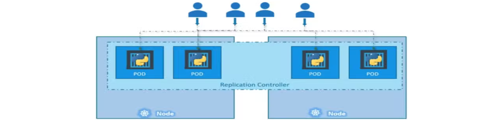

# <p align="center">Kubernetes for Certified Kubernetes Administrator (CKA)</p>

# Kubernetes Cluster Architecture
- [Refer Here](https://kubernetes.io/docs/concepts/architecture/) for the Official docs.
- Kubernetes (K8s) is used to manage containerized applications automatically.
- It enables easy deployment, scaling, and communication between services.
- **Cluster Structure:**
  - **Master Node (Control Plane)**: Manages the cluster.
  - **Worker Nodes**: Run containerized applications.
  
### Master Node Components
- **etcd**: A key-value store that holds cluster data.
- **Kube API Server**: Main communication hub, exposing the Kubernetes API.
- **Scheduler**: Assigns workloads (Pods) to worker nodes based on resources and constraints.
- **Controllers**: Maintain cluster state (e.g., Node Controller, Replication Controller).
### Worker Node Components
- **Kubelet**: The agent that manages containers on the node, communicating with the API Server.
- **Kube Proxy**: Manages networking and enables communication between Pods.
- **Container Runtime**: Runs containers (Docker, containerd, etc.).

# Docker vs. ContainerD
- Docker and containerd are both container runtimes.
- Older Kubernetes versions supported Docker, while newer versions use containerd.
- Several CLI tools exist to interact with these runtimes: `ctr`, `crictl`, `nerdctl`.
### History of Containers
- Initially, **Docker** was the dominant container tool.
- Kubernetes was built to work **only with Docker** in the beginning.
- Other container runtimes (e.g., **rkt**) wanted support in Kubernetes.
### CRI (Container Runtime Interface)
- Kubernetes introduced **CRI** to support multiple container runtimes.
- **CRI follows OCI (Open Container Initiative) standards**:
  - **ImageSpec**: Defines how container images should be built.
  - **RuntimeSpec**: Defines how container runtimes should work.
- Now, any runtime that follows **OCI standards** can work with Kubernetes.
- **Docker was NOT built for CRI** since it existed before CRI.
- Kubernetes had to create **Dockershim** (a workaround) to support Docker.
### Shift from Docker to ContainerD
- Docker is a full suite with CLI, API, build tools, security, volumes, `runc`, and `containerd`.
- **Containerd is the core runtime inside Docker.** It is **CRI-compatible**, so Kubernetes can use it **without Docker**.
- Now, **Containerd is a separate project** under CNCF. You can install **Containerd directly** without installing Docker.
- Kubernetes **removed `dockershim` in v1.24**, eliminating direct Docker support.
- Docker-built images still work because they follow OCI standards.
### CLI Tools for Working with Containers
- **`ctr` (ContainerD CLI):**
  - CLI tool for **containerd**.
  - Used mainly for debugging.
  - Not user-friendly, supports only basic functions.
- **`nerdctl` (Docker-like CLI for ContainerD):**
  - Docker-compatible CLI for containerd.
  - Supports additional features like **encrypted images, P2P distribution**.
  - Works almost like Docker CLI.
- **`crictl` (CRI CLI for Kubernetes Runtimes):**
  - Kubernetes-specific CLI to interact with **CRI-compatible runtimes** (containerd, CRI-O, etc.).
  - Used for **debugging and troubleshooting**, not creating containers.
  - Unlike Docker, `crictl` can manage **pods** (`crictl pods`).

# ETCD
- [Refer Here](https://etcd.io/) for the Official site.
- ETCD is a **distributed, reliable key-value store** used in Kubernetes.
- It is **simple, secure, and fast**.
- **Key-Value Store:**
  - Traditional databases store data in tables (rows & columns).
  - A **key-value store** stores data as **key-value pairs**.
  
- By default, ETCD runs on **port 2379**.
- Use the `etcdctl` command-line tool to interact with ETCD.
- **Basic Commands:**
  ```bash
  ./etcdctl put key1 value1
  # To store a key-value pair
  ./etcdctl get key1
  # To retrieve stored data
  ./etcdctl
  # To view available commands
  ```
### ETCD Versioning
- API versions **v2.0 vs v3.0** have different `etcdctl` commands.
- **Check ETCDCTL Version:** `etcdctl version`
  - The output shows the **ETCDCTL utility version** and **API version**.
  - **Default API version is v2.0**, but Kubernetes uses v3.0.
- **To set API Version 3 Use:** `export ETCDCTL_API=3`
### ETCD in Kubernetes
- [Refer Here](https://kubernetes.io/docs/tasks/administer-cluster/configure-upgrade-etcd/) for the Official docs.
- Stores cluster data (nodes, pods, configs, secrets, roles, etc.).
- All `kubectl get` commands retrieve data from ETCD.
- Cluster changes (e.g., adding nodes, deploying pods) are recorded in ETCD.
#### Installation of ETCD
- **Manually**:
  - If you setup your Cluster from scratch then you deploy `ETCD` by downloading ETCD Binaries:
    ```sh
    wget -q --https-only "https://github.com/etcd-io/etcd/releases/download/v3.3.11/etcd-v3.3.11-linux-amd64.tar.gz"
    ```
  - Install Binaries and Configure `ETCD` as a service in your master node.
  - `ETCD` runs as a **systemd service**.
- **Using kubeadm**:
  - Automatically deployed as a pod in the `kube-system` namespace.
    ```sh
    kubectl get pods -n kube-system | grep etcd-master
    ```
#### EETCD Data Structure in Kubernetes
- List all keys stored in ETCD:
  ```bash
  kubectl exec etcd-master -n kube-system -- sh -c "ETCDCTL_API=3 etcdctl \
                --cert=/etc/kubernetes/pki/etcd/server.crt \
                --key=/etc/kubernetes/pki/etcd/server.key \
                --cacert=/etc/kubernetes/pki/etcd/ca.crt get / --prefix --keys-only"
  ```
- Data is stored in a **directory-like structure**.
- Kubernetes stores data under the **`registry`** directory (The Root directory).
  - Nodes: `/registry/minions`
  - Pods: `/registry/pods`
  - Deployments: `/registry/deployments`
#### ETCD in High Availability (HA) Setup
- Multiple master nodes run multiple **ETCD instances**.
- ETCD instances must be **aware of each other** (configured via `initial-cluster` option).
- **ETCD must always have an odd number of nodes** in an HA setup to **avoid split-brain scenarios**.
- Ensures redundancy and fault tolerance.
##### Add that `backups` are critical in ETCD, and the `etcdctl snapshot save` command is used for backups.

# Kube API Server
- The **main component** of Kubernetes that **manages all requests**.
- Responsible for:
  - **Authentication** (who can access)
  - **Validation** (checking if requests are correct)
  - **Retrieving & Updating** data in **ETCD** (the cluster database).
- It is the **only component** that interacts directly with ETCD.
- Other components (Scheduler, Controller Manager, Kubelet) **use the API Server** to update the cluster.
### Installation of Kube API Server
- **Manually**:
  - If you installing manually (`the hard way`), download the binary from Kubernetes releases:
    ```sh
    wget https://storage.googleapis.com/kubernetes-release/release/v1.13.0/bin/linux/amd64/kube-apiserver
    ```
  - Install and Configure `Kube API Server` as a service in your master node.
  - `Kube API Server` runs as a **systemd service**.
  - Config is in: `/etc/systemd/system/kube-apiserver.service`
  - Running processes can be checked using `ps aux | grep kube-apiserver`.
- **Using kubeadm**:
  - Automatically deployed as a pod in the `kube-system` namespace.
    ```sh
    kubectl get pods -n kube-system | grep kube-apiserver-master
    ```
  - Config is in: `/etc/kubernetes/manifests/kube-apiserver.yaml`

# Kube Controller Manager
- It **manages all controllers** in Kubernetes.
- A **controller** is responsible for monitoring the cluster state and ensuring it reaches the desired condition.
- Works through the **kube-apiserver** to track and control cluster components.
- **Types of Controllers:**
  1. **Node Controller**
     - Checks the status of nodes every **5 seconds**.
     - Marks a node **unreachable** after **40 seconds**.
     - Waits **5 minutes** before reassigning pods to healthy nodes.
  2. **Replication Controller**
     - Ensures the desired number of pods in a **ReplicaSet** is always maintained.
     - If a pod dies, it creates a new one automatically.
  3. **Other Controllers:**
     - **Deployment Controller**: Manages Deployments.
     - **Service Controller**: Handles Services.
     - **Namespace Controller**: Manages namespaces.
     - **Persistent Volume Controller**: Manages storage.
     - **Job Controller**: Manages Jobs & CronJobs.
### Installation of Kube Controller Manager
- Comes as a **single process** that includes all controllers.
- **Manually**:
  - Download the kube-controller-manager binary from the kubernetes release page:
    ```sh
    wget https://storage.googleapis.com/kubernetes-release/release/v1.13.0/bin/linux/amd64/kube-controller-manager
    ```
  - Install and Configure `Kube Controller Manager` as a service in your master node.
  - `Kube Controller Manager` runs as a **systemd service**.
  - By default all controllers are enabled, but you can choose to enable specific one from `kube-controller-manager.service`.
  - Config is in: `/etc/systemd/system/kube-controller-manager.service`
  - Running processes can be checked using `ps aux | grep kube-controller-manager`.
- **Using kubeadm**:
  - Automatically deployed as a pod in the `kube-system` namespace.
    ```sh
    kubectl get pods -n kube-system | grep kube-controller-manager-master
    ```
  - Config is in: `/etc/kubernetes/manifests/kube-controller-manager.yaml`
### Customizing Controllers
- You can pass **options** (modify configuration) when running the Kube Controller Manager.
- Example settings:
  - **Node monitor period** (How often nodes are checked).
  - **Grace period** (Time before marking a node as failed).
  - **Eviction timeout** (When to reassign pods).
- `--controllers` option allows enabling/disabling specific controllers.

# Kube-Scheduler
- **Kube-Scheduler** is responsible for **deciding** which node a pod should be placed on.
- **It does not create pods** on nodes—that's the job of the **kubelet**.
### Work of Kube-Scheduler
- **Filters Nodes:**
   - Eliminates nodes that **don’t meet the pod’s resource requests** (CPU, memory, etc.).
   - **Example:** If a pod needs 4 CPU but a node only has 2 CPU available, that node is filtered out.
- **Ranks Remaining Nodes:**
   - Assigns a **score (0 to 10)** to each valid node.
   - The node with the **highest score** gets selected.
   - **Example:** If one node would have **6 CPUs free** after placing the pod and another only **2 CPUs free**, the first one gets a **higher score** and wins.
### Customizing Scheduling Rules
- Kubernetes allows **custom schedulers** to be defined.
- Additional factors like **taints, tolerations, affinity rules, and node selectors** influence scheduling decisions (covered in detail later).
### Installation of Kube-Scheduler
- **Manually**:
  - Download the kube-scheduler binary from the kubernetes release page:
    ```sh
    wget https://storage.googleapis.com/kubernetes-release/release/v1.13.0/bin/linux/amd64/kube-scheduler
    ```
  - Install and Configure `Kube-Scheduler` as a service in your master node.
  - `Kube-Scheduler` runs as a **systemd service**.
  - Config is in: `/etc/systemd/system/kube-scheduler.service`
  - Running processes can be checked using `ps aux | grep kube-scheduler`.
- **Using kubeadm**:
  - Automatically deployed as a pod in the `kube-system` namespace.
    ```sh
    kubectl get pods -n kube-system | grep kube-scheduler-master
    ```
  - Config is in: `/etc/kubernetes/manifests/kube-scheduler.yaml`

# Kubelet
- **Kubelet** is the **primary agent** running on every worker node in a Kubernetes cluster.
- It **registers the node** with the cluster and ensures that pods run correctly.
- It is like the **captain of a ship**, handling all tasks related to containers on that node.
- Kubelet **does not manage containers directly**—it interacts with the **container runtime via CRI**.
- Kubelet **periodically sends node status to the API Server** to ensure the node remains active.
### Functions of Kubelet
- **Registers the worker node** with the Kubernetes cluster.
- **Receives pod instructions** from the scheduler.
- **Interacts with the container runtime** (e.g., Docker, containerd) to pull images and create containers.
- **Monitors the health** of pods and containers.
- **Reports node and pod status** back to the Kube API server.
### Installation of Kubelet
- **If using `kubeadm`** unlike other components, **kubeadm does not automatically install kubelet** on worker nodes.
- It must be **manually installed** on each worker node.
- **Steps to Install:**
  ```sh
  sudo apt-get update
  sudo apt-get install -y kubelet
  ```
- After installation, it runs as a **service**.
- **To Check Kubelet Status:**
  ```sh
  sudo systemctl status kubelet
  # Check if kubelet is running
  sudo systemctl restart kubelet
  # Start/Restart kubelet service
  ps aux | grep kubelet
  # Check running kubelet process
  ```

# Kube-Proxy
- `kube-proxy` is a **networking component** that runs on every node in a Kubernetes cluster.
- It **forwards traffic** from services to the correct backend pods.
- It ensures that **every pod can communicate with every other pod** inside the cluster.
- **Manages networking rules** for Kubernetes services.
- Uses **iptables** (or other networking tools) to create routing rules.
### Services Work with Kube-Proxy
- Pods communicate using **Pod IPs**, but Pod IPs can change.
- Services provide a **fixed IP** and **DNS name** to access backend pods.
- `kube-proxy` ensures that **requests to the service** are forwarded to the right pod.
- **Example:**
  - A web app pod needs to talk to a database pod.
  - Instead of using the database pod's IP (which can change), it uses a **service** (`db-service`).
  - `kube-proxy` forwards traffic from `db-service` to the correct database pod.
### Installation of Kube-Proxy
- **Deployed as a DaemonSet**, runs on **every node** in the cluster.
- **Manually**:
  - Download the kube-proxy binary from the kubernetes release page:
    ```sh
    wget https://storage.googleapis.com/kubernetes-release/release/v1.13.0/bin/linux/amd64/kube-proxy
    ```
  - Install and Configure `Kube-Proxy` as a service in your master node.
  - `Kube-Proxy` runs as a **systemd service**.
  - Config is in: `/etc/kubernetes/kube-proxy-config.yaml` or `/etc/kube-proxy/config.yaml`
  - Running processes can be checked using `ps aux | grep kube-proxy`.
- **Using kubeadm**:
  - Automatically deployed as a pod in the `kube-system` namespace.
    ```sh
    kubectl get pods -n kube-system
    ```
  - Config is in: `/var/lib/kube-proxy/config.conf`

# Kubernetes Pods
- [Refer Here](https://kubernetes.io/docs/concepts/workloads/pods/) for the Official docs.
- **Pod** is the **smallest deployable unit** in Kubernetes.
- A **pod encapsulates one or more containers**.
- Containers inside a pod **share the same network** and **storage**.
- Pods are used to **deploy your application containers** on Kubernetes.
- Kubernetes **does not deploy containers directly**, it **deploys Pods**.
- Usually, **one pod = one container** (one-to-one relationship).
- Containers inside a pod run on the **same node** and can communicate through `localhost`.
  
### Scaling
- Want to scale? **Don’t add containers to the same pod.**
- **Create more pods** (each with one container).
- To scale down, **delete pods**.
- Pods can be spread across **multiple nodes** if needed.
### Multi-Container Pods
- A pod **can have multiple containers**, but:
  - They’re **not multiple replicas** of the same app.
  - Usually used for **helper or sidecar containers** (e.g., logging, syncing).
### Deploying a Pod using `kubectl`
- To Create a Pod:
  ```sh
  kubectl run <pod_name> --image=<image_name>
  ```
- Check the list of running pods:
  ```sh
  kubectl get pods
  ```
  
- Help Command:
  ```sh
  kubectl run --help
    # A description of what `kubectl run` does.
    # The usage pattern, like: how to use it, its syntax, options, and examples.
  ```
### Pod YAML Configuration
- [Refer Here](https://kubernetes.io/docs/reference/generated/kubernetes-api/v1.32/) for `One-page API Reference for Kubernetes` and choose required Version.
  - Select required API, in this case `Pod`.
- [Refer Here](https://kubernetes.io/docs/reference/generated/kubernetes-api/v1.32/#pod-v1-core) for the **Pod Workloads APIs**.
  - `apiVersion` → Group/Version
    - If **Group** is `core`, provide only `Version`
    - If **Group** is other than `core`, provide `Group/Version`
  - `kind` → Kind
  - `metadata` & `spec` → Use Field and Description.
- **Must-Have Root Keys:** Every Kubernetes Manifest YAML files must have these 4 top level fields.
  - `apiVersion`: Version of Kubernetes API
  - `kind`: Type of object
  - `metadata`: Data about the object
  - `spec`: Details about what to run
- **Nginx Pod YAML:**
  - Based on `Pod Workloads APIs`, Write the Pod YAML file:
    ```yaml
    apiVersion: v1
    kind: Pod
    metadata:
      name: nginx-pod
      labels:
        app: nginx
        tier: frontend
    spec:
      containers:
        - name: nginx
          image: nginx
    ```
- **Commands to Work with Pods:**
  ```sh
  kubectl create -f <filename>
  # Create a pod using YAML
  kubectl get pods
  # View all pods
  kubectl get pods -o wide
  # View all pods with more details
  kubectl describe pod <name>
  # Detailed pod info
  kubectl exec -it <pod-name> -- <command>
  # Execute a command inside a pod
  kubectl delete pod <name>
  # Delete pod
  ```

# Kubernetes Controllers
- Controllers are **the brain of Kubernetes**.
- They **monitor Kubernetes objects** and take action when needed.
- Example: Replication Controller, ReplicaSet, etc.
### Replication Controller (RC)
- [Refer Here](https://kubernetes.io/docs/concepts/workloads/controllers/replicationcontroller/) for the Official docs.
- Ensures a **specific number of pods** are running at all times.
- Provides **high availability** by running multiple copies of a pod.
- Can be used even for **1 pod** to auto-recover if it fails.
- **Use Cases:**
  - Prevent app downtime by having multiple pod replicas.
  - Load balancing across multiple pods.
  - Auto-healing (restart pods if they crash).
  
#### Replication Controller YAML Configuration
- [Refer Here](https://kubernetes.io/docs/reference/generated/kubernetes-api/v1.32/) for `One-page API Reference for Kubernetes` and choose required Version.
  - Select required API, in this case `ReplicationController`.
- [Refer Here](https://kubernetes.io/docs/reference/generated/kubernetes-api/v1.32/#replicationcontroller-v1-core) for the **ReplicationController Workloads APIs**.
  - `apiVersion` → Group/Version
    - If **Group** is `core`, provide only `Version`
    - If **Group** is other than `core`, provide `Group/Version`
  - `kind` → Kind
  - `metadata` & `spec` → Use Field and Description.
- **`apiVersion`, `kind`, `metadata` & `spec`** these are must have Root Keys in every Kubernetes Manifest YAML files.
- **Nginx Replication Controller YAML:**
  - Based on `ReplicationController Workloads APIs`, Write the Replication Controller YAML file:
    ```yaml
    apiVersion: v1
    kind: ReplicationController
    metadata:
      name: myapp-rc
      labels:
        app: myapp
        type: frontend
    spec:
      replicas: 3
      template:
        metadata:
          labels:
            app: myapp
            type: frontend
        spec:
          containers:
          - name: nginx-container
            image: nginx
    ```
- **Commands:**
  ```sh
  kubectl create -f <filename>
  # Create replication controller using YAML
  kubectl get replicationcontroller
  # View all replication controllers
  kubectl delete replicationcontroller <name>
  # Delete replication controller
  ```
### ReplicaSet (RS)
- [Refer Here](https://kubernetes.io/docs/concepts/workloads/controllers/replicaset/) for the Official docs.
- **Modern version of Replication Controller** (recommended to use).
- Works **similar to RC** but more **flexible with label selectors**.
- **Key Difference:**
  - Requires a **selector** (matchLabels) to track pods.
  - Can **adopt existing pods** if they match the selector.
  
#### ReplicaSet YAML Configuration
- [Refer Here](https://kubernetes.io/docs/reference/generated/kubernetes-api/v1.32/) for `One-page API Reference for Kubernetes` and choose required Version.
  - Select required API, in this case `ReplicaSet`.
- [Refer Here](https://kubernetes.io/docs/reference/generated/kubernetes-api/v1.32/#replicaset-v1-apps) for the **ReplicaSet Workloads APIs**.
  - `apiVersion` → Group/Version
    - If **Group** is `core`, provide only `Version`
    - If **Group** is other than `core`, provide `Group/Version`
  - `kind` → Kind
  - `metadata` & `spec` → Use Field and Description.
- **`apiVersion`, `kind`, `metadata` & `spec`** these are must have Root Keys in every Kubernetes Manifest YAML files.
- **Nginx ReplicaSet YAML:**
  - Based on `ReplicaSet Workloads APIs`, Write the ReplicaSet YAML file:
    ```yaml
    apiVersion: apps/v1
    kind: ReplicaSet
    metadata:
      name: myapp-rs
      labels:
        app: myapp
    spec:
      replicas: 3
      selector:
        matchLabels:
          app: myapp
      template:
        metadata:
          labels:
            app: myapp
        spec:
          containers:
          - name: nginx-container
            image: nginx
    ```
- **Commands:**
  ```sh
  kubectl create -f <filename>
  # Create replicaset using YAML
  kubectl get replicasets
  # View all replicasets
  kubectl delete rs <name>
  # Delete replicaset
  kubectl replace -f <file>
  # Update a resource
  ```
#### Scaling ReplicaSet
- **Option:1** Modify YAML file
  - Update `replicas: 3` to `replicas: 6`
  - Run: `kubectl replace -f rs-definition.yaml`
- **Option:2** Using CLI directly
  - Run:  
    ```sh
    kubectl scale --replicas=6 -f rs-definition.yaml
                           or
    kubectl scale replicaset myapp-rs --replicas=6
    ```
  - **Note:** If you scale using the CLI, the YAML file will not auto-update.
### Labels & Selectors
- **Labels**: Key-value pairs added to pods (like `app: myapp`)
- **Selectors**: Used by ReplicaSet to identify which pods to manage.
- Helps ReplicaSet **monitor** the right pods among many.

# Kubernetes Deployments
- [Refer Here](https://kubernetes.io/docs/concepts/workloads/controllers/deployment/) for the Official docs.
- A **Deployment** in Kubernetes is a higher-level object used to **manage applications**.
- It handles:
  - Running **multiple instances (replicas)** of your app.
  - **Upgrading** your app with **rolling updates**.
  - **Rolling back** to a previous version if needed.
  - **Pausing and resuming** changes for better control.
  
### Real-World Deployment Needs
- **Multiple Instances:** Run several copies of your app (e.g., multiple web servers) for **high availability**.
- **Rolling Updates:** Update pods **one at a time**, not all at once — avoids app downtime for users.
- **Rollback:** If a new version causes issues, **revert** to the previous stable version easily.
- **Pause and Resume Updates:** Make **multiple changes** (like scaling, version update, resource config) and **apply all at once** after reviewing.
### Deployment vs ReplicaSet vs Pods
- **Pod:** Runs a single instance of your container
- **ReplicaSet:** Manages **multiple identical pods**
- **Deployment:** Manages **ReplicaSets**, adds **upgrades, rollbacks, pause/resume** features
  - Think of Deployment as the **controller** for ReplicaSet + extra powers.
### Deployment YAML Configuration
- [Refer Here](https://kubernetes.io/docs/reference/generated/kubernetes-api/v1.32/) for `One-page API Reference for Kubernetes` and choose required Version.
  - Select required API, in this case `Deployment`.
- [Refer Here](https://kubernetes.io/docs/reference/generated/kubernetes-api/v1.32/#deployment-v1-apps) for the **Deployment Workloads APIs**.
  - `apiVersion` → Group/Version
    - If **Group** is `core`, provide only `Version`
    - If **Group** is other than `core`, provide `Group/Version`
  - `kind` → Kind
  - `metadata` & `spec` → Use Field and Description.
- **`apiVersion`, `kind`, `metadata` & `spec`** these are must have Root Keys in every Kubernetes Manifest YAML files.
- **Nginx Deployment YAML:**
  - Based on `Deployment Workloads APIs`, Write the Deployment YAML file:
  - Similar to ReplicaSet, just change `kind: Deployment`
    ```yaml
    apiVersion: apps/v1
    kind: Deployment
    metadata:
      name: myapp-deployment
      labels:
        app: myapp
    spec:
      replicas: 3
      selector:
        matchLabels:
          app: myapp
      template:
        metadata:
          labels:
            app: myapp
        spec:
          containers:
          - name: nginx-container
            image: nginx
    ```
- **Commands:**
  ```sh
  kubectl create -f <filename>
  # Create deployment
  kubectl get deployments
  # List all deployments
  kubectl get all
  # View all resources (deployments, RS, pods, etc.)
  kubectl delete deploy <name>
  # Delete deployment
  ```
- **When You Create a Deployment:**
  - Deployment is created.
  - Deployment creates a **ReplicaSet**.
  - ReplicaSet creates **pods**.

# Kubernetes Services
- [Refer Here](https://kubernetes.io/docs/concepts/services-networking/service/) for the Official docs.
- Services allow communication **between Pods**, **between apps**, and **from external users** to Pods.
- Services **abstract** the dynamic IPs of Pods (since Pods can be recreated and get new IPs).
- Services allow **stable access** to Pods.
- **Types of Services:**
  - NodePort
  - ClusterIP
  - LoadBalancer
  
### Services YAML Configuration
- [Refer Here](https://kubernetes.io/docs/reference/generated/kubernetes-api/v1.32/) for `One-page API Reference for Kubernetes` and choose required Version.
  - Select required API, in this case `Service`.
- [Refer Here](https://kubernetes.io/docs/reference/generated/kubernetes-api/v1.32/#deployment-v1-apps) for the **Service in Service APIs**.
  - `apiVersion` → Group/Version
    - If **Group** is `core`, provide only `Version`
    - If **Group** is other than `core`, provide `Group/Version`
  - `kind` → Kind
  - `metadata` & `spec` → Use Field and Description.
  - `type in spec` → Give Type of Service
- **`apiVersion`, `kind`, `metadata` & `spec`** these are must have Root Keys in every Kubernetes Manifest YAML files.
### Types of Services
#### NodePort
- Makes a Pod accessible **from outside the cluster** using `<NodeIP>:<NodePort>`.
- Opens a **specific port on every Node** (between `30000-32767`).
- Traffic goes from NodePort ➝ ClusterIP ➝ Pod.
  
- **NodePort Service YAML:**
  ```yaml
  apiVersion: v1
  kind: Service
  metadata:
    name: my-nodeport-service
  spec:
    type: NodePort
    selector:
      app: myapp
    ports:
      - port: 80         # Service port (ClusterIP)
        targetPort: 80   # Pod port
        nodePort: 30008  # Node's exposed port
  ```
- **Notes:**
  - `port` = service’s own port
  - `targetPort` = Pod’s port
  - `nodePort` = port exposed on Node (external access)
  - If `targetPort` not specified ➝ assumed same as `port`
  - If `nodePort` not specified ➝ random port is chosen from range
#### ClusterIP (Default)
- Used for **internal communication** between services in the cluster.
- Each service gets a **virtual IP (ClusterIP)**.
- **Not accessible from outside the cluster**.
  
- **ClusterIP Service YAML:**
  ```yaml
  apiVersion: v1
  kind: Service
  metadata:
    name: redis
  spec:
    type: ClusterIP
    selector:
      app: redis-pod
    ports:
      - port: 6379
        targetPort: 6379
  ```
#### LoadBalancer
- Exposes service **externally using cloud provider’s load balancer** (AWS, GCP, Azure).
- Best for production **external traffic**.
- **LoadBalancer Service YAML:**
  ```yaml
  apiVersion: v1
  kind: Service
  metadata:
    name: frontend
  spec:
    type: LoadBalancer
    selector:
      app: frontend
    ports:
      - port: 80
        targetPort: 80
  ```
- Creates external IP via cloud LB ➝ traffic gets routed to NodePort ➝ ClusterIP ➝ Pod.
### Service Selectors and Labels
- Services **use selectors** to find matching Pods.
- Pods must have **matching labels** for the service to route traffic.
- **Example:**
  ```yaml
  selector:
    app: myapp
  ```
### Load Balancing Behavior
- Services **load balance automatically** between matching Pods.
- Uses **random algorithm** to distribute traffic.
- Works across **multiple nodes** too:
  - NodePort is open on **every node**
  - Requests can hit any node ➝ routed to correct Pod
### Commands & Real-World Use Cases
- **Commands:**
  ```sh
  kubectl get svc
  # List all services
  kubectl describe svc <svc-name>
  # Detailed service info
  kubectl expose pod <pod-name> --type=NodePort --port=80
  # Quickly expose a pod as a NodePort
  kubectl delete svc <name>
  # Delete service
  ```
- **Use Case:**
  - **ClusterIP:** Internal microservice communication
  - **NodePort:** Access app from browser on Node IP
  - **LoadBalancer:** Expose service on a domain like `myapp.com` via AWS/GCP

# Kubernetes Namespaces
- [Refer Here](https://kubernetes.io/docs/concepts/overview/working-with-objects/namespaces/) for the Official docs.
- A **namespace** in Kubernetes is like a **virtual cluster** inside your real cluster.
- It is used to **divide cluster resources** among multiple users/projects/teams.
- All objects like Pods, Services, Deployments are created **inside a namespace**.
- Useful when running **multiple teams or environments** (e.g., dev, prod) on the **same cluster**.
- If you don’t specify a namespace, objects are created in the `default` namespace.
- **Default Namespaces in Kubernetes:**
  - `default` ➝ Your playground, used if no namespace is specified
  - `kube-system` ➝ For Kubernetes system components (like DNS, networking)
  - `kube-public` ➝ Public resources, viewable by all users
- **Use of Custom Namespaces:**
  - Separate environments: **dev**, **test**, **prod**
  - Avoid accidentally modifying prod while working on dev
  - Apply **policies** and **resource limits** per namespace
- **Communication Between Namespaces:**
  - Pods **within the same namespace**: use service name directly `service-name`
  - Pods **across namespaces**: use full DNS `service-name.namespace-name.svc.cluster.local`
  
### Namespace YAML Configuration
- [Refer Here](https://kubernetes.io/docs/reference/generated/kubernetes-api/v1.32/) for `One-page API Reference for Kubernetes` and choose required Version.
  - Select required API, in this case `Namespace`.
- [Refer Here](https://kubernetes.io/docs/reference/generated/kubernetes-api/v1.32/#namespace-v1-core) for the **Namespace Cluster APIs**.
  - `apiVersion` → Group/Version
    - If **Group** is `core`, provide only `Version`
    - If **Group** is other than `core`, provide `Group/Version`
  - `kind` → Kind
  - `metadata` → Use Field and Description.
- **Namespace YAML:**
  - Based on `Namespace Cluster APIs`, Write the Namespace YAML file:
    ```yaml
    apiVersion: v1
    kind: Namespace
    metadata:
      name: dev
    ```
- **Commands:**
  ```sh
  kubectl apply -f <filename>
  # Create namespace
  kubectl get namespaces
  # List all namespaces
  kubectl get pods
  # List pods in default namespace (ns)
  kubectl get pods -n <namespace-name>
  # List pods in a specific ns
  kubectl get pods --all-namespaces
  # List pods in all namespaces
  kubectl config set-context $(kubectl config current-context) --namespace=<namespace-name>
                            (or)
  kubectl config set-context --current --namespace=<namespace-name>
  # Switch current namespace permanently (Set the default namespace to given namespace)
  kubectl config view --minify | grep namespace
  # Check which namespace you’re in
  kubectl create namespace <namespace-name>
  # Create a namespace
  ```
### Create Resources in a Specific Namespace
- **Option:1** From Command-Line
  ```bash
  kubectl create -f yaml-filename -n <namespace-name>
  ```
- **Option:2** In YAML
  - Add under `metadata`:
    ```yaml
    metadata:
      name: resource-name
      namespace: namespace-name
    ```
- **Note:** If you don’t specify a namespace, objects are created in the `default` namespace.
### Resource Quotas in Namespace
- [Refer Here](https://kubernetes.io/docs/concepts/policy/resource-quotas/) for the Official docs.
- You can **limit usage of resources** (CPU, memory, pod count, etc.) using `ResourceQuota`.
#### ResourceQuota YAML Configuration
- [Refer Here](https://kubernetes.io/docs/reference/generated/kubernetes-api/v1.32/) for `One-page API Reference for Kubernetes` and choose required Version.
  - Select required API, in this case `ResourceQuota`.
- [Refer Here](https://kubernetes.io/docs/reference/generated/kubernetes-api/v1.32/#resourcequota-v1-core) for the **ResourceQuota Cluster APIs**.
  - `apiVersion` → Group/Version
    - If **Group** is `core`, provide only `Version`
    - If **Group** is other than `core`, provide `Group/Version`
  - `kind` → Kind
  - `metadata` & `spec` → Use Field and Description.
- **`apiVersion`, `kind`, `metadata` & `spec`** these are must have Root Keys in every Kubernetes Manifest YAML files.
- **ResourceQuota `dev` Namespace YAML:**
  - Based on `ResourceQuota Cluster APIs`, Write the ResourceQuota YAML file:
    ```yaml
    apiVersion: v1
    kind: ResourceQuota
    metadata:
      name: dev-quota
      namespace: dev
    spec:
      hard:
        pods: "10"
        requests.cpu: "10"
        requests.memory: "10Gi"
    ```
- **Commands:**
  ```bash
  kubectl apply -f <filename>
  # Create resourcequota
  kubectl get resourcequota -n <namespace-name>
  # View resourcequota in a namespace
  kubectl describe resourcequota <resourcequota-name> -n <namespace-name>
  # Describe a resourcequota
  kubectl delete resourcequota <resourcequota-name> -n <namespace-name>
  # Delete a resourcequota
  ```

# Kubernetes - Imperative vs Declarative Approaches
- **Imperative:**
  - Direct commands to create/update/delete resources
  - **Examples:** `kubectl run`, `kubectl create`, `kubectl edit`, `kubectl delete`, `kubectl set image`
- **Declarative:**
  - Use YAML files that define the desired state, and apply them
  - **Command:** `kubectl apply -f <yaml-filename>`
### Key Points
- **Imperative Approach:**
  - Quick and handy in exams.
  - Good for small/simple changes.
  - Can generate YAML templates with `--dry-run=client -o yaml`.
  - Not ideal for teamwork or tracking changes.
  - Example:
    ```bash
    kubectl run nginx --image=nginx
    kubectl edit pod nginx
    kubectl scale deployment nginx --replicas=4
    ```
- **Declarative Approach:**
  - Ideal for production.
  - Use YAML files to describe resources.
  - Trackable (can be stored in Git).
  - Use `kubectl apply` to create or update.
  - Kubernetes compares current state with desired state and makes changes.
### Certification Tips
- Use **imperative commands** for speed (e.g. creating a pod/deployment quickly).
- Use **kubectl edit** for fast one-time edits.
- Use **kubectl apply** with YAML files for complex tasks.
- Prefer YAML when:
  - Using multiple containers
  - Adding env vars, init containers, etc.
  - You want version control (Git)
- Generate YAMLs from imperative commands:
  - `--dry-run=client -o yaml`: **Generate YAML** without creating resources.
    ```bash
    kubectl run <pod-name> --image=<image-name> --dry-run=client -o yaml
    ```
### Imperative Commands
- Pods
  ```bash
  kubectl run <pod-name> --image=<image-name>
  # Create a Pod
  kubectl run <pod-name> --image=<image-name> --dry-run=client -o yaml
  # Generate pod manifest yaml file (-o yaml), don't create it(--dry-run)
  ```
- **Deployments:**
  ```bash
  kubectl create deployment <deployment-name> --image=<image-name>
  # Create a deployment
  kubectl create deployment <deployment-name> --image=<image-name> --replicas=4 --dry-run=client -o yaml
  # Generate deployment manifest yaml file (-o yaml), don't create it(--dry-run)
  kubectl create deployment <deployment-name> --image=<image-name> --replicas=4 --dry-run=client -o yaml > <filename>.yaml
  # Generate deployment manifest yaml file (-o yaml), don't create it(--dry-run) and save it to a file
  kubectl scale deployment <deployment-name> --replicas=4
  # To scale deployment
  ```
- **Services:**
  ```bash
  kubectl expose pod <pod-name> --port=<pod-port> --name=<service-name> --dry-run=client -o yaml
  # Create a service of type `ClusterIP`
  kubectl expose pod <pod-name> --type=NodePort --port=80 --name=<service-name> --dry-run=client -o yaml
  # Create a service of type `NodePort` to expose pod port `80` on node port
  ```

# kubectl apply
- **Creates the resource if it does not exist**, but **updates it if it already exists**.
- It **works declaratively**, meaning Kubernetes will only update the parts that have changed in the YAML.
- Recommended for managing resources efficiently in a production environment.
- **Example Scenario:**
  - Initial Deployment:
    ```sh
    kubectl create -f <filename>
    ```
  - Modify the YAML file (e.g., change the container image)
  - Apply the changes:
    ```sh
    kubectl apply -f <filename>
    ```
- Tracks changes across three versions of the configuration:
  1. **Local Configuration** – the YAML file on your system.
  2. **Live Configuration** – the current state of the object in the cluster.
  3. **Last Applied Configuration** – stored as an annotation (`kubectl.kubernetes.io/last-applied-configuration`) in the live object by `kubectl apply`.
- **`kubectl apply` Updates Work:**
  - When you run `kubectl apply` again:
    - **Local YAML** is compared with:
      - The **live object**
      - The **last applied configuration**
    - Any differences are used to **update the live object**.
    - The **last applied config is also updated** after the change.
- **Deleting a Field in YAML:**
  - If a field (like a label) is **deleted** from the local YAML:
    - `kubectl apply` checks:
      - If the field was present in the **last applied config**
      - And is **missing in the new local config**
    - Then it **removes** it from the **live configuration**.
  - If a field is in the live object but **not in local or last applied**, it is **left unchanged**.
- **Note:**
  - `last-applied-configuration` is **only stored** when you use `kubectl apply`.
  - **Other commands like `kubectl create` or `replace` do not save** this annotation.
  - Avoid mixing **imperative** (`kubectl create`, `kubectl delete`) and **declarative** (`kubectl apply`) approaches to manage the same object.